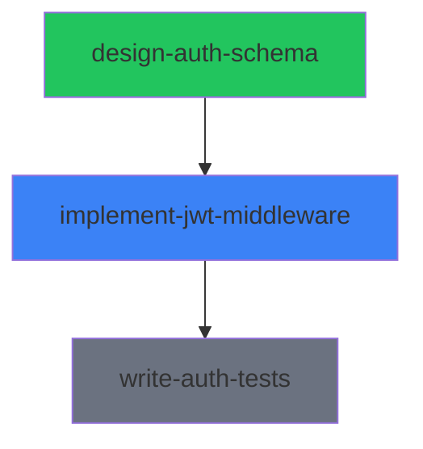

# Chunk 1: Core Protocol & File Structure

**Complexity:** Medium
**Deliverables:**
1. Protocol specification document (`docs/protocol/spec.md`)
2. File format reference for every markdown file type (`docs/protocol/file-formats.md`)
3. Example mission folder with realistic sample data (`examples/sample-mission/`)

---

## Overview

This chunk defines the Syntaur protocol — the markdown-based file structure and formats that form the "API" of the platform. Every subsequent chunk (CLI, lifecycle engine, adapters, dashboard) builds on this spec. Getting it right here means everything else has a stable foundation.

The protocol must be:
- **Agent-framework agnostic** — any tool that reads/writes files can participate
- **Human-readable** — inspectable without tooling
- **Machine-parseable** — YAML frontmatter for structured fields, markdown body for prose
- **Minimal nesting** — flat-ish structure with explicit links via index files

### Source of Truth Rules

**Assignment frontmatter is the single source of truth** for all assignment state (status, dependencies, priority, workspace info). All other representations — checkboxes in mission.md, index tables, mermaid graphs — are **projections** rebuilt by the rebuild script. When there is a divergence, assignment frontmatter wins.

### Timestamp Format

All timestamps use **RFC 3339 / ISO 8601 with UTC offset** (e.g., `2026-03-18T14:30:00Z`). **Filesystem path fields** in frontmatter and config (`workspace.*`, `defaultMissionDir`, `worktreePath`) use absolute expanded form — never store `~` literally; always expand to the full path. **Intra-mission markdown links** (e.g., `[Plan](./plan.md)`) use relative paths for portability.

---

## Task 1: Define the Top-Level Directory Structure

**What:** Document the root `~/.syntaur/` directory layout and the mission folder structure.

**Spec:**

```
~/.syntaur/
  config.md                    # Global Syntaur config (optional)
  missions/
    <mission-slug>/
      manifest.md              # Derived: root index linking to all indexes and config
      mission.md               # Human-authored: overview, goal, context
      _index-assignments.md    # Derived: assignment summary table
      _index-plans.md          # Derived: plan summary table
      _index-decisions.md      # Derived: decision record summary table
      _index-sessions.md       # Derived: active sessions across all assignments
      _status.md               # Derived: computed mission status, assignment rollup, dependency graph
      claude.md                # Human-authored: Claude Code agent instructions
      agent.md                 # Human-authored: generic agent instructions
      assignments/
        <assignment-slug>/
          assignment.md        # Agent-writable: the assignment record (source of truth)
          plan.md              # Agent-writable: implementation plan
          scratchpad.md        # Agent-writable: working memory
          handoff.md           # Agent-writable: append-only handoff log
          decision-record.md   # Agent-writable: append-only decision log
      resources/
        _index.md              # Derived: resource listing
        <resource-slug>.md     # Shared-writable
      memories/
        _index.md              # Derived: memory listing
        <memory-slug>.md       # Shared-writable
```

**File ownership categories:**
- **Human-authored:** mission.md, agent.md, claude.md. Only humans edit these.
- **Agent-writable:** everything inside an assignment folder. Only the assigned agent writes to its own folder. **Exception:** the Q&A section of assignment.md accepts answers from humans or other agents — these writes are mediated through the CLI tooling (e.g., `syntaur answer`), not by directly editing the file, to preserve the single-writer guarantee.
- **Shared-writable:** resources/ and memories/ folders. Both humans and agents can create files here. No single-owner constraint — these are shared mission context. The `source` field in each file tracks who created it.
- **Derived:** manifest.md, all `_index-*` files, `_status.md`. Only the rebuild script writes these. Never edited manually.

**Naming conventions:**
- Mission slugs: lowercase, hyphen-separated (e.g., `build-auth-system`)
- Assignment slugs: lowercase, hyphen-separated (e.g., `implement-jwt-middleware`)
- Derived files use underscore prefix (`_index-*`, `_status.md`) to sort first and signal "don't edit manually"

**Files to create:**
- `docs/protocol/spec.md` — start this file, add the directory structure section

**Acceptance criteria:**
- Directory structure is documented with every file's purpose and ownership explained
- Naming conventions are explicit
- The four ownership categories (human-authored, agent-writable, shared-writable, derived) are clearly defined

---

## Task 2: Define manifest.md Format

**What:** The root navigation file for a mission. An agent reads this first to find everything.

**Format:**

```markdown
---
version: "1.0"
mission: <mission-slug>
generated: <RFC 3339 datetime>
---

# Mission: <mission-slug>

## Overview
- [Mission Overview](./mission.md)

## Indexes
- [Assignments](./_index-assignments.md)
- [Plans](./_index-plans.md)
- [Decision Records](./_index-decisions.md)
- [Sessions](./_index-sessions.md)
- [Status](./_status.md)
- [Resources](./resources/_index.md)
- [Memories](./memories/_index.md)

## Config
- [Agent Instructions](./agent.md)
- [Claude Code Instructions](./claude.md)
```

**Design notes:**
- `version` field allows protocol evolution
- Links are relative paths so the mission folder is portable
- Links to mission.md so both humans and agents can navigate from manifest to the overview
- Manifest is a **derived** file (rebuilt by tooling), agents should not edit it directly

**Files to create/update:**
- `docs/protocol/file-formats.md` — start this file, add manifest.md section

**Acceptance criteria:**
- Format is documented with all fields explained
- Example with realistic values provided
- Links to mission.md included

---

## Task 3: Define mission.md Format

**What:** The human-authored mission overview. Contains the goal, context, and success criteria. This file is **human-authored only** — all computed/derived content (assignment rollups, sessions, status, dependency graph) lives in `_status.md` and index files.

**Format:**

```markdown
---
id: <uuid>
slug: <mission-slug>
title: <string>
archived: <boolean, default false>
archivedAt: <RFC 3339 datetime | null>
archivedReason: <string | null>
created: <RFC 3339 datetime>
updated: <RFC 3339 datetime>
externalIds:
  - system: jira
    id: <string>
    url: <string | null>
  - system: linear
    id: <string>
    url: <string | null>
tags: []
---

# <title>

## Overview

<Free-form description of the mission goal, context, and success criteria.
This is written and maintained by a human. It should explain the "why" behind
the mission and what success looks like.>

## Notes

<Optional human notes, updates, or context that don't fit elsewhere.>
```

**Design notes:**
- `slug` is explicit in frontmatter (matches folder name). This makes rename/move operations and adapter parsing simpler — the slug is always available without path inference.
- `externalIds` is a generic array of `{system, id, url}` entries instead of hardcoded Jira/Linear/GitHub. New integrations don't require protocol changes.
- `archived`, `archivedAt`, and `archivedReason` are the human-authored lifecycle override. When a human sets `archived: true`, the rebuild script projects this as `status: archived` in `_status.md`, overriding the computed status. This is the only mission lifecycle state that lives in mission.md — all other status is computed.
- **No computed status field** — mission status is derived from assignment states and lives in `_status.md`.
- **No assignments section, no dependency graph, no sessions** — all of those are derived and live in their respective index/status files. This eliminates the ownership conflict where a rebuild script would need to surgically update parts of a human-authored file.

**Files to update:**
- `docs/protocol/file-formats.md` — add mission.md section

**Acceptance criteria:**
- All frontmatter fields documented with types and valid values
- Clear that this file is human-authored only — no derived content
- Relationship to `_status.md` explained

---

## Task 4: Define assignment.md Format

**What:** The core unit of work and the **single source of truth** for assignment state. This is the file an agent reads to understand what to do and updates to report progress.

**Format:**

```markdown
---
id: <uuid>
slug: <assignment-slug>
title: <string>
status: <pending | in_progress | blocked | review | completed | failed>
priority: <low | medium | high | critical>
created: <RFC 3339 datetime>
updated: <RFC 3339 datetime>
assignee: <string | null>
externalIds:
  - system: jira
    id: <string>
    url: <string | null>
dependsOn: []
blockedReason: <string | null>
workspace:
  repository: <repo path or URL | null>
  worktreePath: <absolute path to worktree | null>
  branch: <branch name | null>
  parentBranch: <branch this was created from | null>
tags: []
---

# <title>

## Objective

<Clear description of what needs to be done and why.>

## Acceptance Criteria

- [ ] <criterion 1>
- [ ] <criterion 2>
- [ ] <criterion 3>

## Context

<Links to relevant docs, code, or other assignments. Background info the agent needs.>

## Sessions

| Session ID | Agent | Started | Ended | Status |
|------------|-------|---------|-------|--------|
| <session-id> | <agent name> | <RFC 3339> | <RFC 3339 or null> | <active \| completed \| abandoned> |

## Questions & Answers

### Q: <question from agent>
**Asked:** <RFC 3339 datetime>
**A:** <answer from human or another agent>

### Q: <another question>
**Asked:** <RFC 3339 datetime>
**A:** <pending>

## Progress

<Agent updates this section as work progresses. Most recent entry first.>

### <RFC 3339 datetime>
<What was done, what's next, any blockers.>

## Links

- [Plan](./plan.md)
- [Scratchpad](./scratchpad.md)
- [Handoff](./handoff.md)
- [Decision Record](./decision-record.md)
```

**Design notes:**
- `slug` is explicit in frontmatter (matches folder name)
- `workspace` fields are in frontmatter (not a markdown table) so they're machine-parseable by CLI, adapters, and dashboard
- `dependsOn` lists assignment slugs this depends on. **Dependency semantics:** an assignment with unmet dependencies (dependencies not in `completed` status) stays in `pending` and cannot transition to `in_progress`. This is enforced by the lifecycle engine (Chunk 4). `blocked` is reserved for manual/runtime blocks — when an agent encounters an obstacle unrelated to dependencies. `blockedReason` is required when status is `blocked`.
- `externalIds` uses the same generic array format as mission.md
- Sessions table includes `Ended` column and `abandoned` status for stale sessions. Sessions are **informational** — they help the dashboard show what's active but don't control assignment ownership. `assignee` is the authoritative owner. Multiple sessions are allowed (e.g., an agent restarts).
- This file is the **single source of truth** for assignment state. All index files and status rollups are projections of this data.

**Files to update:**
- `docs/protocol/file-formats.md` — add assignment.md section

**Acceptance criteria:**
- All frontmatter fields documented with types, valid values, and which are agent-writable
- Each body section documented with purpose, who writes it, and examples
- Dependency semantics (pending vs blocked) explicitly defined
- Source-of-truth status clearly stated

---

## Task 5: Define Supporting Assignment Files

**What:** Define the format for plan.md, scratchpad.md, handoff.md, and decision-record.md that live in each assignment folder. All of these are **agent-writable** and optional — they are created as empty templates by scaffolding (Chunk 2) but only populated when needed.

### plan.md

```markdown
---
assignment: <assignment-slug>
status: <draft | approved | in_progress | completed>
created: <RFC 3339 datetime>
updated: <RFC 3339 datetime>
---

# Plan: <assignment title>

## Approach

<High-level description of how the agent plans to accomplish the objective.>

## Tasks

- [ ] <step 1>
- [ ] <step 2>
- [ ] <step 3>

## Risks & Mitigations

| Risk | Mitigation |
|------|------------|
| <risk> | <mitigation> |
```

### scratchpad.md

```markdown
---
assignment: <assignment-slug>
updated: <RFC 3339 datetime>
---

# Scratchpad

<Unstructured working notes. The agent uses this as scratch space during work.
No required format — this is the agent's private workspace within the assignment.>
```

### handoff.md (append-only log)

```markdown
---
assignment: <assignment-slug>
updated: <RFC 3339 datetime>
handoffCount: <number>
---

# Handoff Log

## Handoff 1: <RFC 3339 datetime>

**From:** <agent name or "human">
**To:** <agent name or "human">
**Reason:** <why the handoff is happening>

### Summary
<What was accomplished and what remains.>

### Current State
<Where things stand — what's working, what's not, what's partially done.>

### Next Steps
- <step 1>
- <step 2>

### Important Context
<Anything the next agent/human needs to know that isn't in the assignment or plan.>

---

## Handoff 2: <RFC 3339 datetime>
...
```

### decision-record.md (append-only log with structured entries)

```markdown
---
assignment: <assignment-slug>
updated: <RFC 3339 datetime>
decisionCount: <number>
---

# Decision Record

## Decision 1: <decision title>

**Date:** <RFC 3339 datetime>
**Status:** <proposed | accepted | rejected | superseded>
**Context:** <why this decision was needed>
**Decision:** <what was decided>
**Consequences:** <what follows from this decision>

---

## Decision 2: <decision title>

**Date:** <RFC 3339 datetime>
**Status:** <accepted>
**Context:** ...
**Decision:** ...
**Consequences:** ...
```

**Design notes:**
- plan.md has its own status — a plan can be drafted and approved before work begins
- scratchpad.md is intentionally unstructured — agents use it however they need
- handoff.md is now an **append-only log** — each handoff is a numbered entry so history is preserved. The `handoffCount` in frontmatter enables quick indexing without parsing the body.
- decision-record.md uses **numbered, structured entries** with required fields (Date, Status, Context, Decision, Consequences). The `decisionCount` in frontmatter enables indexing without body parsing. This is more reliable than freeform headings for the rebuild script to parse.
- All files reference their parent assignment via the `assignment` frontmatter field
- All supporting files are **optional until first use** — scaffolding creates them as templates but they can remain empty

**Files to update:**
- `docs/protocol/file-formats.md` — add sections for each file

**Acceptance criteria:**
- Each file format documented with all fields
- Purpose and usage patterns explained for each
- Handoff and decision record documented as append-only with numbered entries
- Clear which files are agent-writable vs. derived

---

## Task 6: Define Index and Status File Formats

**What:** Define the format for all derived files: `_index-*.md` and `_status.md`. These are rebuilt by scanning assignment folders (Chunk 3 implements the rebuild logic). **Agents must never write to these files.**

### _index-assignments.md

```markdown
---
mission: <mission-slug>
generated: <RFC 3339 datetime>
total: <number>
by_status:
  pending: <number>
  in_progress: <number>
  blocked: <number>
  review: <number>
  completed: <number>
  failed: <number>
---

# Assignments

| Slug | Title | Status | Priority | Assignee | Dependencies | Updated |
|------|-------|--------|----------|----------|--------------|---------|
| [implement-jwt-middleware](./assignments/implement-jwt-middleware/assignment.md) | Set up JWT middleware | in_progress | high | claude-1 | design-auth-schema | 2026-03-18T14:30:00Z |
| [design-auth-schema](./assignments/design-auth-schema/assignment.md) | Design auth schema | completed | high | claude-2 | — | 2026-03-17T10:00:00Z |
```

### _index-plans.md

```markdown
---
mission: <mission-slug>
generated: <RFC 3339 datetime>
---

# Plans

| Assignment | Plan Status | Updated |
|------------|-------------|---------|
| [implement-jwt-middleware](./assignments/implement-jwt-middleware/plan.md) | in_progress | 2026-03-18T14:30:00Z |
| [design-auth-schema](./assignments/design-auth-schema/plan.md) | completed | 2026-03-17T10:00:00Z |
```

### _index-decisions.md

```markdown
---
mission: <mission-slug>
generated: <RFC 3339 datetime>
---

# Decision Records

| Assignment | Count | Latest Decision | Latest Status | Updated |
|------------|-------|-----------------|---------------|---------|
| [implement-jwt-middleware](./assignments/implement-jwt-middleware/decision-record.md) | 2 | Use RS256 for JWT signing | accepted | 2026-03-18T14:30:00Z |
```

### resources/_index.md

```markdown
---
mission: <mission-slug>
generated: <RFC 3339 datetime>
total: <number>
---

# Resources

| Name | Category | Source | Related Assignments | Updated |
|------|----------|--------|---------------------|---------|
| [auth-requirements](./auth-requirements.md) | documentation | human | design-auth-schema, implement-jwt-middleware | 2026-03-16T09:00:00Z |
```

### memories/_index.md

```markdown
---
mission: <mission-slug>
generated: <RFC 3339 datetime>
total: <number>
---

# Memories

| Name | Source | Scope | Source Assignment | Updated |
|------|--------|-------|------------------|---------|
| [postgres-connection-pooling](./postgres-connection-pooling.md) | claude-2 | mission | design-auth-schema | 2026-03-17T11:00:00Z |
```

### _index-sessions.md

```markdown
---
mission: <mission-slug>
generated: <RFC 3339 datetime>
activeSessions: <number>
---

# Active Sessions

| Assignment | Agent | Session ID | Started | Status |
|------------|-------|------------|---------|--------|
| [implement-jwt-middleware](./assignments/implement-jwt-middleware/assignment.md) | claude-1 | tmux:syntaur-auth-1 | 2026-03-18T14:00:00Z | active |
```

### _status.md (mission status rollup)

```markdown
---
mission: <mission-slug>
generated: <RFC 3339 datetime>
status: <pending | active | blocked | completed | failed | archived>
progress:
  total: <number>
  completed: <number>
  in_progress: <number>
  blocked: <number>
  pending: <number>
  review: <number>
  failed: <number>
needsAttention:
  blockedCount: <number>
  failedCount: <number>
  unansweredQuestions: <number>
---

# Mission Status: <mission title>

**Status:** <status>
**Progress:** <completed>/<total> assignments complete

## Assignments

- [x] [design-auth-schema](./assignments/design-auth-schema/assignment.md) — completed
- [ ] [implement-jwt-middleware](./assignments/implement-jwt-middleware/assignment.md) — in_progress (claude-1)
- [ ] [write-auth-tests](./assignments/write-auth-tests/assignment.md) — pending (waiting on: implement-jwt-middleware)

## Dependency Graph



## Needs Attention

- **0 blocked** assignments
- **0 failed** assignments
- **0 unanswered** questions
```

**Mission status rollup algorithm (evaluated top-to-bottom, first match wins):**

```
1. If mission.md has `archived: true`         → archived
2. If ALL assignments are `completed`          → completed
3. If ANY assignment is `in_progress` or `review` → active
4. If ANY assignment is `failed`               → failed
5. If ANY assignment is `blocked`              → blocked
6. If ALL assignments are `pending`            → pending
7. Otherwise (mixed pending + completed, no active/failed/blocked) → active
```

**Examples of edge cases:**
- 2 completed + 1 pending + 0 active = `active` (rule 7 — work remains but nothing is running; this signals the human that assignments need to be started)
- 1 completed + 1 blocked + 1 pending = `blocked` (rule 5)
- 1 in_progress + 1 failed + 1 completed = `active` (rule 3 — active work takes precedence)
- 3 completed = `completed` (rule 2)
- Human sets `archived: true` on mission.md = `archived` (rule 1 — overrides everything)

`archived` is a **human-authored override** stored in `mission.md` frontmatter (the `archived`, `archivedAt`, and `archivedReason` fields). It is the only status that is not computed from assignment states. It signals "we're done with this, regardless of completion state."

**Design notes:**
- Sessions index is separate from assignments index — makes it easy for dashboard to show "what's running right now" without parsing every assignment
- `_status.md` contains everything a human needs at a glance: overall status, progress, the dependency graph with color-coded statuses, and a "needs attention" section
- `needsAttention` in frontmatter gives the dashboard quick access to whether the human needs to act
- Dependency graph in `_status.md` is rebuilt from assignment `dependsOn` fields (the canonical source) — the mermaid graph is a projection
- All index files have a `generated` timestamp so agents/humans know how fresh the data is

**Files to update:**
- `docs/protocol/file-formats.md` — add index and status files section

**Acceptance criteria:**
- Every derived file format documented
- Clear that these are generated, not manually maintained
- Mission status rollup matrix fully defined with precedence
- `_status.md` needsAttention section documented

---

## Task 7: Define Resource and Memory File Formats

**What:** Define formats for files in the `resources/` and `memories/` folders.

### Resource files

```markdown
---
type: resource
name: <string>
source: <agent name or "human">
category: <documentation | api | service | config | other>
sourceUrl: <string | null>
sourceAssignment: <assignment-slug | null>
relatedAssignments: []
created: <RFC 3339 datetime>
updated: <RFC 3339 datetime>
---

# <name>

<Description of the resource and how it relates to this mission.
Could be a link to external docs, API specs, architecture notes, etc.>
```

### Memory files

```markdown
---
type: memory
name: <string>
source: <agent name or "human">
sourceAssignment: <assignment-slug | null>
relatedAssignments: []
scope: <assignment | mission | global>
created: <RFC 3339 datetime>
updated: <RFC 3339 datetime>
tags: []
---

# <name>

<Learnings, patterns, or context discovered during this mission that may be
useful for other assignments or future work.>
```

**Design notes:**
- Resources are reference material — things agents need to consult
- Memories are learnings — things agents discovered that should persist
- Both include **provenance fields**: `sourceUrl`, `sourceAssignment`, and `relatedAssignments` for traceability and dashboard filtering
- `scope` on memories indicates whether the learning is specific to an assignment, relevant to the whole mission, or potentially promotable to a global memory system in future versions
- Resources and memories belong to the **shared-writable** ownership category — both humans and agents can create them
- **Canonical identity:** the filename (slug) is the canonical identifier for resources and memories. Unlike missions and assignments, they do not carry a separate `id`/`slug` in frontmatter — the `name` field is display-only. This is intentionally simpler since resources and memories are lightweight reference files, not complex stateful entities.

**Files to update:**
- `docs/protocol/file-formats.md` — add resources and memories sections

**Acceptance criteria:**
- Both formats documented with examples
- Clear distinction between resources and memories explained
- Provenance fields documented with usage examples

---

## Task 8: Define agent.md and claude.md Formats

**What:** Mission-scoped instruction files for agents. Both are **human-authored**.

### agent.md (framework-agnostic)

```markdown
---
mission: <mission-slug>
updated: <RFC 3339 datetime>
---

# Agent Instructions

<Instructions that apply to ALL agents working on this mission,
regardless of framework. Written in plain language.>

## Conventions

<Coding conventions, naming standards, architectural patterns to follow.>

## Boundaries

<What agents should NOT do. Files/systems that are off-limits.
Review/approval requirements.>

## Resources

<Links to key resources agents should consult.>
```

### claude.md (Claude Code specific)

Standard CLAUDE.md format — this file is automatically picked up by Claude Code when working in the mission context. Contains Claude-specific instructions, tool permissions, and behavioral rules.

**Design notes:**
- `agent.md` is the universal instruction file — any framework adapter reads this
- `claude.md` is a supplement for Claude Code only, following its native CLAUDE.md convention
- Other adapters (Cursor, Codex) would read `agent.md` and translate it into their own format
- Both are human-authored, not generated

**Files to update:**
- `docs/protocol/file-formats.md` — add agent instruction files section

**Acceptance criteria:**
- Both formats documented
- Relationship between agent.md (universal) and claude.md (framework-specific) explained

---

## Task 9: Define Global Config Format

**What:** The optional `~/.syntaur/config.md` file for global settings.

```markdown
---
version: "1.0"
defaultMissionDir: /Users/username/.syntaur/missions
agentDefaults:
  trustLevel: <low | medium | high>
  autoApprove: <boolean>
sync:
  enabled: <boolean>
  endpoint: <string | null>
  interval: <number in seconds>
---

# Syntaur Configuration

<Optional notes about this configuration.>
```

**Design notes:**
- Global config is optional — Syntaur works with sensible defaults
- Uses YAML frontmatter for machine-readable settings, markdown body for human notes
- Paths are always absolute (never `~` — expanded at write time)
- Sync settings are placeholders for v2 (Chunk 8)

**Files to update:**
- `docs/protocol/file-formats.md` — add config section

**Acceptance criteria:**
- Format documented with all fields, types, defaults, and valid values
- Clear which settings are v1 vs. future
- Path normalization rule documented

---

## Task 10: Create Protocol Spec Document

**What:** Assemble the protocol spec document that ties everything together.

**File:** `docs/protocol/spec.md`

**Sections:**
1. Introduction — what the protocol is and why
2. Design Principles — markdown-as-database, agent-agnostic, minimal nesting, derived indexes
3. Directory Structure — the full tree with annotations
4. File Ownership Rules — the four categories (human-authored, agent-writable, shared-writable, derived) with explicit lists of which files belong to each
5. Source of Truth — assignment frontmatter is canonical, everything else is a projection
6. Lifecycle Overview — assignment status values, dependency semantics (pending vs blocked), mission status rollup matrix with precedence
7. Naming Conventions — slugs, file names, underscore prefix for derived files
8. Timestamp & Path Normalization — RFC 3339 UTC, absolute paths
9. Versioning — how the protocol version field works, forward compatibility

**Acceptance criteria:**
- A reader can understand the entire protocol from this document alone
- File formats document is referenced but the spec stands on its own as the conceptual overview
- Source of truth rules, ownership rules, and lifecycle semantics are unambiguous

---

## Task 11: Create Example Mission Folder

**What:** A complete, realistic example mission folder with sample data that demonstrates the protocol in action.

**Structure:**

```
examples/sample-mission/
  manifest.md
  mission.md
  agent.md
  claude.md
  _index-assignments.md
  _index-plans.md
  _index-decisions.md
  _index-sessions.md
  _status.md
  assignments/
    design-auth-schema/
      assignment.md        # status: completed
      plan.md              # status: completed
      scratchpad.md
      handoff.md           # 1 handoff entry: handed off to implement-jwt-middleware
      decision-record.md   # 1 decision: chose PostgreSQL for user store
    implement-jwt-middleware/
      assignment.md        # status: in_progress, dependsOn: [design-auth-schema]
      plan.md              # status: approved
      scratchpad.md
      handoff.md           # empty (no handoffs yet)
      decision-record.md   # 1 decision: RS256 for JWT signing
    write-auth-tests/
      assignment.md        # status: pending, dependsOn: [implement-jwt-middleware]
      plan.md              # status: draft
      scratchpad.md
      handoff.md
      decision-record.md
  resources/
    _index.md
    auth-requirements.md
  memories/
    _index.md
    postgres-connection-pooling.md
```

**The example should tell a story:** A team is building an auth system. One assignment is done (schema design), one is in progress (JWT middleware), one is waiting (tests). There are dependencies, a handoff from the completed assignment, decision records, and active sessions.

**Key validation points:**
- `write-auth-tests` has `status: pending` (not `blocked`) because its dependency is unmet. It uses `dependsOn: [implement-jwt-middleware]` — the lifecycle engine prevents it from starting.
- `_status.md` shows mission status as `active` (because `implement-jwt-middleware` is in_progress)
- `_index-assignments.md` frontmatter `by_status` counts match the actual assignment statuses
- All timestamps are RFC 3339 with UTC offset
- All filesystem paths in frontmatter are absolute (intra-mission links use relative paths)
- `externalIds` uses the generic array format
- `slug` fields in frontmatter match folder names

**Acceptance criteria:**
- Every file in the example uses the documented format correctly
- The data is realistic and internally consistent (dependencies match, statuses make sense, dates are chronological)
- A human reading through the example folder understands the protocol intuitively
- All source-of-truth rules are demonstrated correctly

---

## Build Order

Tasks 1-9 can be done in any order as they are independent file format definitions. However, the recommended flow is:

1. **Task 1** (directory structure) — establishes the frame
2. **Tasks 2-4** (manifest, mission, assignment) — the three core files
3. **Task 5** (supporting assignment files) — completes the assignment folder
4. **Task 6** (index and status files) — the derived layer
5. **Tasks 7-8** (resources, memories, agent config) — supporting files
6. **Task 9** (global config) — optional settings
7. **Task 10** (protocol spec) — ties it all together as a narrative document
8. **Task 11** (example folder) — validates everything works as a coherent whole

Tasks 10 and 11 depend on Tasks 1-9 being complete.

---

## Resolved Questions

1. **Assignment IDs:** Both UUID (in frontmatter `id` field) and human-readable slug (as folder name and `slug` frontmatter field). UUID for unique identification, slug for human readability and file paths.
2. **Assignment dependencies in frontmatter:** Yes — `dependsOn: [<slug>, ...]` in assignment.md frontmatter. Canonical source for dependencies. The mermaid graph in `_status.md` is a projection of this data.
3. **Catch-all index:** Deferred. Not needed for v1.
4. **mission.md ownership:** Fully human-authored. All derived content (assignment rollups, sessions, status, dependency graph) moved to `_status.md` and index files.
5. **Mission status rollup:** Full matrix defined with precedence order. See Task 6.
6. **Dependency vs blocked semantics:** `pending` with unmet `dependsOn` = waiting for dependencies (enforced by lifecycle engine). `blocked` = manual/runtime block with required `blockedReason`.
7. **Workspace fields:** Moved to assignment frontmatter as structured `workspace` object for machine parseability.
8. **Source of truth:** Assignment frontmatter is canonical. All indexes, status files, and mission-level views are projections.
9. **Index naming:** `_index-<type>.md` at mission level, `_index.md` inside resource/memory folders. Underscore prefix convention throughout.
10. **Handoff history:** `handoff.md` is append-only log with numbered entries and `handoffCount` in frontmatter.
11. **Decision record indexing:** Numbered structured entries with `decisionCount` in frontmatter for reliable indexing.
12. **externalIds format:** Generic array of `{system, id, url}` entries — not hardcoded to specific platforms.
13. **Timestamps:** RFC 3339 with UTC offset. Filesystem paths in frontmatter always absolute (no `~`). Intra-mission markdown links use relative paths for portability.
14. **Supporting files:** Created as empty templates by scaffolding, optional until first use.
15. **Archived status:** `archived` is a human-authored override stored in mission.md frontmatter (`archived`, `archivedAt`, `archivedReason`). The rebuild script projects it as `status: archived` in `_status.md`, overriding computed status. It is the only mission lifecycle state not computed from assignments.
16. **Mission status rollup:** Rewritten as an explicit algorithm with first-match-wins semantics and edge case examples. See Task 6.
17. **Resource/memory index formats:** Explicitly defined with schemas in Task 6 (resources/_index.md and memories/_index.md).
18. **Q&A write boundaries:** Answers to Q&A in assignment.md are mediated through CLI tooling (`syntaur answer`), not direct file edits, preserving the single-writer guarantee for assignment folders.
19. **Resources/memories ownership:** New "shared-writable" category — both humans and agents can create these. The `source` field tracks authorship.
20. **Resource/memory identity:** Filename (slug) is the canonical identifier. No separate `id`/`slug` in frontmatter — simpler model for lightweight reference files.
