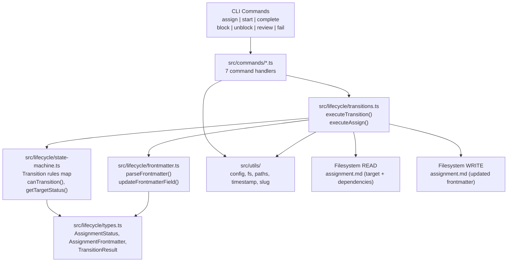
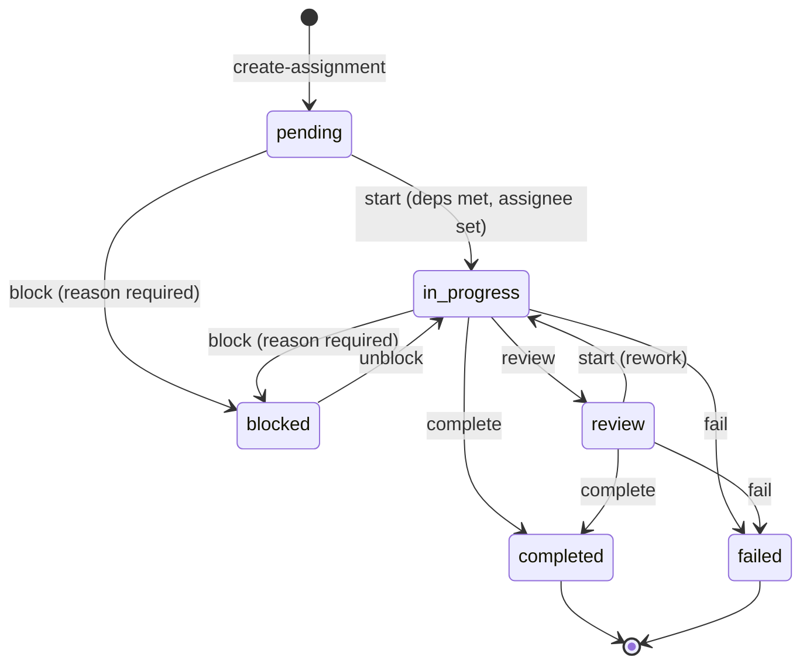

# Chunk 4: Assignment Lifecycle Engine Implementation Plan

## Metadata
- **Date:** 2026-03-18
- **Complexity:** large
- **Tech Stack:** TypeScript, Node.js 20+, Commander.js, tsup, ESM, vitest

## Objective
Build the assignment lifecycle state machine and CLI commands that validate and execute status transitions on assignment.md files, enforcing dependency rules and required fields per the protocol spec.

## Success Criteria
- [ ] State machine module defines all valid transitions between the 6 statuses (pending, in_progress, blocked, review, completed, failed)
- [ ] `canTransition()` and `validateTransition()` enforce the transition map, dependency checks, and required fields (e.g., `blockedReason` for block)
- [ ] Frontmatter round-trip: parse assignment.md frontmatter, modify specific fields, write back preserving the markdown body unchanged
- [ ] 7 CLI commands registered: `assign`, `start`, `complete`, `block`, `unblock`, `review`, `fail`
- [ ] `syntaur assign` sets the assignee on any non-terminal assignment without changing status
- [ ] `syntaur start` transitions pending -> in_progress, validates dependency completion, requires assignee
- [ ] `syntaur block` transitions to blocked, requires `--reason`; `syntaur unblock` transitions back and clears blockedReason
- [ ] `syntaur review` transitions in_progress -> review; `syntaur complete` and `syntaur fail` handle terminal transitions from multiple source states
- [ ] Dependency validation: pending -> in_progress checks that all `dependsOn` assignments have `status: completed`
- [ ] Every transition updates the `updated` timestamp
- [ ] Unit tests for state machine (valid/invalid transitions, dependency checking)
- [ ] Unit tests for frontmatter parse/update/serialize round-trip
- [ ] Integration tests: scaffold assignments, run transitions, verify file changes

## Discovery Findings

### Codebase State (Post-Chunk 2, Chunk 3 NOT Implemented)
The project has a working CLI (`src/index.ts`, L1-73) with 3 commands: `init`, `create-mission`, `create-assignment`. The `src/rebuild/` and `src/lifecycle/` directories do not exist.

Key architectural facts:
- **Single runtime dependency:** `commander` only (`package.json` L24-26). No YAML parsing library.
- **Templates are pure functions** returning strings. Each takes a typed params object (`src/templates/assignment.ts` L12-75).
- **Utils are small focused modules** (`src/utils/slug.ts` = 13 lines, `src/utils/timestamp.ts` = 3 lines, `src/utils/yaml.ts` = 9 lines).
- **Config parser** (`src/utils/config.ts` L24-49) handles only flat key-value and one-level dot-notation. Cannot parse arrays, nested objects, or the full assignment.md frontmatter.
- **Tests use temp directories** with `mkdtemp` (`src/__tests__/commands.test.ts` L10-16), scaffold real files, verify with `readFile` and string assertions.
- **All new assignments start as `status: pending`** with `assignee: null` (`src/templates/assignment.ts` L23-27).

### Critical Dependency: Frontmatter Round-Trip
The existing `parseFrontmatter()` in `src/utils/config.ts` (L24-49) is read-only and limited to flat key-value pairs. Chunk 4 needs a **round-trip** parser that can:
1. Parse assignment.md frontmatter into a typed object (including arrays like `dependsOn` and nested objects like `workspace`)
2. Update specific fields (status, assignee, blockedReason, updated)
3. Serialize back to YAML frontmatter while preserving the markdown body unchanged

**Approach:** Build a focused `src/lifecycle/frontmatter.ts` that handles only the assignment.md schema. This is simpler than chunk 3's full parser because we know the exact schema shape and only need to handle that subset. When chunk 3 is built later, it can either reuse this or build its own read-only parser.

### Files That Will Need Changes
| File | Current Purpose | Needed Change |
|------|----------------|---------------|
| `src/index.ts` | CLI entry with 3 commands (L1-73) | Register 7 new lifecycle commands |
| **New:** `src/lifecycle/types.ts` | -- | TypeScript types: `AssignmentStatus`, `TransitionResult`, `AssignmentFrontmatter` |
| **New:** `src/lifecycle/state-machine.ts` | -- | Valid transitions map, `canTransition()`, `validateTransition()` with dependency checking |
| **New:** `src/lifecycle/frontmatter.ts` | -- | Parse assignment.md frontmatter, update fields, serialize back preserving body |
| **New:** `src/lifecycle/transitions.ts` | -- | Execute transitions: read file, validate, update fields, write file |
| **New:** `src/lifecycle/index.ts` | -- | Barrel export |
| **New:** `src/commands/assign.ts` | -- | `syntaur assign <assignment> --agent <name> --mission <slug>` |
| **New:** `src/commands/start.ts` | -- | `syntaur start <assignment> --mission <slug>` |
| **New:** `src/commands/complete.ts` | -- | `syntaur complete <assignment> --mission <slug>` |
| **New:** `src/commands/block.ts` | -- | `syntaur block <assignment> --reason <text> --mission <slug>` |
| **New:** `src/commands/unblock.ts` | -- | `syntaur unblock <assignment> --mission <slug>` |
| **New:** `src/commands/review.ts` | -- | `syntaur review <assignment> --mission <slug>` |
| **New:** `src/commands/fail.ts` | -- | `syntaur fail <assignment> --mission <slug>` |
| **New:** `src/__tests__/state-machine.test.ts` | -- | Unit tests for transition validation, dependency checking |
| **New:** `src/__tests__/frontmatter.test.ts` | -- | Unit tests for frontmatter parse/update/serialize round-trip |
| **New:** `src/__tests__/lifecycle-commands.test.ts` | -- | Integration tests: scaffold assignments, run transitions, verify file changes |

### CLAUDE.md Rules
- No repo-level CLAUDE.md exists in `/Users/brennen/syntaur/`.
- Global `~/.claude/CLAUDE.md`: avoid preamble, plans in `.claude/plans/`, tracked by git.
- Sample mission CLAUDE.md rule: "Do NOT set status to `blocked` for unanswered questions; `blocked` is reserved for hard runtime/manual blockers." This informs the state machine: blocked is exceptional, not for Q&A stalls.

## High-Level Architecture

### Approach
A **command -> validate -> mutate -> write** pipeline. Each CLI command resolves the assignment.md file, parses its frontmatter, validates the requested transition (checking the state machine, dependency status, and required fields), applies field mutations, and writes the updated file back.

This approach was chosen because:
1. **Matches existing patterns.** Chunk 2 commands follow: validate inputs, resolve paths, read/write files, report results. Lifecycle commands are the same pipeline but with a validate-then-mutate step in the middle.
2. **Testable at each layer.** The state machine is a pure data structure (unit-testable). The frontmatter parser is independently testable. The transition executor composes them. Integration tests cover the full CLI flow.
3. **Self-contained.** Does not depend on chunk 3's rebuild pipeline. The frontmatter module handles only the assignment.md schema, not the general case.
4. **No new runtime dependencies.** Follows the single-dep pattern (only `commander`). The frontmatter parser is hand-rolled for the known assignment.md YAML subset.

### Key Decisions
| Decision | Chosen Option | Alternatives Considered | Rationale |
|----------|--------------|------------------------|-----------|
| Command count | 7 commands: assign, start, complete, block, unblock, review, fail | 3 commands (assign, complete, block) with flags to cover all transitions | 6 statuses imply multiple transitions. Dedicated commands are more discoverable, easier to document, and each has specific required options (e.g., block requires --reason). Avoids overloaded flag combinations on fewer commands. |
| Assign semantics | `assign` only sets assignee, does NOT change status | `assign` also transitions pending -> in_progress | Separating "who owns it" from "what state it's in" is cleaner. `start` handles the state transition and validates dependencies. `assign` can be called on any non-terminal assignment. |
| Frontmatter strategy | Regex-based parse + targeted field replacement (not full serialize) | Full YAML parse/serialize; add `yaml` npm package | A field-replacement approach preserves formatting, comments, and field ordering. Full serialization risks reordering fields or changing quote styles. Regex replacement on known fields is sufficient for the bounded set of mutations (status, assignee, blockedReason, updated). |
| Unblock target state | `unblock` always returns to `in_progress` (not original pre-block state) | Track and restore pre-block state | Simpler and avoids needing a `previousStatus` field. The protocol does not define pre-block state tracking. If the assignment was pending before being blocked, it can be started separately after unblocking. |
| Rebuild integration | Print suggestion message: "Run `syntaur rebuild` to update indexes" | Auto-call rebuild; stub rebuild call | Chunk 3 is not implemented. A suggestion message keeps chunk 4 self-contained. When rebuild exists, we can wire it up. |
| Module location | `src/lifecycle/` directory | Flat in `src/`; inside `src/commands/` | Groups related lifecycle modules (types, state machine, frontmatter, transitions) together. Parallels the `src/commands/`, `src/templates/`, `src/utils/` pattern. |
| Dependency validation | Read each dependency's assignment.md frontmatter at transition time | Cache/index dependency statuses | Reading at transition time is correct since statuses may have changed. The number of dependencies per assignment is small (typically 0-3). No caching needed. |

### Components

**Types (`src/lifecycle/types.ts`):** TypeScript types for the lifecycle domain: `AssignmentStatus` (union of 6 string literals), `AssignmentFrontmatter` (typed object matching the assignment.md frontmatter schema), `TransitionResult` (success/failure with message), `TransitionType` (enum of the 7 operations).

**State Machine (`src/lifecycle/state-machine.ts`):** Pure data structure defining valid transitions as a map from `[fromStatus, command]` to `toStatus`. Exports `canTransition(from, command)` returning boolean and `getTargetStatus(from, command)` returning the target status or null. Does not perform side effects -- it is the transition rule table only.

**Frontmatter Module (`src/lifecycle/frontmatter.ts`):** Two concerns:
1. **Parse:** Extract the `---` frontmatter block from an assignment.md file, parse it into an `AssignmentFrontmatter` typed object. Must handle: strings (quoted/unquoted), null, arrays (`[]` and `- item` forms), and one-level nested objects (`workspace`).
2. **Update:** Given the raw file content and a partial update object (e.g., `{ status: 'in_progress', updated: '...' }`), replace the specific YAML fields in the frontmatter block and return the full file content with the body unchanged. This is a targeted field replacement, not a full re-serialize.

**Transitions (`src/lifecycle/transitions.ts`):** The orchestration layer. Exports an `executeTransition()` function that: (1) resolves the assignment.md path, (2) reads and parses frontmatter, (3) validates via the state machine, (4) for `start`: reads dependency assignment.md files and checks their statuses, (5) applies field mutations (status, updated, plus command-specific fields), (6) writes the updated file, (7) returns a `TransitionResult`. Also exports `executeAssign()` for the assign-only path (no status change).

**Command Handlers (`src/commands/assign.ts`, `start.ts`, `complete.ts`, `block.ts`, `unblock.ts`, `review.ts`, `fail.ts`):** Each follows the existing command pattern from `src/commands/create-assignment.ts` (L26-193): async exported function, validates CLI inputs, calls `readConfig()` for base dir, resolves paths, delegates to `executeTransition()` or `executeAssign()`, prints results. Each command file is small (30-60 lines) since the logic lives in the lifecycle module.

**Barrel Export (`src/lifecycle/index.ts`):** Re-exports all public APIs, following `src/utils/index.ts` (L1-13).

## Architecture Diagram



### State Machine Transition Map



## Patterns to Follow

Every pattern below was verified by reading the complete file.

| Pattern | Reference File | Lines | What to Copy |
|---------|---------------|-------|--------------|
| Command handler structure | `src/commands/create-assignment.ts` | L26-193 | Async exported function, typed options interface (L17-24), `readConfig()` for base dir (L80), `expandHome()` for `--dir` (L82), `resolve()` for paths (L91-93), `fileExists()` for validation (L96), thrown `Error` for failures (L97-99), console output summary (L179-192) |
| CLI registration with try/catch | `src/index.ts` | L29-45 | `.command()`, `.description()`, `.argument()`, `.option()`, `.action(async (...) => { try { ... } catch { console.error(); process.exit(1); } })` |
| YAML array rendering | `src/templates/assignment.ts` | L14-17 | Empty array as `field: []`, populated array as `field:\n  - item1\n  - item2` |
| YAML frontmatter structure | `src/templates/assignment.ts` | L19-36 | Full assignment frontmatter: id, slug, title, status, priority, created, updated, assignee, externalIds, dependsOn, blockedReason, workspace (nested), tags |
| Barrel export pattern | `src/utils/index.ts` | L1-13 | Named exports + type exports from each module in the directory |
| Test setup with temp dirs | `src/__tests__/commands.test.ts` | L1-16 | `mkdtemp(join(tmpdir(), 'syntaur-test-'))` in `beforeEach`, `rm(testDir, { recursive: true, force: true })` in `afterEach` |
| Test assertions on file content | `src/__tests__/commands.test.ts` | L115-123 | `readFile(path, 'utf-8')`, then `expect(content).toContain('status: pending')` |
| Sample assignment: completed | `examples/sample-mission/assignments/design-auth-schema/assignment.md` | L1-18 | Shows `status: completed`, `assignee: claude-2`, `blockedReason: null`, `dependsOn: []` |
| Sample assignment: in_progress with deps | `examples/sample-mission/assignments/implement-jwt-middleware/assignment.md` | L1-22 | Shows `status: in_progress`, `assignee: claude-1`, `dependsOn:\n  - design-auth-schema`, nested `workspace` object, `externalIds` array with nested objects |
| Sample assignment: pending with unmet deps | `examples/sample-mission/assignments/write-auth-tests/assignment.md` | L1-19 | Shows `status: pending`, `assignee: null`, `dependsOn:\n  - implement-jwt-middleware` |
| Timestamp format | `src/utils/timestamp.ts` | L1-3 | `new Date().toISOString().replace(/\.\d{3}Z$/, 'Z')` producing `2026-03-18T14:30:00Z` |
| Slug validation | `src/utils/slug.ts` | L11-13 | `isValidSlug()` uses `/^[a-z0-9]+(-[a-z0-9]+)*$/` |
| File writing | `src/utils/fs.ts` | L29-35 | `writeFileForce()` ensures parent dir exists then writes |

## Implementation Overview

### Task List (High-Level)

1. **Define TypeScript types** -- Files: `src/lifecycle/types.ts`
   Create the `AssignmentStatus` union type (6 literals), `AssignmentFrontmatter` interface (matching the schema from `src/templates/assignment.ts` L19-36), `TransitionResult` (success boolean + message), and `TransitionCommand` type (7 command names). Terminal statuses: `completed`, `failed`.

2. **Build the state machine** -- Files: `src/lifecycle/state-machine.ts`, `src/__tests__/state-machine.test.ts`
   Define the transition rules as a `Map<string, AssignmentStatus>` keyed by `${fromStatus}:${command}`. Export `canTransition(from, command)`, `getTargetStatus(from, command)`, and `isTerminalStatus(status)`. The full transition table:
   - `pending:start` -> `in_progress`
   - `pending:block` -> `blocked`
   - `in_progress:block` -> `blocked`
   - `in_progress:review` -> `review`
   - `in_progress:complete` -> `completed`
   - `in_progress:fail` -> `failed`
   - `blocked:unblock` -> `in_progress`
   - `review:start` -> `in_progress` (rework)
   - `review:complete` -> `completed`
   - `review:fail` -> `failed`

   Unit tests: every valid transition returns correct target, every invalid transition returns null/false, terminal statuses reject all transitions.

3. **Build the frontmatter module** -- Files: `src/lifecycle/frontmatter.ts`, `src/__tests__/frontmatter.test.ts`
   Two functions:
   - `parseAssignmentFrontmatter(fileContent: string): AssignmentFrontmatter` -- Extract `---` block, parse key-value pairs including arrays (`dependsOn`, `externalIds`, `tags`) and nested object (`workspace`). Must handle quoted strings, null, empty arrays `[]`, and block arrays `- item`.
   - `updateAssignmentFile(fileContent: string, updates: Partial<AssignmentFrontmatter>): string` -- For each key in `updates`, find the corresponding line(s) in the frontmatter and replace the value. For simple fields (status, assignee, blockedReason, updated), this is a single-line regex replacement. Returns the complete file content with body unchanged.

   Unit tests: round-trip parse then update on each sample assignment file. Verify body is preserved byte-for-byte. Verify each field type (string, null, array, nested object) parses correctly. Verify updates to status, assignee, blockedReason, and updated produce correct YAML.

4. **Build the transition executor** -- Files: `src/lifecycle/transitions.ts`
   `executeTransition(missionDir, assignmentSlug, command, options?)`:
   1. Resolve `assignments/<slug>/assignment.md` path
   2. Read file, parse frontmatter
   3. Check `canTransition(currentStatus, command)` -- if false, return error result
   4. If command is `start`: read each `dependsOn` assignment's frontmatter, verify all have `status: completed`
   5. If command is `start` and no assignee set: require `--agent` option or error
   6. If command is `block`: require `options.reason` or error
   7. Build updates object: `{ status: targetStatus, updated: nowTimestamp() }` plus command-specific fields
   8. Call `updateAssignmentFile()` and write back
   9. Return success result with message

   `executeAssign(missionDir, assignmentSlug, agent)`:
   1. Read and parse assignment frontmatter
   2. Verify status is not terminal (completed/failed)
   3. Update assignee and updated fields
   4. Write back and return result

5. **Create barrel export** -- Files: `src/lifecycle/index.ts`
   Re-export all public types and functions from the lifecycle modules.

6. **Build the 7 CLI command handlers** -- Files: `src/commands/assign.ts`, `src/commands/start.ts`, `src/commands/complete.ts`, `src/commands/block.ts`, `src/commands/unblock.ts`, `src/commands/review.ts`, `src/commands/fail.ts`
   Each command handler follows the pattern from `src/commands/create-assignment.ts` (L26-193):
   - Typed options interface
   - Async exported function
   - `readConfig()` for base dir, `expandHome()` for `--dir`
   - Resolve mission dir, validate mission exists
   - Delegate to `executeTransition()` or `executeAssign()`
   - Print result (success message or error)
   - Print suggestion: `Tip: Run 'syntaur rebuild --mission <slug>' to update indexes.`

   Common CLI interface per command:
   - `syntaur assign <assignment> --agent <name> --mission <slug> [--dir <path>]`
   - `syntaur start <assignment> --mission <slug> [--agent <name>] [--dir <path>]`
   - `syntaur complete <assignment> --mission <slug> [--dir <path>]`
   - `syntaur block <assignment> --reason <text> --mission <slug> [--dir <path>]`
   - `syntaur unblock <assignment> --mission <slug> [--dir <path>]`
   - `syntaur review <assignment> --mission <slug> [--dir <path>]`
   - `syntaur fail <assignment> --mission <slug> [--dir <path>]`

7. **Register commands in CLI entry** -- Files: `src/index.ts`
   Add 7 new `.command()` registrations following the existing pattern at L29-45. Each with `.command()`, `.description()`, `.argument('<assignment>')`, `.option()` chains, and `.action(async (...) => { try/catch })` wrapper.

8. **Integration tests** -- Files: `src/__tests__/lifecycle-commands.test.ts`
   Test scenarios:
   - Scaffold a mission with 2 assignments (A depends on B), both pending
   - `assign` A -> verify assignee field updated, status still pending
   - `start` A -> should fail (dependency B not completed)
   - `start` B -> should succeed (no deps, but needs assignee -- test with `--agent`)
   - `complete` B -> verify status: completed
   - `start` A -> should now succeed (dependency satisfied)
   - `block` A with reason -> verify status: blocked, blockedReason set
   - `unblock` A -> verify status: in_progress, blockedReason cleared
   - `review` A -> verify status: review
   - `complete` A -> verify status: completed
   - Invalid transitions: `complete` on pending (should error), `start` on completed (should error)
   - Verify body content is unchanged after all transitions

### File Changes Summary
| File | Action | Purpose | Pattern Reference |
|------|--------|---------|-------------------|
| `src/lifecycle/types.ts` | CREATE | TypeScript types for lifecycle domain | N/A (type definitions) |
| `src/lifecycle/state-machine.ts` | CREATE | Transition rules, `canTransition()`, `getTargetStatus()` | Pure data structure (no side effects) |
| `src/lifecycle/frontmatter.ts` | CREATE | Parse and update assignment.md frontmatter | `src/utils/config.ts` L24-49 (extend pattern for arrays + nesting) |
| `src/lifecycle/transitions.ts` | CREATE | Orchestrate: read, validate, mutate, write | `src/commands/create-assignment.ts` L80-112 (path resolution + validation) |
| `src/lifecycle/index.ts` | CREATE | Barrel export | `src/utils/index.ts` L1-13 |
| `src/commands/assign.ts` | CREATE | `syntaur assign` handler | `src/commands/create-assignment.ts` L26-193 |
| `src/commands/start.ts` | CREATE | `syntaur start` handler | `src/commands/create-assignment.ts` L26-193 |
| `src/commands/complete.ts` | CREATE | `syntaur complete` handler | `src/commands/create-assignment.ts` L26-193 |
| `src/commands/block.ts` | CREATE | `syntaur block` handler | `src/commands/create-assignment.ts` L26-193 |
| `src/commands/unblock.ts` | CREATE | `syntaur unblock` handler | `src/commands/create-assignment.ts` L26-193 |
| `src/commands/review.ts` | CREATE | `syntaur review` handler | `src/commands/create-assignment.ts` L26-193 |
| `src/commands/fail.ts` | CREATE | `syntaur fail` handler | `src/commands/create-assignment.ts` L26-193 |
| `src/index.ts` | MODIFY | Register 7 new commands | `src/index.ts` L29-45 (existing registration pattern) |
| `src/__tests__/state-machine.test.ts` | CREATE | State machine unit tests | `src/__tests__/commands.test.ts` L1-16 (test setup) |
| `src/__tests__/frontmatter.test.ts` | CREATE | Frontmatter round-trip tests | `src/__tests__/commands.test.ts` L1-16 (test setup) |
| `src/__tests__/lifecycle-commands.test.ts` | CREATE | Integration tests for full lifecycle | `src/__tests__/commands.test.ts` L94-192 (scaffold + verify pattern) |

## Dependencies & Risks
| Dependency/Risk | Impact | Mitigation |
|----------------|--------|------------|
| Frontmatter field replacement via regex | Could break on edge cases: multi-line values, unusual quoting, comments | The assignment.md schema is well-defined (from `src/templates/assignment.ts` L19-36). Test against all 3 sample assignment files. Only replace known fields with known value patterns. |
| `externalIds` array contains nested objects | The `implement-jwt-middleware` sample (L10-13) has `externalIds` entries with `system`, `id`, `url` sub-keys. The frontmatter parser must handle this. | For the update function, we never modify `externalIds`, only `status`, `assignee`, `blockedReason`, and `updated`. The parser needs to handle it for type-correctness, but the updater can skip complex fields. |
| Dependency validation requires reading multiple files | `start` on an assignment with N dependencies reads N+1 files | N is typically 0-3 per assignment. Sequential reads are fine. Error handling: if a dependency's assignment.md is missing, treat as "dependency not satisfied" with a clear error message. |
| Chunk 3 rebuild not available | Status changes are not reflected in index files | Print a suggestion message after each transition. This is temporary until chunk 3 is implemented. |
| Concurrent modifications | Two agents modifying the same assignment.md simultaneously | Out of scope for v1. The protocol assumes sequential access. Document this as a known limitation. |
| `unblock` always goes to `in_progress` | An assignment blocked from `pending` will unblock to `in_progress`, skipping the dependency check | This is acceptable: if someone manually blocks a pending assignment and then unblocks it, going to `in_progress` is a reasonable default. The `start` command is what enforces dependency checking. If they want to go back to `pending`, they would need to handle that manually. |

## Assumptions Log
| Assumption Avoided | Verified By | Answer |
|-------------------|-------------|--------|
| "parseFrontmatter in config.ts handles arrays" | Read `src/utils/config.ts` L24-49 | No -- it only handles flat key-value and dot-notation nesting. A new parser is needed. |
| "All assignments have the same frontmatter fields" | Read `src/templates/assignment.ts` L19-36 and all 3 sample assignments | Yes -- all assignments follow the same schema: id, slug, title, status, priority, created, updated, assignee, externalIds, dependsOn, blockedReason, workspace, tags. |
| "Timestamps are ISO 8601 in quotes" | Read `src/templates/assignment.ts` L25-26 and `src/utils/timestamp.ts` L1-3 | Yes -- `created: "2026-03-18T14:30:00Z"` format, generated by `nowTimestamp()`. |
| "Blocked requires a reason field" | Read discovery findings and protocol spec reference | Yes -- `blockedReason` must be set when transitioning to blocked. It is `null` when not blocked. |
| "assignee is a string or null" | Read sample assignments: `design-auth-schema` L9 (`assignee: claude-2`), `write-auth-tests` L9 (`assignee: null`) | Yes -- string when assigned, null when unassigned. |
| "dependsOn is an array of slugs" | Read `src/templates/assignment.ts` L14-17 and sample files | Yes -- empty `[]` or block-style `- slug` entries. Each slug references another assignment in the same mission. |
| "Terminal statuses reject all transitions" | Derived from state machine design | Yes -- `completed` and `failed` have no outgoing transitions. The `assign` command also rejects terminal statuses. |
| "workspace nested object needs parsing but not updating" | Read sample assignments: nested `workspace` with `repository`, `worktreePath`, `branch`, `parentBranch` | Yes -- lifecycle commands never modify workspace fields. Parser must handle them for type safety; updater ignores them. |

## Exploration Findings

### Explorer 1: Pattern Verification
Examined all existing command handlers, templates, utils, and test files to verify patterns for the lifecycle implementation.

**Command handler pattern** (`src/commands/create-assignment.ts`, full file 193 lines): Async function exported with typed options interface (L17-24). Uses `readConfig()` (L80) to get base dir, `expandHome()` (L82) for `--dir` override, `resolve()` for path construction (L91-93), `fileExists()` for validation (L96, L121), thrown `Error` instances for failures (L30-32, L35-37, L97-99). Console output summarizes what was created (L179-192). The lifecycle commands should follow this exact structure, but delegate to `executeTransition()` instead of writing template files.

**CLI registration pattern** (`src/index.ts`, full file 73 lines): Each command registered at top level with `.command('name')`, `.description('...')`, `.argument('<required>')`, `.option('--flag <value>', 'description')`, `.action(async (args, options) => { try { await handler(args, options); } catch (error) { console.error('Error:', error instanceof Error ? error.message : String(error)); process.exit(1); } })`. The 7 lifecycle commands should be registered identically.

**Template/frontmatter shape** (`src/templates/assignment.ts`, full file 75 lines): The assignment frontmatter at L19-36 defines every field that the lifecycle module must parse and potentially update. Key observation: `status` is always an unquoted string (L23), `assignee` is unquoted (L27, either a name or `null`), `blockedReason` is unquoted `null` (L30), timestamps are quoted strings (L25-26).

**Test pattern** (`src/__tests__/commands.test.ts`, full file 192 lines): Uses vitest `describe`/`it`/`expect`. Temp directory created in `beforeEach` (L10-12), cleaned up in `afterEach` (L14-16). Tests call command functions directly, not through CLI parsing. Verification via `readFile` + `expect().toContain()`. The lifecycle integration test should scaffold missions using `createMissionCommand` + `createAssignmentCommand`, then call transition functions and verify file content changes.

### Explorer 2: Architecture Validation
Examined the directory structure, module boundaries, and the sample assignment files to validate the architectural approach.

**Directory structure:** `src/commands/` (3 files), `src/templates/` (11 files + barrel), `src/utils/` (7 files + barrel), `src/__tests__/` (6 test files). No `src/lifecycle/` or `src/rebuild/` exists. Creating `src/lifecycle/` follows the established pattern of feature-grouped directories.

**Sample assignment files validate the frontmatter schema:**
- `design-auth-schema/assignment.md` (L1-18): completed status, assigned agent, empty arrays as `[]`, null blockedReason.
- `implement-jwt-middleware/assignment.md` (L1-22): in_progress status, assigned agent, block-style dependsOn array, nested externalIds with sub-objects, populated workspace.
- `write-auth-tests/assignment.md` (L1-19): pending status, null assignee, block-style dependsOn array.

These three samples cover every field variation the frontmatter parser must handle. They also demonstrate the dependency chain that the `start` command must validate: `write-auth-tests` depends on `implement-jwt-middleware`, which depends on `design-auth-schema`.

**Module boundaries are clean:** Utils never import from commands or templates. Commands import from utils and templates. The lifecycle module should import from utils (config, fs, paths, timestamp, slug) but not from commands or templates. Commands import from lifecycle.

---

## Phase 3: Detailed Implementation Plan

### Task 1: Define TypeScript Types
**File(s):** `src/lifecycle/types.ts`
**Action:** CREATE
**Pattern Reference:** N/A (pure type definitions)
**Estimated complexity:** Low

#### Context
All other lifecycle modules depend on these types. They must be created first.

#### Steps

1. [ ] **Step 1.1:** Create `src/lifecycle/types.ts` with all type definitions
   - **Location:** new file at `src/lifecycle/types.ts`
   - **Action:** CREATE
   - **What to do:** Define `AssignmentStatus` union type, `TransitionCommand` union type, `AssignmentFrontmatter` interface, `TransitionResult` interface, and `TERMINAL_STATUSES` constant.
   - **Code:**
     ```typescript
     export type AssignmentStatus =
       | 'pending'
       | 'in_progress'
       | 'blocked'
       | 'review'
       | 'completed'
       | 'failed';

     export type TransitionCommand =
       | 'assign'
       | 'start'
       | 'complete'
       | 'block'
       | 'unblock'
       | 'review'
       | 'fail';

     export interface ExternalId {
       system: string;
       id: string;
       url: string;
     }

     export interface Workspace {
       repository: string | null;
       worktreePath: string | null;
       branch: string | null;
       parentBranch: string | null;
     }

     export interface AssignmentFrontmatter {
       id: string;
       slug: string;
       title: string;
       status: AssignmentStatus;
       priority: 'low' | 'medium' | 'high' | 'critical';
       created: string;
       updated: string;
       assignee: string | null;
       externalIds: ExternalId[];
       dependsOn: string[];
       blockedReason: string | null;
       workspace: Workspace;
       tags: string[];
     }

     export interface TransitionResult {
       success: boolean;
       message: string;
       fromStatus?: AssignmentStatus;
       toStatus?: AssignmentStatus;
     }

     export const TERMINAL_STATUSES: ReadonlySet<AssignmentStatus> = new Set([
       'completed',
       'failed',
     ]);
     ```
   - **Proof blocks:**
     - **PROOF:** `status: pending` is an unquoted string literal in assignment frontmatter
       Source: `src/templates/assignment.ts:23`
       Actual code: `status: pending`
     - **PROOF:** The 6 statuses come from the state diagram in the outline: pending, in_progress, blocked, review, completed, failed
       Source: Plan outline, state machine transition map (lines 139-153)
     - **PROOF:** `assignee` is `null` or an unquoted string
       Source: `examples/sample-mission/assignments/design-auth-schema/assignment.md:9` (`assignee: claude-2`) and `examples/sample-mission/assignments/write-auth-tests/assignment.md:9` (`assignee: null`)
     - **PROOF:** `externalIds` can contain objects with `system`, `id`, `url` sub-keys
       Source: `examples/sample-mission/assignments/implement-jwt-middleware/assignment.md:10-13`
       Actual code:
       ```yaml
       externalIds:
         - system: jira
           id: AUTH-43
           url: https://jira.example.com/browse/AUTH-43
       ```
     - **PROOF:** `workspace` has 4 sub-fields: `repository`, `worktreePath`, `branch`, `parentBranch`
       Source: `src/templates/assignment.ts:31-35`
       Actual code:
       ```yaml
       workspace:
         repository: null
         worktreePath: null
         branch: null
         parentBranch: null
       ```
     - **PROOF:** `dependsOn` is either `[]` or block array of slugs
       Source: `src/templates/assignment.ts:14-17`
       Actual code:
       ```typescript
       const dependsOnYaml =
         params.dependsOn.length === 0
           ? 'dependsOn: []'
           : `dependsOn:\n  - ${params.dependsOn.join('\n  - ')}`;
       ```
     - **PROOF:** `priority` type is `'low' | 'medium' | 'high' | 'critical'`
       Source: `src/templates/assignment.ts:8`
       Actual code: `priority: 'low' | 'medium' | 'high' | 'critical';`
   - **Verification:**
     ```bash
     cd /Users/brennen/syntaur && npx tsc --noEmit src/lifecycle/types.ts
     ```

#### Error Handling
No error handling needed -- this is a pure type definitions file.

#### Task Completion Criteria
- [ ] File compiles without errors
- [ ] `AssignmentStatus` has exactly 6 literal members
- [ ] `TransitionCommand` has exactly 7 literal members
- [ ] `AssignmentFrontmatter` interface has all 13 fields matching the template at `src/templates/assignment.ts:19-36`
- [ ] `TERMINAL_STATUSES` contains exactly `completed` and `failed`

---

### Task 2: Build the State Machine
**File(s):** `src/lifecycle/state-machine.ts`
**Action:** CREATE
**Pattern Reference:** Pure data structure, no side effects
**Estimated complexity:** Low

#### Context
The state machine is the rules engine that determines which status transitions are valid. It is a pure function layer with no file I/O.

#### Steps

1. [ ] **Step 2.1:** Create `src/lifecycle/state-machine.ts` with the transition table and query functions
   - **Location:** new file at `src/lifecycle/state-machine.ts`
   - **Action:** CREATE
   - **What to do:** Define a `Map<string, AssignmentStatus>` keyed by `${fromStatus}:${command}` mapping to the target status. Export `canTransition()`, `getTargetStatus()`, and `isTerminalStatus()`.
   - **Code:**
     ```typescript
     import type { AssignmentStatus, TransitionCommand } from './types.js';
     import { TERMINAL_STATUSES } from './types.js';

     /**
      * Transition rules map. Key format: "fromStatus:command" -> toStatus.
      * Only entries present here are valid transitions.
      */
     const TRANSITION_TABLE = new Map<string, AssignmentStatus>([
       ['pending:start', 'in_progress'],
       ['pending:block', 'blocked'],
       ['in_progress:block', 'blocked'],
       ['in_progress:review', 'review'],
       ['in_progress:complete', 'completed'],
       ['in_progress:fail', 'failed'],
       ['blocked:unblock', 'in_progress'],
       ['review:start', 'in_progress'],
       ['review:complete', 'completed'],
       ['review:fail', 'failed'],
     ]);

     function transitionKey(from: AssignmentStatus, command: TransitionCommand): string {
       return `${from}:${command}`;
     }

     export function canTransition(from: AssignmentStatus, command: TransitionCommand): boolean {
       return TRANSITION_TABLE.has(transitionKey(from, command));
     }

     export function getTargetStatus(
       from: AssignmentStatus,
       command: TransitionCommand,
     ): AssignmentStatus | null {
       return TRANSITION_TABLE.get(transitionKey(from, command)) ?? null;
     }

     export function isTerminalStatus(status: AssignmentStatus): boolean {
       return TERMINAL_STATUSES.has(status);
     }
     ```
   - **Proof blocks:**
     - **PROOF:** The 10 valid transitions match the state diagram in the outline
       Source: Plan outline, lines 140-152
       Actual transitions:
       ```
       pending --> in_progress : start
       pending --> blocked : block
       in_progress --> blocked : block
       in_progress --> review : review
       in_progress --> completed : complete
       in_progress --> failed : fail
       blocked --> in_progress : unblock
       review --> in_progress : start (rework)
       review --> completed : complete
       review --> failed : fail
       ```
     - **PROOF:** `TERMINAL_STATUSES` is exported from `./types.js` (defined in Task 1)
     - **PROOF:** Import uses `.js` extension per the ESM convention in this project
       Source: `src/commands/create-assignment.ts:2-7` (all imports use `.js` extension)
   - **Verification:**
     ```bash
     cd /Users/brennen/syntaur && npx tsc --noEmit src/lifecycle/state-machine.ts
     ```

#### Error Handling
No runtime error handling needed -- pure functions return `false` or `null` for invalid inputs.

#### Task Completion Criteria
- [ ] `canTransition('pending', 'start')` returns `true`
- [ ] `canTransition('completed', 'start')` returns `false`
- [ ] `getTargetStatus('pending', 'start')` returns `'in_progress'`
- [ ] `getTargetStatus('completed', 'start')` returns `null`
- [ ] `isTerminalStatus('completed')` returns `true`
- [ ] `isTerminalStatus('pending')` returns `false`
- [ ] Exactly 10 entries in the transition table

---

### Task 3: Build the Frontmatter Module
**File(s):** `src/lifecycle/frontmatter.ts`
**Action:** CREATE
**Pattern Reference:** `src/utils/config.ts:24-49` (existing `parseFrontmatter` for structure reference, but our version is more capable)
**Estimated complexity:** High

#### Context
This module parses assignment.md frontmatter into a typed object and performs targeted field replacement to update specific fields without affecting the markdown body or other frontmatter fields.

#### Steps

1. [ ] **Step 3.1:** Create `src/lifecycle/frontmatter.ts` with parse and update functions
   - **Location:** new file at `src/lifecycle/frontmatter.ts`
   - **Action:** CREATE
   - **What to do:** Implement `parseAssignmentFrontmatter()` that extracts the `---` block and parses it into an `AssignmentFrontmatter` typed object. Implement `updateAssignmentFile()` that performs targeted regex-based field replacement on the raw file content.
   - **Code:**
     ```typescript
     import type { AssignmentFrontmatter, AssignmentStatus, ExternalId, Workspace } from './types.js';

     /**
      * Extract the raw frontmatter string (between --- markers) from file content.
      * Returns [frontmatterBlock, bodyContent] or throws if no frontmatter found.
      */
     function extractFrontmatter(fileContent: string): [string, string] {
       const match = fileContent.match(/^---\n([\s\S]*?)\n---/);
       if (!match) {
         throw new Error('No frontmatter found in file. Expected --- delimiters.');
       }
       const frontmatterBlock = match[1];
       const body = fileContent.slice(match[0].length);
       return [frontmatterBlock, body];
     }

     /**
      * Parse a simple YAML value: handles quoted strings, null, unquoted strings.
      */
     function parseSimpleValue(raw: string): string | null {
       const trimmed = raw.trim();
       if (trimmed === 'null') return null;
       // Remove surrounding quotes if present
       if (
         (trimmed.startsWith('"') && trimmed.endsWith('"')) ||
         (trimmed.startsWith("'") && trimmed.endsWith("'"))
       ) {
         return trimmed.slice(1, -1);
       }
       return trimmed;
     }

     /**
      * Parse the dependsOn field. Handles:
      * - `dependsOn: []` (empty inline)
      * - `dependsOn:\n  - slug1\n  - slug2` (block array of strings)
      */
     function parseDependsOn(frontmatter: string): string[] {
       // Check for inline empty array
       const inlineMatch = frontmatter.match(/^dependsOn:\s*\[\s*\]/m);
       if (inlineMatch) return [];

       // Check for block array
       const results: string[] = [];
       const blockMatch = frontmatter.match(/^dependsOn:\s*\n((?:\s+-\s+.*\n?)*)/m);
       if (blockMatch) {
         const items = blockMatch[1].matchAll(/^\s+-\s+(.+)$/gm);
         for (const item of items) {
           results.push(item[1].trim());
         }
       }
       return results;
     }

     /**
      * Parse the externalIds field. Handles:
      * - `externalIds: []` (empty inline)
      * - Block array of objects with system, id, url sub-keys
      */
     function parseExternalIds(frontmatter: string): ExternalId[] {
       const inlineMatch = frontmatter.match(/^externalIds:\s*\[\s*\]/m);
       if (inlineMatch) return [];

       const results: ExternalId[] = [];
       // Match the externalIds block: starts with "externalIds:" followed by "  - system:" entries
       const blockMatch = frontmatter.match(
         /^externalIds:\s*\n((?:\s+-\s+[\s\S]*?)(?=^\w|\n---)/m,
       );
       if (!blockMatch) return [];

       // Split on "  - " to get individual items
       const itemBlocks = blockMatch[1].split(/\n\s+-\s+/).filter(Boolean);
       for (const block of itemBlocks) {
         const lines = block.split('\n');
         const entry: Record<string, string> = {};
         for (const line of lines) {
           const colonIdx = line.indexOf(':');
           if (colonIdx < 0) continue;
           const key = line.slice(0, colonIdx).trim().replace(/^-\s+/, '');
           const value = line.slice(colonIdx + 1).trim();
           if (key && value) {
             entry[key] = value;
           }
         }
         if (entry['system'] && entry['id'] && entry['url']) {
           results.push({
             system: entry['system'],
             id: entry['id'],
             url: entry['url'],
           });
         }
       }
       return results;
     }

     /**
      * Parse the workspace nested object.
      */
     function parseWorkspace(frontmatter: string): Workspace {
       const defaults: Workspace = {
         repository: null,
         worktreePath: null,
         branch: null,
         parentBranch: null,
       };

       const fields = ['repository', 'worktreePath', 'branch', 'parentBranch'] as const;
       for (const field of fields) {
         const match = frontmatter.match(new RegExp(`^\\s+${field}:\\s*(.*)$`, 'm'));
         if (match) {
           defaults[field] = parseSimpleValue(match[1]);
         }
       }
       return defaults;
     }

     /**
      * Parse the tags field. Handles:
      * - `tags: []` (empty inline)
      * - `tags:\n  - tag1\n  - tag2` (block array)
      */
     function parseTags(frontmatter: string): string[] {
       const inlineMatch = frontmatter.match(/^tags:\s*\[\s*\]/m);
       if (inlineMatch) return [];

       const results: string[] = [];
       const blockMatch = frontmatter.match(/^tags:\s*\n((?:\s+-\s+.*\n?)*)/m);
       if (blockMatch) {
         const items = blockMatch[1].matchAll(/^\s+-\s+(.+)$/gm);
         for (const item of items) {
           results.push(item[1].trim());
         }
       }
       return results;
     }

     /**
      * Parse assignment.md file content into a typed AssignmentFrontmatter object.
      */
     export function parseAssignmentFrontmatter(fileContent: string): AssignmentFrontmatter {
       const [frontmatter] = extractFrontmatter(fileContent);

       function getField(key: string): string | null {
         const match = frontmatter.match(new RegExp(`^${key}:\\s*(.*)$`, 'm'));
         if (!match) return null;
         return parseSimpleValue(match[1]);
       }

       return {
         id: getField('id') ?? '',
         slug: getField('slug') ?? '',
         title: getField('title') ?? '',
         status: (getField('status') ?? 'pending') as AssignmentStatus,
         priority: (getField('priority') ?? 'medium') as AssignmentFrontmatter['priority'],
         created: getField('created') ?? '',
         updated: getField('updated') ?? '',
         assignee: getField('assignee'),
         externalIds: parseExternalIds(frontmatter),
         dependsOn: parseDependsOn(frontmatter),
         blockedReason: getField('blockedReason'),
         workspace: parseWorkspace(frontmatter),
         tags: parseTags(frontmatter),
       };
     }

     /**
      * Format a value for YAML output. Handles string, null, and quoted timestamp strings.
      */
     function formatYamlValue(value: string | null): string {
       if (value === null) return 'null';
       // Timestamps should be quoted (they contain colons)
       if (/^\d{4}-\d{2}-\d{2}T/.test(value)) {
         return `"${value}"`;
       }
       return value;
     }

     /**
      * Update specific fields in the assignment.md frontmatter.
      * Only modifies the fields specified in the updates object.
      * Preserves the markdown body unchanged.
      *
      * Supported update fields: status, assignee, blockedReason, updated.
      * These are all simple single-line key: value fields.
      */
     export function updateAssignmentFile(
       fileContent: string,
       updates: Partial<Pick<AssignmentFrontmatter, 'status' | 'assignee' | 'blockedReason' | 'updated'>>,
     ): string {
       let result = fileContent;

       for (const [key, value] of Object.entries(updates)) {
         if (value === undefined) continue;
         const formatted = formatYamlValue(value as string | null);
         // Match the field line in frontmatter: "key: anything" at start of line
         // This regex only matches within frontmatter because these field names
         // are unique YAML keys that appear before the closing ---
         const fieldRegex = new RegExp(`^(${key}:)\\s*.*$`, 'm');
         if (fieldRegex.test(result)) {
           result = result.replace(fieldRegex, `$1 ${formatted}`);
         }
       }

       return result;
     }
     ```
   - **Proof blocks:**
     - **PROOF:** Frontmatter delimiters are `---\n...\n---`
       Source: `src/utils/config.ts:25`
       Actual code: `const match = content.match(/^---\n([\s\S]*?)\n---/);`
     - **PROOF:** `status` is unquoted in frontmatter: `status: pending`
       Source: `src/templates/assignment.ts:23`
     - **PROOF:** `assignee` is unquoted: either `assignee: null` or `assignee: claude-2`
       Source: `examples/sample-mission/assignments/design-auth-schema/assignment.md:9` (`assignee: claude-2`)
     - **PROOF:** Timestamps are quoted: `created: "2026-03-15T09:30:00Z"`
       Source: `examples/sample-mission/assignments/design-auth-schema/assignment.md:7`
     - **PROOF:** `blockedReason` is unquoted: `blockedReason: null`
       Source: `examples/sample-mission/assignments/design-auth-schema/assignment.md:12`
     - **PROOF:** `dependsOn` empty form: `dependsOn: []`
       Source: `examples/sample-mission/assignments/design-auth-schema/assignment.md:11`
     - **PROOF:** `dependsOn` populated form: block array with `  - slug` items
       Source: `examples/sample-mission/assignments/implement-jwt-middleware/assignment.md:14-15`
       Actual code:
       ```yaml
       dependsOn:
         - design-auth-schema
       ```
     - **PROOF:** `externalIds` populated form: block array of objects
       Source: `examples/sample-mission/assignments/implement-jwt-middleware/assignment.md:10-13`
       Actual code:
       ```yaml
       externalIds:
         - system: jira
           id: AUTH-43
           url: https://jira.example.com/browse/AUTH-43
       ```
     - **PROOF:** `workspace` nested object with 4 sub-keys
       Source: `examples/sample-mission/assignments/implement-jwt-middleware/assignment.md:17-21`
       Actual code:
       ```yaml
       workspace:
         repository: /Users/brennen/projects/auth-service
         worktreePath: /Users/brennen/projects/auth-service-worktrees/implement-jwt-middleware
         branch: feat/jwt-middleware
         parentBranch: main
       ```
   - **Verification:**
     ```bash
     cd /Users/brennen/syntaur && npx tsc --noEmit src/lifecycle/frontmatter.ts
     ```

#### Error Handling
| Scenario | Handling | User Message | Code |
|----------|----------|--------------|------|
| No frontmatter delimiters found | Throw Error | "No frontmatter found in file. Expected --- delimiters." | `throw new Error('No frontmatter found in file. Expected --- delimiters.')` |
| Missing required field (id, slug, title) | Return empty string for that field | N/A (caller validates) | `getField('id') ?? ''` |

#### Task Completion Criteria
- [ ] `parseAssignmentFrontmatter()` correctly parses all 3 sample assignment files
- [ ] `parseAssignmentFrontmatter()` returns correct types for all 13 fields
- [ ] `updateAssignmentFile()` with `{ status: 'in_progress' }` replaces only the status line
- [ ] `updateAssignmentFile()` preserves the markdown body byte-for-byte
- [ ] `updateAssignmentFile()` with `{ updated: '2026-03-18T15:00:00Z' }` produces a quoted timestamp
- [ ] `updateAssignmentFile()` with `{ assignee: 'claude-3' }` replaces `assignee: null` with `assignee: claude-3`
- [ ] `updateAssignmentFile()` with `{ blockedReason: null }` replaces any blockedReason value with `null`

---

### Task 4: Build the Transition Executor
**File(s):** `src/lifecycle/transitions.ts`
**Action:** CREATE
**Pattern Reference:** `src/commands/create-assignment.ts:80-112` (path resolution and validation pattern)
**Estimated complexity:** Medium

#### Context
This module orchestrates the full transition pipeline: resolve path, read file, validate via state machine, check dependencies, apply mutations, write file.

#### Steps

1. [ ] **Step 4.1:** Create `src/lifecycle/transitions.ts` with `executeTransition()` and `executeAssign()`
   - **Location:** new file at `src/lifecycle/transitions.ts`
   - **Action:** CREATE
   - **What to do:** Implement the two main orchestration functions that compose the state machine, frontmatter parser, and file I/O.
   - **Code:**
     ```typescript
     import { resolve } from 'node:path';
     import { readFile } from 'node:fs/promises';
     import { fileExists, writeFileForce } from '../utils/fs.js';
     import { nowTimestamp } from '../utils/timestamp.js';
     import { canTransition, getTargetStatus, isTerminalStatus } from './state-machine.js';
     import { parseAssignmentFrontmatter, updateAssignmentFile } from './frontmatter.js';
     import type { TransitionCommand, TransitionResult, AssignmentFrontmatter } from './types.js';

     /**
      * Resolve the assignment.md file path within a mission directory.
      */
     function resolveAssignmentPath(missionDir: string, assignmentSlug: string): string {
       return resolve(missionDir, 'assignments', assignmentSlug, 'assignment.md');
     }

     /**
      * Read and parse an assignment's frontmatter.
      */
     async function readAssignment(
       filePath: string,
     ): Promise<{ content: string; frontmatter: AssignmentFrontmatter }> {
       if (!(await fileExists(filePath))) {
         throw new Error(`Assignment file not found: ${filePath}`);
       }
       const content = await readFile(filePath, 'utf-8');
       const frontmatter = parseAssignmentFrontmatter(content);
       return { content, frontmatter };
     }

     /**
      * Check that all dependencies of an assignment have status: completed.
      */
     async function checkDependencies(
       missionDir: string,
       dependsOn: string[],
     ): Promise<{ satisfied: boolean; unmet: string[] }> {
       const unmet: string[] = [];
       for (const depSlug of dependsOn) {
         const depPath = resolveAssignmentPath(missionDir, depSlug);
         if (!(await fileExists(depPath))) {
           unmet.push(`${depSlug} (file not found)`);
           continue;
         }
         const depContent = await readFile(depPath, 'utf-8');
         const depFrontmatter = parseAssignmentFrontmatter(depContent);
         if (depFrontmatter.status !== 'completed') {
           unmet.push(`${depSlug} (status: ${depFrontmatter.status})`);
         }
       }
       return { satisfied: unmet.length === 0, unmet };
     }

     export interface TransitionOptions {
       reason?: string;
       agent?: string;
     }

     /**
      * Execute a status transition on an assignment.
      *
      * Pipeline:
      * 1. Resolve assignment.md path
      * 2. Read file and parse frontmatter
      * 3. Validate transition via state machine
      * 4. For 'start': check dependencies are completed
      * 5. For 'start': require assignee (from frontmatter or --agent option)
      * 6. For 'block': require --reason
      * 7. Build updates object and write file
      */
     export async function executeTransition(
       missionDir: string,
       assignmentSlug: string,
       command: Exclude<TransitionCommand, 'assign'>,
       options: TransitionOptions = {},
     ): Promise<TransitionResult> {
       const filePath = resolveAssignmentPath(missionDir, assignmentSlug);
       const { content, frontmatter } = await readAssignment(filePath);

       // Validate transition
       if (!canTransition(frontmatter.status, command)) {
         return {
           success: false,
           message: `Cannot '${command}' assignment "${assignmentSlug}": current status is '${frontmatter.status}'. This transition is not allowed.`,
           fromStatus: frontmatter.status,
         };
       }

       const targetStatus = getTargetStatus(frontmatter.status, command)!;

       // For 'start': check dependencies
       if (command === 'start' && frontmatter.dependsOn.length > 0) {
         const depCheck = await checkDependencies(missionDir, frontmatter.dependsOn);
         if (!depCheck.satisfied) {
           return {
             success: false,
             message: `Cannot start assignment "${assignmentSlug}": unmet dependencies: ${depCheck.unmet.join(', ')}`,
             fromStatus: frontmatter.status,
           };
         }
       }

       // For 'start': require assignee
       if (command === 'start') {
         const assignee = options.agent ?? frontmatter.assignee;
         if (!assignee) {
           return {
             success: false,
             message: `Cannot start assignment "${assignmentSlug}": no assignee set. Use --agent <name> or run 'syntaur assign' first.`,
             fromStatus: frontmatter.status,
           };
         }
       }

       // For 'block': require reason
       if (command === 'block' && !options.reason) {
         return {
           success: false,
           message: `Cannot block assignment "${assignmentSlug}": --reason is required.`,
           fromStatus: frontmatter.status,
         };
       }

       // Build updates
       const updates: Partial<Pick<AssignmentFrontmatter, 'status' | 'assignee' | 'blockedReason' | 'updated'>> = {
         status: targetStatus,
         updated: nowTimestamp(),
       };

       // Command-specific field mutations
       if (command === 'start' && options.agent) {
         updates.assignee = options.agent;
       }
       if (command === 'block') {
         updates.blockedReason = options.reason!;
       }
       if (command === 'unblock') {
         updates.blockedReason = null;
       }

       const updatedContent = updateAssignmentFile(content, updates);
       await writeFileForce(filePath, updatedContent);

       return {
         success: true,
         message: `Assignment "${assignmentSlug}" transitioned: ${frontmatter.status} -> ${targetStatus}`,
         fromStatus: frontmatter.status,
         toStatus: targetStatus,
       };
     }

     /**
      * Set the assignee on an assignment without changing status.
      * Rejects if the assignment is in a terminal status (completed/failed).
      */
     export async function executeAssign(
       missionDir: string,
       assignmentSlug: string,
       agent: string,
     ): Promise<TransitionResult> {
       const filePath = resolveAssignmentPath(missionDir, assignmentSlug);
       const { content, frontmatter } = await readAssignment(filePath);

       if (isTerminalStatus(frontmatter.status)) {
         return {
           success: false,
           message: `Cannot assign agent to "${assignmentSlug}": assignment status is '${frontmatter.status}' (terminal).`,
           fromStatus: frontmatter.status,
         };
       }

       const updates: Partial<Pick<AssignmentFrontmatter, 'status' | 'assignee' | 'blockedReason' | 'updated'>> = {
         assignee: agent,
         updated: nowTimestamp(),
       };

       const updatedContent = updateAssignmentFile(content, updates);
       await writeFileForce(filePath, updatedContent);

       return {
         success: true,
         message: `Assignment "${assignmentSlug}" assigned to '${agent}'.`,
         fromStatus: frontmatter.status,
       };
     }
     ```
   - **Proof blocks:**
     - **PROOF:** `fileExists()` is exported from `../utils/fs.js`
       Source: `src/utils/fs.ts:8-14`
       Actual code: `export async function fileExists(filePath: string): Promise<boolean>`
     - **PROOF:** `writeFileForce()` is exported from `../utils/fs.js`
       Source: `src/utils/fs.ts:29-35`
       Actual code: `export async function writeFileForce(filePath: string, content: string): Promise<void>`
     - **PROOF:** `nowTimestamp()` is exported from `../utils/timestamp.js`
       Source: `src/utils/timestamp.ts:1-3`
       Actual code: `export function nowTimestamp(): string { return new Date().toISOString().replace(/\.\d{3}Z$/, 'Z'); }`
     - **PROOF:** Assignment path structure is `assignments/<slug>/assignment.md`
       Source: `src/commands/create-assignment.ts:115-119`
       Actual code:
       ```typescript
       const assignmentDir = resolve(
         missionDir,
         'assignments',
         assignmentSlug,
       );
       ```
     - **PROOF:** `readFile` from `node:fs/promises` is the standard file reading approach
       Source: `src/utils/config.ts:1` (`import { readFile } from 'node:fs/promises';`)
   - **Verification:**
     ```bash
     cd /Users/brennen/syntaur && npx tsc --noEmit src/lifecycle/transitions.ts
     ```

#### Error Handling
| Scenario | Handling | User Message | Code |
|----------|----------|--------------|------|
| Assignment file not found | Throw Error from `readAssignment()` | "Assignment file not found: /path/to/assignment.md" | `throw new Error(\`Assignment file not found: ${filePath}\`)` |
| Invalid transition | Return failure TransitionResult | "Cannot 'start' assignment \"slug\": current status is 'completed'. This transition is not allowed." | See `executeTransition()` validation block |
| Unmet dependencies | Return failure TransitionResult | "Cannot start assignment \"slug\": unmet dependencies: dep1 (status: pending), dep2 (file not found)" | See `checkDependencies()` |
| No assignee for start | Return failure TransitionResult | "Cannot start assignment \"slug\": no assignee set. Use --agent <name> or run 'syntaur assign' first." | See `executeTransition()` start validation |
| No reason for block | Return failure TransitionResult | "Cannot block assignment \"slug\": --reason is required." | See `executeTransition()` block validation |
| Assign to terminal status | Return failure TransitionResult | "Cannot assign agent to \"slug\": assignment status is 'completed' (terminal)." | See `executeAssign()` terminal check |

#### Task Completion Criteria
- [ ] `executeTransition()` reads the assignment file correctly
- [ ] `executeTransition()` returns failure for invalid transitions
- [ ] `executeTransition('start')` checks dependencies
- [ ] `executeTransition('start')` requires an assignee
- [ ] `executeTransition('block')` requires a reason
- [ ] `executeTransition('unblock')` clears blockedReason
- [ ] `executeAssign()` sets the assignee field
- [ ] `executeAssign()` rejects terminal statuses
- [ ] Both functions update the `updated` timestamp

---

### Task 5: Create Barrel Export
**File(s):** `src/lifecycle/index.ts`
**Action:** CREATE
**Pattern Reference:** `src/utils/index.ts:1-13`
**Estimated complexity:** Low

#### Context
Barrel export re-exports all public APIs from the lifecycle module so consumers can import from `../lifecycle/index.js`.

#### Steps

1. [ ] **Step 5.1:** Create `src/lifecycle/index.ts`
   - **Location:** new file at `src/lifecycle/index.ts`
   - **Action:** CREATE
   - **What to do:** Re-export all public types and functions from lifecycle sub-modules.
   - **Code:**
     ```typescript
     export type {
       AssignmentStatus,
       TransitionCommand,
       AssignmentFrontmatter,
       ExternalId,
       Workspace,
       TransitionResult,
     } from './types.js';
     export { TERMINAL_STATUSES } from './types.js';
     export { canTransition, getTargetStatus, isTerminalStatus } from './state-machine.js';
     export { parseAssignmentFrontmatter, updateAssignmentFile } from './frontmatter.js';
     export { executeTransition, executeAssign } from './transitions.js';
     export type { TransitionOptions } from './transitions.js';
     ```
   - **Proof blocks:**
     - **PROOF:** Barrel export pattern uses named `export { ... } from './module.js'` and `export type { ... } from './module.js'`
       Source: `src/utils/index.ts:1-13`
       Actual code:
       ```typescript
       export { slugify, isValidSlug } from './slug.js';
       export { escapeYamlString } from './yaml.js';
       export { nowTimestamp } from './timestamp.js';
       export { generateId } from './uuid.js';
       export { expandHome, syntaurRoot, defaultMissionDir } from './paths.js';
       export {
         ensureDir,
         fileExists,
         writeFileSafe,
         writeFileForce,
       } from './fs.js';
       export { readConfig } from './config.js';
       export type { SyntaurConfig } from './config.js';
       ```
   - **Verification:**
     ```bash
     cd /Users/brennen/syntaur && npx tsc --noEmit src/lifecycle/index.ts
     ```

#### Error Handling
None needed -- barrel exports only.

#### Task Completion Criteria
- [ ] All public types re-exported
- [ ] All public functions re-exported
- [ ] File compiles without errors

---

### Task 6: Build the 7 CLI Command Handlers
**File(s):** `src/commands/assign.ts`, `src/commands/start.ts`, `src/commands/complete.ts`, `src/commands/block.ts`, `src/commands/unblock.ts`, `src/commands/review.ts`, `src/commands/fail.ts`
**Action:** CREATE (all 7 files)
**Pattern Reference:** `src/commands/create-assignment.ts:17-24` (options interface), `src/commands/create-assignment.ts:26-193` (handler structure)
**Estimated complexity:** Medium

#### Context
Each command handler follows the same pattern: validate CLI inputs, resolve the mission directory, delegate to `executeTransition()` or `executeAssign()`, and print the result. All 7 are structurally identical except for their specific options and the transition command they invoke.

#### Steps

1. [ ] **Step 6.1:** Create `src/commands/assign.ts`
   - **Location:** new file at `src/commands/assign.ts`
   - **Action:** CREATE
   - **What to do:** Implement the `syntaur assign <assignment> --agent <name> --mission <slug>` command handler.
   - **Code:**
     ```typescript
     import { resolve } from 'node:path';
     import { expandHome } from '../utils/paths.js';
     import { fileExists } from '../utils/fs.js';
     import { readConfig } from '../utils/config.js';
     import { isValidSlug } from '../utils/slug.js';
     import { executeAssign } from '../lifecycle/index.js';

     export interface AssignOptions {
       mission: string;
       agent: string;
       dir?: string;
     }

     export async function assignCommand(
       assignment: string,
       options: AssignOptions,
     ): Promise<void> {
       if (!options.mission) {
         throw new Error('--mission <slug> is required.');
       }
       if (!isValidSlug(options.mission)) {
         throw new Error(
           `Invalid mission slug "${options.mission}". Slugs must be lowercase, hyphen-separated, with no special characters.`,
         );
       }
       if (!options.agent) {
         throw new Error('--agent <name> is required.');
       }
       if (!isValidSlug(assignment)) {
         throw new Error(
           `Invalid assignment slug "${assignment}". Slugs must be lowercase, hyphen-separated, with no special characters.`,
         );
       }

       const config = await readConfig();
       const baseDir = options.dir
         ? expandHome(options.dir)
         : config.defaultMissionDir;
       const missionDir = resolve(baseDir, options.mission);

       const missionMdPath = resolve(missionDir, 'mission.md');
       if (!(await fileExists(missionDir)) || !(await fileExists(missionMdPath))) {
         throw new Error(
           `Mission "${options.mission}" not found at ${missionDir}.`,
         );
       }

       const result = await executeAssign(missionDir, assignment, options.agent);

       if (!result.success) {
         throw new Error(result.message);
       }

       console.log(result.message);
       console.log(`  Tip: Run 'syntaur rebuild --mission ${options.mission}' to update indexes.`);
     }
     ```
   - **Proof blocks:**
     - **PROOF:** `readConfig()` returns `SyntaurConfig` with `defaultMissionDir` field
       Source: `src/utils/config.ts:51-86`
       Actual code: `export async function readConfig(): Promise<SyntaurConfig>`
     - **PROOF:** `expandHome()` resolves `~` paths
       Source: `src/utils/paths.ts:4-9`
       Actual code: `export function expandHome(p: string): string`
     - **PROOF:** `isValidSlug()` validates slug format
       Source: `src/utils/slug.ts:11-13`
       Actual code: `export function isValidSlug(slug: string): boolean { return /^[a-z0-9]+(-[a-z0-9]+)*$/.test(slug); }`
     - **PROOF:** Mission validation checks both dir and mission.md existence
       Source: `src/commands/create-assignment.ts:95-100`
       Actual code:
       ```typescript
       const missionMdPath = resolve(missionDir, 'mission.md');
       if (!(await fileExists(missionDir)) || !(await fileExists(missionMdPath))) {
         throw new Error(
           `Mission "${missionSlug}" not found at ${missionDir}.\nRun 'syntaur create-mission' first or use --one-off.`,
         );
       }
       ```
   - **Verification:**
     ```bash
     cd /Users/brennen/syntaur && npx tsc --noEmit src/commands/assign.ts
     ```

2. [ ] **Step 6.2:** Create `src/commands/start.ts`
   - **Location:** new file at `src/commands/start.ts`
   - **Action:** CREATE
   - **What to do:** Implement the `syntaur start <assignment> --mission <slug> [--agent <name>]` command handler.
   - **Code:**
     ```typescript
     import { resolve } from 'node:path';
     import { expandHome } from '../utils/paths.js';
     import { fileExists } from '../utils/fs.js';
     import { readConfig } from '../utils/config.js';
     import { isValidSlug } from '../utils/slug.js';
     import { executeTransition } from '../lifecycle/index.js';

     export interface StartOptions {
       mission: string;
       agent?: string;
       dir?: string;
     }

     export async function startCommand(
       assignment: string,
       options: StartOptions,
     ): Promise<void> {
       if (!options.mission) {
         throw new Error('--mission <slug> is required.');
       }
       if (!isValidSlug(options.mission)) {
         throw new Error(
           `Invalid mission slug "${options.mission}". Slugs must be lowercase, hyphen-separated, with no special characters.`,
         );
       }
       if (!isValidSlug(assignment)) {
         throw new Error(
           `Invalid assignment slug "${assignment}". Slugs must be lowercase, hyphen-separated, with no special characters.`,
         );
       }

       const config = await readConfig();
       const baseDir = options.dir
         ? expandHome(options.dir)
         : config.defaultMissionDir;
       const missionDir = resolve(baseDir, options.mission);

       const missionMdPath = resolve(missionDir, 'mission.md');
       if (!(await fileExists(missionDir)) || !(await fileExists(missionMdPath))) {
         throw new Error(
           `Mission "${options.mission}" not found at ${missionDir}.`,
         );
       }

       const result = await executeTransition(missionDir, assignment, 'start', {
         agent: options.agent,
       });

       if (!result.success) {
         throw new Error(result.message);
       }

       console.log(result.message);
       console.log(`  Tip: Run 'syntaur rebuild --mission ${options.mission}' to update indexes.`);
     }
     ```
   - **Proof blocks:** Same as Step 6.1 (identical import paths and patterns).
   - **Verification:**
     ```bash
     cd /Users/brennen/syntaur && npx tsc --noEmit src/commands/start.ts
     ```

3. [ ] **Step 6.3:** Create `src/commands/complete.ts`
   - **Location:** new file at `src/commands/complete.ts`
   - **Action:** CREATE
   - **What to do:** Implement the `syntaur complete <assignment> --mission <slug>` command handler.
   - **Code:**
     ```typescript
     import { resolve } from 'node:path';
     import { expandHome } from '../utils/paths.js';
     import { fileExists } from '../utils/fs.js';
     import { readConfig } from '../utils/config.js';
     import { isValidSlug } from '../utils/slug.js';
     import { executeTransition } from '../lifecycle/index.js';

     export interface CompleteOptions {
       mission: string;
       dir?: string;
     }

     export async function completeCommand(
       assignment: string,
       options: CompleteOptions,
     ): Promise<void> {
       if (!options.mission) {
         throw new Error('--mission <slug> is required.');
       }
       if (!isValidSlug(options.mission)) {
         throw new Error(
           `Invalid mission slug "${options.mission}". Slugs must be lowercase, hyphen-separated, with no special characters.`,
         );
       }
       if (!isValidSlug(assignment)) {
         throw new Error(
           `Invalid assignment slug "${assignment}". Slugs must be lowercase, hyphen-separated, with no special characters.`,
         );
       }

       const config = await readConfig();
       const baseDir = options.dir
         ? expandHome(options.dir)
         : config.defaultMissionDir;
       const missionDir = resolve(baseDir, options.mission);

       const missionMdPath = resolve(missionDir, 'mission.md');
       if (!(await fileExists(missionDir)) || !(await fileExists(missionMdPath))) {
         throw new Error(
           `Mission "${options.mission}" not found at ${missionDir}.`,
         );
       }

       const result = await executeTransition(missionDir, assignment, 'complete');

       if (!result.success) {
         throw new Error(result.message);
       }

       console.log(result.message);
       console.log(`  Tip: Run 'syntaur rebuild --mission ${options.mission}' to update indexes.`);
     }
     ```
   - **Proof blocks:** Same as Step 6.1.
   - **Verification:**
     ```bash
     cd /Users/brennen/syntaur && npx tsc --noEmit src/commands/complete.ts
     ```

4. [ ] **Step 6.4:** Create `src/commands/block.ts`
   - **Location:** new file at `src/commands/block.ts`
   - **Action:** CREATE
   - **What to do:** Implement the `syntaur block <assignment> --reason <text> --mission <slug>` command handler.
   - **Code:**
     ```typescript
     import { resolve } from 'node:path';
     import { expandHome } from '../utils/paths.js';
     import { fileExists } from '../utils/fs.js';
     import { readConfig } from '../utils/config.js';
     import { isValidSlug } from '../utils/slug.js';
     import { executeTransition } from '../lifecycle/index.js';

     export interface BlockOptions {
       mission: string;
       reason: string;
       dir?: string;
     }

     export async function blockCommand(
       assignment: string,
       options: BlockOptions,
     ): Promise<void> {
       if (!options.mission) {
         throw new Error('--mission <slug> is required.');
       }
       if (!isValidSlug(options.mission)) {
         throw new Error(
           `Invalid mission slug "${options.mission}". Slugs must be lowercase, hyphen-separated, with no special characters.`,
         );
       }
       if (!options.reason) {
         throw new Error('--reason <text> is required.');
       }
       if (!isValidSlug(assignment)) {
         throw new Error(
           `Invalid assignment slug "${assignment}". Slugs must be lowercase, hyphen-separated, with no special characters.`,
         );
       }

       const config = await readConfig();
       const baseDir = options.dir
         ? expandHome(options.dir)
         : config.defaultMissionDir;
       const missionDir = resolve(baseDir, options.mission);

       const missionMdPath = resolve(missionDir, 'mission.md');
       if (!(await fileExists(missionDir)) || !(await fileExists(missionMdPath))) {
         throw new Error(
           `Mission "${options.mission}" not found at ${missionDir}.`,
         );
       }

       const result = await executeTransition(missionDir, assignment, 'block', {
         reason: options.reason,
       });

       if (!result.success) {
         throw new Error(result.message);
       }

       console.log(result.message);
       console.log(`  Tip: Run 'syntaur rebuild --mission ${options.mission}' to update indexes.`);
     }
     ```
   - **Proof blocks:** Same as Step 6.1.
   - **Verification:**
     ```bash
     cd /Users/brennen/syntaur && npx tsc --noEmit src/commands/block.ts
     ```

5. [ ] **Step 6.5:** Create `src/commands/unblock.ts`
   - **Location:** new file at `src/commands/unblock.ts`
   - **Action:** CREATE
   - **What to do:** Implement the `syntaur unblock <assignment> --mission <slug>` command handler.
   - **Code:**
     ```typescript
     import { resolve } from 'node:path';
     import { expandHome } from '../utils/paths.js';
     import { fileExists } from '../utils/fs.js';
     import { readConfig } from '../utils/config.js';
     import { isValidSlug } from '../utils/slug.js';
     import { executeTransition } from '../lifecycle/index.js';

     export interface UnblockOptions {
       mission: string;
       dir?: string;
     }

     export async function unblockCommand(
       assignment: string,
       options: UnblockOptions,
     ): Promise<void> {
       if (!options.mission) {
         throw new Error('--mission <slug> is required.');
       }
       if (!isValidSlug(options.mission)) {
         throw new Error(
           `Invalid mission slug "${options.mission}". Slugs must be lowercase, hyphen-separated, with no special characters.`,
         );
       }
       if (!isValidSlug(assignment)) {
         throw new Error(
           `Invalid assignment slug "${assignment}". Slugs must be lowercase, hyphen-separated, with no special characters.`,
         );
       }

       const config = await readConfig();
       const baseDir = options.dir
         ? expandHome(options.dir)
         : config.defaultMissionDir;
       const missionDir = resolve(baseDir, options.mission);

       const missionMdPath = resolve(missionDir, 'mission.md');
       if (!(await fileExists(missionDir)) || !(await fileExists(missionMdPath))) {
         throw new Error(
           `Mission "${options.mission}" not found at ${missionDir}.`,
         );
       }

       const result = await executeTransition(missionDir, assignment, 'unblock');

       if (!result.success) {
         throw new Error(result.message);
       }

       console.log(result.message);
       console.log(`  Tip: Run 'syntaur rebuild --mission ${options.mission}' to update indexes.`);
     }
     ```
   - **Proof blocks:** Same as Step 6.1.
   - **Verification:**
     ```bash
     cd /Users/brennen/syntaur && npx tsc --noEmit src/commands/unblock.ts
     ```

6. [ ] **Step 6.6:** Create `src/commands/review.ts`
   - **Location:** new file at `src/commands/review.ts`
   - **Action:** CREATE
   - **What to do:** Implement the `syntaur review <assignment> --mission <slug>` command handler.
   - **Code:**
     ```typescript
     import { resolve } from 'node:path';
     import { expandHome } from '../utils/paths.js';
     import { fileExists } from '../utils/fs.js';
     import { readConfig } from '../utils/config.js';
     import { isValidSlug } from '../utils/slug.js';
     import { executeTransition } from '../lifecycle/index.js';

     export interface ReviewOptions {
       mission: string;
       dir?: string;
     }

     export async function reviewCommand(
       assignment: string,
       options: ReviewOptions,
     ): Promise<void> {
       if (!options.mission) {
         throw new Error('--mission <slug> is required.');
       }
       if (!isValidSlug(options.mission)) {
         throw new Error(
           `Invalid mission slug "${options.mission}". Slugs must be lowercase, hyphen-separated, with no special characters.`,
         );
       }
       if (!isValidSlug(assignment)) {
         throw new Error(
           `Invalid assignment slug "${assignment}". Slugs must be lowercase, hyphen-separated, with no special characters.`,
         );
       }

       const config = await readConfig();
       const baseDir = options.dir
         ? expandHome(options.dir)
         : config.defaultMissionDir;
       const missionDir = resolve(baseDir, options.mission);

       const missionMdPath = resolve(missionDir, 'mission.md');
       if (!(await fileExists(missionDir)) || !(await fileExists(missionMdPath))) {
         throw new Error(
           `Mission "${options.mission}" not found at ${missionDir}.`,
         );
       }

       const result = await executeTransition(missionDir, assignment, 'review');

       if (!result.success) {
         throw new Error(result.message);
       }

       console.log(result.message);
       console.log(`  Tip: Run 'syntaur rebuild --mission ${options.mission}' to update indexes.`);
     }
     ```
   - **Proof blocks:** Same as Step 6.1.
   - **Verification:**
     ```bash
     cd /Users/brennen/syntaur && npx tsc --noEmit src/commands/review.ts
     ```

7. [ ] **Step 6.7:** Create `src/commands/fail.ts`
   - **Location:** new file at `src/commands/fail.ts`
   - **Action:** CREATE
   - **What to do:** Implement the `syntaur fail <assignment> --mission <slug>` command handler.
   - **Code:**
     ```typescript
     import { resolve } from 'node:path';
     import { expandHome } from '../utils/paths.js';
     import { fileExists } from '../utils/fs.js';
     import { readConfig } from '../utils/config.js';
     import { isValidSlug } from '../utils/slug.js';
     import { executeTransition } from '../lifecycle/index.js';

     export interface FailOptions {
       mission: string;
       dir?: string;
     }

     export async function failCommand(
       assignment: string,
       options: FailOptions,
     ): Promise<void> {
       if (!options.mission) {
         throw new Error('--mission <slug> is required.');
       }
       if (!isValidSlug(options.mission)) {
         throw new Error(
           `Invalid mission slug "${options.mission}". Slugs must be lowercase, hyphen-separated, with no special characters.`,
         );
       }
       if (!isValidSlug(assignment)) {
         throw new Error(
           `Invalid assignment slug "${assignment}". Slugs must be lowercase, hyphen-separated, with no special characters.`,
         );
       }

       const config = await readConfig();
       const baseDir = options.dir
         ? expandHome(options.dir)
         : config.defaultMissionDir;
       const missionDir = resolve(baseDir, options.mission);

       const missionMdPath = resolve(missionDir, 'mission.md');
       if (!(await fileExists(missionDir)) || !(await fileExists(missionMdPath))) {
         throw new Error(
           `Mission "${options.mission}" not found at ${missionDir}.`,
         );
       }

       const result = await executeTransition(missionDir, assignment, 'fail');

       if (!result.success) {
         throw new Error(result.message);
       }

       console.log(result.message);
       console.log(`  Tip: Run 'syntaur rebuild --mission ${options.mission}' to update indexes.`);
     }
     ```
   - **Proof blocks:** Same as Step 6.1.
   - **Verification:**
     ```bash
     cd /Users/brennen/syntaur && npx tsc --noEmit src/commands/fail.ts
     ```

#### Error Handling
All 7 command handlers follow the same error pattern:
| Scenario | Handling | User Message | Code |
|----------|----------|--------------|------|
| Missing --mission | Throw Error | "--mission <slug> is required." | `throw new Error('--mission <slug> is required.')` |
| Invalid mission slug | Throw Error | "Invalid mission slug \"...\". Slugs must be lowercase, hyphen-separated, with no special characters." | See validation code |
| Invalid assignment slug | Throw Error | "Invalid assignment slug \"...\". ..." | See validation code |
| Mission not found | Throw Error | "Mission \"slug\" not found at /path." | See mission validation code |
| Transition failure | Throw Error with result.message | Varies by failure reason (from executeTransition) | `throw new Error(result.message)` |
| block: missing --reason | Throw Error | "--reason <text> is required." | `throw new Error('--reason <text> is required.')` |
| assign: missing --agent | Throw Error | "--agent <name> is required." | `throw new Error('--agent <name> is required.')` |

#### Task Completion Criteria
- [ ] All 7 files created
- [ ] Each file exports a typed options interface and an async command function
- [ ] Each follows the `readConfig()` -> `expandHome()` -> `resolve()` -> `fileExists()` pattern from `src/commands/create-assignment.ts`
- [ ] `assign` delegates to `executeAssign()`, all others delegate to `executeTransition()`
- [ ] `block` passes `reason` option, `start` passes `agent` option
- [ ] All print the rebuild tip message on success
- [ ] All compile without errors

---

### Task 7: Register Commands in CLI Entry
**File(s):** `src/index.ts`
**Action:** MODIFY
**Pattern Reference:** `src/index.ts:29-45` (existing `create-mission` registration)
**Estimated complexity:** Low

#### Context
Register all 7 new lifecycle commands in the CLI entry point, following the exact pattern of the existing command registrations.

#### Steps

1. [ ] **Step 7.1:** Add imports for all 7 command handlers at the top of `src/index.ts`
   - **Location:** `src/index.ts:4` (after existing imports)
   - **Action:** MODIFY
   - **What to do:** Add import statements for all 7 new command handlers after the existing `createAssignmentCommand` import.
   - **Code:** Add after line 4 (`import { createAssignmentCommand } from './commands/create-assignment.js';`):
     ```typescript
     import { assignCommand } from './commands/assign.js';
     import { startCommand } from './commands/start.js';
     import { completeCommand } from './commands/complete.js';
     import { blockCommand } from './commands/block.js';
     import { unblockCommand } from './commands/unblock.js';
     import { reviewCommand } from './commands/review.js';
     import { failCommand } from './commands/fail.js';
     ```
   - **Proof blocks:**
     - **PROOF:** Existing imports use `./commands/<name>.js` pattern
       Source: `src/index.ts:2-4`
       Actual code:
       ```typescript
       import { initCommand } from './commands/init.js';
       import { createMissionCommand } from './commands/create-mission.js';
       import { createAssignmentCommand } from './commands/create-assignment.js';
       ```

2. [ ] **Step 7.2:** Add 7 command registrations before `program.parse()`
   - **Location:** `src/index.ts:71-73` (before `program.parse()`)
   - **Action:** MODIFY
   - **What to do:** Add 7 new `.command()` chains following the exact pattern at lines 29-45 (the `create-mission` registration). Insert them between the last existing command registration (line 71, closing of create-assignment action) and `program.parse()` (line 73).
   - **Code:** Insert between line 71 and `program.parse()`:
     ```typescript

     program
       .command('assign')
       .description('Set the assignee on an assignment')
       .argument('<assignment>', 'Assignment slug')
       .option('--mission <slug>', 'Target mission slug')
       .option('--agent <name>', 'Agent name to assign')
       .option('--dir <path>', 'Override default mission directory')
       .action(async (assignment, options) => {
         try {
           await assignCommand(assignment, options);
         } catch (error) {
           console.error(
             'Error:',
             error instanceof Error ? error.message : String(error),
           );
           process.exit(1);
         }
       });

     program
       .command('start')
       .description('Transition an assignment to in_progress')
       .argument('<assignment>', 'Assignment slug')
       .option('--mission <slug>', 'Target mission slug')
       .option('--agent <name>', 'Agent name (sets assignee if not already set)')
       .option('--dir <path>', 'Override default mission directory')
       .action(async (assignment, options) => {
         try {
           await startCommand(assignment, options);
         } catch (error) {
           console.error(
             'Error:',
             error instanceof Error ? error.message : String(error),
           );
           process.exit(1);
         }
       });

     program
       .command('complete')
       .description('Transition an assignment to completed')
       .argument('<assignment>', 'Assignment slug')
       .option('--mission <slug>', 'Target mission slug')
       .option('--dir <path>', 'Override default mission directory')
       .action(async (assignment, options) => {
         try {
           await completeCommand(assignment, options);
         } catch (error) {
           console.error(
             'Error:',
             error instanceof Error ? error.message : String(error),
           );
           process.exit(1);
         }
       });

     program
       .command('block')
       .description('Transition an assignment to blocked')
       .argument('<assignment>', 'Assignment slug')
       .option('--mission <slug>', 'Target mission slug')
       .option('--reason <text>', 'Reason for blocking')
       .option('--dir <path>', 'Override default mission directory')
       .action(async (assignment, options) => {
         try {
           await blockCommand(assignment, options);
         } catch (error) {
           console.error(
             'Error:',
             error instanceof Error ? error.message : String(error),
           );
           process.exit(1);
         }
       });

     program
       .command('unblock')
       .description('Transition a blocked assignment to in_progress')
       .argument('<assignment>', 'Assignment slug')
       .option('--mission <slug>', 'Target mission slug')
       .option('--dir <path>', 'Override default mission directory')
       .action(async (assignment, options) => {
         try {
           await unblockCommand(assignment, options);
         } catch (error) {
           console.error(
             'Error:',
             error instanceof Error ? error.message : String(error),
           );
           process.exit(1);
         }
       });

     program
       .command('review')
       .description('Transition an assignment to review')
       .argument('<assignment>', 'Assignment slug')
       .option('--mission <slug>', 'Target mission slug')
       .option('--dir <path>', 'Override default mission directory')
       .action(async (assignment, options) => {
         try {
           await reviewCommand(assignment, options);
         } catch (error) {
           console.error(
             'Error:',
             error instanceof Error ? error.message : String(error),
           );
           process.exit(1);
         }
       });

     program
       .command('fail')
       .description('Transition an assignment to failed')
       .argument('<assignment>', 'Assignment slug')
       .option('--mission <slug>', 'Target mission slug')
       .option('--dir <path>', 'Override default mission directory')
       .action(async (assignment, options) => {
         try {
           await failCommand(assignment, options);
         } catch (error) {
           console.error(
             'Error:',
             error instanceof Error ? error.message : String(error),
           );
           process.exit(1);
         }
       });
     ```
   - **Proof blocks:**
     - **PROOF:** Command registration pattern: `.command()`, `.description()`, `.argument()`, `.option()`, `.action()`
       Source: `src/index.ts:29-45`
       Actual code:
       ```typescript
       program
         .command('create-mission')
         .description('Create a new mission with all required files')
         .argument('<title>', 'Mission title')
         .option('--slug <slug>', 'Override auto-generated slug')
         .option('--dir <path>', 'Override default mission directory')
         .action(async (title, options) => {
           try {
             await createMissionCommand(title, options);
           } catch (error) {
             console.error(
               'Error:',
               error instanceof Error ? error.message : String(error),
             );
             process.exit(1);
           }
         });
       ```
     - **PROOF:** Action callback wraps in try/catch with `console.error` + `process.exit(1)`
       Source: `src/index.ts:35-44` (shown above)
   - **Verification:**
     ```bash
     cd /Users/brennen/syntaur && npx tsc --noEmit src/index.ts
     ```

#### Error Handling
All error handling is in the try/catch wrappers that match the existing pattern.

#### Task Completion Criteria
- [ ] 7 import statements added after line 4
- [ ] 7 command registrations added before `program.parse()`
- [ ] Each registration uses `.argument('<assignment>', 'Assignment slug')`
- [ ] `assign` has `--mission` and `--agent` options
- [ ] `start` has `--mission`, `--agent`, and `--dir` options
- [ ] `block` has `--mission`, `--reason`, and `--dir` options
- [ ] `complete`, `unblock`, `review`, `fail` have `--mission` and `--dir` options
- [ ] All 7 have the same try/catch error pattern
- [ ] `program.parse()` remains the last line

---

### Task 8: Write Tests
**File(s):** `src/__tests__/state-machine.test.ts`, `src/__tests__/frontmatter.test.ts`, `src/__tests__/lifecycle-commands.test.ts`
**Action:** CREATE (all 3 files)
**Pattern Reference:** `src/__tests__/commands.test.ts:1-16` (test setup), `src/__tests__/commands.test.ts:94-192` (scaffold + verify pattern)
**Estimated complexity:** High

#### Context
Three test files covering unit tests for the state machine, unit tests for the frontmatter module, and integration tests for the full lifecycle flow.

#### Steps

1. [ ] **Step 8.1:** Create `src/__tests__/state-machine.test.ts`
   - **Location:** new file at `src/__tests__/state-machine.test.ts`
   - **Action:** CREATE
   - **What to do:** Write unit tests for all valid transitions, all invalid transitions, and terminal status checks.
   - **Code:**
     ```typescript
     import { describe, it, expect } from 'vitest';
     import { canTransition, getTargetStatus, isTerminalStatus } from '../lifecycle/state-machine.js';

     describe('state-machine', () => {
       describe('canTransition', () => {
         it('allows pending -> in_progress via start', () => {
           expect(canTransition('pending', 'start')).toBe(true);
         });

         it('allows pending -> blocked via block', () => {
           expect(canTransition('pending', 'block')).toBe(true);
         });

         it('allows in_progress -> blocked via block', () => {
           expect(canTransition('in_progress', 'block')).toBe(true);
         });

         it('allows in_progress -> review via review', () => {
           expect(canTransition('in_progress', 'review')).toBe(true);
         });

         it('allows in_progress -> completed via complete', () => {
           expect(canTransition('in_progress', 'complete')).toBe(true);
         });

         it('allows in_progress -> failed via fail', () => {
           expect(canTransition('in_progress', 'fail')).toBe(true);
         });

         it('allows blocked -> in_progress via unblock', () => {
           expect(canTransition('blocked', 'unblock')).toBe(true);
         });

         it('allows review -> in_progress via start (rework)', () => {
           expect(canTransition('review', 'start')).toBe(true);
         });

         it('allows review -> completed via complete', () => {
           expect(canTransition('review', 'complete')).toBe(true);
         });

         it('allows review -> failed via fail', () => {
           expect(canTransition('review', 'fail')).toBe(true);
         });

         it('rejects completed -> anything', () => {
           expect(canTransition('completed', 'start')).toBe(false);
           expect(canTransition('completed', 'complete')).toBe(false);
           expect(canTransition('completed', 'block')).toBe(false);
           expect(canTransition('completed', 'unblock')).toBe(false);
           expect(canTransition('completed', 'review')).toBe(false);
           expect(canTransition('completed', 'fail')).toBe(false);
         });

         it('rejects failed -> anything', () => {
           expect(canTransition('failed', 'start')).toBe(false);
           expect(canTransition('failed', 'complete')).toBe(false);
           expect(canTransition('failed', 'block')).toBe(false);
           expect(canTransition('failed', 'unblock')).toBe(false);
           expect(canTransition('failed', 'review')).toBe(false);
           expect(canTransition('failed', 'fail')).toBe(false);
         });

         it('rejects invalid transitions from non-terminal statuses', () => {
           expect(canTransition('pending', 'complete')).toBe(false);
           expect(canTransition('pending', 'review')).toBe(false);
           expect(canTransition('pending', 'fail')).toBe(false);
           expect(canTransition('pending', 'unblock')).toBe(false);
           expect(canTransition('blocked', 'start')).toBe(false);
           expect(canTransition('blocked', 'complete')).toBe(false);
           expect(canTransition('blocked', 'review')).toBe(false);
           expect(canTransition('blocked', 'fail')).toBe(false);
           expect(canTransition('review', 'block')).toBe(false);
           expect(canTransition('review', 'unblock')).toBe(false);
           expect(canTransition('in_progress', 'start')).toBe(false);
           expect(canTransition('in_progress', 'unblock')).toBe(false);
         });
       });

       describe('getTargetStatus', () => {
         it('returns in_progress for pending:start', () => {
           expect(getTargetStatus('pending', 'start')).toBe('in_progress');
         });

         it('returns blocked for pending:block', () => {
           expect(getTargetStatus('pending', 'block')).toBe('blocked');
         });

         it('returns completed for in_progress:complete', () => {
           expect(getTargetStatus('in_progress', 'complete')).toBe('completed');
         });

         it('returns null for invalid transition', () => {
           expect(getTargetStatus('completed', 'start')).toBeNull();
         });

         it('returns in_progress for review:start (rework)', () => {
           expect(getTargetStatus('review', 'start')).toBe('in_progress');
         });
       });

       describe('isTerminalStatus', () => {
         it('returns true for completed', () => {
           expect(isTerminalStatus('completed')).toBe(true);
         });

         it('returns true for failed', () => {
           expect(isTerminalStatus('failed')).toBe(true);
         });

         it('returns false for non-terminal statuses', () => {
           expect(isTerminalStatus('pending')).toBe(false);
           expect(isTerminalStatus('in_progress')).toBe(false);
           expect(isTerminalStatus('blocked')).toBe(false);
           expect(isTerminalStatus('review')).toBe(false);
         });
       });
     });
     ```
   - **Proof blocks:**
     - **PROOF:** Vitest imports `describe`, `it`, `expect`
       Source: `src/__tests__/commands.test.ts:1`
       Actual code: `import { describe, it, expect, beforeEach, afterEach } from 'vitest';`
   - **Verification:**
     ```bash
     cd /Users/brennen/syntaur && npx vitest run src/__tests__/state-machine.test.ts
     ```

2. [ ] **Step 8.2:** Create `src/__tests__/frontmatter.test.ts`
   - **Location:** new file at `src/__tests__/frontmatter.test.ts`
   - **Action:** CREATE
   - **What to do:** Write unit tests for parsing all 3 sample assignment files and for field updates.
   - **Code:**
     ```typescript
     import { describe, it, expect } from 'vitest';
     import { parseAssignmentFrontmatter, updateAssignmentFile } from '../lifecycle/frontmatter.js';

     const SIMPLE_ASSIGNMENT = `---
     id: test-id-123
     slug: test-assignment
     title: "Test Assignment"
     status: pending
     priority: medium
     created: "2026-03-18T10:00:00Z"
     updated: "2026-03-18T10:00:00Z"
     assignee: null
     externalIds: []
     dependsOn: []
     blockedReason: null
     workspace:
       repository: null
       worktreePath: null
       branch: null
       parentBranch: null
     tags: []
     ---

     # Test Assignment

     Body content here.
     `.replace(/^     /gm, '');

     const COMPLEX_ASSIGNMENT = `---
     id: complex-id-456
     slug: complex-task
     title: "Complex Task"
     status: in_progress
     priority: high
     created: "2026-03-15T09:30:00Z"
     updated: "2026-03-18T14:30:00Z"
     assignee: claude-1
     externalIds:
       - system: jira
         id: AUTH-43
         url: https://jira.example.com/browse/AUTH-43
     dependsOn:
       - design-auth-schema
     blockedReason: null
     workspace:
       repository: /Users/brennen/projects/auth-service
       worktreePath: /Users/brennen/projects/auth-service-worktrees/complex-task
       branch: feat/complex-task
       parentBranch: main
     tags: []
     ---

     # Complex Task

     Body content here.
     `.replace(/^     /gm, '');

     describe('parseAssignmentFrontmatter', () => {
       it('parses simple assignment with empty arrays and null fields', () => {
         const fm = parseAssignmentFrontmatter(SIMPLE_ASSIGNMENT);
         expect(fm.id).toBe('test-id-123');
         expect(fm.slug).toBe('test-assignment');
         expect(fm.title).toBe('Test Assignment');
         expect(fm.status).toBe('pending');
         expect(fm.priority).toBe('medium');
         expect(fm.created).toBe('2026-03-18T10:00:00Z');
         expect(fm.updated).toBe('2026-03-18T10:00:00Z');
         expect(fm.assignee).toBeNull();
         expect(fm.externalIds).toEqual([]);
         expect(fm.dependsOn).toEqual([]);
         expect(fm.blockedReason).toBeNull();
         expect(fm.workspace.repository).toBeNull();
         expect(fm.workspace.worktreePath).toBeNull();
         expect(fm.workspace.branch).toBeNull();
         expect(fm.workspace.parentBranch).toBeNull();
         expect(fm.tags).toEqual([]);
       });

       it('parses assignment with populated fields', () => {
         const fm = parseAssignmentFrontmatter(COMPLEX_ASSIGNMENT);
         expect(fm.status).toBe('in_progress');
         expect(fm.assignee).toBe('claude-1');
         expect(fm.dependsOn).toEqual(['design-auth-schema']);
         expect(fm.workspace.repository).toBe('/Users/brennen/projects/auth-service');
         expect(fm.workspace.branch).toBe('feat/complex-task');
         expect(fm.workspace.parentBranch).toBe('main');
       });

       it('parses externalIds with nested objects', () => {
         const fm = parseAssignmentFrontmatter(COMPLEX_ASSIGNMENT);
         expect(fm.externalIds.length).toBe(1);
         expect(fm.externalIds[0]).toEqual({
           system: 'jira',
           id: 'AUTH-43',
           url: 'https://jira.example.com/browse/AUTH-43',
         });
       });

       it('throws on content without frontmatter', () => {
         expect(() => parseAssignmentFrontmatter('no frontmatter here')).toThrow(
           'No frontmatter found',
         );
       });
     });

     describe('updateAssignmentFile', () => {
       it('updates status field', () => {
         const result = updateAssignmentFile(SIMPLE_ASSIGNMENT, {
           status: 'in_progress',
         });
         expect(result).toContain('status: in_progress');
         expect(result).not.toContain('status: pending');
       });

       it('updates assignee from null to a name', () => {
         const result = updateAssignmentFile(SIMPLE_ASSIGNMENT, {
           assignee: 'claude-3',
         });
         expect(result).toContain('assignee: claude-3');
         expect(result).not.toContain('assignee: null');
       });

       it('updates assignee from a name back to null', () => {
         const result = updateAssignmentFile(COMPLEX_ASSIGNMENT, {
           assignee: null,
         });
         expect(result).toContain('assignee: null');
         expect(result).not.toContain('assignee: claude-1');
       });

       it('updates blockedReason to a string value', () => {
         const result = updateAssignmentFile(SIMPLE_ASSIGNMENT, {
           blockedReason: 'Waiting for API key',
         });
         expect(result).toContain('blockedReason: Waiting for API key');
       });

       it('updates blockedReason back to null', () => {
         const withReason = updateAssignmentFile(SIMPLE_ASSIGNMENT, {
           blockedReason: 'some reason',
         });
         const result = updateAssignmentFile(withReason, {
           blockedReason: null,
         });
         expect(result).toContain('blockedReason: null');
       });

       it('updates timestamp with quotes', () => {
         const result = updateAssignmentFile(SIMPLE_ASSIGNMENT, {
           updated: '2026-03-18T15:00:00Z',
         });
         expect(result).toContain('updated: "2026-03-18T15:00:00Z"');
       });

       it('preserves the markdown body unchanged', () => {
         const body = '# Test Assignment\n\nBody content here.\n';
         const result = updateAssignmentFile(SIMPLE_ASSIGNMENT, {
           status: 'in_progress',
           assignee: 'claude-1',
           updated: '2026-03-18T15:00:00Z',
         });
         expect(result).toContain(body);
       });

       it('updates multiple fields at once', () => {
         const result = updateAssignmentFile(SIMPLE_ASSIGNMENT, {
           status: 'blocked',
           blockedReason: 'Need API key',
           updated: '2026-03-18T16:00:00Z',
         });
         expect(result).toContain('status: blocked');
         expect(result).toContain('blockedReason: Need API key');
         expect(result).toContain('updated: "2026-03-18T16:00:00Z"');
       });
     });
     ```
   - **Proof blocks:**
     - **PROOF:** Test fixtures match the actual frontmatter format from the template
       Source: `src/templates/assignment.ts:19-36` (full frontmatter shape)
     - **PROOF:** Vitest uses `describe`/`it`/`expect` pattern
       Source: `src/__tests__/commands.test.ts:1`
   - **Verification:**
     ```bash
     cd /Users/brennen/syntaur && npx vitest run src/__tests__/frontmatter.test.ts
     ```

3. [ ] **Step 8.3:** Create `src/__tests__/lifecycle-commands.test.ts`
   - **Location:** new file at `src/__tests__/lifecycle-commands.test.ts`
   - **Action:** CREATE
   - **What to do:** Write integration tests that scaffold a real mission with assignments, run lifecycle transitions, and verify the file contents change correctly.
   - **Code:**
     ```typescript
     import { describe, it, expect, beforeEach, afterEach } from 'vitest';
     import { mkdtemp, rm, readFile } from 'node:fs/promises';
     import { tmpdir } from 'node:os';
     import { resolve, join } from 'node:path';
     import { createMissionCommand } from '../commands/create-mission.js';
     import { createAssignmentCommand } from '../commands/create-assignment.js';
     import { executeTransition, executeAssign } from '../lifecycle/index.js';

     let testDir: string;

     beforeEach(async () => {
       testDir = await mkdtemp(join(tmpdir(), 'syntaur-lifecycle-'));
     });

     afterEach(async () => {
       await rm(testDir, { recursive: true, force: true });
     });

     async function readAssignmentContent(
       missionSlug: string,
       assignmentSlug: string,
     ): Promise<string> {
       return readFile(
         resolve(testDir, missionSlug, 'assignments', assignmentSlug, 'assignment.md'),
         'utf-8',
       );
     }

     describe('lifecycle integration', () => {
       const missionSlug = 'test-mission';

       beforeEach(async () => {
         // Create a mission with two assignments: task-b (no deps) and task-a (depends on task-b)
         await createMissionCommand('Test Mission', { dir: testDir });
         await createAssignmentCommand('Task B', {
           mission: missionSlug,
           dir: testDir,
         });
         await createAssignmentCommand('Task A', {
           mission: missionSlug,
           dir: testDir,
           dependsOn: 'task-b',
         });
       });

       it('assign sets assignee without changing status', async () => {
         const missionDir = resolve(testDir, missionSlug);
         const result = await executeAssign(missionDir, 'task-a', 'claude-1');
         expect(result.success).toBe(true);

         const content = await readAssignmentContent(missionSlug, 'task-a');
         expect(content).toContain('assignee: claude-1');
         expect(content).toContain('status: pending');
       });

       it('start fails when dependencies are not completed', async () => {
         const missionDir = resolve(testDir, missionSlug);
         // Assign first so assignee check passes
         await executeAssign(missionDir, 'task-a', 'claude-1');

         const result = await executeTransition(missionDir, 'task-a', 'start');
         expect(result.success).toBe(false);
         expect(result.message).toContain('unmet dependencies');
       });

       it('start succeeds on assignment with no dependencies', async () => {
         const missionDir = resolve(testDir, missionSlug);
         const result = await executeTransition(missionDir, 'task-b', 'start', {
           agent: 'claude-2',
         });
         expect(result.success).toBe(true);

         const content = await readAssignmentContent(missionSlug, 'task-b');
         expect(content).toContain('status: in_progress');
         expect(content).toContain('assignee: claude-2');
       });

       it('full lifecycle: start -> complete dependency, then start -> block -> unblock -> review -> complete dependent', async () => {
         const missionDir = resolve(testDir, missionSlug);

         // Start and complete task-b (no deps)
         await executeTransition(missionDir, 'task-b', 'start', { agent: 'claude-2' });
         await executeTransition(missionDir, 'task-b', 'complete');

         let content = await readAssignmentContent(missionSlug, 'task-b');
         expect(content).toContain('status: completed');

         // Now task-a's dependency is met; assign and start
         await executeAssign(missionDir, 'task-a', 'claude-1');
         const startResult = await executeTransition(missionDir, 'task-a', 'start');
         expect(startResult.success).toBe(true);

         content = await readAssignmentContent(missionSlug, 'task-a');
         expect(content).toContain('status: in_progress');

         // Block task-a
         await executeTransition(missionDir, 'task-a', 'block', { reason: 'Waiting for API key' });
         content = await readAssignmentContent(missionSlug, 'task-a');
         expect(content).toContain('status: blocked');
         expect(content).toContain('blockedReason: Waiting for API key');

         // Unblock task-a
         await executeTransition(missionDir, 'task-a', 'unblock');
         content = await readAssignmentContent(missionSlug, 'task-a');
         expect(content).toContain('status: in_progress');
         expect(content).toContain('blockedReason: null');

         // Review task-a
         await executeTransition(missionDir, 'task-a', 'review');
         content = await readAssignmentContent(missionSlug, 'task-a');
         expect(content).toContain('status: review');

         // Complete task-a
         await executeTransition(missionDir, 'task-a', 'complete');
         content = await readAssignmentContent(missionSlug, 'task-a');
         expect(content).toContain('status: completed');
       });

       it('rejects invalid transitions', async () => {
         const missionDir = resolve(testDir, missionSlug);

         // Cannot complete a pending assignment
         const result1 = await executeTransition(missionDir, 'task-b', 'complete');
         expect(result1.success).toBe(false);
         expect(result1.message).toContain('not allowed');

         // Start and complete task-b, then try to start it again
         await executeTransition(missionDir, 'task-b', 'start', { agent: 'claude-2' });
         await executeTransition(missionDir, 'task-b', 'complete');
         const result2 = await executeTransition(missionDir, 'task-b', 'start');
         expect(result2.success).toBe(false);
         expect(result2.message).toContain('not allowed');
       });

       it('assign rejects terminal statuses', async () => {
         const missionDir = resolve(testDir, missionSlug);
         await executeTransition(missionDir, 'task-b', 'start', { agent: 'claude-2' });
         await executeTransition(missionDir, 'task-b', 'complete');

         const result = await executeAssign(missionDir, 'task-b', 'claude-3');
         expect(result.success).toBe(false);
         expect(result.message).toContain('terminal');
       });

       it('start requires assignee', async () => {
         const missionDir = resolve(testDir, missionSlug);
         const result = await executeTransition(missionDir, 'task-b', 'start');
         expect(result.success).toBe(false);
         expect(result.message).toContain('no assignee');
       });

       it('preserves markdown body through multiple transitions', async () => {
         const missionDir = resolve(testDir, missionSlug);
         const originalContent = await readAssignmentContent(missionSlug, 'task-b');
         const bodyMarker = '## Objective';

         await executeTransition(missionDir, 'task-b', 'start', { agent: 'claude-2' });
         await executeTransition(missionDir, 'task-b', 'complete');

         const finalContent = await readAssignmentContent(missionSlug, 'task-b');
         // Body should still contain all the markdown sections
         expect(finalContent).toContain(bodyMarker);
         expect(finalContent).toContain('## Acceptance Criteria');
         expect(finalContent).toContain('## Sessions');
       });
     });
     ```
   - **Proof blocks:**
     - **PROOF:** Test setup pattern uses `mkdtemp` + `rm`
       Source: `src/__tests__/commands.test.ts:10-16`
       Actual code:
       ```typescript
       beforeEach(async () => {
         testDir = await mkdtemp(join(tmpdir(), 'syntaur-test-'));
       });
       afterEach(async () => {
         await rm(testDir, { recursive: true, force: true });
       });
       ```
     - **PROOF:** `createMissionCommand` returns the slug string
       Source: `src/commands/create-mission.ts:27-128`
       Actual code: `export async function createMissionCommand(title: string, options: CreateMissionOptions): Promise<string>`
     - **PROOF:** `createAssignmentCommand` accepts `mission` and `dir` in options
       Source: `src/commands/create-assignment.ts:17-24`
       Actual code:
       ```typescript
       export interface CreateAssignmentOptions {
         mission?: string;
         oneOff?: boolean;
         slug?: string;
         priority?: 'low' | 'medium' | 'high' | 'critical';
         dependsOn?: string;
         dir?: string;
       }
       ```
     - **PROOF:** Assignment file verification uses `readFile` + `expect().toContain()`
       Source: `src/__tests__/commands.test.ts:115-122`
       Actual code:
       ```typescript
       const content = await readFile(
         resolve(assignmentDir, 'assignment.md'),
         'utf-8',
       );
       expect(content).toContain('slug: write-tests');
       expect(content).toContain('status: pending');
       ```
   - **Verification:**
     ```bash
     cd /Users/brennen/syntaur && npx vitest run src/__tests__/lifecycle-commands.test.ts
     ```

#### Error Handling
Tests themselves validate error handling. No additional error handling in test files.

#### Task Completion Criteria
- [ ] State machine tests cover all 10 valid transitions
- [ ] State machine tests cover terminal status rejection (completed and failed reject all commands)
- [ ] State machine tests cover invalid transitions from non-terminal statuses
- [ ] Frontmatter tests cover parsing simple (empty arrays, null) and complex (populated arrays, nested objects) frontmatter
- [ ] Frontmatter tests cover updating status, assignee, blockedReason, and updated fields
- [ ] Frontmatter tests verify body preservation
- [ ] Integration tests scaffold a real mission with dependency chain
- [ ] Integration tests cover: assign, start with deps met/unmet, block/unblock, review, complete, fail
- [ ] Integration tests verify invalid transition rejection
- [ ] Integration tests verify terminal status rejection for assign
- [ ] All tests pass with `npm test`
