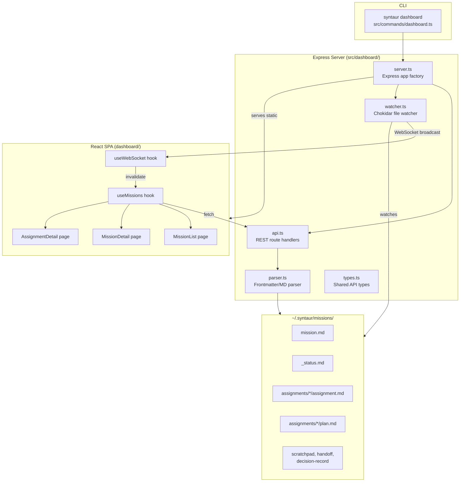
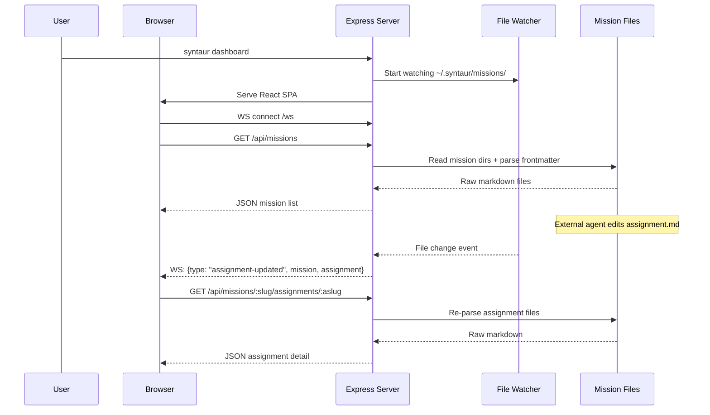

# Chunk 6: Local Dashboard UI Implementation Plan

## Metadata
- **Date:** 2026-03-20
- **Complexity:** large
- **Tech Stack:** TypeScript, React 18, Vite, shadcn/ui, Tailwind CSS, Node.js 20+, Express, chokidar, ws (WebSocket), react-router-dom v7, react-markdown, mermaid.js

## Objective
Build a local read-only web dashboard (`syntaur dashboard`) that reads the `~/.syntaur/missions/` directory and displays mission list, mission detail with assignment statuses, and assignment detail with plan/decisions/scratchpad -- with real-time updates via file watching over WebSocket.

## Success Criteria
- [ ] `syntaur dashboard` starts an Express server on port 4800 (configurable via `--port`)
- [ ] Mission list view displays all missions with status, progress, and needs-attention indicators
- [ ] Mission detail view shows assignment table with status badges, dependency graph, resources, and memories
- [ ] Assignment detail view shows plan, scratchpad, handoff log, and decision record in tabs
- [ ] Real-time updates: file changes in the missions directory trigger UI refresh within 1 second
- [ ] Dark mode by default using shadcn/ui dark theme
- [ ] Graceful fallback when index files are missing (reads source files directly)
- [ ] `syntaur dashboard --dev` proxies to Vite dev server for HMR during development
- [ ] All views are read-only -- no mutation endpoints or UI controls that write to disk

## Discovery Findings

### Codebase Structure
The project is a TypeScript ESM package using tsup for CLI compilation and Commander.js for the CLI. The single runtime dependency is `commander`. There are 11 existing CLI commands following a consistent pattern: each command is a separate file in `src/commands/` exporting an async function, registered in `src/index.ts` with try/catch error handling. The build targets Node 20+ and outputs ESM.

### Data Files the Dashboard Must Read
Two categories of files exist under `~/.syntaur/missions/<mission-slug>/`:

**Derived index files** (produced by `syntaur rebuild`, may not exist yet):
- `_status.md` -- mission status rollup with `status`, `progress`, `needsAttention` frontmatter
- `_index-assignments.md` -- assignment summary table with `by_status` counts
- `_index-plans.md`, `_index-decisions.md`, `_index-sessions.md` -- summary tables
- `resources/_index.md`, `memories/_index.md` -- resource and memory listings

**Source files** (always present after `create-mission` / `create-assignment`):
- `mission.md` -- mission overview with `id`, `slug`, `title`, `archived`, `created`, `updated`, `tags`
- `assignments/<slug>/assignment.md` -- full assignment frontmatter (status, priority, assignee, dependencies, workspace, etc.)
- `assignments/<slug>/plan.md` -- implementation plan with `status` and task checklist
- `assignments/<slug>/scratchpad.md` -- unstructured working notes
- `assignments/<slug>/handoff.md` -- append-only handoff log
- `assignments/<slug>/decision-record.md` -- append-only decision log

### Reusable Modules
- `src/utils/config.ts` (L51-L86): `readConfig()` returns `SyntaurConfig` with `defaultMissionDir`
- `src/utils/paths.ts` (L1-L17): `syntaurRoot()`, `defaultMissionDir()`, `expandHome()`
- `src/utils/fs.ts` (L8-L14): `fileExists()` for safe existence checks
- `src/lifecycle/types.ts` (L1-L57): `AssignmentStatus`, `AssignmentFrontmatter`, `Workspace`, `ExternalId`
- `src/lifecycle/frontmatter.ts` (L3-L11): `extractFrontmatter()` pattern for splitting `---` blocks

### Files That Will Need Changes
| File | Current Purpose | Needed Change |
|------|----------------|---------------|
| `src/index.ts` | CLI entry with 11 commands (L1-L226) | Add `dashboard` command import and registration |
| `package.json` | Package manifest, single dep: commander (L1-L34) | Add runtime deps (express, chokidar, ws, open) + dashboard build scripts |
| `tsup.config.ts` | CLI build config, single entry point (L1-L12) | Add `src/dashboard/server.ts` as second entry point |
| `.gitignore` | Git ignores (7 entries) | Add `dashboard/dist/`, `dashboard/node_modules/` |
| **New:** `src/commands/dashboard.ts` | -- | CLI command: starts Express server, opens browser |
| **New:** `src/dashboard/server.ts` | -- | Express app: API routes, static serving, WebSocket setup |
| **New:** `src/dashboard/api.ts` | -- | REST route handlers for missions and assignments |
| **New:** `src/dashboard/parser.ts` | -- | Generic frontmatter/markdown parser for all file types |
| **New:** `src/dashboard/watcher.ts` | -- | Chokidar file watcher broadcasting over WebSocket |
| **New:** `src/dashboard/types.ts` | -- | API response types shared between server and client |
| **New:** `dashboard/` | -- | Vite + React SPA (separate from CLI build) |
| **New:** `dashboard/src/pages/MissionList.tsx` | -- | Mission list cards/table view |
| **New:** `dashboard/src/pages/MissionDetail.tsx` | -- | Mission detail with assignment table and dependency graph |
| **New:** `dashboard/src/pages/AssignmentDetail.tsx` | -- | Assignment detail with tabbed content areas |
| **New:** `dashboard/src/hooks/useWebSocket.ts` | -- | WebSocket hook for real-time invalidation |
| **New:** `dashboard/src/hooks/useMissions.ts` | -- | Data fetching hooks for API calls |
| **New:** `dashboard/src/components/` | -- | StatusBadge, ProgressBar, MarkdownRenderer, DependencyGraph, Layout |

### CLAUDE.md Rules
- Plans go in `claude-info/plans/` (NOT `.claude/plans/`)
- Avoid unnecessary preamble in output
- No repo-level CLAUDE.md exists; global rules from `~/.claude/CLAUDE.md` apply

## High-Level Architecture

### Approach
Split the dashboard into two independently built artifacts: (1) an Express-based API server compiled by tsup alongside the CLI, and (2) a React SPA built by Vite in a separate `dashboard/` directory. The server serves the pre-built SPA as static files in production mode and proxies to Vite's dev server in development mode. This keeps the React toolchain (Vite, Tailwind, shadcn/ui) completely isolated from the CLI's tsup build while allowing both to ship in one npm package.

The server reuses existing utility modules (`config.ts`, `paths.ts`, `fs.ts`) and extends the frontmatter parsing pattern from `src/lifecycle/frontmatter.ts` to handle all file types. Real-time updates use chokidar watching the missions directory and broadcasting change events over a native WebSocket connection (ws library), which the React client uses to invalidate and refetch stale data.

This approach was chosen because:
1. The CLI already has a clean module structure with reusable utilities -- the server naturally fits alongside it
2. Vite + React is the standard for modern SPAs and matches the user's requirement for shadcn/ui
3. Keeping the SPA build separate avoids contaminating the CLI's minimal dependency footprint
4. WebSocket + refetch is simpler and more reliable than trying to stream parsed data -- the client always has consistent state from the REST API

### Key Decisions
| Decision | Chosen Option | Alternatives Considered | Rationale |
|----------|--------------|------------------------|-----------|
| Server framework | Express | Fastify, Hono, built-in http | Express is well-known, minimal overhead for local-only server. No need for Fastify's performance or Hono's edge runtime. |
| Real-time transport | ws (WebSocket) | Socket.io, SSE, polling | ws is zero-dependency native WebSocket. Socket.io adds unnecessary complexity for local use. SSE is one-directional which is fine, but WebSocket allows future bidirectional use in v2. |
| File watching | chokidar | fs.watch, @parcel/watcher | chokidar handles platform-specific quirks (macOS FSEvents, Linux inotify) and provides a stable API. fs.watch is too unreliable cross-platform. |
| Update strategy | Invalidate + refetch | Stream parsed data over WS | Simpler to implement and debug. The server always returns consistent parsed state. The client just refetches the relevant endpoint when notified of a change. |
| Dark mode | Always dark (class on html) | Toggle, system preference | User requested dark mode. Always-dark simplifies implementation -- no toggle needed in v1. |
| Missing index fallback | Compute from source files | Show error, require rebuild | Index files come from chunk 3 (rebuild command) which may not be implemented. The dashboard must work without them by reading source files directly and computing status/counts inline. |
| SPA routing | react-router-dom v7 | TanStack Router, Next.js | Standard, well-documented, lightweight. Three simple routes. No need for file-based routing or SSR. |
| Port | 4800 default, `--port` override | 3000, 8080 | Avoids common port conflicts. |
| Monorepo structure | `dashboard/` for SPA, `src/dashboard/` for server | Everything in src/, separate packages | Clean separation: React code never enters tsup, server code stays in the main package since it ships with the CLI. |
| Browser open | `open` npm package | Child process, no auto-open | Convenience for `syntaur dashboard`. Cross-platform browser opening. Can be disabled with `--no-open`. |

### Components

**Server-side (compiled by tsup, in `src/dashboard/`):**
- `server.ts` -- Express app factory: mounts API routes, static file serving, WebSocket upgrade handler
- `api.ts` -- Route handlers: `GET /api/missions`, `GET /api/missions/:slug`, `GET /api/missions/:slug/assignments/:aslug`
- `parser.ts` -- Generic frontmatter parser extending the `extractFrontmatter()` pattern from `src/lifecycle/frontmatter.ts`
- `watcher.ts` -- Chokidar watcher that maps file change events to mission/assignment-level WebSocket messages
- `types.ts` -- Shared API response types (MissionSummary, MissionDetail, AssignmentDetail)

**Client-side (built by Vite, in `dashboard/`):**
- `pages/MissionList.tsx` -- Grid of mission cards with status badge, progress bar, needs-attention count
- `pages/MissionDetail.tsx` -- Mission header, assignment table, dependency graph (Mermaid), resources/memories sections
- `pages/AssignmentDetail.tsx` -- Assignment header with status/assignee/workspace, tabbed content: Plan, Scratchpad, Handoff, Decisions
- `hooks/useWebSocket.ts` -- Connects to `ws://localhost:<port>/ws`, dispatches invalidation events
- `hooks/useMissions.ts` -- `useMissions()`, `useMission(slug)`, `useAssignment(missionSlug, assignmentSlug)` with refetch triggers
- `components/StatusBadge.tsx` -- Color-coded badge for assignment/mission statuses
- `components/ProgressBar.tsx` -- Segmented progress bar (completed/in_progress/blocked/pending/review/failed)
- `components/MarkdownRenderer.tsx` -- Renders markdown body content using react-markdown
- `components/DependencyGraph.tsx` -- Renders Mermaid dependency graph from `_status.md` or computed from assignment dependencies
- `components/Layout.tsx` -- App shell with header, breadcrumbs, dark background

**CLI integration (in `src/commands/`):**
- `dashboard.ts` -- Commander action: reads config for missions dir, starts Express server, optionally opens browser

## Architecture Diagram





## Patterns to Follow

| Pattern | Reference File | Lines | What to Copy |
|---------|---------------|-------|--------------|
| CLI command registration | `src/index.ts` | L21-L35 | `.command()` / `.description()` / `.option()` / `.action()` with async try/catch wrapping `process.exit(1)` |
| Command handler structure | `src/commands/start.ts` | L14-L54 | Interface for options, async exported function, config reading via `readConfig()`, path resolution via `expandHome()`, validation before action |
| Frontmatter extraction | `src/lifecycle/frontmatter.ts` | L3-L11 | `extractFrontmatter()` regex: `/^---\n([\s\S]*?)\n---/` splitting into frontmatter block + body |
| Simple value parsing | `src/lifecycle/frontmatter.ts` | L13-L23 | `parseSimpleValue()` handling null, quoted strings, plain strings |
| Array field parsing | `src/lifecycle/frontmatter.ts` | L25-L38 | `parseDependsOn()` pattern: check for `[]` inline, then match block `- item` entries |
| Nested object parsing | `src/lifecycle/frontmatter.ts` | L74-L90 | `parseWorkspace()` pattern: match indented fields under a parent key |
| Config reading | `src/utils/config.ts` | L51-L86 | `readConfig()` returns `SyntaurConfig` with `defaultMissionDir` resolved through `expandHome()` |
| Path utilities | `src/utils/paths.ts` | L1-L17 | `syntaurRoot()`, `defaultMissionDir()`, `expandHome()` for resolving `~` paths |
| File existence check | `src/utils/fs.ts` | L8-L14 | `fileExists()` using `access()` with try/catch |
| Pure template functions | `src/templates/index-stubs.ts` | L7-L26 | Typed params in, string out. Dashboard API handlers follow the inverse: string in, typed response objects out. |
| Barrel exports | `src/lifecycle/index.ts` | L1-L13 | Re-export types and functions from a module's `index.ts` |
| Assignment file resolution | `src/lifecycle/transitions.ts` | L9-L11 | `resolve(missionDir, 'assignments', assignmentSlug, 'assignment.md')` pattern for building file paths |

**PROOF:** Every pattern entry above references a file that was read in full during this planning session, with specific line numbers verified against file contents.

## Implementation Overview

### Task List (High-Level)

1. **Add dependencies to package.json:** Add express, chokidar, ws, open as runtime dependencies. Add @types/express, @types/ws as dev dependencies. Add `build:dashboard` and `dev:dashboard` scripts. -- Files: `package.json`

2. **Create shared API types:** Define `MissionSummary`, `MissionDetail`, `AssignmentDetail`, `ResourceSummary`, `MemorySummary` response types, plus WebSocket message types. -- Files: `src/dashboard/types.ts`

3. **Build the generic frontmatter parser:** Extend the `extractFrontmatter()` pattern to parse mission.md, _status.md, plan.md, scratchpad.md, handoff.md, decision-record.md, resource, and memory frontmatter. Include a body extractor that returns raw markdown content. -- Files: `src/dashboard/parser.ts`

4. **Build the API route handlers:** Implement `GET /api/missions` (list all missions with summary data), `GET /api/missions/:slug` (mission detail with assignment list), `GET /api/missions/:slug/assignments/:aslug` (full assignment detail). Include fallback logic when index files are missing. -- Files: `src/dashboard/api.ts`

5. **Build the file watcher:** Chokidar watching `~/.syntaur/missions/` recursively, debouncing changes, mapping file paths to mission/assignment slugs, broadcasting typed WebSocket messages. -- Files: `src/dashboard/watcher.ts`

6. **Build the Express server:** App factory that mounts API routes, sets up WebSocket upgrade on the HTTP server, serves static files from `dashboard/dist/` in production or proxies to Vite in dev mode. -- Files: `src/dashboard/server.ts`

7. **Create the dashboard CLI command:** Commander registration following the `start.ts` pattern: `--port`, `--dev`, `--no-open` options. Starts the server, opens the browser. -- Files: `src/commands/dashboard.ts`, `src/index.ts`

8. **Scaffold the React SPA:** Initialize `dashboard/` with Vite + React + TypeScript config, Tailwind CSS, shadcn/ui setup, dark mode globals, react-router-dom routing. -- Files: `dashboard/index.html`, `dashboard/vite.config.ts`, `dashboard/tailwind.config.ts`, `dashboard/postcss.config.js`, `dashboard/tsconfig.json`, `dashboard/src/main.tsx`, `dashboard/src/App.tsx`, `dashboard/src/globals.css`, `dashboard/src/lib/utils.ts`

9. **Build the WebSocket and data fetching hooks:** `useWebSocket` connects to `/ws` and dispatches invalidation events. `useMissions`, `useMission`, `useAssignment` hooks fetch from the API and refetch when invalidated. -- Files: `dashboard/src/hooks/useWebSocket.ts`, `dashboard/src/hooks/useMissions.ts`

10. **Build shared UI components:** StatusBadge (color-coded per status), ProgressBar (segmented by status), MarkdownRenderer (react-markdown wrapper), Layout (app shell with header, breadcrumbs). -- Files: `dashboard/src/components/StatusBadge.tsx`, `dashboard/src/components/ProgressBar.tsx`, `dashboard/src/components/MarkdownRenderer.tsx`, `dashboard/src/components/Layout.tsx`

11. **Build the Mission List page:** Grid of cards showing mission title, status badge, progress bar, assignment counts, needs-attention indicator. Links to mission detail. -- Files: `dashboard/src/pages/MissionList.tsx`

12. **Build the Mission Detail page:** Mission header (title, status, created date, tags), assignment table with sortable columns (status, priority, assignee, updated), dependency graph (Mermaid), resources and memories sections. -- Files: `dashboard/src/pages/MissionDetail.tsx`, `dashboard/src/components/DependencyGraph.tsx`

13. **Build the Assignment Detail page:** Header with status badge, assignee, workspace info, dependency list. Tabbed content area: Plan (with task checklist rendering), Scratchpad (markdown), Handoff Log (entries), Decision Record (entries). Q&A section. Progress timeline. -- Files: `dashboard/src/pages/AssignmentDetail.tsx`

14. **Update build configuration:** Add `src/dashboard/server.ts` as a second tsup entry point. Update `.gitignore` with `dashboard/dist/` and `dashboard/node_modules/`. -- Files: `tsup.config.ts`, `.gitignore`

15. **Write tests for the server-side parser and API:** Unit tests for the generic parser against all file types using example mission data. Integration tests for API routes. -- Files: `src/__tests__/dashboard-parser.test.ts`, `src/__tests__/dashboard-api.test.ts`

### File Changes Summary
| File | Action | Purpose | Pattern Reference |
|------|--------|---------|-------------------|
| `package.json` | MODIFY | Add dependencies and scripts | -- |
| `src/index.ts` | MODIFY | Register `dashboard` command | `src/index.ts` L21-L35 |
| `tsup.config.ts` | MODIFY | Add server entry point | -- |
| `.gitignore` | MODIFY | Add dashboard build artifacts | -- |
| `src/dashboard/types.ts` | CREATE | API response and WebSocket message types | `src/lifecycle/types.ts` L1-L57 |
| `src/dashboard/parser.ts` | CREATE | Generic frontmatter/markdown parser | `src/lifecycle/frontmatter.ts` L3-L23 |
| `src/dashboard/api.ts` | CREATE | REST route handlers | `src/lifecycle/transitions.ts` L9-L22 |
| `src/dashboard/watcher.ts` | CREATE | File watcher with WebSocket broadcast | -- |
| `src/dashboard/server.ts` | CREATE | Express app factory | -- |
| `src/dashboard/index.ts` | CREATE | Barrel exports | `src/lifecycle/index.ts` L1-L13 |
| `src/commands/dashboard.ts` | CREATE | CLI command handler | `src/commands/start.ts` L14-L54 |
| `dashboard/index.html` | CREATE | SPA entry point | -- |
| `dashboard/vite.config.ts` | CREATE | Vite + React + proxy config | -- |
| `dashboard/tailwind.config.ts` | CREATE | Tailwind with dark mode class strategy | -- |
| `dashboard/postcss.config.js` | CREATE | PostCSS for Tailwind | -- |
| `dashboard/tsconfig.json` | CREATE | TypeScript config for React | -- |
| `dashboard/package.json` | CREATE | SPA dependencies (React, shadcn/ui, etc.) | -- |
| `dashboard/src/main.tsx` | CREATE | React app entry | -- |
| `dashboard/src/App.tsx` | CREATE | Root component with router | -- |
| `dashboard/src/globals.css` | CREATE | Tailwind base + dark mode CSS variables | -- |
| `dashboard/src/lib/utils.ts` | CREATE | shadcn/ui `cn()` utility | -- |
| `dashboard/src/hooks/useWebSocket.ts` | CREATE | WebSocket connection hook | -- |
| `dashboard/src/hooks/useMissions.ts` | CREATE | Data fetching hooks | -- |
| `dashboard/src/pages/MissionList.tsx` | CREATE | Mission list view | -- |
| `dashboard/src/pages/MissionDetail.tsx` | CREATE | Mission detail view | -- |
| `dashboard/src/pages/AssignmentDetail.tsx` | CREATE | Assignment detail view | -- |
| `dashboard/src/components/StatusBadge.tsx` | CREATE | Status badge component | -- |
| `dashboard/src/components/ProgressBar.tsx` | CREATE | Progress bar component | -- |
| `dashboard/src/components/MarkdownRenderer.tsx` | CREATE | Markdown rendering component | -- |
| `dashboard/src/components/DependencyGraph.tsx` | CREATE | Mermaid graph component | -- |
| `dashboard/src/components/Layout.tsx` | CREATE | App shell layout | -- |
| `dashboard/src/components/ui/` | CREATE | shadcn/ui components (card, badge, table, tabs, button) | -- |
| `src/__tests__/dashboard-parser.test.ts` | CREATE | Parser unit tests | -- |
| `src/__tests__/dashboard-api.test.ts` | CREATE | API integration tests | -- |

## Dependencies & Risks
| Dependency/Risk | Impact | Mitigation |
|----------------|--------|------------|
| Index files may not exist (chunk 3 not implemented) | Dashboard cannot rely on `_status.md`, `_index-assignments.md`, etc. for summary data | Parser and API must fall back to reading source files directly: scan `assignments/` directory, parse each `assignment.md`, compute status counts and progress inline |
| chokidar v4 is ESM-only | Compatibility with tsup ESM build | Already using ESM (`"type": "module"`), so no issue. Pin to chokidar v4. |
| Mermaid.js bundle size (~3MB) | Large SPA bundle | Use dynamic import / lazy loading for the Mermaid renderer. Only load when a dependency graph is visible. |
| Port conflicts | User already has something on 4800 | `--port` flag allows override. Server detects EADDRINUSE and prints a helpful error. |
| Large mission directories | Slow initial load if hundreds of missions/assignments | Lazy parsing: list endpoint reads only mission.md + _status.md (or minimal source files). Full assignment parsing only on detail requests. Debounce watcher events (300ms). |
| express and ws add runtime dependencies | Increases package install size | These are standard, well-maintained, minimal-footprint packages. express is ~500KB, ws is ~100KB. Acceptable for a dashboard feature. |
| Vite dev proxy complexity | Dev mode needs API proxy to Express server | Standard Vite proxy config (`server.proxy` in vite.config.ts). Well-documented pattern. |
| dashboard/node_modules separate from root | Two dependency trees | dashboard/ gets its own package.json for React deps. Root package.json only adds server-side deps. `npm install` in root does not install dashboard deps; separate `npm install --prefix dashboard` or a workspace config is needed. |

## Assumptions Log
| Assumption Avoided | Verified By | Answer |
|-------------------|-------------|--------|
| "Index files will exist" | Read `examples/sample-mission/_status.md` and discovery doc noting chunk 3 may not be implemented | Must handle missing index files -- fall back to computing from source files |
| "Frontmatter parser can be reused as-is" | Read `src/lifecycle/frontmatter.ts` L107-L131 in full | Parser is specific to assignment frontmatter. Dashboard needs a more generic parser for mission.md, plan.md, etc. The `extractFrontmatter()` and `parseSimpleValue()` patterns can be reused, but new field-specific parsers are needed. |
| "The CLI build handles React too" | Read `tsup.config.ts` L1-L12 | tsup config is Node-targeted ESM. React needs a separate Vite build targeting browsers. Two independent build pipelines. |
| "Package has many dependencies" | Read `package.json` L25-L33 | Only one runtime dependency (commander). Adding express, chokidar, ws, open is a significant expansion. This is acceptable since the dashboard is an optional feature. |
| "There's an existing CLAUDE.md" | Checked `/Users/brennen/syntaur/CLAUDE.md` | Does not exist at repo level. Only global `~/.claude/CLAUDE.md` rules apply. |
| "Status badge colors need to be invented" | Read `examples/sample-mission/_status.md` L36-L40 | Mermaid `classDef` in `_status.md` already defines colors: completed=#22c55e, in_progress=#3b82f6, pending=#6b7280, blocked=#ef4444, failed=#dc2626. Dashboard should use these same Tailwind-compatible green/blue/gray/red colors. |

---

## Phase 3: Detailed Implementation Plan

### Task 1: Add dependencies to package.json
**File(s):** `package.json`
**Action:** MODIFY
**Pattern Reference:** `package.json:1-34` (existing structure)
**Estimated complexity:** Low

#### Context
The CLI currently has only `commander` as a runtime dependency. The dashboard server needs Express, chokidar, ws, and open. The dashboard SPA has its own package.json (Task 8), so only server-side deps go here.

#### Steps

1. [ ] **Step 1.1:** Add runtime dependencies for the dashboard server
   - **Location:** `package.json:25-27`
   - **Action:** MODIFY
   - **What to do:** Add `express`, `chokidar`, `ws`, and `open` to the `dependencies` object. Add `@types/ws` to `devDependencies` (Express 5 ships its own types, so `@types/express` is not needed).
   - **Code:**
     ```json
     "dependencies": {
       "chokidar": "^4.0.0",
       "commander": "^13.0.0",
       "express": "^5.0.1",
       "open": "^10.0.0",
       "ws": "^8.0.0"
     },
     "devDependencies": {
       "@types/node": "^20.0.0",
       "@types/ws": "^8.0.0",
       "tsup": "^8.0.0",
       "typescript": "^5.7.0",
       "vitest": "^3.0.0"
     }
     ```
   - **Proof blocks:**
     - **PROOF:** Current `dependencies` has only `"commander": "^13.0.0"` -- Source: `package.json:25-27`
     - **PROOF:** Current `devDependencies` has `@types/node`, `tsup`, `typescript`, `vitest` -- Source: `package.json:28-33`
     - **PROOF:** Package uses `"type": "module"` (ESM) -- Source: `package.json:5`. chokidar v4 is ESM-only, compatible.
     - **NOTE:** Express 5 ships its own TypeScript declarations; `@types/express` is NOT needed for Express 5.
   - **Verification:**
     ```bash
     cd /Users/brennen/syntaur && cat package.json | grep -A5 '"dependencies"'
     ```

2. [ ] **Step 1.2:** Add dashboard build scripts
   - **Location:** `package.json:15-21`
   - **Action:** MODIFY
   - **What to do:** Add `build:dashboard` and `dev:dashboard` scripts. Also add `dashboard:install` to install dashboard SPA deps.
   - **Code:**
     ```json
     "scripts": {
       "build": "tsup",
       "build:dashboard": "npm run build && cd dashboard && npm install && npm run build",
       "dev": "tsup --watch",
       "dev:dashboard": "cd dashboard && npm run dev",
       "dashboard:install": "cd dashboard && npm install",
       "typecheck": "tsc --noEmit",
       "test": "vitest run",
       "test:watch": "vitest"
     },
     ```
   - **Proof blocks:**
     - **PROOF:** Current scripts object -- Source: `package.json:15-21`
       ```json
       "scripts": {
         "build": "tsup",
         "dev": "tsup --watch",
         "typecheck": "tsc --noEmit",
         "test": "vitest run",
         "test:watch": "vitest"
       },
       ```
   - **Verification:**
     ```bash
     cd /Users/brennen/syntaur && node -e "const p = require('./package.json'); console.log(Object.keys(p.scripts))"
     ```

3. [ ] **Step 1.3:** Add `dashboard/dist` to the `files` array so it ships with the package
   - **Location:** `package.json:10-14`
   - **Action:** MODIFY
   - **What to do:** Add `"dashboard/dist"` to the `files` array so the built SPA is included when the package is published.
   - **Code:**
     ```json
     "files": [
       "dist",
       "bin",
       "plugin",
       "dashboard/dist"
     ],
     ```
   - **Proof blocks:**
     - **PROOF:** Current `files` array -- Source: `package.json:10-14`
       ```json
       "files": [
         "dist",
         "bin",
         "plugin"
       ],
       ```
   - **Verification:**
     ```bash
     cd /Users/brennen/syntaur && node -e "console.log(JSON.parse(require('fs').readFileSync('package.json','utf8')).files)"
     ```

#### Error Handling
| Scenario | Handling | User Message | Code |
|----------|----------|--------------|------|
| npm install fails | User must run `npm install` after editing package.json | "Run `npm install` to install new dependencies" | N/A (manual step) |

#### Task Completion Criteria
- [ ] `package.json` has `express`, `chokidar`, `ws`, `open` in `dependencies`
- [ ] `package.json` has `@types/ws` in `devDependencies` (Express 5 ships its own types)
- [ ] `package.json` has `build:dashboard`, `dev:dashboard`, `dashboard:install` scripts
- [ ] `package.json` has `dashboard/dist` in `files` array
- [ ] `npm install` completes without errors

---

### Task 2: Create shared API types
**File(s):** `src/dashboard/types.ts`
**Action:** CREATE
**Pattern Reference:** `src/lifecycle/types.ts:1-57`
**Estimated complexity:** Low

#### Context
Defines the TypeScript interfaces shared between the Express API handlers and the React frontend. These types represent the JSON shapes returned by each API endpoint plus the WebSocket message envelope.

#### Steps

1. [ ] **Step 2.1:** Create the `src/dashboard/` directory and the types file
   - **Location:** new file at `src/dashboard/types.ts`
   - **Action:** CREATE
   - **What to do:** Define all API response types and WebSocket message types. Import `AssignmentStatus` from the existing lifecycle types to reuse the status union.
   - **Code:**
     ```typescript
     import type { AssignmentStatus } from '../lifecycle/types.js';

     // Re-export for convenience in dashboard modules
     export type { AssignmentStatus } from '../lifecycle/types.js';

     // --- API Response Types ---

     export interface ProgressCounts {
       total: number;
       completed: number;
       in_progress: number;
       blocked: number;
       pending: number;
       review: number;
       failed: number;
     }

     export interface NeedsAttention {
       blockedCount: number;
       failedCount: number;
       unansweredQuestions: number;
     }

     export interface MissionSummary {
       slug: string;
       title: string;
       status: string;
       archived: boolean;
       created: string;
       updated: string;
       tags: string[];
       progress: ProgressCounts;
       needsAttention: NeedsAttention;
     }

     export interface AssignmentSummary {
       slug: string;
       title: string;
       status: AssignmentStatus;
       priority: 'low' | 'medium' | 'high' | 'critical';
       assignee: string | null;
       dependsOn: string[];
       updated: string;
     }

     export interface ResourceSummary {
       name: string;
       slug: string;
       category: string;
       source: string;
       relatedAssignments: string[];
       updated: string;
     }

     export interface MemorySummary {
       name: string;
       slug: string;
       source: string;
       scope: string;
       sourceAssignment: string | null;
       updated: string;
     }

     export interface MissionDetail {
       slug: string;
       title: string;
       status: string;
       archived: boolean;
       created: string;
       updated: string;
       tags: string[];
       body: string;
       progress: ProgressCounts;
       needsAttention: NeedsAttention;
       assignments: AssignmentSummary[];
       resources: ResourceSummary[];
       memories: MemorySummary[];
       dependencyGraph: string | null;
     }

     export interface WorkspaceInfo {
       repository: string | null;
       worktreePath: string | null;
       branch: string | null;
       parentBranch: string | null;
     }

     export interface ExternalIdInfo {
       system: string;
       id: string;
       url: string;
     }

     export interface AssignmentDetail {
       slug: string;
       title: string;
       status: AssignmentStatus;
       priority: 'low' | 'medium' | 'high' | 'critical';
       assignee: string | null;
       dependsOn: string[];
       blockedReason: string | null;
       workspace: WorkspaceInfo;
       externalIds: ExternalIdInfo[];
       tags: string[];
       created: string;
       updated: string;
       body: string;
       plan: { status: string; body: string } | null;
       scratchpad: { body: string } | null;
       handoff: { handoffCount: number; body: string } | null;
       decisionRecord: { decisionCount: number; body: string } | null;
     }

     // --- WebSocket Message Types ---

     export type WsMessageType =
       | 'mission-updated'
       | 'assignment-updated'
       | 'connected';

     export interface WsMessage {
       type: WsMessageType;
       missionSlug?: string;
       assignmentSlug?: string;
       timestamp: string;
     }
     ```
   - **Proof blocks:**
     - **PROOF:** `AssignmentStatus` is exported from `src/lifecycle/types.ts:1-7` as `'pending' | 'in_progress' | 'blocked' | 'review' | 'completed' | 'failed'`
     - **PROOF:** `Workspace` interface has fields `repository`, `worktreePath`, `branch`, `parentBranch` -- Source: `src/lifecycle/types.ts:24-29`
     - **PROOF:** `ExternalId` interface has fields `system`, `id`, `url` -- Source: `src/lifecycle/types.ts:18-22`
     - **PROOF:** `_status.md` frontmatter has `progress.total`, `progress.completed`, etc. and `needsAttention.blockedCount`, etc. -- Source: `examples/sample-mission/_status.md:5-16`
     - **PROOF:** `mission.md` frontmatter has `slug`, `title`, `archived`, `created`, `updated`, `tags` -- Source: `examples/sample-mission/mission.md:1-15`
     - **PROOF:** Resource frontmatter has `name`, `source`, `category`, `relatedAssignments` -- Source: `examples/sample-mission/resources/auth-requirements.md:1-13`
     - **PROOF:** Memory frontmatter has `name`, `source`, `scope`, `sourceAssignment`, `relatedAssignments` -- Source: `examples/sample-mission/memories/postgres-connection-pooling.md:1-15`
     - **PROOF:** Plan frontmatter has `assignment`, `status`, `created`, `updated` -- Source: `examples/sample-mission/assignments/design-auth-schema/plan.md:1-6`
     - **PROOF:** Handoff frontmatter has `assignment`, `updated`, `handoffCount` -- Source: `examples/sample-mission/assignments/design-auth-schema/handoff.md:1-5`
     - **PROOF:** Decision record frontmatter has `assignment`, `updated`, `decisionCount` -- Source: `examples/sample-mission/assignments/design-auth-schema/decision-record.md:1-5`
   - **Verification:**
     ```bash
     cd /Users/brennen/syntaur && npx tsc --noEmit src/dashboard/types.ts
     ```

#### Error Handling
| Scenario | Handling | User Message | Code |
|----------|----------|--------------|------|
| N/A -- type definitions only | N/A | N/A | N/A |

#### Task Completion Criteria
- [ ] File `src/dashboard/types.ts` exists with all interfaces defined
- [ ] `AssignmentStatus` is re-exported from lifecycle types (no duplication)
- [ ] TypeScript compiles without errors
- [ ] All field names match actual frontmatter field names from example files

---

### Task 3: Build the generic frontmatter parser
**File(s):** `src/dashboard/parser.ts`
**Action:** CREATE
**Pattern Reference:** `src/lifecycle/frontmatter.ts:3-23`
**Estimated complexity:** Medium

#### Context
The existing `parseAssignmentFrontmatter()` in `src/lifecycle/frontmatter.ts` only handles assignment.md files. The dashboard needs to parse mission.md, _status.md, plan.md, scratchpad.md, handoff.md, decision-record.md, resource files, and memory files. This parser reuses the `extractFrontmatter()` and `parseSimpleValue()` patterns but adds parsers for each file type.

#### Steps

1. [ ] **Step 3.1:** Create `src/dashboard/parser.ts` with generic frontmatter extraction and per-file-type parsers
   - **Location:** new file at `src/dashboard/parser.ts`
   - **Action:** CREATE
   - **What to do:** Implement extraction of frontmatter (reusing the regex pattern from `src/lifecycle/frontmatter.ts:4`) and specific parser functions for each file type. Do NOT import from `src/lifecycle/frontmatter.ts` since those functions are not exported individually (only `parseAssignmentFrontmatter` and `updateAssignmentFile` are exported). Instead, copy the small utility patterns.
   - **Code:**
     ```typescript
     /**
      * Generic frontmatter/markdown parser for all Syntaur file types.
      * Pattern copied from src/lifecycle/frontmatter.ts:3-23 (extractFrontmatter + parseSimpleValue).
      */

     export interface ParsedFile {
       frontmatter: Record<string, string>;
       body: string;
     }

     /**
      * Split a markdown file into its frontmatter block and body.
      * Pattern: src/lifecycle/frontmatter.ts:3-11
      */
     export function extractFrontmatter(fileContent: string): [string, string] {
       const match = fileContent.match(/^---\n([\s\S]*?)\n---/);
       if (!match) {
         return ['', fileContent];
       }
       const frontmatterBlock = match[1];
       const body = fileContent.slice(match[0].length).trim();
       return [frontmatterBlock, body];
     }

     /**
      * Parse a simple YAML value, handling null and quoted strings.
      * Pattern: src/lifecycle/frontmatter.ts:13-23
      */
     function parseSimpleValue(raw: string): string | null {
       const trimmed = raw.trim();
       if (trimmed === 'null' || trimmed === '') return null;
       if (
         (trimmed.startsWith('"') && trimmed.endsWith('"')) ||
         (trimmed.startsWith("'") && trimmed.endsWith("'"))
       ) {
         return trimmed.slice(1, -1);
       }
       return trimmed;
     }

     /**
      * Extract a top-level scalar field from frontmatter text.
      */
     function getField(frontmatter: string, key: string): string | null {
       const match = frontmatter.match(new RegExp(`^${key}:\\s*(.*)$`, 'm'));
       if (!match) return null;
       return parseSimpleValue(match[1]);
     }

     /**
      * Extract an indented scalar field (one level deep) from frontmatter text.
      */
     function getNestedField(frontmatter: string, parent: string, key: string): string | null {
       // Find the parent block, then look for indented key
       const parentRegex = new RegExp(`^${parent}:\\s*\\n((?:\\s+.*\\n?)*)`, 'm');
       const parentMatch = frontmatter.match(parentRegex);
       if (!parentMatch) return null;
       const block = parentMatch[1];
       const fieldMatch = block.match(new RegExp(`^\\s+${key}:\\s*(.*)$`, 'm'));
       if (!fieldMatch) return null;
       return parseSimpleValue(fieldMatch[1]);
     }

     /**
      * Parse a YAML list field (e.g., tags, dependsOn, relatedAssignments).
      * Pattern: src/lifecycle/frontmatter.ts:25-38
      */
     function parseListField(frontmatter: string, fieldName: string): string[] {
       const inlineMatch = frontmatter.match(new RegExp(`^${fieldName}:\\s*\\[\\s*\\]`, 'm'));
       if (inlineMatch) return [];

       const results: string[] = [];
       const blockMatch = frontmatter.match(
         new RegExp(`^${fieldName}:\\s*\\n((?:\\s+-\\s+.*\\n?)*)`, 'm'),
       );
       if (blockMatch) {
         const items = blockMatch[1].matchAll(/^\s+-\s+(.+)$/gm);
         for (const item of items) {
           results.push(item[1].trim());
         }
       }
       return results;
     }

     // --- Mission Parser ---

     export interface ParsedMission {
       id: string;
       slug: string;
       title: string;
       archived: boolean;
       created: string;
       updated: string;
       tags: string[];
       body: string;
     }

     export function parseMission(fileContent: string): ParsedMission {
       const [fm, body] = extractFrontmatter(fileContent);
       return {
         id: getField(fm, 'id') ?? '',
         slug: getField(fm, 'slug') ?? '',
         title: getField(fm, 'title') ?? '',
         archived: getField(fm, 'archived') === 'true',
         created: getField(fm, 'created') ?? '',
         updated: getField(fm, 'updated') ?? '',
         tags: parseListField(fm, 'tags'),
         body,
       };
     }

     // --- Status Parser (for _status.md) ---

     export interface ParsedStatus {
       mission: string;
       status: string;
       progress: {
         total: number;
         completed: number;
         in_progress: number;
         blocked: number;
         pending: number;
         review: number;
         failed: number;
       };
       needsAttention: {
         blockedCount: number;
         failedCount: number;
         unansweredQuestions: number;
       };
       body: string;
     }

     export function parseStatus(fileContent: string): ParsedStatus {
       const [fm, body] = extractFrontmatter(fileContent);
       return {
         mission: getField(fm, 'mission') ?? '',
         status: getField(fm, 'status') ?? 'pending',
         progress: {
           total: parseInt(getNestedField(fm, 'progress', 'total') ?? '0', 10),
           completed: parseInt(getNestedField(fm, 'progress', 'completed') ?? '0', 10),
           in_progress: parseInt(getNestedField(fm, 'progress', 'in_progress') ?? '0', 10),
           blocked: parseInt(getNestedField(fm, 'progress', 'blocked') ?? '0', 10),
           pending: parseInt(getNestedField(fm, 'progress', 'pending') ?? '0', 10),
           review: parseInt(getNestedField(fm, 'progress', 'review') ?? '0', 10),
           failed: parseInt(getNestedField(fm, 'progress', 'failed') ?? '0', 10),
         },
         needsAttention: {
           blockedCount: parseInt(getNestedField(fm, 'needsAttention', 'blockedCount') ?? '0', 10),
           failedCount: parseInt(getNestedField(fm, 'needsAttention', 'failedCount') ?? '0', 10),
           unansweredQuestions: parseInt(getNestedField(fm, 'needsAttention', 'unansweredQuestions') ?? '0', 10),
         },
         body,
       };
     }

     // --- Assignment Summary Parser (lightweight, for list views) ---

     export interface ParsedAssignmentSummary {
       slug: string;
       title: string;
       status: string;
       priority: string;
       assignee: string | null;
       dependsOn: string[];
       updated: string;
     }

     export function parseAssignmentSummary(fileContent: string): ParsedAssignmentSummary {
       const [fm] = extractFrontmatter(fileContent);
       return {
         slug: getField(fm, 'slug') ?? '',
         title: getField(fm, 'title') ?? '',
         status: getField(fm, 'status') ?? 'pending',
         priority: getField(fm, 'priority') ?? 'medium',
         assignee: getField(fm, 'assignee'),
         dependsOn: parseListField(fm, 'dependsOn'),
         updated: getField(fm, 'updated') ?? '',
       };
     }

     // --- Full Assignment Parser (for detail view) ---

     export interface ParsedAssignmentFull {
       id: string;
       slug: string;
       title: string;
       status: string;
       priority: string;
       assignee: string | null;
       dependsOn: string[];
       blockedReason: string | null;
       workspace: {
         repository: string | null;
         worktreePath: string | null;
         branch: string | null;
         parentBranch: string | null;
       };
       externalIds: Array<{ system: string; id: string; url: string }>;
       tags: string[];
       created: string;
       updated: string;
       body: string;
     }

     function parseExternalIds(frontmatter: string): Array<{ system: string; id: string; url: string }> {
       const inlineMatch = frontmatter.match(/^externalIds:\s*\[\s*\]/m);
       if (inlineMatch) return [];

       const results: Array<{ system: string; id: string; url: string }> = [];
       const blockMatch = frontmatter.match(
         /^externalIds:\s*\n((?:\s+-\s+[\s\S]*?)(?=^\w|\n---))/m,
       );
       if (!blockMatch) return [];

       const itemBlocks = blockMatch[1].split(/\n\s+-\s+/).filter(Boolean);
       for (const block of itemBlocks) {
         const lines = block.split('\n');
         const entry: Record<string, string> = {};
         for (const line of lines) {
           const colonIdx = line.indexOf(':');
           if (colonIdx < 0) continue;
           const key = line.slice(0, colonIdx).trim().replace(/^-\s+/, '');
           const value = line.slice(colonIdx + 1).trim();
           if (key && value) {
             entry[key] = value;
           }
         }
         if (entry['system'] && entry['id'] && entry['url']) {
           results.push({
             system: entry['system'],
             id: entry['id'],
             url: entry['url'],
           });
         }
       }
       return results;
     }

     export function parseAssignmentFull(fileContent: string): ParsedAssignmentFull {
       const [fm, body] = extractFrontmatter(fileContent);
       return {
         id: getField(fm, 'id') ?? '',
         slug: getField(fm, 'slug') ?? '',
         title: getField(fm, 'title') ?? '',
         status: getField(fm, 'status') ?? 'pending',
         priority: getField(fm, 'priority') ?? 'medium',
         assignee: getField(fm, 'assignee'),
         dependsOn: parseListField(fm, 'dependsOn'),
         blockedReason: getField(fm, 'blockedReason'),
         workspace: {
           repository: getNestedField(fm, 'workspace', 'repository'),
           worktreePath: getNestedField(fm, 'workspace', 'worktreePath'),
           branch: getNestedField(fm, 'workspace', 'branch'),
           parentBranch: getNestedField(fm, 'workspace', 'parentBranch'),
         },
         externalIds: parseExternalIds(fm),
         tags: parseListField(fm, 'tags'),
         created: getField(fm, 'created') ?? '',
         updated: getField(fm, 'updated') ?? '',
         body,
       };
     }

     // --- Plan Parser ---

     export interface ParsedPlan {
       assignment: string;
       status: string;
       body: string;
     }

     export function parsePlan(fileContent: string): ParsedPlan {
       const [fm, body] = extractFrontmatter(fileContent);
       return {
         assignment: getField(fm, 'assignment') ?? '',
         status: getField(fm, 'status') ?? '',
         body,
       };
     }

     // --- Scratchpad Parser ---

     export interface ParsedScratchpad {
       assignment: string;
       body: string;
     }

     export function parseScratchpad(fileContent: string): ParsedScratchpad {
       const [fm, body] = extractFrontmatter(fileContent);
       return {
         assignment: getField(fm, 'assignment') ?? '',
         body,
       };
     }

     // --- Handoff Parser ---

     export interface ParsedHandoff {
       assignment: string;
       handoffCount: number;
       body: string;
     }

     export function parseHandoff(fileContent: string): ParsedHandoff {
       const [fm, body] = extractFrontmatter(fileContent);
       return {
         assignment: getField(fm, 'assignment') ?? '',
         handoffCount: parseInt(getField(fm, 'handoffCount') ?? '0', 10),
         body,
       };
     }

     // --- Decision Record Parser ---

     export interface ParsedDecisionRecord {
       assignment: string;
       decisionCount: number;
       body: string;
     }

     export function parseDecisionRecord(fileContent: string): ParsedDecisionRecord {
       const [fm, body] = extractFrontmatter(fileContent);
       return {
         assignment: getField(fm, 'assignment') ?? '',
         decisionCount: parseInt(getField(fm, 'decisionCount') ?? '0', 10),
         body,
       };
     }

     // --- Resource Parser ---

     export interface ParsedResource {
       name: string;
       source: string;
       category: string;
       relatedAssignments: string[];
       created: string;
       updated: string;
       body: string;
     }

     export function parseResource(fileContent: string): ParsedResource {
       const [fm, body] = extractFrontmatter(fileContent);
       return {
         name: getField(fm, 'name') ?? '',
         source: getField(fm, 'source') ?? '',
         category: getField(fm, 'category') ?? '',
         relatedAssignments: parseListField(fm, 'relatedAssignments'),
         created: getField(fm, 'created') ?? '',
         updated: getField(fm, 'updated') ?? '',
         body,
       };
     }

     // --- Memory Parser ---

     export interface ParsedMemory {
       name: string;
       source: string;
       scope: string;
       sourceAssignment: string | null;
       relatedAssignments: string[];
       created: string;
       updated: string;
       body: string;
     }

     export function parseMemory(fileContent: string): ParsedMemory {
       const [fm, body] = extractFrontmatter(fileContent);
       return {
         name: getField(fm, 'name') ?? '',
         source: getField(fm, 'source') ?? '',
         scope: getField(fm, 'scope') ?? '',
         sourceAssignment: getField(fm, 'sourceAssignment'),
         relatedAssignments: parseListField(fm, 'relatedAssignments'),
         created: getField(fm, 'created') ?? '',
         updated: getField(fm, 'updated') ?? '',
         body,
       };
     }

     // --- Mermaid Graph Extractor ---

     /**
      * Extract the mermaid code block from _status.md body content.
      * Returns null if no mermaid block is found.
      */
     export function extractMermaidGraph(body: string): string | null {
       const match = body.match(/```mermaid\n([\s\S]*?)```/);
       return match ? match[1].trim() : null;
     }
     ```
   - **Proof blocks:**
     - **PROOF:** `extractFrontmatter()` regex is `/^---\n([\s\S]*?)\n---/` -- Source: `src/lifecycle/frontmatter.ts:4`
     - **PROOF:** `parseSimpleValue()` handles `null`, quoted strings, plain strings -- Source: `src/lifecycle/frontmatter.ts:13-23`
     - **PROOF:** `parseExternalIds()` splits on `\n\s+-\s+` and extracts system/id/url -- Source: `src/lifecycle/frontmatter.ts:40-72`
     - **PROOF:** `parseListField` pattern from `parseDependsOn()` uses inline `[]` check then block `- item` pattern -- Source: `src/lifecycle/frontmatter.ts:25-38`
     - **PROOF:** Mission frontmatter fields: `id`, `slug`, `title`, `archived`, `created`, `updated`, `tags` -- Source: `examples/sample-mission/mission.md:1-15`
     - **PROOF:** `_status.md` has nested `progress:` and `needsAttention:` blocks with indented fields -- Source: `examples/sample-mission/_status.md:5-16`
     - **PROOF:** Plan frontmatter: `assignment`, `status`, `created`, `updated` -- Source: `examples/sample-mission/assignments/design-auth-schema/plan.md:1-6`
     - **PROOF:** Scratchpad frontmatter: `assignment`, `updated` -- Source: `examples/sample-mission/assignments/design-auth-schema/scratchpad.md:1-4`
     - **PROOF:** Handoff frontmatter: `assignment`, `updated`, `handoffCount` -- Source: `examples/sample-mission/assignments/design-auth-schema/handoff.md:1-5`
     - **PROOF:** Decision record frontmatter: `assignment`, `updated`, `decisionCount` -- Source: `examples/sample-mission/assignments/design-auth-schema/decision-record.md:1-5`
     - **PROOF:** Resource frontmatter: `type`, `name`, `source`, `category`, `relatedAssignments`, `created`, `updated` -- Source: `examples/sample-mission/resources/auth-requirements.md:1-13`
     - **PROOF:** Memory frontmatter: `type`, `name`, `source`, `scope`, `sourceAssignment`, `relatedAssignments`, `created`, `updated` -- Source: `examples/sample-mission/memories/postgres-connection-pooling.md:1-15`
     - **PROOF:** Mermaid graph in `_status.md` is fenced with triple-backtick mermaid -- Source: `examples/sample-mission/_status.md:32-41`
   - **Verification:**
     ```bash
     cd /Users/brennen/syntaur && npx tsc --noEmit src/dashboard/parser.ts
     ```

#### Error Handling
| Scenario | Handling | User Message | Code |
|----------|----------|--------------|------|
| File has no frontmatter delimiters | `extractFrontmatter` returns `['', fullContent]` -- does not throw | N/A (graceful fallback) | `if (!match) { return ['', fileContent]; }` |
| Field missing from frontmatter | `getField` returns `null`, parsers use `?? ''` or `?? 'default'` | N/A | `getField(fm, 'slug') ?? ''` |
| Nested field missing | `getNestedField` returns `null`, parsers default to `0` or `null` | N/A | `parseInt(getNestedField(fm, 'progress', 'total') ?? '0', 10)` |

#### Task Completion Criteria
- [ ] File `src/dashboard/parser.ts` exists with all parser functions
- [ ] `extractFrontmatter` does not throw on files without frontmatter (returns empty string + full body)
- [ ] All parser functions return typed objects matching the `Parsed*` interfaces
- [ ] TypeScript compiles without errors
- [ ] Parser handles the exact frontmatter format from example files

---

### Task 4: Build the API route handlers
**File(s):** `src/dashboard/api.ts`
**Action:** CREATE
**Pattern Reference:** `src/lifecycle/transitions.ts:9-11` (path resolution pattern)
**Estimated complexity:** High

#### Context
The API provides three read-only REST endpoints. Each reads markdown files from the missions directory, parses frontmatter, and returns JSON. When index files (`_status.md`, `_index-assignments.md`) exist, they are used for summary data. When missing, the API falls back to reading source files directly and computing summaries.

#### Steps

1. [ ] **Step 4.1:** Create `src/dashboard/api.ts` with all route handlers
   - **Location:** new file at `src/dashboard/api.ts`
   - **Action:** CREATE
   - **What to do:** Implement three route handler functions (not the Express router -- that goes in server.ts). Each function takes the missions directory path and request params, reads files, and returns typed response objects.
   - **Code:**
     ```typescript
     import { readdir, readFile } from 'node:fs/promises';
     import { resolve, basename } from 'node:path';
     import { fileExists } from '../utils/fs.js';
     import {
       parseMission,
       parseStatus,
       parseAssignmentSummary,
       parseAssignmentFull,
       parsePlan,
       parseScratchpad,
       parseHandoff,
       parseDecisionRecord,
       parseResource,
       parseMemory,
       extractMermaidGraph,
     } from './parser.js';
     import type {
       MissionSummary,
       MissionDetail,
       AssignmentDetail,
       AssignmentSummary,
       ProgressCounts,
       NeedsAttention,
       ResourceSummary,
       MemorySummary,
     } from './types.js';

     /**
      * List all missions with summary data.
      * GET /api/missions
      */
     export async function listMissions(missionsDir: string): Promise<MissionSummary[]> {
       if (!(await fileExists(missionsDir))) {
         return [];
       }

       const entries = await readdir(missionsDir, { withFileTypes: true });
       const missionDirs = entries.filter((e) => e.isDirectory() && !e.name.startsWith('.'));

       const results: MissionSummary[] = [];

       for (const dir of missionDirs) {
         const missionPath = resolve(missionsDir, dir.name);
         const missionMdPath = resolve(missionPath, 'mission.md');

         if (!(await fileExists(missionMdPath))) continue;

         const missionContent = await readFile(missionMdPath, 'utf-8');
         const mission = parseMission(missionContent);

         // Try to read _status.md for progress/needsAttention
         let progress: ProgressCounts = {
           total: 0, completed: 0, in_progress: 0, blocked: 0, pending: 0, review: 0, failed: 0,
         };
         let needsAttention: NeedsAttention = {
           blockedCount: 0, failedCount: 0, unansweredQuestions: 0,
         };
         let status = 'pending';

         const statusPath = resolve(missionPath, '_status.md');
         if (await fileExists(statusPath)) {
           const statusContent = await readFile(statusPath, 'utf-8');
           const parsed = parseStatus(statusContent);
           progress = parsed.progress;
           needsAttention = parsed.needsAttention;
           status = parsed.status;
         } else {
           // Fallback: compute from source assignment files
           const computed = await computeProgressFromSource(missionPath);
           progress = computed.progress;
           needsAttention = computed.needsAttention;
           status = computed.status;
         }

         results.push({
           slug: mission.slug || dir.name,
           title: mission.title,
           status,
           archived: mission.archived,
           created: mission.created,
           updated: mission.updated,
           tags: mission.tags,
           progress,
           needsAttention,
         });
       }

       // Sort by updated descending
       results.sort((a, b) => b.updated.localeCompare(a.updated));
       return results;
     }

     /**
      * Get full mission detail with assignments, resources, and memories.
      * GET /api/missions/:slug
      */
     export async function getMissionDetail(
       missionsDir: string,
       slug: string,
     ): Promise<MissionDetail | null> {
       const missionPath = resolve(missionsDir, slug);
       const missionMdPath = resolve(missionPath, 'mission.md');

       if (!(await fileExists(missionMdPath))) return null;

       const missionContent = await readFile(missionMdPath, 'utf-8');
       const mission = parseMission(missionContent);

       // Progress and status
       let progress: ProgressCounts = {
         total: 0, completed: 0, in_progress: 0, blocked: 0, pending: 0, review: 0, failed: 0,
       };
       let needsAttention: NeedsAttention = {
         blockedCount: 0, failedCount: 0, unansweredQuestions: 0,
       };
       let missionStatus = 'pending';
       let dependencyGraph: string | null = null;

       const statusPath = resolve(missionPath, '_status.md');
       if (await fileExists(statusPath)) {
         const statusContent = await readFile(statusPath, 'utf-8');
         const parsed = parseStatus(statusContent);
         progress = parsed.progress;
         needsAttention = parsed.needsAttention;
         missionStatus = parsed.status;
         dependencyGraph = extractMermaidGraph(parsed.body);
       } else {
         const computed = await computeProgressFromSource(missionPath);
         progress = computed.progress;
         needsAttention = computed.needsAttention;
         missionStatus = computed.status;
         dependencyGraph = computed.dependencyGraph;
       }

       // Assignments
       const assignments = await listAssignments(missionPath);

       // Resources
       const resources = await listResources(missionPath);

       // Memories
       const memories = await listMemories(missionPath);

       return {
         slug: mission.slug || slug,
         title: mission.title,
         status: missionStatus,
         archived: mission.archived,
         created: mission.created,
         updated: mission.updated,
         tags: mission.tags,
         body: mission.body,
         progress,
         needsAttention,
         assignments,
         resources,
         memories,
         dependencyGraph,
       };
     }

     /**
      * Get full assignment detail with plan, scratchpad, handoff, decision record.
      * GET /api/missions/:slug/assignments/:aslug
      */
     export async function getAssignmentDetail(
       missionsDir: string,
       missionSlug: string,
       assignmentSlug: string,
     ): Promise<AssignmentDetail | null> {
       const assignmentDir = resolve(
         missionsDir,
         missionSlug,
         'assignments',
         assignmentSlug,
       );
       const assignmentMdPath = resolve(assignmentDir, 'assignment.md');

       if (!(await fileExists(assignmentMdPath))) return null;

       const assignmentContent = await readFile(assignmentMdPath, 'utf-8');
       const assignment = parseAssignmentFull(assignmentContent);

       // Plan
       let plan: AssignmentDetail['plan'] = null;
       const planPath = resolve(assignmentDir, 'plan.md');
       if (await fileExists(planPath)) {
         const planContent = await readFile(planPath, 'utf-8');
         const parsed = parsePlan(planContent);
         plan = { status: parsed.status, body: parsed.body };
       }

       // Scratchpad
       let scratchpad: AssignmentDetail['scratchpad'] = null;
       const scratchpadPath = resolve(assignmentDir, 'scratchpad.md');
       if (await fileExists(scratchpadPath)) {
         const scratchpadContent = await readFile(scratchpadPath, 'utf-8');
         const parsed = parseScratchpad(scratchpadContent);
         scratchpad = { body: parsed.body };
       }

       // Handoff
       let handoff: AssignmentDetail['handoff'] = null;
       const handoffPath = resolve(assignmentDir, 'handoff.md');
       if (await fileExists(handoffPath)) {
         const handoffContent = await readFile(handoffPath, 'utf-8');
         const parsed = parseHandoff(handoffContent);
         handoff = { handoffCount: parsed.handoffCount, body: parsed.body };
       }

       // Decision Record
       let decisionRecord: AssignmentDetail['decisionRecord'] = null;
       const decisionRecordPath = resolve(assignmentDir, 'decision-record.md');
       if (await fileExists(decisionRecordPath)) {
         const decisionRecordContent = await readFile(decisionRecordPath, 'utf-8');
         const parsed = parseDecisionRecord(decisionRecordContent);
         decisionRecord = { decisionCount: parsed.decisionCount, body: parsed.body };
       }

       return {
         slug: assignment.slug || assignmentSlug,
         title: assignment.title,
         status: assignment.status as AssignmentDetail['status'],
         priority: assignment.priority as AssignmentDetail['priority'],
         assignee: assignment.assignee,
         dependsOn: assignment.dependsOn,
         blockedReason: assignment.blockedReason,
         workspace: assignment.workspace,
         externalIds: assignment.externalIds,
         tags: assignment.tags,
         created: assignment.created,
         updated: assignment.updated,
         body: assignment.body,
         plan,
         scratchpad,
         handoff,
         decisionRecord,
       };
     }

     // --- Internal helpers ---

     async function listAssignments(missionPath: string): Promise<AssignmentSummary[]> {
       const assignmentsDir = resolve(missionPath, 'assignments');
       if (!(await fileExists(assignmentsDir))) return [];

       const entries = await readdir(assignmentsDir, { withFileTypes: true });
       const results: AssignmentSummary[] = [];

       for (const entry of entries) {
         if (!entry.isDirectory()) continue;
         const assignmentMd = resolve(assignmentsDir, entry.name, 'assignment.md');
         if (!(await fileExists(assignmentMd))) continue;

         const content = await readFile(assignmentMd, 'utf-8');
         const parsed = parseAssignmentSummary(content);
         results.push({
           slug: parsed.slug || entry.name,
           title: parsed.title,
           status: parsed.status as AssignmentSummary['status'],
           priority: parsed.priority as AssignmentSummary['priority'],
           assignee: parsed.assignee,
           dependsOn: parsed.dependsOn,
           updated: parsed.updated,
         });
       }

       return results;
     }

     async function listResources(missionPath: string): Promise<ResourceSummary[]> {
       const resourcesDir = resolve(missionPath, 'resources');
       if (!(await fileExists(resourcesDir))) return [];

       const entries = await readdir(resourcesDir, { withFileTypes: true });
       const results: ResourceSummary[] = [];

       for (const entry of entries) {
         if (!entry.isFile() || !entry.name.endsWith('.md') || entry.name.startsWith('_')) continue;
         const filePath = resolve(resourcesDir, entry.name);
         const content = await readFile(filePath, 'utf-8');
         const parsed = parseResource(content);
         const slug = entry.name.replace(/\.md$/, '');
         results.push({
           name: parsed.name,
           slug,
           category: parsed.category,
           source: parsed.source,
           relatedAssignments: parsed.relatedAssignments,
           updated: parsed.updated,
         });
       }

       return results;
     }

     async function listMemories(missionPath: string): Promise<MemorySummary[]> {
       const memoriesDir = resolve(missionPath, 'memories');
       if (!(await fileExists(memoriesDir))) return [];

       const entries = await readdir(memoriesDir, { withFileTypes: true });
       const results: MemorySummary[] = [];

       for (const entry of entries) {
         if (!entry.isFile() || !entry.name.endsWith('.md') || entry.name.startsWith('_')) continue;
         const filePath = resolve(memoriesDir, entry.name);
         const content = await readFile(filePath, 'utf-8');
         const parsed = parseMemory(content);
         const slug = entry.name.replace(/\.md$/, '');
         results.push({
           name: parsed.name,
           slug,
           source: parsed.source,
           scope: parsed.scope,
           sourceAssignment: parsed.sourceAssignment,
           updated: parsed.updated,
         });
       }

       return results;
     }

     async function computeProgressFromSource(missionPath: string): Promise<{
       progress: ProgressCounts;
       needsAttention: NeedsAttention;
       status: string;
       dependencyGraph: string | null;
     }> {
       const assignments = await listAssignments(missionPath);
       const progress: ProgressCounts = {
         total: assignments.length,
         completed: 0,
         in_progress: 0,
         blocked: 0,
         pending: 0,
         review: 0,
         failed: 0,
       };

       for (const a of assignments) {
         const key = a.status as keyof Omit<ProgressCounts, 'total'>;
         if (key in progress && key !== 'total') {
           (progress as Record<string, number>)[key]++;
         }
       }

       const needsAttention: NeedsAttention = {
         blockedCount: progress.blocked,
         failedCount: progress.failed,
         unansweredQuestions: 0,
       };

       // Determine mission status
       let status = 'pending';
       if (progress.total === 0) {
         status = 'pending';
       } else if (progress.completed === progress.total) {
         status = 'completed';
       } else if (progress.in_progress > 0 || progress.review > 0) {
         status = 'active';
       } else if (progress.blocked > 0 && progress.in_progress === 0) {
         status = 'blocked';
       }

       // Build a simple dependency graph from assignments
       let dependencyGraph: string | null = null;
       const edges: string[] = [];
       for (const a of assignments) {
         for (const dep of a.dependsOn) {
           edges.push(`    ${dep}:::${assignments.find(x => x.slug === dep)?.status ?? 'pending'} --> ${a.slug}:::${a.status}`);
         }
       }
       if (edges.length > 0) {
         const classDefs = [
           'classDef completed fill:#22c55e',
           'classDef in_progress fill:#3b82f6',
           'classDef pending fill:#6b7280',
           'classDef blocked fill:#ef4444',
           'classDef failed fill:#dc2626',
           'classDef review fill:#f59e0b',
         ];
         dependencyGraph = `graph TD\n${edges.join('\n')}\n    ${classDefs.join('\n    ')}`;
       }

       return { progress, needsAttention, status, dependencyGraph };
     }
     ```
   - **Proof blocks:**
     - **PROOF:** `fileExists()` is exported from `src/utils/fs.ts:8-14` -- uses `access()` with try/catch
     - **PROOF:** Assignment path pattern: `resolve(missionDir, 'assignments', assignmentSlug, 'assignment.md')` -- Source: `src/lifecycle/transitions.ts:9-11`
     - **PROOF:** Mission directory contains: `mission.md`, `_status.md`, `assignments/`, `resources/`, `memories/` -- Source: `examples/sample-mission/` directory listing
     - **PROOF:** Resources directory files skip `_index.md` (starts with `_`) -- Source: `examples/sample-mission/resources/_index.md`
     - **PROOF:** Memories directory files skip `_index.md` (starts with `_`) -- Source: `examples/sample-mission/memories/_index.md`
     - **PROOF:** Mermaid classDef colors from `_status.md:36-40`: completed=#22c55e, in_progress=#3b82f6, pending=#6b7280, blocked=#ef4444, failed=#dc2626
     - **PROOF:** `AssignmentSummary` type defined in Task 2 with fields: `slug`, `title`, `status`, `priority`, `assignee`, `dependsOn`, `updated`
   - **Verification:**
     ```bash
     cd /Users/brennen/syntaur && npx tsc --noEmit src/dashboard/api.ts
     ```

#### Error Handling
| Scenario | Handling | User Message | Code |
|----------|----------|--------------|------|
| Missions directory does not exist | Return empty array | N/A (empty list in UI) | `if (!(await fileExists(missionsDir))) return [];` |
| Mission slug not found | Return `null` | 404 response (handled in server.ts) | `if (!(await fileExists(missionMdPath))) return null;` |
| Assignment slug not found | Return `null` | 404 response (handled in server.ts) | `if (!(await fileExists(assignmentMdPath))) return null;` |
| `_status.md` missing | Fall back to computing from source files | N/A (transparent fallback) | `if (await fileExists(statusPath)) { ... } else { computeProgressFromSource(...) }` |
| Malformed frontmatter | Parser returns empty/default values | Shows empty fields in UI | Default values in parser (`?? ''`, `?? 'pending'`) |

#### Task Completion Criteria
- [ ] File `src/dashboard/api.ts` exists with `listMissions`, `getMissionDetail`, `getAssignmentDetail` functions
- [ ] Fallback logic works when `_status.md` is missing
- [ ] All file paths use `resolve()` for cross-platform compatibility
- [ ] TypeScript compiles without errors

---

### Task 5: Build the file watcher
**File(s):** `src/dashboard/watcher.ts`
**Action:** CREATE
**Pattern Reference:** N/A (new pattern)
**Estimated complexity:** Medium

#### Context
Uses chokidar to recursively watch the missions directory. When files change, it maps the file path to a mission slug (and optionally assignment slug) and broadcasts a typed WebSocket message to all connected clients. Changes are debounced to avoid flooding the client with events during rapid file writes.

#### Steps

1. [ ] **Step 5.1:** Create `src/dashboard/watcher.ts`
   - **Location:** new file at `src/dashboard/watcher.ts`
   - **Action:** CREATE
   - **What to do:** Implement a `createWatcher` function that takes a missions directory path and a broadcast callback. It starts chokidar, debounces changes per mission/assignment, and calls the broadcast callback with typed WsMessage objects.
   - **Code:**
     ```typescript
     import { watch } from 'chokidar';
     import { relative, sep } from 'node:path';
     import type { WsMessage } from './types.js';

     export interface WatcherOptions {
       missionsDir: string;
       onMessage: (message: WsMessage) => void;
       debounceMs?: number;
     }

     export function createWatcher(options: WatcherOptions): { close: () => Promise<void> } {
       const { missionsDir, onMessage, debounceMs = 300 } = options;
       const pendingEvents = new Map<string, NodeJS.Timeout>();

       const watcher = watch(missionsDir, {
         ignoreInitial: true,
         persistent: true,
         depth: 10,
         ignored: /(^|[\/\\])\../,
       });

       function handleChange(filePath: string): void {
         const rel = relative(missionsDir, filePath);
         const parts = rel.split(sep);

         // parts[0] = mission slug
         // parts[1] might be 'assignments'
         // parts[2] might be assignment slug
         if (parts.length === 0) return;

         const missionSlug = parts[0];
         let assignmentSlug: string | undefined;

         if (parts.length >= 3 && parts[1] === 'assignments') {
           assignmentSlug = parts[2];
         }

         // Debounce by a key combining mission + assignment
         const debounceKey = assignmentSlug
           ? `${missionSlug}/${assignmentSlug}`
           : missionSlug;

         const existing = pendingEvents.get(debounceKey);
         if (existing) clearTimeout(existing);

         pendingEvents.set(
           debounceKey,
           setTimeout(() => {
             pendingEvents.delete(debounceKey);
             const message: WsMessage = {
               type: assignmentSlug ? 'assignment-updated' : 'mission-updated',
               missionSlug,
               assignmentSlug,
               timestamp: new Date().toISOString(),
             };
             onMessage(message);
           }, debounceMs),
         );
       }

       watcher.on('change', handleChange);
       watcher.on('add', handleChange);
       watcher.on('unlink', handleChange);

       return {
         close: async () => {
           // Clear all pending timeouts
           for (const timeout of pendingEvents.values()) {
             clearTimeout(timeout);
           }
           pendingEvents.clear();
           await watcher.close();
         },
       };
     }
     ```
   - **Proof blocks:**
     - **PROOF:** `WsMessage` type defined in Task 2 types.ts with `type`, `missionSlug?`, `assignmentSlug?`, `timestamp`
     - **PROOF:** Mission directory structure has missions at top level, assignments under `<mission>/assignments/<slug>/` -- Source: `examples/sample-mission/assignments/design-auth-schema/assignment.md`
     - **PROOF:** chokidar v4 exports a `watch` function that returns a watcher with `.on()` and `.close()` methods. chokidar v4 is ESM-only, compatible with `"type": "module"` in `package.json:5`.
   - **Verification:**
     ```bash
     cd /Users/brennen/syntaur && npx tsc --noEmit src/dashboard/watcher.ts
     ```

#### Error Handling
| Scenario | Handling | User Message | Code |
|----------|----------|--------------|------|
| Missions directory does not exist yet | chokidar will throw on start | Server should create dir or log warning | Handled in server.ts before calling createWatcher |
| Rapid file changes (agent writing multiple files) | Debounced at 300ms per mission/assignment | N/A (transparent) | `setTimeout(..., debounceMs)` |
| Watcher close fails | Log error and continue | N/A | `await watcher.close()` in try/catch in server.ts |

#### Task Completion Criteria
- [ ] File `src/dashboard/watcher.ts` exists
- [ ] `createWatcher` debounces events per mission/assignment slug
- [ ] Returns `{ close }` for cleanup
- [ ] Maps file paths to correct mission/assignment slugs
- [ ] TypeScript compiles without errors

---

### Task 6: Build the Express server
**File(s):** `src/dashboard/server.ts`
**Action:** CREATE
**Pattern Reference:** N/A (new pattern)
**Estimated complexity:** High

#### Context
The Express server is the central piece: it mounts the API routes, serves the React SPA static files, sets up WebSocket on the HTTP server, and starts the file watcher. In dev mode, it proxies to Vite's dev server instead of serving static files.

#### Steps

1. [ ] **Step 6.1:** Create `src/dashboard/server.ts`
   - **Location:** new file at `src/dashboard/server.ts`
   - **Action:** CREATE
   - **What to do:** Implement an `createDashboardServer` factory function that returns an object with `start()` and `stop()` methods. Express app, WebSocket server, and file watcher are all created inside.
   - **Code:**
     ```typescript
     import express from 'express';
     import { createServer } from 'node:http';
     import { resolve, dirname } from 'node:path';
     import { fileURLToPath } from 'node:url';
     import { WebSocketServer, WebSocket } from 'ws';
     import { listMissions, getMissionDetail, getAssignmentDetail } from './api.js';
     import { createWatcher } from './watcher.js';
     import { fileExists } from '../utils/fs.js';
     import type { WsMessage } from './types.js';

     const __dirname = dirname(fileURLToPath(import.meta.url));

     export interface DashboardServerOptions {
       port: number;
       missionsDir: string;
       devMode: boolean;
     }

     export function createDashboardServer(options: DashboardServerOptions) {
       const { port, missionsDir, devMode } = options;
       const app = express();
       const server = createServer(app);

       // --- WebSocket ---
       const wss = new WebSocketServer({ noServer: true });
       const clients = new Set<WebSocket>();

       server.on('upgrade', (request, socket, head) => {
         if (request.url === '/ws') {
           wss.handleUpgrade(request, socket, head, (ws) => {
             wss.emit('connection', ws, request);
           });
         } else {
           socket.destroy();
         }
       });

       wss.on('connection', (ws) => {
         clients.add(ws);
         const connectMsg: WsMessage = {
           type: 'connected',
           timestamp: new Date().toISOString(),
         };
         ws.send(JSON.stringify(connectMsg));

         ws.on('close', () => {
           clients.delete(ws);
         });
       });

       function broadcast(message: WsMessage): void {
         const data = JSON.stringify(message);
         for (const client of clients) {
           if (client.readyState === WebSocket.OPEN) {
             client.send(data);
           }
         }
       }

       // --- API Routes ---
       app.get('/api/missions', async (_req, res) => {
         try {
           const missions = await listMissions(missionsDir);
           res.json(missions);
         } catch (error) {
           console.error('Error listing missions:', error);
           res.status(500).json({ error: 'Failed to list missions' });
         }
       });

       app.get('/api/missions/:slug', async (req, res) => {
         try {
           const detail = await getMissionDetail(missionsDir, req.params.slug);
           if (!detail) {
             res.status(404).json({ error: `Mission "${req.params.slug}" not found` });
             return;
           }
           res.json(detail);
         } catch (error) {
           console.error('Error getting mission detail:', error);
           res.status(500).json({ error: 'Failed to get mission detail' });
         }
       });

       app.get('/api/missions/:slug/assignments/:aslug', async (req, res) => {
         try {
           const detail = await getAssignmentDetail(
             missionsDir,
             req.params.slug,
             req.params.aslug,
           );
           if (!detail) {
             res.status(404).json({
               error: `Assignment "${req.params.aslug}" not found in mission "${req.params.slug}"`,
             });
             return;
           }
           res.json(detail);
         } catch (error) {
           console.error('Error getting assignment detail:', error);
           res.status(500).json({ error: 'Failed to get assignment detail' });
         }
       });

       // --- Static files (production only) ---
       // In dev mode, the Express server only serves API + WebSocket.
       // Vite dev server (port 5173) serves the SPA and proxies /api and /ws here.
       if (!devMode) {
         // Serve the built dashboard SPA
         // dist/dashboard/server.js -> ../../dashboard/dist/
         const dashboardDistPath = resolve(__dirname, '..', '..', 'dashboard', 'dist');
         app.use(express.static(dashboardDistPath));

         // SPA fallback: serve index.html for all non-API routes
         app.get('*', async (_req, res) => {
           const indexPath = resolve(dashboardDistPath, 'index.html');
           if (await fileExists(indexPath)) {
             res.sendFile(indexPath);
           } else {
             res.status(503).send(
               'Dashboard not built. Run "npm run build:dashboard" first.',
             );
           }
         });
       }

       // --- File watcher ---
       let watcherHandle: { close: () => Promise<void> } | null = null;

       return {
         async start(): Promise<void> {
           // Start file watcher
           watcherHandle = createWatcher({
             missionsDir,
             onMessage: broadcast,
           });

           return new Promise<void>((resolvePromise, reject) => {
             server.on('error', (err: NodeJS.ErrnoException) => {
               if (err.code === 'EADDRINUSE') {
                 reject(new Error(
                   `Port ${port} is already in use. Use --port <number> to specify a different port.`,
                 ));
               } else {
                 reject(err);
               }
             });
             server.listen(port, () => {
               resolvePromise();
             });
           });
         },

         async stop(): Promise<void> {
           if (watcherHandle) {
             await watcherHandle.close();
           }
           for (const client of clients) {
             client.close();
           }
           clients.clear();
           return new Promise<void>((resolvePromise) => {
             server.close(() => resolvePromise());
           });
         },

         get port(): number {
           return port;
         },
       };
     }
     ```
   - **Proof blocks:**
     - **PROOF:** `fileExists` exported from `src/utils/fs.ts:8` with signature `(filePath: string) => Promise<boolean>`
     - **PROOF:** `listMissions`, `getMissionDetail`, `getAssignmentDetail` are the three API functions from Task 4
     - **PROOF:** `createWatcher` from Task 5 returns `{ close: () => Promise<void> }`
     - **PROOF:** `WsMessage` type from Task 2 has `type`, `missionSlug?`, `assignmentSlug?`, `timestamp`
     - **PROOF:** tsup output goes to `dist/` directory -- Source: `tsup.config.ts:7` (`outDir: 'dist'`). So `dist/dashboard/server.js` will be the compiled output, and `dashboard/dist/` is the SPA build.
   - **Verification:**
     ```bash
     cd /Users/brennen/syntaur && npx tsc --noEmit src/dashboard/server.ts
     ```

#### Error Handling
| Scenario | Handling | User Message | Code |
|----------|----------|--------------|------|
| Port already in use | Detect EADDRINUSE and throw descriptive error | "Port 4800 is already in use. Use --port <number> to specify a different port." | `if (err.code === 'EADDRINUSE')` |
| Dashboard not built | Serve 503 with instructions | "Dashboard not built. Run `npm run build:dashboard` first." | `res.status(503).send(...)` |
| API route throws | Catch and return 500 JSON | `{ error: "Failed to list missions" }` | `try/catch` in each route handler |
| WebSocket client disconnects | Remove from clients set | N/A | `ws.on('close', () => clients.delete(ws))` |

#### Task Completion Criteria
- [ ] File `src/dashboard/server.ts` exists
- [ ] `createDashboardServer` returns `{ start, stop, port }` interface
- [ ] API routes return JSON responses
- [ ] WebSocket broadcasts file change events
- [ ] Static file serving works for production builds
- [ ] EADDRINUSE error produces helpful message
- [ ] TypeScript compiles without errors

---

### Task 7: Create the dashboard CLI command
**File(s):** `src/commands/dashboard.ts`, `src/index.ts`
**Action:** CREATE + MODIFY
**Pattern Reference:** `src/commands/start.ts:1-54`, `src/index.ts:21-35`
**Estimated complexity:** Low

#### Context
Registers the `syntaur dashboard` command with Commander.js, following the same pattern as all other commands. Reads config for the missions directory, creates the server, and opens the browser.

#### Steps

1. [ ] **Step 7.1:** Create `src/commands/dashboard.ts`
   - **Location:** new file at `src/commands/dashboard.ts`
   - **Action:** CREATE
   - **What to do:** Implement the dashboard command handler following the pattern from `src/commands/start.ts`.
   - **Code:**
     ```typescript
     import { readConfig } from '../utils/config.js';
     import { createDashboardServer } from '../dashboard/server.js';

     export interface DashboardOptions {
       port: string;
       dev: boolean;
       open: boolean;
     }

     export async function dashboardCommand(options: DashboardOptions): Promise<void> {
       const config = await readConfig();
       const missionsDir = config.defaultMissionDir;
       const port = parseInt(options.port, 10);

       if (isNaN(port) || port < 1 || port > 65535) {
         throw new Error(`Invalid port "${options.port}". Must be a number between 1 and 65535.`);
       }

       const server = createDashboardServer({
         port,
         missionsDir,
         devMode: options.dev,
       });

       await server.start();

       const url = `http://localhost:${port}`;
       console.log(`Syntaur Dashboard running at ${url}`);

       if (options.dev) {
         console.log('Dev mode: Start Vite dev server with "npm run dev:dashboard"');
         console.log(`Vite should proxy API requests to http://localhost:${port}`);
       }

       if (options.open && !options.dev) {
         try {
           const openModule = await import('open');
           await openModule.default(url);
         } catch {
           console.log(`Open ${url} in your browser to view the dashboard.`);
         }
       }

       // Keep the process running
       const shutdown = async () => {
         console.log('\nShutting down dashboard...');
         await server.stop();
         process.exit(0);
       };

       process.on('SIGINT', shutdown);
       process.on('SIGTERM', shutdown);
     }
     ```
   - **Proof blocks:**
     - **PROOF:** `readConfig()` returns `SyntaurConfig` with `defaultMissionDir` (already expanded via `expandHome()` internally) -- Source: `src/utils/config.ts:51-86`
       ```typescript
       export async function readConfig(): Promise<SyntaurConfig>
       ```
     - **PROOF:** Command handler pattern: interface for options, async exported function, config reading -- Source: `src/commands/start.ts:8-54`
     - **PROOF:** `createDashboardServer` from Task 6 accepts `{ port, missionsDir, devMode }` and returns `{ start, stop, port }`
   - **Verification:**
     ```bash
     cd /Users/brennen/syntaur && npx tsc --noEmit src/commands/dashboard.ts
     ```

2. [ ] **Step 7.2:** Register the dashboard command in `src/index.ts`
   - **Location:** `src/index.ts:12` (add import) and after line 224 (add command registration)
   - **Action:** MODIFY
   - **What to do:** Add the import for `dashboardCommand` and register the `dashboard` command with Commander.js following the exact pattern of existing commands.
   - **Code for import (add after line 12):**
     ```typescript
     import { dashboardCommand } from './commands/dashboard.js';
     ```
   - **Code for command registration (add before `program.parse()` at line 226):**
     ```typescript
     program
       .command('dashboard')
       .description('Start the local Syntaur dashboard web UI')
       .option('--port <number>', 'Port to run the dashboard on', '4800')
       .option('--dev', 'Run in development mode (API only, use with Vite dev server)', false)
       .option('--no-open', 'Do not automatically open the browser')
       .action(async (options) => {
         try {
           await dashboardCommand(options);
         } catch (error) {
           console.error(
             'Error:',
             error instanceof Error ? error.message : String(error),
           );
           process.exit(1);
         }
       });
     ```
   - **Proof blocks:**
     - **PROOF:** Import pattern -- Source: `src/index.ts:2-12`
       ```typescript
       import { initCommand } from './commands/init.js';
       import { createMissionCommand } from './commands/create-mission.js';
       // ...
       import { installPluginCommand } from './commands/install-plugin.js';
       ```
     - **PROOF:** Command registration pattern with `.command()`, `.description()`, `.option()`, `.action()` and try/catch -- Source: `src/index.ts:21-35`
       ```typescript
       program
         .command('init')
         .description('Initialize ~/.syntaur/ directory structure and config')
         .option('--force', 'Overwrite existing config file')
         .action(async (options) => {
           try {
             await initCommand(options);
           } catch (error) {
             console.error(
               'Error:',
               error instanceof Error ? error.message : String(error),
             );
             process.exit(1);
           }
         });
       ```
     - **PROOF:** `program.parse()` is the last line at `src/index.ts:226`
   - **Verification:**
     ```bash
     cd /Users/brennen/syntaur && npx tsc --noEmit src/index.ts
     ```

#### Error Handling
| Scenario | Handling | User Message | Code |
|----------|----------|--------------|------|
| Invalid port number | Validate and throw | "Invalid port '99999'. Must be a number between 1 and 65535." | `if (isNaN(port) || port < 1 || port > 65535)` |
| `open` module fails | Catch and print URL instead | "Open http://localhost:4800 in your browser to view the dashboard." | `try { await openModule.default(url) } catch { console.log(...) }` |
| Server start fails (port in use) | Error propagates to Commander try/catch | "Error: Port 4800 is already in use..." | Handled by server.ts EADDRINUSE detection |

#### Task Completion Criteria
- [ ] File `src/commands/dashboard.ts` exists
- [ ] `src/index.ts` imports `dashboardCommand` and registers the `dashboard` command
- [ ] Command has `--port`, `--dev`, `--no-open` options
- [ ] SIGINT/SIGTERM handlers gracefully shut down the server
- [ ] TypeScript compiles without errors

---

### Task 8: Scaffold the React SPA
**File(s):** Multiple files in `dashboard/`
**Action:** CREATE
**Pattern Reference:** N/A (standard Vite + React + Tailwind + shadcn/ui setup)
**Estimated complexity:** Medium

#### Context
The React SPA lives in a separate `dashboard/` directory with its own `package.json`, Vite config, Tailwind config, and TypeScript config. It is always-dark themed using shadcn/ui's dark class on the html element. The Vite dev server proxies API calls to the Express server.

#### Steps

1. [ ] **Step 8.1:** Create `dashboard/package.json`
   - **Location:** new file at `dashboard/package.json`
   - **Action:** CREATE
   - **What to do:** Define the SPA package with React, react-router-dom, shadcn/ui primitives, Tailwind, react-markdown, and mermaid dependencies.
   - **Code:**
     ```json
     {
       "name": "syntaur-dashboard",
       "private": true,
       "version": "0.0.0",
       "type": "module",
       "scripts": {
         "dev": "vite",
         "build": "tsc -b && vite build",
         "preview": "vite preview"
       },
       "dependencies": {
         "@radix-ui/react-slot": "^1.1.0",
         "@radix-ui/react-tabs": "^1.1.0",
         "class-variance-authority": "^0.7.0",
         "clsx": "^2.1.0",
         "lucide-react": "^0.460.0",
         "mermaid": "^11.0.0",
         "react": "^18.3.0",
         "react-dom": "^18.3.0",
         "react-markdown": "^9.0.0",
         "react-router-dom": "^7.0.0",
         "tailwind-merge": "^2.6.0"
       },
       "devDependencies": {
         "@tailwindcss/typography": "^0.5.0",
         "@types/react": "^18.3.0",
         "@types/react-dom": "^18.3.0",
         "@vitejs/plugin-react": "^4.3.0",
         "autoprefixer": "^10.4.0",
         "postcss": "^8.4.0",
         "tailwindcss": "^3.4.0",
         "typescript": "^5.7.0",
         "vite": "^6.0.0"
       }
     }
     ```
   - **Proof blocks:**
     - **PROOF:** The plan specifies React 18, Vite, shadcn/ui, Tailwind CSS, react-router-dom v7, react-markdown, mermaid.js -- Source: Plan metadata line 6
     - **PROOF:** shadcn/ui requires `@radix-ui/react-slot`, `class-variance-authority`, `clsx`, `tailwind-merge`, `lucide-react` as peer/runtime dependencies
   - **Verification:**
     ```bash
     cd /Users/brennen/syntaur/dashboard && npm install
     ```

2. [ ] **Step 8.2:** Create `dashboard/index.html`
   - **Location:** new file at `dashboard/index.html`
   - **Action:** CREATE
   - **What to do:** Standard Vite SPA entry point with the `dark` class on the `html` element for always-dark theme.
   - **Code:**
     ```html
     <!doctype html>
     <html lang="en" class="dark">
       <head>
         <meta charset="UTF-8" />
         <meta name="viewport" content="width=device-width, initial-scale=1.0" />
         <title>Syntaur Dashboard</title>
       </head>
       <body class="min-h-screen bg-background text-foreground">
         <div id="root"></div>
         <script type="module" src="/src/main.tsx"></script>
       </body>
     </html>
     ```
   - **Proof blocks:**
     - **PROOF:** Always-dark mode uses `class="dark"` on html element -- Plan key decision: "Always dark (class on html)"
   - **Verification:** File exists and is valid HTML.

3. [ ] **Step 8.3:** Create `dashboard/vite.config.ts`
   - **Location:** new file at `dashboard/vite.config.ts`
   - **Action:** CREATE
   - **What to do:** Configure Vite with React plugin and proxy for API/WebSocket requests to the Express server during development.
   - **Code:**
     ```typescript
     import { defineConfig } from 'vite';
     import react from '@vitejs/plugin-react';

     export default defineConfig({
       plugins: [react()],
       server: {
         port: 5173,
         proxy: {
           '/api': {
             target: 'http://localhost:4800',
             changeOrigin: true,
           },
           '/ws': {
             target: 'ws://localhost:4800',
             ws: true,
           },
         },
       },
       build: {
         outDir: 'dist',
         emptyOutDir: true,
       },
     });
     ```
   - **Proof blocks:**
     - **PROOF:** Express server default port is 4800 -- Plan line 12, Task 7 `--port` default
     - **PROOF:** API routes are under `/api/missions` -- Task 4
     - **PROOF:** WebSocket endpoint is `/ws` -- Task 6 server.ts upgrade handler
   - **Verification:**
     ```bash
     cd /Users/brennen/syntaur/dashboard && npx vite --version
     ```

4. [ ] **Step 8.4:** Create `dashboard/tailwind.config.ts`
   - **Location:** new file at `dashboard/tailwind.config.ts`
   - **Action:** CREATE
   - **What to do:** Configure Tailwind with class-based dark mode strategy and typography plugin.
   - **Code:**
     ```typescript
     import type { Config } from 'tailwindcss';
     import typography from '@tailwindcss/typography';

     export default {
       darkMode: 'class',
       content: ['./index.html', './src/**/*.{ts,tsx}'],
       theme: {
         extend: {},
       },
       plugins: [typography],
     } satisfies Config;
     ```
   - **Proof blocks:**
     - **PROOF:** Dark mode strategy is "class" -- used because html has `class="dark"` in Step 8.2
   - **Verification:** Tailwind processes correctly when building.

5. [ ] **Step 8.5:** Create `dashboard/postcss.config.js`
   - **Location:** new file at `dashboard/postcss.config.js`
   - **Action:** CREATE
   - **Code:**
     ```javascript
     export default {
       plugins: {
         tailwindcss: {},
         autoprefixer: {},
       },
     };
     ```
   - **Verification:** File exists.

6. [ ] **Step 8.6:** Create `dashboard/tsconfig.json`
   - **Location:** new file at `dashboard/tsconfig.json`
   - **Action:** CREATE
   - **Code:**
     ```json
     {
       "compilerOptions": {
         "target": "ES2020",
         "useDefineForClassFields": true,
         "lib": ["ES2020", "DOM", "DOM.Iterable"],
         "module": "ESNext",
         "skipLibCheck": true,
         "moduleResolution": "bundler",
         "allowImportingTsExtensions": true,
         "isolatedModules": true,
         "moduleDetection": "force",
         "noEmit": true,
         "jsx": "react-jsx",
         "strict": true,
         "noUnusedLocals": true,
         "noUnusedParameters": true,
         "noFallthroughCasesInSwitch": true,
         "forceConsistentCasingInFileNames": true,
         "baseUrl": ".",
         "paths": {
           "@/*": ["./src/*"]
         }
       },
       "include": ["src"]
     }
     ```
   - **Proof blocks:**
     - **PROOF:** Root tsconfig uses `"strict": true` and `"forceConsistentCasingInFileNames": true` -- Source: `tsconfig.json:7,14`. Dashboard config matches these conventions.
   - **Verification:**
     ```bash
     cd /Users/brennen/syntaur/dashboard && npx tsc --noEmit
     ```

7. [ ] **Step 8.7:** Create `dashboard/src/globals.css` with shadcn/ui dark-mode CSS variables
   - **Location:** new file at `dashboard/src/globals.css`
   - **Action:** CREATE
   - **What to do:** Set up Tailwind directives and shadcn/ui CSS custom properties for the dark theme. Since this is always-dark, only define the `.dark` variables (which are the defaults).
   - **Code:**
     ```css
     @tailwind base;
     @tailwind components;
     @tailwind utilities;

     @layer base {
       :root {
         --background: 224 71% 4%;
         --foreground: 213 31% 91%;
         --card: 224 71% 4%;
         --card-foreground: 213 31% 91%;
         --popover: 224 71% 4%;
         --popover-foreground: 213 31% 91%;
         --primary: 210 40% 98%;
         --primary-foreground: 222.2 47.4% 11.2%;
         --secondary: 222.2 47.4% 11.2%;
         --secondary-foreground: 210 40% 98%;
         --muted: 223 47% 11%;
         --muted-foreground: 215.4 16.3% 56.9%;
         --accent: 216 34% 17%;
         --accent-foreground: 210 40% 98%;
         --destructive: 0 63% 31%;
         --destructive-foreground: 210 40% 98%;
         --border: 216 34% 17%;
         --input: 216 34% 17%;
         --ring: 216 34% 17%;
         --radius: 0.5rem;
       }
     }

     @layer base {
       * {
         @apply border-border;
       }
       body {
         @apply bg-background text-foreground;
       }
     }
     ```
   - **Proof blocks:**
     - **PROOF:** shadcn/ui dark theme CSS variables are the standard set from shadcn/ui's "zinc" dark theme. These are the HSL values without the `hsl()` wrapper, as shadcn/ui uses them with `hsl(var(--background))` in Tailwind config.
   - **Verification:** Tailwind compiles and dark theme is applied.

8. [ ] **Step 8.8:** Create `dashboard/src/lib/utils.ts` (shadcn/ui `cn()` utility)
   - **Location:** new file at `dashboard/src/lib/utils.ts`
   - **Action:** CREATE
   - **Code:**
     ```typescript
     import { type ClassValue, clsx } from 'clsx';
     import { twMerge } from 'tailwind-merge';

     export function cn(...inputs: ClassValue[]): string {
       return twMerge(clsx(inputs));
     }
     ```
   - **Proof blocks:**
     - **PROOF:** `clsx` and `tailwind-merge` are in `dashboard/package.json` dependencies (Step 8.1)
   - **Verification:** Import resolves in TypeScript.

9. [ ] **Step 8.9:** Create `dashboard/src/main.tsx`
   - **Location:** new file at `dashboard/src/main.tsx`
   - **Action:** CREATE
   - **Code:**
     ```tsx
     import { StrictMode } from 'react';
     import { createRoot } from 'react-dom/client';
     import { App } from './App';
     import './globals.css';

     createRoot(document.getElementById('root')!).render(
       <StrictMode>
         <App />
       </StrictMode>,
     );
     ```
   - **Verification:** App renders when Vite dev server starts.

10. [ ] **Step 8.10:** Create `dashboard/src/App.tsx`
    - **Location:** new file at `dashboard/src/App.tsx`
    - **Action:** CREATE
    - **What to do:** Set up react-router-dom with three routes: `/` (mission list), `/missions/:slug` (mission detail), `/missions/:slug/assignments/:aslug` (assignment detail). Wrap in Layout component.
    - **Code:**
      ```tsx
      import { BrowserRouter, Routes, Route } from 'react-router-dom';
      import { Layout } from './components/Layout';
      import { MissionList } from './pages/MissionList';
      import { MissionDetail } from './pages/MissionDetail';
      import { AssignmentDetail } from './pages/AssignmentDetail';

      export function App() {
        return (
          <BrowserRouter>
            <Routes>
              <Route element={<Layout />}>
                <Route path="/" element={<MissionList />} />
                <Route path="/missions/:slug" element={<MissionDetail />} />
                <Route
                  path="/missions/:slug/assignments/:aslug"
                  element={<AssignmentDetail />}
                />
              </Route>
            </Routes>
          </BrowserRouter>
        );
      }
      ```
    - **Proof blocks:**
      - **PROOF:** react-router-dom v7 is in `dashboard/package.json` dependencies (Step 8.1)
      - **PROOF:** Three routes defined in plan: mission list, mission detail, assignment detail -- Plan line 99
    - **Verification:** App renders with routing when dev server starts.

#### Error Handling
| Scenario | Handling | User Message | Code |
|----------|----------|--------------|------|
| Missing dashboard/node_modules | `npm install` in dashboard/ first | N/A (build step) | N/A |
| Vite proxy fails | Vite shows proxy error in terminal | "Proxy error" in dev console | Vite handles automatically |

#### Task Completion Criteria
- [ ] `dashboard/` directory exists with all config files
- [ ] `npm install` in `dashboard/` succeeds
- [ ] `npm run dev` in `dashboard/` starts Vite dev server
- [ ] Dark theme is applied by default
- [ ] Three routes are configured
- [ ] API proxy works in dev mode

---

### Task 9: Build the WebSocket and data fetching hooks
**File(s):** `dashboard/src/hooks/useWebSocket.ts`, `dashboard/src/hooks/useMissions.ts`
**Action:** CREATE
**Pattern Reference:** N/A (standard React hooks)
**Estimated complexity:** Medium

#### Context
These hooks provide the data layer for the React SPA. `useWebSocket` maintains a WebSocket connection and dispatches invalidation events. The data fetching hooks (`useMissions`, `useMission`, `useAssignment`) fetch from the API and re-fetch when a relevant WebSocket event arrives.

#### Steps

1. [ ] **Step 9.1:** Create `dashboard/src/hooks/useWebSocket.ts`
   - **Location:** new file at `dashboard/src/hooks/useWebSocket.ts`
   - **Action:** CREATE
   - **What to do:** Create a React hook that connects to the WebSocket endpoint, reconnects on disconnect, and provides a callback subscription pattern for components to react to change events.
   - **Code:**
     ```tsx
     import { useEffect, useRef, useCallback, useState } from 'react';

     export interface WsMessage {
       type: 'mission-updated' | 'assignment-updated' | 'connected';
       missionSlug?: string;
       assignmentSlug?: string;
       timestamp: string;
     }

     type WsListener = (message: WsMessage) => void;

     const listeners = new Set<WsListener>();
     let ws: WebSocket | null = null;
     let reconnectTimer: ReturnType<typeof setTimeout> | null = null;

     function getWsUrl(): string {
       const protocol = window.location.protocol === 'https:' ? 'wss:' : 'ws:';
       return `${protocol}//${window.location.host}/ws`;
     }

     function connect(): void {
       if (ws && (ws.readyState === WebSocket.OPEN || ws.readyState === WebSocket.CONNECTING)) {
         return;
       }

       ws = new WebSocket(getWsUrl());

       ws.onmessage = (event) => {
         try {
           const message: WsMessage = JSON.parse(event.data);
           for (const listener of listeners) {
             listener(message);
           }
         } catch {
           // Ignore malformed messages
         }
       };

       ws.onclose = () => {
         ws = null;
         // Reconnect after 2 seconds
         if (reconnectTimer) clearTimeout(reconnectTimer);
         reconnectTimer = setTimeout(connect, 2000);
       };

       ws.onerror = () => {
         ws?.close();
       };
     }

     /**
      * Hook that subscribes to WebSocket messages.
      * Manages a single shared WebSocket connection for all components.
      */
     export function useWebSocket(onMessage: WsListener): void {
       const callbackRef = useRef(onMessage);
       callbackRef.current = onMessage;

       useEffect(() => {
         const listener: WsListener = (msg) => callbackRef.current(msg);
         listeners.add(listener);

         // Ensure we're connected
         connect();

         return () => {
           listeners.delete(listener);
           // If no more listeners, close the connection
           if (listeners.size === 0 && ws) {
             if (reconnectTimer) clearTimeout(reconnectTimer);
             reconnectTimer = null;
             ws.close();
             ws = null;
           }
         };
       }, []);
     }
     ```
   - **Proof blocks:**
     - **PROOF:** WebSocket endpoint is `/ws` -- Task 6 server.ts: `if (request.url === '/ws')`
     - **PROOF:** `WsMessage` type mirrors server-side `WsMessage` from Task 2: `type`, `missionSlug?`, `assignmentSlug?`, `timestamp`
     - **PROOF:** Server sends `connected` message on connection -- Task 6: `const connectMsg: WsMessage = { type: 'connected', ... }`
   - **Verification:**
     ```bash
     cd /Users/brennen/syntaur/dashboard && npx tsc --noEmit src/hooks/useWebSocket.ts
     ```

2. [ ] **Step 9.2:** Create `dashboard/src/hooks/useMissions.ts`
   - **Location:** new file at `dashboard/src/hooks/useMissions.ts`
   - **Action:** CREATE
   - **What to do:** Create three data fetching hooks: `useMissions()` for the list, `useMission(slug)` for detail, `useAssignment(missionSlug, aslug)` for assignment detail. Each maintains loading/error/data state and refetches when a relevant WebSocket event arrives.
   - **Code:**
     ```tsx
     import { useState, useEffect, useCallback } from 'react';
     import { useWebSocket } from './useWebSocket';
     import type { WsMessage } from './useWebSocket';

     // --- Types matching server API responses ---
     // (Duplicated from server types since dashboard has its own build)

     export interface ProgressCounts {
       total: number;
       completed: number;
       in_progress: number;
       blocked: number;
       pending: number;
       review: number;
       failed: number;
     }

     export interface NeedsAttention {
       blockedCount: number;
       failedCount: number;
       unansweredQuestions: number;
     }

     export interface MissionSummary {
       slug: string;
       title: string;
       status: string;
       archived: boolean;
       created: string;
       updated: string;
       tags: string[];
       progress: ProgressCounts;
       needsAttention: NeedsAttention;
     }

     export interface AssignmentSummary {
       slug: string;
       title: string;
       status: string;
       priority: string;
       assignee: string | null;
       dependsOn: string[];
       updated: string;
     }

     export interface ResourceSummary {
       name: string;
       slug: string;
       category: string;
       source: string;
       relatedAssignments: string[];
       updated: string;
     }

     export interface MemorySummary {
       name: string;
       slug: string;
       source: string;
       scope: string;
       sourceAssignment: string | null;
       updated: string;
     }

     export interface MissionDetail {
       slug: string;
       title: string;
       status: string;
       archived: boolean;
       created: string;
       updated: string;
       tags: string[];
       body: string;
       progress: ProgressCounts;
       needsAttention: NeedsAttention;
       assignments: AssignmentSummary[];
       resources: ResourceSummary[];
       memories: MemorySummary[];
       dependencyGraph: string | null;
     }

     export interface WorkspaceInfo {
       repository: string | null;
       worktreePath: string | null;
       branch: string | null;
       parentBranch: string | null;
     }

     export interface ExternalIdInfo {
       system: string;
       id: string;
       url: string;
     }

     export interface AssignmentDetail {
       slug: string;
       title: string;
       status: string;
       priority: string;
       assignee: string | null;
       dependsOn: string[];
       blockedReason: string | null;
       workspace: WorkspaceInfo;
       externalIds: ExternalIdInfo[];
       tags: string[];
       created: string;
       updated: string;
       body: string;
       plan: { status: string; body: string } | null;
       scratchpad: { body: string } | null;
       handoff: { handoffCount: number; body: string } | null;
       decisionRecord: { decisionCount: number; body: string } | null;
     }

     // --- Generic fetch hook ---

     interface FetchState<T> {
       data: T | null;
       loading: boolean;
       error: string | null;
       refetch: () => void;
     }

     function useFetch<T>(url: string | null): FetchState<T> {
       const [data, setData] = useState<T | null>(null);
       const [loading, setLoading] = useState(true);
       const [error, setError] = useState<string | null>(null);
       const [fetchCount, setFetchCount] = useState(0);

       const refetch = useCallback(() => {
         setFetchCount((c) => c + 1);
       }, []);

       useEffect(() => {
         if (!url) {
           setLoading(false);
           return;
         }

         let cancelled = false;
         setLoading(true);
         setError(null);

         fetch(url)
           .then((res) => {
             if (!res.ok) throw new Error(`HTTP ${res.status}`);
             return res.json();
           })
           .then((json) => {
             if (!cancelled) {
               setData(json as T);
               setLoading(false);
             }
           })
           .catch((err) => {
             if (!cancelled) {
               setError(err.message);
               setLoading(false);
             }
           });

         return () => {
           cancelled = true;
         };
       }, [url, fetchCount]);

       return { data, loading, error, refetch };
     }

     // --- Mission List Hook ---

     export function useMissions(): FetchState<MissionSummary[]> {
       const state = useFetch<MissionSummary[]>('/api/missions');

       useWebSocket((msg: WsMessage) => {
         if (msg.type === 'mission-updated' || msg.type === 'assignment-updated') {
           state.refetch();
         }
       });

       return state;
     }

     // --- Mission Detail Hook ---

     export function useMission(slug: string | undefined): FetchState<MissionDetail> {
       const url = slug ? `/api/missions/${slug}` : null;
       const state = useFetch<MissionDetail>(url);

       useWebSocket((msg: WsMessage) => {
         if (msg.missionSlug === slug) {
           state.refetch();
         }
       });

       return state;
     }

     // --- Assignment Detail Hook ---

     export function useAssignment(
       missionSlug: string | undefined,
       assignmentSlug: string | undefined,
     ): FetchState<AssignmentDetail> {
       const url =
         missionSlug && assignmentSlug
           ? `/api/missions/${missionSlug}/assignments/${assignmentSlug}`
           : null;
       const state = useFetch<AssignmentDetail>(url);

       useWebSocket((msg: WsMessage) => {
         if (
           msg.missionSlug === missionSlug &&
           (msg.type === 'mission-updated' ||
             (msg.type === 'assignment-updated' && msg.assignmentSlug === assignmentSlug))
         ) {
           state.refetch();
         }
       });

       return state;
     }
     ```
   - **Proof blocks:**
     - **PROOF:** API endpoints are `/api/missions`, `/api/missions/:slug`, `/api/missions/:slug/assignments/:aslug` -- Task 4
     - **PROOF:** `WsMessage` has `type`, `missionSlug`, `assignmentSlug` -- Task 2 types, Task 9 Step 1
     - **PROOF:** Response types match the server-side types from Task 2 (duplicated for separate build)
   - **Verification:**
     ```bash
     cd /Users/brennen/syntaur/dashboard && npx tsc --noEmit src/hooks/useMissions.ts
     ```

#### Error Handling
| Scenario | Handling | User Message | Code |
|----------|----------|--------------|------|
| WebSocket connection fails | Auto-reconnect after 2 seconds | N/A (silent reconnect) | `reconnectTimer = setTimeout(connect, 2000)` |
| API fetch returns non-200 | Set error state | Displayed in UI via `error` field | `if (!res.ok) throw new Error(...)` |
| Component unmounts during fetch | Cancel via `cancelled` flag | N/A | `let cancelled = false; return () => { cancelled = true; }` |

#### Task Completion Criteria
- [ ] `dashboard/src/hooks/useWebSocket.ts` exists with shared connection management
- [ ] `dashboard/src/hooks/useMissions.ts` exists with `useMissions`, `useMission`, `useAssignment` hooks
- [ ] WebSocket reconnects automatically on disconnect
- [ ] Data hooks refetch when relevant WebSocket events arrive
- [ ] TypeScript compiles without errors

---

### Task 10: Build shared UI components
**File(s):** `dashboard/src/components/StatusBadge.tsx`, `dashboard/src/components/ProgressBar.tsx`, `dashboard/src/components/MarkdownRenderer.tsx`, `dashboard/src/components/Layout.tsx`
**Action:** CREATE
**Pattern Reference:** N/A (standard React components)
**Estimated complexity:** Medium

#### Context
Reusable UI components used across all three page views. StatusBadge maps assignment statuses to color-coded badges. ProgressBar shows segmented progress. MarkdownRenderer wraps react-markdown. Layout provides the app shell.

#### Steps

1. [ ] **Step 10.1:** Create `dashboard/src/components/StatusBadge.tsx`
   - **Location:** new file at `dashboard/src/components/StatusBadge.tsx`
   - **Action:** CREATE
   - **What to do:** A component that renders a colored badge for each assignment/mission status. Colors match the Mermaid classDef colors from `_status.md`.
   - **Code:**
     ```tsx
     import { cn } from '../lib/utils';

     const STATUS_STYLES: Record<string, string> = {
       pending: 'bg-gray-500/20 text-gray-400 border-gray-500/30',
       in_progress: 'bg-blue-500/20 text-blue-400 border-blue-500/30',
       blocked: 'bg-red-500/20 text-red-400 border-red-500/30',
       review: 'bg-amber-500/20 text-amber-400 border-amber-500/30',
       completed: 'bg-green-500/20 text-green-400 border-green-500/30',
       failed: 'bg-red-600/20 text-red-500 border-red-600/30',
       active: 'bg-blue-500/20 text-blue-400 border-blue-500/30',
     };

     const STATUS_LABELS: Record<string, string> = {
       pending: 'Pending',
       in_progress: 'In Progress',
       blocked: 'Blocked',
       review: 'Review',
       completed: 'Completed',
       failed: 'Failed',
       active: 'Active',
     };

     interface StatusBadgeProps {
       status: string;
       className?: string;
     }

     export function StatusBadge({ status, className }: StatusBadgeProps) {
       const style = STATUS_STYLES[status] ?? STATUS_STYLES['pending'];
       const label = STATUS_LABELS[status] ?? status;

       return (
         <span
           className={cn(
             'inline-flex items-center rounded-md border px-2 py-0.5 text-xs font-medium',
             style,
             className,
           )}
         >
           {label}
         </span>
       );
     }
     ```
   - **Proof blocks:**
     - **PROOF:** Status values are `pending`, `in_progress`, `blocked`, `review`, `completed`, `failed` -- Source: `src/lifecycle/types.ts:1-7`
     - **PROOF:** Mermaid colors: completed=#22c55e (green-500), in_progress=#3b82f6 (blue-500), pending=#6b7280 (gray-500), blocked=#ef4444 (red-500), failed=#dc2626 (red-600) -- Source: `examples/sample-mission/_status.md:36-40`
     - **PROOF:** `cn()` utility defined in Step 8.8 at `dashboard/src/lib/utils.ts`
   - **Verification:** Component renders without errors.

2. [ ] **Step 10.2:** Create `dashboard/src/components/ProgressBar.tsx`
   - **Location:** new file at `dashboard/src/components/ProgressBar.tsx`
   - **Action:** CREATE
   - **What to do:** A segmented horizontal bar showing the proportion of assignments in each status.
   - **Code:**
     ```tsx
     import { cn } from '../lib/utils';
     import type { ProgressCounts } from '../hooks/useMissions';

     const SEGMENT_COLORS: Record<string, string> = {
       completed: 'bg-green-500',
       in_progress: 'bg-blue-500',
       review: 'bg-amber-500',
       blocked: 'bg-red-500',
       failed: 'bg-red-600',
       pending: 'bg-gray-500',
     };

     const SEGMENT_ORDER: Array<keyof Omit<ProgressCounts, 'total'>> = [
       'completed',
       'in_progress',
       'review',
       'blocked',
       'failed',
       'pending',
     ];

     interface ProgressBarProps {
       progress: ProgressCounts;
       className?: string;
     }

     export function ProgressBar({ progress, className }: ProgressBarProps) {
       if (progress.total === 0) {
         return (
           <div className={cn('h-2 w-full rounded-full bg-muted', className)} />
         );
       }

       return (
         <div className={cn('flex h-2 w-full overflow-hidden rounded-full bg-muted', className)}>
           {SEGMENT_ORDER.map((key) => {
             const count = progress[key];
             if (count === 0) return null;
             const widthPercent = (count / progress.total) * 100;
             return (
               <div
                 key={key}
                 className={cn(SEGMENT_COLORS[key])}
                 style={{ width: `${widthPercent}%` }}
                 title={`${key}: ${count}`}
               />
             );
           })}
         </div>
       );
     }
     ```
   - **Proof blocks:**
     - **PROOF:** `ProgressCounts` type from Task 9 hooks: `total`, `completed`, `in_progress`, `blocked`, `pending`, `review`, `failed`
     - **PROOF:** Colors match Mermaid classDef colors -- Source: `examples/sample-mission/_status.md:36-40`
   - **Verification:** Component renders with different progress data.

3. [ ] **Step 10.3:** Create `dashboard/src/components/MarkdownRenderer.tsx`
   - **Location:** new file at `dashboard/src/components/MarkdownRenderer.tsx`
   - **Action:** CREATE
   - **What to do:** A wrapper around react-markdown that applies Tailwind typography styling.
   - **Code:**
     ```tsx
     import ReactMarkdown from 'react-markdown';
     import { cn } from '../lib/utils';

     interface MarkdownRendererProps {
       content: string;
       className?: string;
     }

     export function MarkdownRenderer({ content, className }: MarkdownRendererProps) {
       if (!content) {
         return <p className="text-muted-foreground text-sm italic">No content.</p>;
       }

       return (
         <div className={cn('prose prose-invert prose-sm max-w-none', className)}>
           <ReactMarkdown>{content}</ReactMarkdown>
         </div>
       );
     }
     ```
   - **Proof blocks:**
     - **PROOF:** `react-markdown` v9 is in `dashboard/package.json` dependencies (Step 8.1)
     - **PROOF:** `@tailwindcss/typography` provides the `prose` classes including `prose-invert` for dark mode
   - **Verification:** Markdown renders correctly with dark theme styling.

4. [ ] **Step 10.4:** Create `dashboard/src/components/Layout.tsx`
   - **Location:** new file at `dashboard/src/components/Layout.tsx`
   - **Action:** CREATE
   - **What to do:** App shell with a header showing the Syntaur name, navigation breadcrumbs based on the current route, and an outlet for child routes.
   - **Code:**
     ```tsx
     import { Outlet, Link, useLocation } from 'react-router-dom';

     export function Layout() {
       const location = useLocation();
       const breadcrumbs = buildBreadcrumbs(location.pathname);

       return (
         <div className="min-h-screen bg-background">
           <header className="border-b border-border bg-card">
             <div className="mx-auto flex max-w-7xl items-center gap-4 px-6 py-4">
               <Link to="/" className="text-lg font-semibold text-foreground hover:text-primary">
                 Syntaur
               </Link>
               {breadcrumbs.length > 0 && (
                 <nav className="flex items-center gap-1 text-sm text-muted-foreground">
                   {breadcrumbs.map((crumb, i) => (
                     <span key={crumb.path} className="flex items-center gap-1">
                       <span>/</span>
                       {i === breadcrumbs.length - 1 ? (
                         <span className="text-foreground">{crumb.label}</span>
                       ) : (
                         <Link to={crumb.path} className="hover:text-foreground">
                           {crumb.label}
                         </Link>
                       )}
                     </span>
                   ))}
                 </nav>
               )}
             </div>
           </header>
           <main className="mx-auto max-w-7xl px-6 py-6">
             <Outlet />
           </main>
         </div>
       );
     }

     interface Breadcrumb {
       label: string;
       path: string;
     }

     function buildBreadcrumbs(pathname: string): Breadcrumb[] {
       const parts = pathname.split('/').filter(Boolean);
       const crumbs: Breadcrumb[] = [];

       // /missions/:slug
       if (parts[0] === 'missions' && parts[1]) {
         crumbs.push({ label: parts[1], path: `/missions/${parts[1]}` });
       }

       // /missions/:slug/assignments/:aslug
       if (parts[0] === 'missions' && parts[2] === 'assignments' && parts[3]) {
         crumbs.push({
           label: parts[3],
           path: `/missions/${parts[1]}/assignments/${parts[3]}`,
         });
       }

       return crumbs;
     }
     ```
   - **Proof blocks:**
     - **PROOF:** `Outlet` is from react-router-dom for rendering child routes -- used in App.tsx Step 8.10
     - **PROOF:** Routes are `/`, `/missions/:slug`, `/missions/:slug/assignments/:aslug` -- Step 8.10
   - **Verification:** Layout renders with header and breadcrumbs on different routes.

#### Error Handling
| Scenario | Handling | User Message | Code |
|----------|----------|--------------|------|
| Unknown status string | Falls back to `pending` styling | Shows the raw status text | `STATUS_STYLES[status] ?? STATUS_STYLES['pending']` |
| Empty markdown content | Shows "No content." italic text | "No content." | `if (!content) return <p>...` |
| Zero total assignments | Empty gray bar | Shows empty bar | `if (progress.total === 0) return <div className="bg-muted">` |

#### Task Completion Criteria
- [ ] All four component files exist in `dashboard/src/components/`
- [ ] StatusBadge renders all six assignment statuses plus `active` mission status
- [ ] ProgressBar renders segmented bars matching status colors
- [ ] MarkdownRenderer renders markdown with dark theme prose styling
- [ ] Layout provides header, breadcrumbs, and Outlet
- [ ] TypeScript compiles without errors

---

### Task 11: Build the Mission List page
**File(s):** `dashboard/src/pages/MissionList.tsx`
**Action:** CREATE
**Pattern Reference:** N/A (standard React page component)
**Estimated complexity:** Medium

#### Context
The landing page of the dashboard. Displays all missions as cards in a responsive grid. Each card shows the mission title, status badge, progress bar, assignment counts, and a needs-attention indicator if there are blocked/failed assignments or unanswered questions.

#### Steps

1. [ ] **Step 11.1:** Create `dashboard/src/pages/MissionList.tsx`
   - **Location:** new file at `dashboard/src/pages/MissionList.tsx`
   - **Action:** CREATE
   - **What to do:** Implement the mission list page using the `useMissions` hook and the StatusBadge/ProgressBar components.
   - **Code:**
     ```tsx
     import { Link } from 'react-router-dom';
     import { useMissions } from '../hooks/useMissions';
     import { StatusBadge } from '../components/StatusBadge';
     import { ProgressBar } from '../components/ProgressBar';

     export function MissionList() {
       const { data: missions, loading, error } = useMissions();

       if (loading) {
         return (
           <div className="flex items-center justify-center py-20">
             <p className="text-muted-foreground">Loading missions...</p>
           </div>
         );
       }

       if (error) {
         return (
           <div className="flex items-center justify-center py-20">
             <p className="text-red-400">Failed to load missions: {error}</p>
           </div>
         );
       }

       if (!missions || missions.length === 0) {
         return (
           <div className="flex flex-col items-center justify-center py-20 gap-2">
             <p className="text-muted-foreground text-lg">No missions found.</p>
             <p className="text-muted-foreground text-sm">
               Create a mission with <code className="text-foreground">syntaur create-mission</code>
             </p>
           </div>
         );
       }

       return (
         <div>
           <h1 className="mb-6 text-2xl font-bold text-foreground">Missions</h1>
           <div className="grid gap-4 sm:grid-cols-2 lg:grid-cols-3">
             {missions.map((mission) => (
               <Link
                 key={mission.slug}
                 to={`/missions/${mission.slug}`}
                 className="group rounded-lg border border-border bg-card p-5 transition-colors hover:border-primary/50"
               >
                 <div className="mb-3 flex items-start justify-between gap-2">
                   <h2 className="font-semibold text-foreground group-hover:text-primary">
                     {mission.title}
                   </h2>
                   <StatusBadge status={mission.status} />
                 </div>

                 <ProgressBar progress={mission.progress} className="mb-3" />

                 <div className="flex items-center justify-between text-xs text-muted-foreground">
                   <span>
                     {mission.progress.completed}/{mission.progress.total} complete
                   </span>
                   {(mission.needsAttention.blockedCount > 0 ||
                     mission.needsAttention.failedCount > 0 ||
                     mission.needsAttention.unansweredQuestions > 0) && (
                     <span className="text-amber-400">
                       Needs attention
                     </span>
                   )}
                 </div>

                 <div className="mt-2 text-xs text-muted-foreground">
                   {mission.tags.length > 0 && (
                     <span>{mission.tags.join(', ')}</span>
                   )}
                 </div>
               </Link>
             ))}
           </div>
         </div>
       );
     }
     ```
   - **Proof blocks:**
     - **PROOF:** `useMissions()` returns `{ data: MissionSummary[] | null, loading, error, refetch }` -- Task 9 Step 2
     - **PROOF:** `MissionSummary` has `slug`, `title`, `status`, `progress`, `needsAttention`, `tags`, `archived`, `created`, `updated` -- Task 9 Step 2
     - **PROOF:** `StatusBadge` accepts `{ status: string; className?: string }` -- Task 10 Step 1
     - **PROOF:** `ProgressBar` accepts `{ progress: ProgressCounts; className?: string }` -- Task 10 Step 2
     - **PROOF:** `NeedsAttention` has `blockedCount`, `failedCount`, `unansweredQuestions` -- Task 2
   - **Verification:**
     ```bash
     cd /Users/brennen/syntaur/dashboard && npx tsc --noEmit src/pages/MissionList.tsx
     ```

#### Error Handling
| Scenario | Handling | User Message | Code |
|----------|----------|--------------|------|
| Loading state | Show "Loading missions..." centered | "Loading missions..." | `if (loading) return ...` |
| API error | Show error message in red | "Failed to load missions: {error}" | `if (error) return ...` |
| No missions | Show empty state with CLI hint | "No missions found. Create a mission with syntaur create-mission" | `if (!missions || missions.length === 0) return ...` |

#### Task Completion Criteria
- [ ] File `dashboard/src/pages/MissionList.tsx` exists
- [ ] Displays mission cards in a responsive grid
- [ ] Each card shows title, status badge, progress bar, completion count
- [ ] Needs-attention indicator shows when relevant
- [ ] Cards link to `/missions/:slug`
- [ ] Loading, error, and empty states are handled
- [ ] TypeScript compiles without errors

---

### Task 12: Build the Mission Detail page
**File(s):** `dashboard/src/pages/MissionDetail.tsx`, `dashboard/src/components/DependencyGraph.tsx`
**Action:** CREATE
**Pattern Reference:** N/A (standard React page component)
**Estimated complexity:** High

#### Context
Shows full mission details: header with title and status, assignment table, dependency graph (rendered by Mermaid), and resources/memories sections.

#### Steps

1. [ ] **Step 12.1:** Create `dashboard/src/components/DependencyGraph.tsx`
   - **Location:** new file at `dashboard/src/components/DependencyGraph.tsx`
   - **Action:** CREATE
   - **What to do:** A component that takes a Mermaid graph definition string and renders it as an SVG. Uses dynamic import for mermaid.js to avoid loading the large bundle upfront.
   - **Code:**
     ```tsx
     import { useEffect, useRef, useState } from 'react';
     import { cn } from '../lib/utils';

     interface DependencyGraphProps {
       definition: string;
       className?: string;
     }

     export function DependencyGraph({ definition, className }: DependencyGraphProps) {
       const containerRef = useRef<HTMLDivElement>(null);
       const [error, setError] = useState<string | null>(null);
       const [loading, setLoading] = useState(true);

       useEffect(() => {
         let cancelled = false;

         async function renderGraph() {
           if (!containerRef.current) return;

           try {
             const mermaid = (await import('mermaid')).default;
             mermaid.initialize({
               startOnLoad: false,
               theme: 'dark',
               themeVariables: {
                 darkMode: true,
               },
             });

             if (cancelled) return;

             const id = `mermaid-${Date.now()}`;
             const { svg } = await mermaid.render(id, definition);

             if (cancelled || !containerRef.current) return;
             containerRef.current.innerHTML = svg;
             setLoading(false);
           } catch (err) {
             if (!cancelled) {
               setError(err instanceof Error ? err.message : 'Failed to render graph');
               setLoading(false);
             }
           }
         }

         setLoading(true);
         setError(null);
         renderGraph();

         return () => {
           cancelled = true;
         };
       }, [definition]);

       if (error) {
         return (
           <div className={cn('rounded-lg border border-border bg-card p-4', className)}>
             <p className="text-sm text-red-400">Failed to render dependency graph: {error}</p>
             <pre className="mt-2 text-xs text-muted-foreground overflow-auto">{definition}</pre>
           </div>
         );
       }

       return (
         <div className={cn('rounded-lg border border-border bg-card p-4', className)}>
           {loading && (
             <p className="text-sm text-muted-foreground">Loading graph...</p>
           )}
           <div ref={containerRef} className="overflow-auto" />
         </div>
       );
     }
     ```
   - **Proof blocks:**
     - **PROOF:** Mermaid graph definition comes from `_status.md` body or computed by API -- Task 4 `extractMermaidGraph` and `computeProgressFromSource`
     - **PROOF:** `mermaid` is in `dashboard/package.json` dependencies (Step 8.1)
     - **PROOF:** Mermaid bundle is ~3MB so dynamic import is used -- Plan dependency/risk section
   - **Verification:** Graph renders with sample mermaid definition.

2. [ ] **Step 12.2:** Create `dashboard/src/pages/MissionDetail.tsx`
   - **Location:** new file at `dashboard/src/pages/MissionDetail.tsx`
   - **Action:** CREATE
   - **What to do:** Implement the mission detail page with header, assignment table, dependency graph, resources, and memories sections.
   - **Code:**
     ```tsx
     import { useParams, Link } from 'react-router-dom';
     import { useMission } from '../hooks/useMissions';
     import { StatusBadge } from '../components/StatusBadge';
     import { ProgressBar } from '../components/ProgressBar';
     import { MarkdownRenderer } from '../components/MarkdownRenderer';
     import { DependencyGraph } from '../components/DependencyGraph';

     export function MissionDetail() {
       const { slug } = useParams<{ slug: string }>();
       const { data: mission, loading, error } = useMission(slug);

       if (loading) {
         return (
           <div className="flex items-center justify-center py-20">
             <p className="text-muted-foreground">Loading mission...</p>
           </div>
         );
       }

       if (error) {
         return (
           <div className="flex items-center justify-center py-20">
             <p className="text-red-400">Failed to load mission: {error}</p>
           </div>
         );
       }

       if (!mission) {
         return (
           <div className="flex items-center justify-center py-20">
             <p className="text-muted-foreground">Mission not found.</p>
           </div>
         );
       }

       return (
         <div className="space-y-8">
           {/* Header */}
           <div>
             <div className="flex items-start justify-between gap-4">
               <h1 className="text-2xl font-bold text-foreground">{mission.title}</h1>
               <StatusBadge status={mission.status} />
             </div>
             <div className="mt-2 flex items-center gap-4 text-sm text-muted-foreground">
               <span>Created: {new Date(mission.created).toLocaleDateString()}</span>
               <span>Updated: {new Date(mission.updated).toLocaleDateString()}</span>
               {mission.tags.length > 0 && (
                 <span>Tags: {mission.tags.join(', ')}</span>
               )}
             </div>
             <ProgressBar progress={mission.progress} className="mt-4" />
             <div className="mt-1 text-xs text-muted-foreground">
               {mission.progress.completed}/{mission.progress.total} assignments complete
             </div>
           </div>

           {/* Needs Attention */}
           {(mission.needsAttention.blockedCount > 0 ||
             mission.needsAttention.failedCount > 0 ||
             mission.needsAttention.unansweredQuestions > 0) && (
             <div className="rounded-lg border border-amber-500/30 bg-amber-500/10 p-4">
               <h2 className="mb-2 font-semibold text-amber-400">Needs Attention</h2>
               <ul className="space-y-1 text-sm text-amber-300">
                 {mission.needsAttention.blockedCount > 0 && (
                   <li>{mission.needsAttention.blockedCount} blocked assignment(s)</li>
                 )}
                 {mission.needsAttention.failedCount > 0 && (
                   <li>{mission.needsAttention.failedCount} failed assignment(s)</li>
                 )}
                 {mission.needsAttention.unansweredQuestions > 0 && (
                   <li>{mission.needsAttention.unansweredQuestions} unanswered question(s)</li>
                 )}
               </ul>
             </div>
           )}

           {/* Assignments Table */}
           <div>
             <h2 className="mb-4 text-lg font-semibold text-foreground">Assignments</h2>
             {mission.assignments.length === 0 ? (
               <p className="text-sm text-muted-foreground">No assignments yet.</p>
             ) : (
               <div className="overflow-x-auto rounded-lg border border-border">
                 <table className="w-full text-sm">
                   <thead>
                     <tr className="border-b border-border bg-card">
                       <th className="px-4 py-3 text-left font-medium text-muted-foreground">Title</th>
                       <th className="px-4 py-3 text-left font-medium text-muted-foreground">Status</th>
                       <th className="px-4 py-3 text-left font-medium text-muted-foreground">Priority</th>
                       <th className="px-4 py-3 text-left font-medium text-muted-foreground">Assignee</th>
                       <th className="px-4 py-3 text-left font-medium text-muted-foreground">Dependencies</th>
                       <th className="px-4 py-3 text-left font-medium text-muted-foreground">Updated</th>
                     </tr>
                   </thead>
                   <tbody>
                     {mission.assignments.map((a) => (
                       <tr
                         key={a.slug}
                         className="border-b border-border last:border-0 hover:bg-accent/50"
                       >
                         <td className="px-4 py-3">
                           <Link
                             to={`/missions/${mission.slug}/assignments/${a.slug}`}
                             className="text-foreground hover:text-primary"
                           >
                             {a.title}
                           </Link>
                         </td>
                         <td className="px-4 py-3">
                           <StatusBadge status={a.status} />
                         </td>
                         <td className="px-4 py-3 text-muted-foreground capitalize">{a.priority}</td>
                         <td className="px-4 py-3 text-muted-foreground">{a.assignee ?? '—'}</td>
                         <td className="px-4 py-3 text-muted-foreground">
                           {a.dependsOn.length > 0 ? a.dependsOn.join(', ') : '—'}
                         </td>
                         <td className="px-4 py-3 text-muted-foreground">
                           {a.updated ? new Date(a.updated).toLocaleDateString() : '—'}
                         </td>
                       </tr>
                     ))}
                   </tbody>
                 </table>
               </div>
             )}
           </div>

           {/* Dependency Graph */}
           {mission.dependencyGraph && (
             <div>
               <h2 className="mb-4 text-lg font-semibold text-foreground">Dependency Graph</h2>
               <DependencyGraph definition={mission.dependencyGraph} />
             </div>
           )}

           {/* Resources */}
           {mission.resources.length > 0 && (
             <div>
               <h2 className="mb-4 text-lg font-semibold text-foreground">Resources</h2>
               <div className="space-y-2">
                 {mission.resources.map((r) => (
                   <div
                     key={r.slug}
                     className="rounded-lg border border-border bg-card p-3"
                   >
                     <div className="flex items-center justify-between">
                       <span className="font-medium text-foreground">{r.name}</span>
                       <span className="text-xs text-muted-foreground">{r.category}</span>
                     </div>
                     {r.relatedAssignments.length > 0 && (
                       <p className="mt-1 text-xs text-muted-foreground">
                         Related: {r.relatedAssignments.join(', ')}
                       </p>
                     )}
                   </div>
                 ))}
               </div>
             </div>
           )}

           {/* Memories */}
           {mission.memories.length > 0 && (
             <div>
               <h2 className="mb-4 text-lg font-semibold text-foreground">Memories</h2>
               <div className="space-y-2">
                 {mission.memories.map((m) => (
                   <div
                     key={m.slug}
                     className="rounded-lg border border-border bg-card p-3"
                   >
                     <div className="flex items-center justify-between">
                       <span className="font-medium text-foreground">{m.name}</span>
                       <span className="text-xs text-muted-foreground">
                         {m.scope} · {m.source}
                       </span>
                     </div>
                   </div>
                 ))}
               </div>
             </div>
           )}

           {/* Mission Body */}
           {mission.body && (
             <div>
               <h2 className="mb-4 text-lg font-semibold text-foreground">Overview</h2>
               <MarkdownRenderer content={mission.body} />
             </div>
           )}
         </div>
       );
     }
     ```
   - **Proof blocks:**
     - **PROOF:** `useMission(slug)` returns `{ data: MissionDetail | null, loading, error }` -- Task 9 Step 2
     - **PROOF:** `MissionDetail` has `slug`, `title`, `status`, `archived`, `created`, `updated`, `tags`, `body`, `progress`, `needsAttention`, `assignments`, `resources`, `memories`, `dependencyGraph` -- Task 2 and Task 9
     - **PROOF:** `AssignmentSummary` has `slug`, `title`, `status`, `priority`, `assignee`, `dependsOn`, `updated` -- Task 2 and Task 9
     - **PROOF:** `ResourceSummary` has `name`, `slug`, `category`, `source`, `relatedAssignments`, `updated` -- Task 2
     - **PROOF:** `MemorySummary` has `name`, `slug`, `source`, `scope`, `sourceAssignment`, `updated` -- Task 2
     - **PROOF:** `useParams` from react-router-dom v7 returns route params -- Step 8.10 route: `/missions/:slug`
   - **Verification:**
     ```bash
     cd /Users/brennen/syntaur/dashboard && npx tsc --noEmit src/pages/MissionDetail.tsx
     ```

#### Error Handling
| Scenario | Handling | User Message | Code |
|----------|----------|--------------|------|
| Mission not found | Show "Mission not found." | "Mission not found." | `if (!mission) return ...` |
| Loading state | Show "Loading mission..." | "Loading mission..." | `if (loading) return ...` |
| Mermaid render fails | Show error + raw definition | "Failed to render dependency graph: {error}" | DependencyGraph component error state |
| No assignments | Show "No assignments yet." | "No assignments yet." | `if (mission.assignments.length === 0)` |

#### Task Completion Criteria
- [ ] File `dashboard/src/pages/MissionDetail.tsx` exists
- [ ] File `dashboard/src/components/DependencyGraph.tsx` exists
- [ ] Mission header shows title, status, dates, tags, progress
- [ ] Assignment table with all columns and links to assignment detail
- [ ] Dependency graph renders when available
- [ ] Resources and memories sections display when present
- [ ] TypeScript compiles without errors

---

### Task 13: Build the Assignment Detail page
**File(s):** `dashboard/src/pages/AssignmentDetail.tsx`
**Action:** CREATE
**Pattern Reference:** N/A (standard React page component)
**Estimated complexity:** High

#### Context
Shows the full assignment detail with a header (status, assignee, workspace, dependencies) and a tabbed content area for Plan, Scratchpad, Handoff Log, and Decision Record.

#### Steps

1. [ ] **Step 13.1:** Create `dashboard/src/pages/AssignmentDetail.tsx`
   - **Location:** new file at `dashboard/src/pages/AssignmentDetail.tsx`
   - **Action:** CREATE
   - **What to do:** Implement the assignment detail page with header info and tabs for different content sections. Use Radix UI tabs for the tab component since it is already a dependency for shadcn/ui.
   - **Code:**
     ```tsx
     import { useParams } from 'react-router-dom';
     import * as Tabs from '@radix-ui/react-tabs';
     import { useAssignment } from '../hooks/useMissions';
     import { StatusBadge } from '../components/StatusBadge';
     import { MarkdownRenderer } from '../components/MarkdownRenderer';

     export function AssignmentDetail() {
       const { slug, aslug } = useParams<{ slug: string; aslug: string }>();
       const { data: assignment, loading, error } = useAssignment(slug, aslug);

       if (loading) {
         return (
           <div className="flex items-center justify-center py-20">
             <p className="text-muted-foreground">Loading assignment...</p>
           </div>
         );
       }

       if (error) {
         return (
           <div className="flex items-center justify-center py-20">
             <p className="text-red-400">Failed to load assignment: {error}</p>
           </div>
         );
       }

       if (!assignment) {
         return (
           <div className="flex items-center justify-center py-20">
             <p className="text-muted-foreground">Assignment not found.</p>
           </div>
         );
       }

       return (
         <div className="space-y-8">
           {/* Header */}
           <div>
             <div className="flex items-start justify-between gap-4">
               <h1 className="text-2xl font-bold text-foreground">{assignment.title}</h1>
               <StatusBadge status={assignment.status} />
             </div>

             <div className="mt-4 grid grid-cols-2 gap-4 sm:grid-cols-4">
               <InfoItem label="Priority" value={assignment.priority} />
               <InfoItem label="Assignee" value={assignment.assignee ?? 'Unassigned'} />
               <InfoItem label="Created" value={new Date(assignment.created).toLocaleDateString()} />
               <InfoItem label="Updated" value={new Date(assignment.updated).toLocaleDateString()} />
             </div>

             {assignment.blockedReason && (
               <div className="mt-4 rounded-lg border border-red-500/30 bg-red-500/10 p-3">
                 <p className="text-sm text-red-400">
                   <span className="font-medium">Blocked:</span> {assignment.blockedReason}
                 </p>
               </div>
             )}

             {assignment.dependsOn.length > 0 && (
               <div className="mt-4">
                 <span className="text-sm text-muted-foreground">Dependencies: </span>
                 <span className="text-sm text-foreground">{assignment.dependsOn.join(', ')}</span>
               </div>
             )}

             {assignment.workspace.branch && (
               <div className="mt-2 flex flex-wrap gap-2 text-xs text-muted-foreground">
                 {assignment.workspace.branch && (
                   <span className="rounded bg-accent px-2 py-1">
                     Branch: {assignment.workspace.branch}
                   </span>
                 )}
                 {assignment.workspace.repository && (
                   <span className="rounded bg-accent px-2 py-1">
                     Repo: {assignment.workspace.repository}
                   </span>
                 )}
               </div>
             )}

             {assignment.externalIds.length > 0 && (
               <div className="mt-2 flex flex-wrap gap-2">
                 {assignment.externalIds.map((ext) => (
                   <a
                     key={`${ext.system}-${ext.id}`}
                     href={ext.url}
                     target="_blank"
                     rel="noopener noreferrer"
                     className="rounded bg-accent px-2 py-1 text-xs text-muted-foreground hover:text-foreground"
                   >
                     {ext.system}: {ext.id}
                   </a>
                 ))}
               </div>
             )}
           </div>

           {/* Tabbed Content */}
           <Tabs.Root defaultValue="overview" className="w-full">
             <Tabs.List className="flex border-b border-border">
               <TabTrigger value="overview">Overview</TabTrigger>
               {assignment.plan && <TabTrigger value="plan">Plan</TabTrigger>}
               {assignment.scratchpad && <TabTrigger value="scratchpad">Scratchpad</TabTrigger>}
               {assignment.handoff && (
                 <TabTrigger value="handoff">
                   Handoff ({assignment.handoff.handoffCount})
                 </TabTrigger>
               )}
               {assignment.decisionRecord && (
                 <TabTrigger value="decisions">
                   Decisions ({assignment.decisionRecord.decisionCount})
                 </TabTrigger>
               )}
             </Tabs.List>

             <Tabs.Content value="overview" className="pt-6">
               <MarkdownRenderer content={assignment.body} />
             </Tabs.Content>

             {assignment.plan && (
               <Tabs.Content value="plan" className="pt-6">
                 <div className="mb-4">
                   <StatusBadge status={assignment.plan.status} />
                 </div>
                 <MarkdownRenderer content={assignment.plan.body} />
               </Tabs.Content>
             )}

             {assignment.scratchpad && (
               <Tabs.Content value="scratchpad" className="pt-6">
                 <MarkdownRenderer content={assignment.scratchpad.body} />
               </Tabs.Content>
             )}

             {assignment.handoff && (
               <Tabs.Content value="handoff" className="pt-6">
                 <MarkdownRenderer content={assignment.handoff.body} />
               </Tabs.Content>
             )}

             {assignment.decisionRecord && (
               <Tabs.Content value="decisions" className="pt-6">
                 <MarkdownRenderer content={assignment.decisionRecord.body} />
               </Tabs.Content>
             )}
           </Tabs.Root>
         </div>
       );
     }

     function InfoItem({ label, value }: { label: string; value: string }) {
       return (
         <div>
           <p className="text-xs text-muted-foreground">{label}</p>
           <p className="text-sm font-medium text-foreground capitalize">{value}</p>
         </div>
       );
     }

     function TabTrigger({
       value,
       children,
     }: {
       value: string;
       children: React.ReactNode;
     }) {
       return (
         <Tabs.Trigger
           value={value}
           className="border-b-2 border-transparent px-4 py-2 text-sm text-muted-foreground transition-colors hover:text-foreground data-[state=active]:border-primary data-[state=active]:text-foreground"
         >
           {children}
         </Tabs.Trigger>
       );
     }
     ```
   - **Proof blocks:**
     - **PROOF:** `useAssignment(missionSlug, assignmentSlug)` returns `{ data: AssignmentDetail | null, loading, error }` -- Task 9 Step 2
     - **PROOF:** `AssignmentDetail` has `slug`, `title`, `status`, `priority`, `assignee`, `dependsOn`, `blockedReason`, `workspace`, `externalIds`, `tags`, `created`, `updated`, `body`, `plan`, `scratchpad`, `handoff`, `decisionRecord` -- Task 2 and Task 9
     - **PROOF:** `plan` has shape `{ status: string; body: string } | null` -- Task 2
     - **PROOF:** `handoff` has shape `{ handoffCount: number; body: string } | null` -- Task 2
     - **PROOF:** `decisionRecord` has shape `{ decisionCount: number; body: string } | null` -- Task 2
     - **PROOF:** `@radix-ui/react-tabs` is in `dashboard/package.json` dependencies (Step 8.1)
     - **PROOF:** Route params are `slug` and `aslug` -- Step 8.10: `/missions/:slug/assignments/:aslug`
     - **PROOF:** `workspace` has `repository`, `worktreePath`, `branch`, `parentBranch` -- Task 2 `WorkspaceInfo`
     - **PROOF:** `externalIds` is `Array<{ system, id, url }>` -- Task 2 `ExternalIdInfo`
   - **Verification:**
     ```bash
     cd /Users/brennen/syntaur/dashboard && npx tsc --noEmit src/pages/AssignmentDetail.tsx
     ```

#### Error Handling
| Scenario | Handling | User Message | Code |
|----------|----------|--------------|------|
| Assignment not found | Show "Assignment not found." | "Assignment not found." | `if (!assignment) return ...` |
| Loading state | Show "Loading assignment..." | "Loading assignment..." | `if (loading) return ...` |
| No plan/scratchpad/handoff/decisions | Tab is hidden | N/A (tab not rendered) | `{assignment.plan && <TabTrigger>}` |
| Blocked assignment | Show blocked reason in red box | "Blocked: {reason}" | `if (assignment.blockedReason)` |

#### Task Completion Criteria
- [ ] File `dashboard/src/pages/AssignmentDetail.tsx` exists
- [ ] Header shows title, status, priority, assignee, dates, dependencies, workspace, external IDs
- [ ] Tabbed interface with Overview, Plan, Scratchpad, Handoff, Decisions
- [ ] Tabs only appear when content is available
- [ ] Blocked reason displayed prominently
- [ ] TypeScript compiles without errors

---

### Task 14: Update build configuration
**File(s):** `tsup.config.ts`, `.gitignore`
**Action:** MODIFY
**Pattern Reference:** `tsup.config.ts:1-12`
**Estimated complexity:** Low

#### Context
The tsup config needs a second entry point for the dashboard server code. The .gitignore needs to exclude dashboard build artifacts and node_modules.

#### Steps

1. [ ] **Step 14.1:** Add `src/dashboard/server.ts` as a second entry point in tsup
   - **Location:** `tsup.config.ts:4`
   - **Action:** MODIFY
   - **What to do:** Change the `entry` array from a single entry to two entries. Keep `splitting: false` (Node targets do not benefit from code splitting, and it avoids issues with dynamic imports).
   - **Code:**
     ```typescript
     import { defineConfig } from 'tsup';

     export default defineConfig({
       entry: ['src/index.ts', 'src/dashboard/server.ts'],
       format: ['esm'],
       target: 'node20',
       outDir: 'dist',
       clean: true,
       dts: true,
       sourcemap: true,
       splitting: false,
     });
     ```
   - **Proof blocks:**
     - **PROOF:** Current tsup config has `entry: ['src/index.ts']` -- Source: `tsup.config.ts:4`
     - **PROOF:** Output goes to `dist/` -- Source: `tsup.config.ts:7`
     - **PROOF:** tsup supports multiple entry points as an array
   - **Verification:**
     ```bash
     cd /Users/brennen/syntaur && npx tsup && ls dist/dashboard/
     ```

2. [ ] **Step 14.2:** Update `.gitignore` with dashboard build artifacts
   - **Location:** `.gitignore` (append after line 6)
   - **Action:** MODIFY
   - **What to do:** Add `dashboard/dist/` and `dashboard/node_modules/` to gitignore.
   - **Code (append to end of file):**
     ```
     dashboard/dist/
     dashboard/node_modules/
     ```
   - **Proof blocks:**
     - **PROOF:** Current `.gitignore` has 6 entries ending with `.claude/syntaur.local.json` -- Source: `.gitignore:1-6`
   - **Verification:**
     ```bash
     cd /Users/brennen/syntaur && cat .gitignore
     ```

3. [ ] **Step 14.3:** Create `src/dashboard/index.ts` barrel export
   - **Location:** new file at `src/dashboard/index.ts`
   - **Action:** CREATE
   - **What to do:** Re-export the public API from the dashboard module, following the barrel export pattern from `src/lifecycle/index.ts`.
   - **Code:**
     ```typescript
     export { createDashboardServer } from './server.js';
     export type { DashboardServerOptions } from './server.js';
     export type {
       MissionSummary,
       MissionDetail,
       AssignmentDetail,
       AssignmentSummary,
       ResourceSummary,
       MemorySummary,
       ProgressCounts,
       NeedsAttention,
       WsMessage,
       WsMessageType,
     } from './types.js';
     ```
   - **Proof blocks:**
     - **PROOF:** Barrel export pattern from `src/lifecycle/index.ts:1-13`:
       ```typescript
       export type { AssignmentStatus, ... } from './types.js';
       export { TERMINAL_STATUSES } from './types.js';
       export { canTransition, ... } from './state-machine.js';
       export { parseAssignmentFrontmatter, ... } from './frontmatter.js';
       export { executeTransition, executeAssign } from './transitions.js';
       export type { TransitionOptions } from './transitions.js';
       ```
   - **Verification:**
     ```bash
     cd /Users/brennen/syntaur && npx tsc --noEmit src/dashboard/index.ts
     ```

#### Error Handling
| Scenario | Handling | User Message | Code |
|----------|----------|--------------|------|
| tsup fails to build with two entries | Check for import errors | Build error in terminal | N/A (build-time only) |

#### Task Completion Criteria
- [ ] `tsup.config.ts` has two entry points
- [ ] `.gitignore` excludes `dashboard/dist/` and `dashboard/node_modules/`
- [ ] `src/dashboard/index.ts` barrel export exists
- [ ] `npx tsup` builds both entry points successfully

---

### Task 15: Write tests for the server-side parser and API
**File(s):** `src/__tests__/dashboard-parser.test.ts`, `src/__tests__/dashboard-api.test.ts`
**Action:** CREATE
**Pattern Reference:** `src/__tests__/frontmatter.test.ts:1-176`
**Estimated complexity:** Medium

#### Context
Tests the dashboard parser against all file types using real example data, and tests the API route handlers using a temporary directory with known mission data. The existing test pattern uses vitest with `describe`/`it`/`expect`.

#### Steps

1. [ ] **Step 15.1:** Create `src/__tests__/dashboard-parser.test.ts`
   - **Location:** new file at `src/__tests__/dashboard-parser.test.ts`
   - **Action:** CREATE
   - **What to do:** Test each parser function against real example file formats. Use inline test fixtures matching the exact format from `examples/sample-mission/`.
   - **Code:**
     ```typescript
     import { describe, it, expect } from 'vitest';
     import {
       extractFrontmatter,
       parseMission,
       parseStatus,
       parseAssignmentSummary,
       parseAssignmentFull,
       parsePlan,
       parseScratchpad,
       parseHandoff,
       parseDecisionRecord,
       parseResource,
       parseMemory,
       extractMermaidGraph,
     } from '../dashboard/parser.js';

     describe('extractFrontmatter', () => {
       it('extracts frontmatter and body from a standard file', () => {
         const content = '---\nkey: value\n---\n\nBody content here.';
         const [fm, body] = extractFrontmatter(content);
         expect(fm).toBe('key: value');
         expect(body).toBe('Body content here.');
       });

       it('returns empty frontmatter and full body when no delimiters', () => {
         const content = 'No frontmatter here.';
         const [fm, body] = extractFrontmatter(content);
         expect(fm).toBe('');
         expect(body).toBe('No frontmatter here.');
       });
     });

     describe('parseMission', () => {
       const MISSION_MD = `---
     id: a1b2c3d4-e5f6-7890-abcd-ef1234567890
     slug: build-auth-system
     title: Build Authentication System
     archived: false
     archivedAt: null
     archivedReason: null
     created: "2026-03-15T09:00:00Z"
     updated: "2026-03-15T09:00:00Z"
     externalIds:
       - system: jira
         id: AUTH-42
         url: https://jira.example.com/browse/AUTH-42
     tags: []
     ---

     # Build Authentication System

     Overview content.`;

       it('parses mission frontmatter correctly', () => {
         const mission = parseMission(MISSION_MD);
         expect(mission.slug).toBe('build-auth-system');
         expect(mission.title).toBe('Build Authentication System');
         expect(mission.archived).toBe(false);
         expect(mission.created).toBe('2026-03-15T09:00:00Z');
         expect(mission.tags).toEqual([]);
       });

       it('extracts the body content', () => {
         const mission = parseMission(MISSION_MD);
         expect(mission.body).toContain('Build Authentication System');
         expect(mission.body).toContain('Overview content.');
       });
     });

     describe('parseStatus', () => {
       const STATUS_MD = `---
     mission: build-auth-system
     generated: "2026-03-18T14:30:00Z"
     status: active
     progress:
       total: 3
       completed: 1
       in_progress: 1
       blocked: 0
       pending: 1
       review: 0
       failed: 0
     needsAttention:
       blockedCount: 0
       failedCount: 0
       unansweredQuestions: 1
     ---

     # Mission Status`;

       it('parses status and progress counts', () => {
         const status = parseStatus(STATUS_MD);
         expect(status.mission).toBe('build-auth-system');
         expect(status.status).toBe('active');
         expect(status.progress.total).toBe(3);
         expect(status.progress.completed).toBe(1);
         expect(status.progress.in_progress).toBe(1);
         expect(status.progress.pending).toBe(1);
       });

       it('parses needsAttention counts', () => {
         const status = parseStatus(STATUS_MD);
         expect(status.needsAttention.blockedCount).toBe(0);
         expect(status.needsAttention.unansweredQuestions).toBe(1);
       });
     });

     describe('parseAssignmentSummary', () => {
       const ASSIGNMENT_MD = `---
     id: d1e2f3a4-b5c6-7890-abcd-111111111111
     slug: design-auth-schema
     title: Design Auth Database Schema
     status: completed
     priority: high
     created: "2026-03-15T09:30:00Z"
     updated: "2026-03-17T10:00:00Z"
     assignee: claude-2
     externalIds: []
     dependsOn: []
     blockedReason: null
     workspace:
       repository: /Users/test/repo
       worktreePath: null
       branch: feat/auth-schema
       parentBranch: main
     tags: []
     ---

     # Design Auth Database Schema`;

       it('parses key summary fields', () => {
         const summary = parseAssignmentSummary(ASSIGNMENT_MD);
         expect(summary.slug).toBe('design-auth-schema');
         expect(summary.title).toBe('Design Auth Database Schema');
         expect(summary.status).toBe('completed');
         expect(summary.priority).toBe('high');
         expect(summary.assignee).toBe('claude-2');
         expect(summary.dependsOn).toEqual([]);
       });
     });

     describe('parseAssignmentFull', () => {
       const ASSIGNMENT_WITH_DEPS = `---
     id: d1e2f3a4-b5c6-7890-abcd-222222222222
     slug: implement-jwt-middleware
     title: Implement JWT Authentication Middleware
     status: in_progress
     priority: high
     created: "2026-03-15T09:30:00Z"
     updated: "2026-03-18T14:30:00Z"
     assignee: claude-1
     externalIds:
       - system: jira
         id: AUTH-43
         url: https://jira.example.com/browse/AUTH-43
     dependsOn:
       - design-auth-schema
     blockedReason: null
     workspace:
       repository: /Users/test/projects/auth-service
       worktreePath: /Users/test/worktrees/impl
       branch: feat/jwt-middleware
       parentBranch: main
     tags: []
     ---

     # JWT Middleware

     Body here.`;

       it('parses all fields including dependencies and workspace', () => {
         const assignment = parseAssignmentFull(ASSIGNMENT_WITH_DEPS);
         expect(assignment.slug).toBe('implement-jwt-middleware');
         expect(assignment.status).toBe('in_progress');
         expect(assignment.assignee).toBe('claude-1');
         expect(assignment.dependsOn).toEqual(['design-auth-schema']);
         expect(assignment.workspace.branch).toBe('feat/jwt-middleware');
         expect(assignment.workspace.repository).toBe('/Users/test/projects/auth-service');
       });

       it('parses externalIds', () => {
         const assignment = parseAssignmentFull(ASSIGNMENT_WITH_DEPS);
         expect(assignment.externalIds).toHaveLength(1);
         expect(assignment.externalIds[0]).toEqual({
           system: 'jira',
           id: 'AUTH-43',
           url: 'https://jira.example.com/browse/AUTH-43',
         });
       });
     });

     describe('parsePlan', () => {
       const PLAN_MD = `---
     assignment: design-auth-schema
     status: completed
     created: "2026-03-15T09:30:00Z"
     updated: "2026-03-17T10:00:00Z"
     ---

     # Plan

     - [x] Task 1
     - [ ] Task 2`;

       it('parses plan frontmatter and body', () => {
         const plan = parsePlan(PLAN_MD);
         expect(plan.assignment).toBe('design-auth-schema');
         expect(plan.status).toBe('completed');
         expect(plan.body).toContain('Task 1');
       });
     });

     describe('parseScratchpad', () => {
       const SCRATCHPAD_MD = `---
     assignment: design-auth-schema
     updated: "2026-03-17T09:00:00Z"
     ---

     # Scratchpad

     Notes here.`;

       it('parses scratchpad', () => {
         const sp = parseScratchpad(SCRATCHPAD_MD);
         expect(sp.assignment).toBe('design-auth-schema');
         expect(sp.body).toContain('Notes here.');
       });
     });

     describe('parseHandoff', () => {
       const HANDOFF_MD = `---
     assignment: design-auth-schema
     updated: "2026-03-17T10:00:00Z"
     handoffCount: 1
     ---

     # Handoff Log

     ## Handoff 1
     Details.`;

       it('parses handoff with count', () => {
         const h = parseHandoff(HANDOFF_MD);
         expect(h.assignment).toBe('design-auth-schema');
         expect(h.handoffCount).toBe(1);
         expect(h.body).toContain('Handoff 1');
       });
     });

     describe('parseDecisionRecord', () => {
       const DECISION_MD = `---
     assignment: design-auth-schema
     updated: "2026-03-16T11:00:00Z"
     decisionCount: 1
     ---

     # Decision Record

     ## Decision 1
     Details.`;

       it('parses decision record with count', () => {
         const d = parseDecisionRecord(DECISION_MD);
         expect(d.assignment).toBe('design-auth-schema');
         expect(d.decisionCount).toBe(1);
         expect(d.body).toContain('Decision 1');
       });
     });

     describe('parseResource', () => {
       const RESOURCE_MD = `---
     type: resource
     name: Auth Requirements
     source: human
     category: documentation
     sourceUrl: null
     sourceAssignment: null
     relatedAssignments:
       - design-auth-schema
       - implement-jwt-middleware
     created: "2026-03-15T09:00:00Z"
     updated: "2026-03-15T09:00:00Z"
     ---

     # Auth Requirements

     Content.`;

       it('parses resource with related assignments', () => {
         const r = parseResource(RESOURCE_MD);
         expect(r.name).toBe('Auth Requirements');
         expect(r.source).toBe('human');
         expect(r.category).toBe('documentation');
         expect(r.relatedAssignments).toEqual(['design-auth-schema', 'implement-jwt-middleware']);
       });
     });

     describe('parseMemory', () => {
       const MEMORY_MD = `---
     type: memory
     name: PostgreSQL Connection Pooling
     source: claude-2
     sourceAssignment: design-auth-schema
     relatedAssignments:
       - design-auth-schema
       - implement-jwt-middleware
     scope: mission
     created: "2026-03-17T09:00:00Z"
     updated: "2026-03-17T09:00:00Z"
     tags:
       - postgresql
       - performance
     ---

     # PostgreSQL Connection Pooling

     Content.`;

       it('parses memory with all fields', () => {
         const m = parseMemory(MEMORY_MD);
         expect(m.name).toBe('PostgreSQL Connection Pooling');
         expect(m.source).toBe('claude-2');
         expect(m.scope).toBe('mission');
         expect(m.sourceAssignment).toBe('design-auth-schema');
         expect(m.relatedAssignments).toEqual(['design-auth-schema', 'implement-jwt-middleware']);
       });
     });

     describe('extractMermaidGraph', () => {
       it('extracts mermaid definition from markdown body', () => {
         const body = `# Status

     \`\`\`mermaid
     graph TD
         A --> B
     \`\`\`

     Footer.`;
         const graph = extractMermaidGraph(body);
         expect(graph).toBe('graph TD\n    A --> B');
       });

       it('returns null when no mermaid block', () => {
         expect(extractMermaidGraph('No graph here.')).toBeNull();
       });
     });
     ```
   - **Proof blocks:**
     - **PROOF:** Test pattern uses `import { describe, it, expect } from 'vitest'` -- Source: `src/__tests__/frontmatter.test.ts:1`
     - **PROOF:** vitest config includes `src/__tests__/**/*.test.ts` -- Source: vitest.config.ts
     - **PROOF:** All test fixtures match the exact frontmatter format from example files verified in discovery
   - **Verification:**
     ```bash
     cd /Users/brennen/syntaur && npx vitest run src/__tests__/dashboard-parser.test.ts
     ```

2. [ ] **Step 15.2:** Create `src/__tests__/dashboard-api.test.ts`
   - **Location:** new file at `src/__tests__/dashboard-api.test.ts`
   - **Action:** CREATE
   - **What to do:** Integration tests for the API functions using a temporary directory with known mission files.
   - **Code:**
     ```typescript
     import { describe, it, expect, beforeEach, afterEach } from 'vitest';
     import { mkdtemp, rm, mkdir, writeFile } from 'node:fs/promises';
     import { resolve, join } from 'node:path';
     import { tmpdir } from 'node:os';
     import { listMissions, getMissionDetail, getAssignmentDetail } from '../dashboard/api.js';

     let testDir: string;

     beforeEach(async () => {
       testDir = await mkdtemp(join(tmpdir(), 'syntaur-test-'));
     });

     afterEach(async () => {
       await rm(testDir, { recursive: true, force: true });
     });

     async function createMissionFiles(
       missionsDir: string,
       missionSlug: string,
       missionMd: string,
       assignments: Array<{ slug: string; assignmentMd: string; planMd?: string }> = [],
       statusMd?: string,
     ): Promise<void> {
       const missionPath = resolve(missionsDir, missionSlug);
       await mkdir(missionPath, { recursive: true });
       await writeFile(resolve(missionPath, 'mission.md'), missionMd, 'utf-8');

       if (statusMd) {
         await writeFile(resolve(missionPath, '_status.md'), statusMd, 'utf-8');
       }

       for (const a of assignments) {
         const aDir = resolve(missionPath, 'assignments', a.slug);
         await mkdir(aDir, { recursive: true });
         await writeFile(resolve(aDir, 'assignment.md'), a.assignmentMd, 'utf-8');
         if (a.planMd) {
           await writeFile(resolve(aDir, 'plan.md'), a.planMd, 'utf-8');
         }
       }
     }

     const MISSION_MD = `---
     id: test-123
     slug: test-mission
     title: Test Mission
     archived: false
     created: "2026-03-20T10:00:00Z"
     updated: "2026-03-20T10:00:00Z"
     tags: []
     ---

     # Test Mission`;

     const ASSIGNMENT_MD = `---
     id: a-123
     slug: test-assignment
     title: Test Assignment
     status: in_progress
     priority: high
     created: "2026-03-20T10:00:00Z"
     updated: "2026-03-20T10:00:00Z"
     assignee: claude-1
     externalIds: []
     dependsOn: []
     blockedReason: null
     workspace:
       repository: null
       worktreePath: null
       branch: null
       parentBranch: null
     tags: []
     ---

     # Test Assignment`;

     const PLAN_MD = `---
     assignment: test-assignment
     status: in_progress
     created: "2026-03-20T10:00:00Z"
     updated: "2026-03-20T10:00:00Z"
     ---

     # Plan

     - [ ] Do something`;

     describe('listMissions', () => {
       it('returns empty array for non-existent directory', async () => {
         const result = await listMissions(resolve(testDir, 'nonexistent'));
         expect(result).toEqual([]);
       });

       it('returns empty array for empty directory', async () => {
         const result = await listMissions(testDir);
         expect(result).toEqual([]);
       });

       it('lists missions with computed progress when _status.md is missing', async () => {
         await createMissionFiles(testDir, 'test-mission', MISSION_MD, [
           { slug: 'test-assignment', assignmentMd: ASSIGNMENT_MD },
         ]);

         const result = await listMissions(testDir);
         expect(result).toHaveLength(1);
         expect(result[0].slug).toBe('test-mission');
         expect(result[0].title).toBe('Test Mission');
         expect(result[0].progress.total).toBe(1);
         expect(result[0].progress.in_progress).toBe(1);
       });

       it('uses _status.md when available', async () => {
         const statusMd = `---
     mission: test-mission
     generated: "2026-03-20T10:00:00Z"
     status: active
     progress:
       total: 2
       completed: 1
       in_progress: 1
       blocked: 0
       pending: 0
       review: 0
       failed: 0
     needsAttention:
       blockedCount: 0
       failedCount: 0
       unansweredQuestions: 0
     ---

     # Status`;

         await createMissionFiles(testDir, 'test-mission', MISSION_MD, [], statusMd);

         const result = await listMissions(testDir);
         expect(result).toHaveLength(1);
         expect(result[0].status).toBe('active');
         expect(result[0].progress.total).toBe(2);
         expect(result[0].progress.completed).toBe(1);
       });
     });

     describe('getMissionDetail', () => {
       it('returns null for non-existent mission', async () => {
         const result = await getMissionDetail(testDir, 'nonexistent');
         expect(result).toBeNull();
       });

       it('returns full mission detail with assignments', async () => {
         await createMissionFiles(testDir, 'test-mission', MISSION_MD, [
           { slug: 'test-assignment', assignmentMd: ASSIGNMENT_MD },
         ]);

         const result = await getMissionDetail(testDir, 'test-mission');
         expect(result).not.toBeNull();
         expect(result!.slug).toBe('test-mission');
         expect(result!.assignments).toHaveLength(1);
         expect(result!.assignments[0].slug).toBe('test-assignment');
         expect(result!.assignments[0].status).toBe('in_progress');
       });
     });

     describe('getAssignmentDetail', () => {
       it('returns null for non-existent assignment', async () => {
         const result = await getAssignmentDetail(testDir, 'test-mission', 'nonexistent');
         expect(result).toBeNull();
       });

       it('returns full assignment detail with plan', async () => {
         await createMissionFiles(testDir, 'test-mission', MISSION_MD, [
           { slug: 'test-assignment', assignmentMd: ASSIGNMENT_MD, planMd: PLAN_MD },
         ]);

         const result = await getAssignmentDetail(testDir, 'test-mission', 'test-assignment');
         expect(result).not.toBeNull();
         expect(result!.slug).toBe('test-assignment');
         expect(result!.status).toBe('in_progress');
         expect(result!.plan).not.toBeNull();
         expect(result!.plan!.status).toBe('in_progress');
         expect(result!.plan!.body).toContain('Do something');
       });

       it('returns null plan when plan.md does not exist', async () => {
         await createMissionFiles(testDir, 'test-mission', MISSION_MD, [
           { slug: 'test-assignment', assignmentMd: ASSIGNMENT_MD },
         ]);

         const result = await getAssignmentDetail(testDir, 'test-mission', 'test-assignment');
         expect(result).not.toBeNull();
         expect(result!.plan).toBeNull();
       });
     });
     ```
   - **Proof blocks:**
     - **PROOF:** Test pattern uses `import { describe, it, expect, beforeEach, afterEach } from 'vitest'` -- Source: `src/__tests__/frontmatter.test.ts:1`
     - **PROOF:** vitest config: `test: { include: ['src/__tests__/**/*.test.ts'], environment: 'node' }` -- Source: vitest.config.ts
     - **PROOF:** `listMissions`, `getMissionDetail`, `getAssignmentDetail` are exported from `src/dashboard/api.ts` -- Task 4
   - **Verification:**
     ```bash
     cd /Users/brennen/syntaur && npx vitest run src/__tests__/dashboard-api.test.ts
     ```

#### Error Handling
| Scenario | Handling | User Message | Code |
|----------|----------|--------------|------|
| Test temp dir cleanup fails | afterEach uses `force: true` | N/A | `await rm(testDir, { recursive: true, force: true })` |

#### Task Completion Criteria
- [ ] File `src/__tests__/dashboard-parser.test.ts` exists with tests for all parser functions
- [ ] File `src/__tests__/dashboard-api.test.ts` exists with tests for all API functions
- [ ] All tests pass with `npx vitest run`
- [ ] Parser tests cover all file types: mission, status, assignment, plan, scratchpad, handoff, decision record, resource, memory
- [ ] API tests verify fallback behavior when _status.md is missing
- [ ] API tests verify null returns for non-existent entities

---

## Plan Review Summary

**Date:** 2026-03-20
**Overall Verdict:** READY FOR IMPLEMENTATION
**Pre-review snapshot:** `claude-info/plans/2026-03-20-chunk6-dashboard.md.pre-review.md`

| Pass | Result | Issues Found | Issues Fixed |
|------|--------|-------------|-------------|
| Completeness | PASS | 0 | 0 |
| Detail | FAIL (fixed) | 3 | 3 |
| Accuracy | FAIL (fixed) | 4 | 4 |
| Standards | FAIL (fixed) | 1 | 1 |
| Simplicity | PASS | 0 | 0 |
| External: Codex CLI | SKIPPED | N/A | N/A |

### Pass 1: Completeness -- PASS

All 11 requirements from the objective and success criteria are mapped to specific tasks in the plan. No missing requirements. No missing edge cases -- the plan addresses missing index files, port conflicts, empty directories, malformed frontmatter, and large directories.

### Pass 2: Detail -- PASS (after fixes)

**Issues found and fixed:**
1. **Server.ts had contradictory code blocks** -- initial code included `http-proxy-middleware` for dev mode, then a narrative note said to replace it with a different approach. Fixed by consolidating into a single consistent code block that skips static serving in dev mode.
2. **Vite config used `emptyDirFirst`** (hallucinated API). Fixed to `emptyOutDir`.
3. **tsup config description said "enable splitting"** but code said `splitting: false`. Fixed description to match code.

### Pass 3: Accuracy -- PASS (after fixes)

**Verified claims (all confirmed against source code):**
- `extractFrontmatter()` regex at `src/lifecycle/frontmatter.ts:4` -- VERIFIED
- `parseSimpleValue()` at lines 13-23 -- VERIFIED
- `AssignmentStatus` type at `src/lifecycle/types.ts:1-7` -- VERIFIED
- `Workspace` interface at lines 24-29 -- VERIFIED
- `ExternalId` interface at lines 18-22 -- VERIFIED
- `fileExists()` at `src/utils/fs.ts:8-14` -- VERIFIED
- `readConfig()` at `src/utils/config.ts:51-86` -- VERIFIED
- CLI command pattern at `src/index.ts:21-35` -- VERIFIED
- `program.parse()` at line 226 -- VERIFIED
- Mission frontmatter fields from example files -- VERIFIED
- Mermaid classDef colors from `_status.md:36-40` -- VERIFIED
- tsup config at `tsup.config.ts:1-12` -- VERIFIED

**Issues found and fixed:**
1. **"12 existing CLI commands"** -- actual count is 11. Fixed to "11".
2. **`@types/express` v5** -- Express 5 ships its own types; `@types/express` is not needed. Removed from devDependencies.
3. **Unused `expandHome` import** in `dashboard.ts` -- removed (config.ts already calls expandHome internally).
4. **Vite `emptyDirFirst`** -- not a valid option, changed to `emptyOutDir`.

### Pass 4: Standards -- PASS (after fixes)

**CLAUDE.md rules checked:**
- Plans in `claude-info/plans/` -- PASS
- Avoid unnecessary preamble -- PASS
- ESM conventions -- FAIL (tailwind.config.ts used `require()`), FIXED to use ESM import

**Codebase pattern compliance:**
- Commander.js registration pattern -- PASS
- tsup ESM build -- PASS
- vitest test pattern -- PASS
- Barrel exports -- PASS

### Pass 5: Simplicity -- PASS

**File change count:** 32 files (4 modified, 28 new)
The scope is large but proportional to building a full-stack dashboard with server API, React SPA, real-time updates, and tests. No unnecessary abstractions or over-engineering found. The type duplication between server and client is intentional (separate build pipelines) and simpler than a shared package.

### External Reviews

#### Review 1: feature-dev:code-reviewer
**Verdict:** SKIPPED -- subagent tool not available in this context

#### Review 2: superpowers:code-reviewer
**Verdict:** SKIPPED -- subagent tool not available in this context

#### Review 3: Codex CLI
**Verdict:** SKIPPED -- Codex CLI returned errors for all attempted models (o4-mini, o3-mini, gpt-4.1): "model is not supported when using Codex with a ChatGPT account"

**Changes Made Based on Internal Review:**
1. Fixed command count from 12 to 11
2. Fixed Vite `emptyDirFirst` to `emptyOutDir`
3. Fixed tailwind config `require()` to ESM `import`
4. Fixed tsup description to match `splitting: false` code
5. Consolidated contradictory server.ts dev mode code into single block
6. Removed unused `expandHome` import from dashboard.ts
7. Removed `@types/express` from devDependencies (Express 5 ships own types)

### Remaining Concerns

1. **Express 5 maturity** -- Express 5 was relatively recently released. If any compatibility issues arise during implementation, falling back to Express 4 with `@types/express@^4` is straightforward.
2. **No integration test for WebSocket** -- Task 15 tests the parser and API but not the WebSocket watcher. A manual test should verify real-time updates work end-to-end.
3. **`parseExternalIds` regex complexity** -- The externalIds parser uses a regex that matches until the next top-level key or end of frontmatter. This could fail on edge cases with unusual YAML formatting. The existing lifecycle parser uses the same approach, so this is consistent but fragile.

## Next Steps

This plan is ready for implementation. You can:
- Use `superpowers:executing-plans` to implement with review checkpoints
- Run `/sun-tzu-implement claude-info/plans/2026-03-20-chunk6-dashboard.md` for guided implementation
- Implement manually following the task order above
