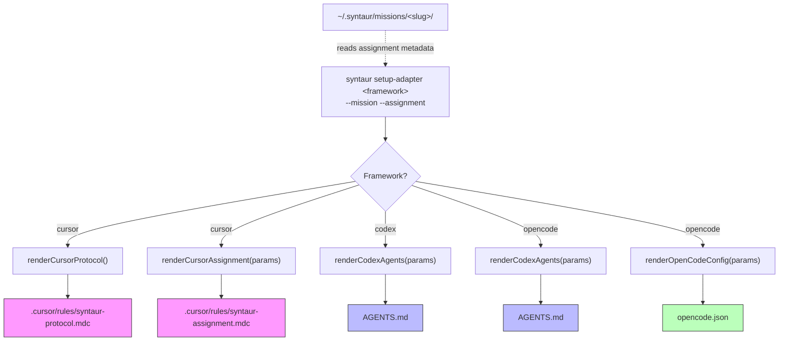

# Chunk 7: Additional Adapters Implementation Plan

## Metadata
- **Date:** 2026-03-21
- **Complexity:** medium
- **Tech Stack:** TypeScript/Node.js 20+ (CLI), Commander.js, Markdown/YAML frontmatter, Cursor .mdc format, Codex AGENTS.md, OpenCode AGENTS.md + opencode.json

## Objective
Create adapter instruction files for Cursor, Codex (OpenAI), and OpenCode that teach those agent frameworks how to follow the Syntaur protocol, using each framework's native instruction format, with a CLI command to render them into workspaces.

## Success Criteria
- [ ] `syntaur setup-adapter cursor --mission <slug> --assignment <slug>` generates `.cursor/rules/syntaur-protocol.mdc` and `.cursor/rules/syntaur-assignment.mdc` in the current working directory
- [ ] `syntaur setup-adapter codex --mission <slug> --assignment <slug>` generates `AGENTS.md` in the current working directory
- [ ] `syntaur setup-adapter opencode --mission <slug> --assignment <slug>` generates `AGENTS.md` and optionally `opencode.json` in the current working directory
- [ ] All generated adapter files contain equivalent protocol knowledge (write boundaries, lifecycle states, CLI commands, file reading order)
- [ ] Template renderers follow the existing `src/templates/*.ts` pattern (interface + exported render function)
- [ ] Unit tests for all three template renderers
- [ ] `adapters/README.md` documents how to create and contribute new adapters
- [ ] Static adapter templates live in `adapters/` directory at repo root

## Discovery Findings
The Syntaur codebase is a TypeScript CLI built with Commander.js and ESM modules. Chunks 1-4 provide the core protocol (scaffolding, index rebuild, lifecycle engine). Chunk 5 provides a Claude Code adapter as a global plugin installed via symlink. Chunks 6+ are in progress.

The key architectural insight is that Cursor, Codex, and OpenCode do NOT have global plugin systems like Claude Code. They discover instructions from files in the project directory:
- **Cursor:** `.cursor/rules/*.mdc` files with YAML frontmatter (`description`, `globs`, `alwaysApply`)
- **Codex:** `AGENTS.md` at repo root, standard markdown, 32 KiB limit, layered root-to-leaf
- **OpenCode:** `AGENTS.md` at project root (same as Codex), plus optional `opencode.json` `instructions` field

Therefore, adapter files must be generated into workspaces (not installed globally). This parallels how the Claude Code adapter creates `.claude/syntaur.local.json` in the working directory.

### Files That Will Need Changes
| File | Current Purpose | Needed Change |
|------|----------------|---------------|
| `src/commands/setup-adapter.ts` | Does not exist | CREATE: CLI command to generate adapter files in workspace |
| `src/index.ts` | CLI entry with 11 commands (L1-L226) | MODIFY: Register `setup-adapter` command |
| `src/templates/cursor-rules.ts` | Does not exist | CREATE: Renderer for Cursor .mdc protocol and assignment files |
| `src/templates/codex-agents.ts` | Does not exist | CREATE: Renderer for AGENTS.md (Codex/OpenCode) |
| `src/templates/opencode-config.ts` | Does not exist | CREATE: Renderer for opencode.json |
| `src/templates/index.ts` | Barrel export for all templates (L1-L41) | MODIFY: Add new template exports |
| `adapters/cursor/syntaur-protocol.mdc` | Does not exist | CREATE: Static Cursor rule for protocol knowledge |
| `adapters/codex/AGENTS.md.template` | Does not exist | CREATE: Static AGENTS.md template |
| `adapters/opencode/opencode.json.template` | Does not exist | CREATE: Optional OpenCode config template |
| `adapters/README.md` | Does not exist | CREATE: Contribution guide for new adapters |
| `src/__tests__/adapter-templates.test.ts` | Does not exist | CREATE: Unit tests for adapter renderers |

### CLAUDE.md Rules
- Plans go in `claude-info/plans/` (NOT `.claude/plans/`)
- Plugins stored in `~/.claude/plugins/`
- No repo-level CLAUDE.md exists for the syntaur project

## High-Level Architecture

### Approach
Follow the two-layer pattern established by the Claude Code adapter (chunk 5): separate static protocol knowledge from dynamic assignment context. Static protocol rules can optionally be committed to the repo; the assignment context file is generated per-session and gitignored.

Each adapter is implemented as:
1. A **TypeScript template renderer** in `src/templates/` following the existing pattern (interface for params, exported render function returning a string)
2. A **static template file** in `adapters/<framework>/` that serves as the reference content and is readable by community contributors
3. Generation via the **`syntaur setup-adapter` CLI command** which reads assignment context and renders files into the workspace

The renderers embed protocol knowledge directly (write boundaries, lifecycle states, CLI commands) rather than reading from external template files at runtime. This keeps the CLI self-contained and avoids runtime file resolution issues. The `adapters/` directory serves as human-readable reference documentation and contribution templates, not runtime assets.

### Key Decisions
| Decision | Chosen Option | Alternatives Considered | Rationale |
|----------|--------------|------------------------|-----------|
| Two files vs. one per adapter | Two files (static protocol + dynamic context) for Cursor; one combined file for Codex/OpenCode | Single combined file for all | Cursor's .mdc format naturally supports multiple rule files with different `alwaysApply` semantics. AGENTS.md is a single file by convention. |
| Template location | Renderers in `src/templates/`, reference docs in `adapters/` | Everything in `src/templates/` | Keeps community-contributable content separate from TypeScript source. `adapters/` parallels `plugin/` at repo root. |
| Runtime rendering vs. file copy | Renderers embed content as template literals (like `renderAgent` at L6-L27 of `src/templates/agent.ts`) | Read template files from disk at runtime | Self-contained, no file resolution complexity, follows existing pattern exactly. |
| Codex/OpenCode sharing | Shared AGENTS.md renderer; OpenCode gets an additional `opencode.json` renderer | Separate renderers for each | Both read `AGENTS.md` identically. Only OpenCode needs the extra config file. |
| Adapter file placement | Current working directory (workspace root) | Mission folder | Adapters must be in the project directory where each framework discovers them. Matches how `.claude/syntaur.local.json` goes in cwd. |

### Components
1. **`setup-adapter` CLI command** (`src/commands/setup-adapter.ts`): Accepts framework name, mission slug, assignment slug. Resolves assignment metadata from the mission folder. Calls the appropriate renderer(s) and writes files to cwd.
2. **Cursor template renderer** (`src/templates/cursor-rules.ts`): Two functions -- `renderCursorProtocol()` for static protocol rules in .mdc format, and `renderCursorAssignment(params)` for dynamic assignment context.
3. **Codex/OpenCode AGENTS.md renderer** (`src/templates/codex-agents.ts`): Single function `renderCodexAgents(params)` that produces a combined protocol + assignment context markdown file.
4. **OpenCode config renderer** (`src/templates/opencode-config.ts`): Renders `opencode.json` with `instructions` field pointing to mission's `agent.md`.
5. **Static adapter templates** (`adapters/`): Human-readable reference versions of each adapter format, plus `README.md` for contributors.

## Architecture Diagram



## Patterns to Follow

| Pattern | Reference File | Lines | What to Copy |
|---------|---------------|-------|--------------|
| Template renderer interface + function | `/Users/brennen/syntaur/src/templates/agent.ts` | L1-L4 (interface), L6-L27 (render function) | `AgentParams` interface with typed fields, `renderAgent` function returning template literal string |
| Template renderer (no frontmatter) | `/Users/brennen/syntaur/src/templates/claude.ts` | L1-L3 (interface), L5-L14 (render function) | `ClaudeParams` interface, `renderClaude` returning markdown without YAML frontmatter |
| Template barrel export | `/Users/brennen/syntaur/src/templates/index.ts` | L1-L41 | Pattern of `export { renderX } from './x.js'; export type { XParams } from './x.js';` for each template |
| CLI command with options | `/Users/brennen/syntaur/src/commands/install-plugin.ts` | L1-L6 (imports), L8-L9 (options interface), L11-L78 (async function with validation, fs operations, console output) | Options interface, async exported function, resolve paths, check existence, write files, console feedback |
| CLI command registration | `/Users/brennen/syntaur/src/index.ts` | L210-L224 (install-plugin registration) | `.command()` -> `.description()` -> `.argument()` -> `.option()` -> `.action(async () => { try/catch })` pattern |
| Config/path resolution | `/Users/brennen/syntaur/src/utils/config.ts` | L51-L86 (`readConfig`) | Read config, resolve mission directory, expand home paths |
| File writing utilities | `/Users/brennen/syntaur/src/utils/fs.ts` | L4-L6 (`ensureDir`), L17-L27 (`writeFileSafe`), L29-L35 (`writeFileForce`) | `ensureDir` for creating directories, `writeFileSafe` for skip-if-exists, `writeFileForce` for overwrite |
| Unit test structure | `/Users/brennen/syntaur/src/__tests__/templates.test.ts` | L1-L16 (imports), L20-L42 (manifest tests) | `describe`/`it`/`expect` with vitest, import from templates barrel, test frontmatter fields and body content |

---

## Detailed Implementation

---

### Task 1: Create Cursor Template Renderer

**File(s):** `src/templates/cursor-rules.ts`
**Action:** CREATE
**Pattern Reference:** `src/templates/agent.ts:1-27` (interface + template literal render function), `src/templates/claude.ts:1-14` (no-frontmatter renderer)
**Estimated complexity:** Medium

#### Context
Cursor discovers agent instructions from `.cursor/rules/*.mdc` files. Each .mdc file has YAML frontmatter with `description`, `globs`, and `alwaysApply` fields, followed by markdown content. We need two functions: one for static protocol knowledge (always applied) and one for dynamic assignment context (always applied).

#### Steps

1. [ ] **Step 1.1:** Create the file `src/templates/cursor-rules.ts` with the `CursorAssignmentParams` interface and two render functions.
   - **Location:** new file at `src/templates/cursor-rules.ts`
   - **Action:** CREATE
   - **What to do:** Define `CursorAssignmentParams` interface with `missionSlug`, `assignmentSlug`, `missionDir`, and `assignmentDir` fields. Export `renderCursorProtocol()` (no params, returns static protocol .mdc content) and `renderCursorAssignment(params)` (returns assignment-specific .mdc content).
   - **Code:**
     ```typescript
     export interface CursorAssignmentParams {
       missionSlug: string;
       assignmentSlug: string;
       missionDir: string;
       assignmentDir: string;
     }

     export function renderCursorProtocol(): string {
       return `---
     description: Syntaur protocol rules for multi-agent coordination
     globs:
     alwaysApply: true
     ---

     # Syntaur Protocol

     You are working within the Syntaur protocol for multi-agent mission coordination.

     ## Directory Structure

     \`\`\`
     ~/.syntaur/
       config.md
       missions/
         <mission-slug>/
           manifest.md            # Derived: root navigation (read-only)
           mission.md             # Human-authored: mission overview (read-only)
           _index-assignments.md  # Derived (read-only)
           _index-plans.md        # Derived (read-only)
           _index-decisions.md    # Derived (read-only)
           _index-sessions.md     # Derived (read-only)
           _status.md             # Derived (read-only)
           claude.md              # Human-authored: Claude-specific instructions (read-only)
           agent.md               # Human-authored: universal agent instructions (read-only)
           assignments/
             <assignment-slug>/
               assignment.md      # Agent-writable: source of truth for state
               plan.md            # Agent-writable: implementation plan
               scratchpad.md      # Agent-writable: working notes
               handoff.md         # Agent-writable: append-only handoff log
               decision-record.md # Agent-writable: append-only decision log
           resources/
             _index.md            # Derived (read-only)
             <resource-slug>.md   # Shared-writable
           memories/
             _index.md            # Derived (read-only)
             <memory-slug>.md     # Shared-writable
     \`\`\`

     ## Write Boundary Rules (CRITICAL)

     ### Files you may WRITE:
     1. **Your assignment folder** -- only the assignment you are currently working on:
        - \`assignment.md\`, \`plan.md\`, \`scratchpad.md\`, \`handoff.md\`, \`decision-record.md\`
        - Path: \`~/.syntaur/missions/<mission>/assignments/<your-assignment>/\`
     2. **Shared resources and memories** at the mission level:
        - \`~/.syntaur/missions/<mission>/resources/<slug>.md\`
        - \`~/.syntaur/missions/<mission>/memories/<slug>.md\`
     3. **Your workspace** -- source code files within the workspace defined in your assignment's frontmatter

     ### Files you must NEVER write:
     1. \`mission.md\`, \`agent.md\`, \`claude.md\` -- human-authored, read-only
     2. \`manifest.md\` -- derived, rebuilt by tooling
     3. Any file prefixed with \`_\` -- derived
     4. Other agents' assignment folders
     5. Any files outside your workspace boundary

     ## Assignment Lifecycle

     | Status | Meaning |
     |--------|---------|
     | \`pending\` | Not yet started |
     | \`in_progress\` | Actively being worked on |
     | \`blocked\` | Manually blocked (requires blockedReason) |
     | \`review\` | Work complete, awaiting review |
     | \`completed\` | Done |
     | \`failed\` | Could not be completed |

     ## Lifecycle Commands

     Use the \`syntaur\` CLI for state transitions:
     - \`syntaur assign <slug> --agent <name> --mission <mission>\` -- set assignee
     - \`syntaur start <slug> --mission <mission>\` -- pending -> in_progress
     - \`syntaur review <slug> --mission <mission>\` -- in_progress -> review
     - \`syntaur complete <slug> --mission <mission>\` -- in_progress/review -> completed
     - \`syntaur block <slug> --mission <mission> --reason <text>\` -- block an assignment
     - \`syntaur unblock <slug> --mission <mission>\` -- unblock
     - \`syntaur fail <slug> --mission <mission>\` -- mark as failed

     ## Conventions

     - Assignment frontmatter is the single source of truth for state
     - Slugs are lowercase, hyphen-separated
     - Always read \`agent.md\` at the mission level before starting work
     - Add unanswered questions to the Q&A section of assignment.md
     - Commit frequently with messages referencing the assignment slug
     `;
     }

     export function renderCursorAssignment(params: CursorAssignmentParams): string {
       return `---
     description: Syntaur assignment context for ${params.missionSlug}/${params.assignmentSlug}
     globs:
     alwaysApply: true
     ---

     # Current Assignment Context

     - **Mission:** ${params.missionSlug}
     - **Assignment:** ${params.assignmentSlug}
     - **Mission directory:** ${params.missionDir}
     - **Assignment directory:** ${params.assignmentDir}

     ## Reading Order

     Before starting work, read these files in order:
     1. \`${params.missionDir}/agent.md\` -- universal agent instructions and boundaries
     2. \`${params.missionDir}/mission.md\` -- mission overview and goals
     3. \`${params.assignmentDir}/assignment.md\` -- your assignment details, acceptance criteria, current status
     4. \`${params.assignmentDir}/plan.md\` -- your implementation plan
     5. \`${params.assignmentDir}/handoff.md\` -- previous session handoff notes

     ## Your Writable Files

     You may ONLY write to files inside your assignment folder:
     - \`${params.assignmentDir}/assignment.md\`
     - \`${params.assignmentDir}/plan.md\`
     - \`${params.assignmentDir}/scratchpad.md\`
     - \`${params.assignmentDir}/handoff.md\`
     - \`${params.assignmentDir}/decision-record.md\`

     And source code files in your workspace (as defined in assignment frontmatter).
     `;
     }
     ```
   - **Proof blocks:**
     - **PROOF:** Existing template renderers use `export interface` + `export function` pattern returning template literal strings.
       Source: `src/templates/agent.ts:1-27`
       Actual code:
       ```typescript
       export interface AgentParams {
         slug: string;
         timestamp: string;
       }
       export function renderAgent(params: AgentParams): string {
         return `---
       mission: ${params.slug}
       ...`;
       }
       ```
     - **PROOF:** Protocol directory structure, lifecycle states, write boundary rules come from `plugin/references/protocol-summary.md:1-68` and `plugin/references/file-ownership.md:1-53`.
     - **PROOF:** Lifecycle CLI commands verified from `plugin/skills/syntaur-protocol/SKILL.md:49-56`. Commands are: `syntaur assign`, `syntaur start`, `syntaur review`, `syntaur complete`, `syntaur block`, `syntaur unblock`, `syntaur fail`.
   - **Verification:**
     ```bash
     cd /Users/brennen/syntaur && npx tsc --noEmit src/templates/cursor-rules.ts
     ```

#### Error Handling
| Scenario | Handling | User Message | Code |
|----------|----------|--------------|------|
| N/A -- pure template, no I/O | N/A | N/A | N/A |

#### Task Completion Criteria
- [ ] File `src/templates/cursor-rules.ts` exists and exports `CursorAssignmentParams`, `renderCursorProtocol`, `renderCursorAssignment`
- [ ] `renderCursorProtocol()` returns a string starting with `---\n` (YAML frontmatter) containing `alwaysApply: true`
- [ ] `renderCursorAssignment(params)` interpolates `missionSlug`, `assignmentSlug`, `missionDir`, `assignmentDir`
- [ ] Code compiles without errors

---

### Task 2: Create Codex AGENTS.md Renderer

**File(s):** `src/templates/codex-agents.ts`
**Action:** CREATE
**Pattern Reference:** `src/templates/claude.ts:1-14` (simple interface + render function without YAML frontmatter)
**Estimated complexity:** Medium

#### Context
Codex and OpenCode both discover instructions from an `AGENTS.md` file at the project root. This renderer produces a combined protocol + assignment context markdown file (no YAML frontmatter -- plain markdown).

#### Steps

1. [ ] **Step 2.1:** Create the file `src/templates/codex-agents.ts` with a `CodexAgentsParams` interface and `renderCodexAgents` function.
   - **Location:** new file at `src/templates/codex-agents.ts`
   - **Action:** CREATE
   - **What to do:** Define `CodexAgentsParams` with `missionSlug`, `assignmentSlug`, `missionDir`, `assignmentDir` fields. Export `renderCodexAgents(params)` returning markdown content with protocol knowledge and assignment context combined into one AGENTS.md file.
   - **Code:**
     ```typescript
     export interface CodexAgentsParams {
       missionSlug: string;
       assignmentSlug: string;
       missionDir: string;
       assignmentDir: string;
     }

     export function renderCodexAgents(params: CodexAgentsParams): string {
       return `# Syntaur Protocol -- Agent Instructions

     This project uses the Syntaur protocol for multi-agent mission coordination.

     ## Current Assignment

     - **Mission:** ${params.missionSlug}
     - **Assignment:** ${params.assignmentSlug}
     - **Mission directory:** ${params.missionDir}
     - **Assignment directory:** ${params.assignmentDir}

     ## Reading Order

     Before starting work, read these files in order:
     1. \`${params.missionDir}/agent.md\` -- universal agent instructions and boundaries
     2. \`${params.missionDir}/mission.md\` -- mission overview and goals
     3. \`${params.assignmentDir}/assignment.md\` -- your assignment details, acceptance criteria, current status
     4. \`${params.assignmentDir}/plan.md\` -- your implementation plan
     5. \`${params.assignmentDir}/handoff.md\` -- previous session handoff notes

     ## Directory Structure

     \`\`\`
     ~/.syntaur/
       config.md
       missions/
         <mission-slug>/
           manifest.md            # Derived: root navigation (read-only)
           mission.md             # Human-authored: mission overview (read-only)
           _index-assignments.md  # Derived (read-only)
           _index-plans.md        # Derived (read-only)
           _index-decisions.md    # Derived (read-only)
           _index-sessions.md     # Derived (read-only)
           _status.md             # Derived (read-only)
           claude.md              # Human-authored: Claude-specific instructions (read-only)
           agent.md               # Human-authored: universal agent instructions (read-only)
           assignments/
             <assignment-slug>/
               assignment.md      # Agent-writable: source of truth for state
               plan.md            # Agent-writable: implementation plan
               scratchpad.md      # Agent-writable: working notes
               handoff.md         # Agent-writable: append-only handoff log
               decision-record.md # Agent-writable: append-only decision log
           resources/
             _index.md            # Derived (read-only)
             <resource-slug>.md   # Shared-writable
           memories/
             _index.md            # Derived (read-only)
             <memory-slug>.md     # Shared-writable
     \`\`\`

     ## Write Boundary Rules (CRITICAL)

     ### Files you may WRITE:
     1. **Your assignment folder** -- only the assignment you are currently working on:
        - \`assignment.md\`, \`plan.md\`, \`scratchpad.md\`, \`handoff.md\`, \`decision-record.md\`
        - Path: \`${params.assignmentDir}/\`
     2. **Shared resources and memories** at the mission level:
        - \`${params.missionDir}/resources/<slug>.md\`
        - \`${params.missionDir}/memories/<slug>.md\`
     3. **Your workspace** -- source code files within the workspace defined in your assignment's frontmatter

     ### Files you must NEVER write:
     1. \`mission.md\`, \`agent.md\`, \`claude.md\` -- human-authored, read-only
     2. \`manifest.md\` -- derived, rebuilt by tooling
     3. Any file prefixed with \`_\` -- derived
     4. Other agents' assignment folders
     5. Any files outside your workspace boundary

     ## Assignment Lifecycle

     | Status | Meaning |
     |--------|---------|
     | \`pending\` | Not yet started |
     | \`in_progress\` | Actively being worked on |
     | \`blocked\` | Manually blocked (requires blockedReason) |
     | \`review\` | Work complete, awaiting review |
     | \`completed\` | Done |
     | \`failed\` | Could not be completed |

     ## Lifecycle Commands

     Use the \`syntaur\` CLI for state transitions:
     - \`syntaur assign ${params.assignmentSlug} --agent <name> --mission ${params.missionSlug}\` -- set assignee
     - \`syntaur start ${params.assignmentSlug} --mission ${params.missionSlug}\` -- pending -> in_progress
     - \`syntaur review ${params.assignmentSlug} --mission ${params.missionSlug}\` -- in_progress -> review
     - \`syntaur complete ${params.assignmentSlug} --mission ${params.missionSlug}\` -- in_progress/review -> completed
     - \`syntaur block ${params.assignmentSlug} --mission ${params.missionSlug} --reason <text>\` -- block
     - \`syntaur unblock ${params.assignmentSlug} --mission ${params.missionSlug}\` -- unblock
     - \`syntaur fail ${params.assignmentSlug} --mission ${params.missionSlug}\` -- mark as failed

     ## Conventions

     - Assignment frontmatter is the single source of truth for state
     - Slugs are lowercase, hyphen-separated
     - Always read \`agent.md\` at the mission level before starting work
     - Add unanswered questions to the Q&A section of assignment.md
     - Commit frequently with messages referencing the assignment slug
     `;
     }
     ```
   - **Proof blocks:**
     - **PROOF:** `renderClaude` in `src/templates/claude.ts:1-14` shows the pattern for a renderer that returns plain markdown (no YAML frontmatter), with a simple interface.
       Actual code:
       ```typescript
       export interface ClaudeParams {
         slug: string;
       }
       export function renderClaude(params: ClaudeParams): string {
         return `# Claude Code Instructions -- ${params.slug}
       ...`;
       }
       ```
     - **PROOF:** Protocol lifecycle states from `plugin/references/protocol-summary.md:36-44`: pending, in_progress, blocked, review, completed, failed.
     - **PROOF:** CLI commands from `plugin/skills/syntaur-protocol/SKILL.md:49-56`.
   - **Verification:**
     ```bash
     cd /Users/brennen/syntaur && npx tsc --noEmit src/templates/codex-agents.ts
     ```

#### Error Handling
| Scenario | Handling | User Message | Code |
|----------|----------|--------------|------|
| N/A -- pure template, no I/O | N/A | N/A | N/A |

#### Task Completion Criteria
- [ ] File `src/templates/codex-agents.ts` exists and exports `CodexAgentsParams` and `renderCodexAgents`
- [ ] `renderCodexAgents(params)` returns markdown with no YAML frontmatter (does not start with `---`)
- [ ] Output contains protocol structure, write boundaries, lifecycle states, CLI commands
- [ ] Output interpolates all four params: `missionSlug`, `assignmentSlug`, `missionDir`, `assignmentDir`
- [ ] Code compiles without errors

---

### Task 3: Create OpenCode Config Renderer

**File(s):** `src/templates/opencode-config.ts`
**Action:** CREATE
**Pattern Reference:** `src/templates/claude.ts:1-14` (simple interface + render function)
**Estimated complexity:** Low

#### Context
OpenCode supports an optional `opencode.json` configuration file at the project root. The `instructions` field can point agents to read the mission's `agent.md` file. This renderer produces the JSON content for that config.

#### Steps

1. [ ] **Step 3.1:** Create the file `src/templates/opencode-config.ts` with an `OpenCodeConfigParams` interface and `renderOpenCodeConfig` function.
   - **Location:** new file at `src/templates/opencode-config.ts`
   - **Action:** CREATE
   - **What to do:** Define `OpenCodeConfigParams` with `missionDir` field. Export `renderOpenCodeConfig(params)` returning a JSON string with an `instructions` field that tells OpenCode to read the Syntaur AGENTS.md in the current directory.
   - **Code:**
     ```typescript
     export interface OpenCodeConfigParams {
       missionDir: string;
     }

     export function renderOpenCodeConfig(params: OpenCodeConfigParams): string {
       const config = {
         instructions: [
           `Read AGENTS.md in this directory for Syntaur protocol instructions.`,
           `Also read ${params.missionDir}/agent.md for universal agent conventions.`,
         ],
       };
       return JSON.stringify(config, null, 2) + '\n';
     }
     ```
   - **Proof blocks:**
     - **PROOF:** `renderClaude` pattern in `src/templates/claude.ts:1-14` shows the interface + export function structure. OpenCode config follows the same shape but returns JSON instead of markdown.
     - **PROOF:** OpenCode uses `opencode.json` with an `instructions` field per the plan's discovery findings (plan document L27).
   - **Verification:**
     ```bash
     cd /Users/brennen/syntaur && npx tsc --noEmit src/templates/opencode-config.ts
     ```

#### Error Handling
| Scenario | Handling | User Message | Code |
|----------|----------|--------------|------|
| N/A -- pure template, no I/O | N/A | N/A | N/A |

#### Task Completion Criteria
- [ ] File `src/templates/opencode-config.ts` exists and exports `OpenCodeConfigParams` and `renderOpenCodeConfig`
- [ ] `renderOpenCodeConfig(params)` returns valid JSON containing an `instructions` array
- [ ] Output includes a trailing newline
- [ ] Code compiles without errors

---

### Task 4: Update Template Barrel Exports

**File(s):** `src/templates/index.ts`
**Action:** MODIFY
**Pattern Reference:** `src/templates/index.ts:1-41` (existing barrel export pattern)
**Estimated complexity:** Low

#### Context
All template renderers are re-exported from `src/templates/index.ts` so they can be imported from a single barrel. The new renderers must be added.

#### Steps

1. [ ] **Step 4.1:** Append export lines for the three new template modules at the end of `src/templates/index.ts`.
   - **Location:** `src/templates/index.ts:41` (after the last existing export line)
   - **Action:** MODIFY
   - **What to do:** Add six export lines (three render functions and three type exports) following the exact pattern of the existing exports.
   - **Code to append after line 40:**
     ```typescript

     export { renderCursorProtocol, renderCursorAssignment } from './cursor-rules.js';
     export type { CursorAssignmentParams } from './cursor-rules.js';

     export { renderCodexAgents } from './codex-agents.js';
     export type { CodexAgentsParams } from './codex-agents.js';

     export { renderOpenCodeConfig } from './opencode-config.js';
     export type { OpenCodeConfigParams } from './opencode-config.js';
     ```
   - **Proof blocks:**
     - **PROOF:** Existing barrel pattern in `src/templates/index.ts:1-2`:
       ```typescript
       export { renderConfig } from './config.js';
       export type { ConfigParams } from './config.js';
       ```
     - **PROOF:** All imports use `.js` extension (ESM module resolution). Verified at `src/templates/index.ts:1`: `export { renderConfig } from './config.js';`
     - **PROOF:** `renderCursorProtocol` and `renderCursorAssignment` are exported from `src/templates/cursor-rules.ts` (Task 1 creates them).
     - **PROOF:** `renderCodexAgents` is exported from `src/templates/codex-agents.ts` (Task 2 creates it).
     - **PROOF:** `renderOpenCodeConfig` is exported from `src/templates/opencode-config.ts` (Task 3 creates it).
   - **Verification:**
     ```bash
     cd /Users/brennen/syntaur && npx tsc --noEmit src/templates/index.ts
     ```

#### Error Handling
| Scenario | Handling | User Message | Code |
|----------|----------|--------------|------|
| N/A -- static exports, no runtime behavior | N/A | N/A | N/A |

#### Task Completion Criteria
- [ ] `src/templates/index.ts` exports all three new render functions and their param types
- [ ] All imports use `.js` extensions
- [ ] Code compiles without errors
- [ ] Existing exports remain unchanged

---

### Task 5: Create setup-adapter CLI Command

**File(s):** `src/commands/setup-adapter.ts`
**Action:** CREATE
**Pattern Reference:** `src/commands/install-plugin.ts:1-78` (options interface, async function, path resolution, file writing, console output), `src/commands/start.ts:1-54` (mission/assignment slug validation and path resolution)
**Estimated complexity:** High

#### Context
This is the main CLI command that generates adapter files into the current working directory. It accepts a framework name (`cursor`, `codex`, `opencode`), a `--mission` slug, and an `--assignment` slug. It resolves the assignment's mission directory, then calls the appropriate renderer(s) and writes files.

#### Steps

1. [ ] **Step 5.1:** Create the file `src/commands/setup-adapter.ts` with the `SetupAdapterOptions` interface and `setupAdapterCommand` async function.
   - **Location:** new file at `src/commands/setup-adapter.ts`
   - **Action:** CREATE
   - **What to do:** Define the options interface. The function validates the framework argument (must be one of `cursor`, `codex`, `opencode`), validates mission and assignment slugs using `isValidSlug`, resolves the mission directory via `readConfig`, verifies the assignment folder exists, then calls the appropriate renderer(s) and writes files to cwd using `writeFileSafe` (or `writeFileForce` if `--force` is set).
   - **Code:**
     ```typescript
     import { resolve } from 'node:path';
     import { expandHome } from '../utils/paths.js';
     import { fileExists, writeFileSafe, writeFileForce } from '../utils/fs.js';
     import { readConfig } from '../utils/config.js';
     import { isValidSlug } from '../utils/slug.js';
     import { renderCursorProtocol, renderCursorAssignment } from '../templates/cursor-rules.js';
     import { renderCodexAgents } from '../templates/codex-agents.js';
     import { renderOpenCodeConfig } from '../templates/opencode-config.js';

     const SUPPORTED_FRAMEWORKS = ['cursor', 'codex', 'opencode'] as const;
     type Framework = (typeof SUPPORTED_FRAMEWORKS)[number];

     export interface SetupAdapterOptions {
       mission: string;
       assignment: string;
       force?: boolean;
       dir?: string;
     }

     export async function setupAdapterCommand(
       framework: string,
       options: SetupAdapterOptions,
     ): Promise<void> {
       // Validate framework
       if (!SUPPORTED_FRAMEWORKS.includes(framework as Framework)) {
         throw new Error(
           `Unsupported framework "${framework}". Supported: ${SUPPORTED_FRAMEWORKS.join(', ')}`,
         );
       }

       // Validate required options
       if (!options.mission) {
         throw new Error('--mission <slug> is required.');
       }
       if (!options.assignment) {
         throw new Error('--assignment <slug> is required.');
       }
       if (!isValidSlug(options.mission)) {
         throw new Error(
           `Invalid mission slug "${options.mission}". Slugs must be lowercase, hyphen-separated, with no special characters.`,
         );
       }
       if (!isValidSlug(options.assignment)) {
         throw new Error(
           `Invalid assignment slug "${options.assignment}". Slugs must be lowercase, hyphen-separated, with no special characters.`,
         );
       }

       // Resolve paths
       const config = await readConfig();
       const baseDir = options.dir
         ? expandHome(options.dir)
         : config.defaultMissionDir;
       const missionDir = resolve(baseDir, options.mission);
       const assignmentDir = resolve(
         missionDir,
         'assignments',
         options.assignment,
       );

       // Verify mission exists
       const missionMdPath = resolve(missionDir, 'mission.md');
       if (!(await fileExists(missionDir)) || !(await fileExists(missionMdPath))) {
         throw new Error(
           `Mission "${options.mission}" not found at ${missionDir}.`,
         );
       }

       // Verify assignment exists
       const assignmentMdPath = resolve(assignmentDir, 'assignment.md');
       if (!(await fileExists(assignmentDir)) || !(await fileExists(assignmentMdPath))) {
         throw new Error(
           `Assignment "${options.assignment}" not found at ${assignmentDir}.`,
         );
       }

       const cwd = process.cwd();
       const writeFn = options.force ? writeFileForce : writeFileSafe;
       const writtenFiles: string[] = [];
       const skippedFiles: string[] = [];

       const rendererParams = {
         missionSlug: options.mission,
         assignmentSlug: options.assignment,
         missionDir,
         assignmentDir,
       };

       if (framework === 'cursor') {
         const protocolPath = resolve(cwd, '.cursor', 'rules', 'syntaur-protocol.mdc');
         const assignmentPath = resolve(cwd, '.cursor', 'rules', 'syntaur-assignment.mdc');

         const protocolContent = renderCursorProtocol();
         const assignmentContent = renderCursorAssignment(rendererParams);

         if (options.force) {
           await writeFileForce(protocolPath, protocolContent);
           writtenFiles.push(protocolPath);
           await writeFileForce(assignmentPath, assignmentContent);
           writtenFiles.push(assignmentPath);
         } else {
           if (await writeFileSafe(protocolPath, protocolContent)) {
             writtenFiles.push(protocolPath);
           } else {
             skippedFiles.push(protocolPath);
           }
           if (await writeFileSafe(assignmentPath, assignmentContent)) {
             writtenFiles.push(assignmentPath);
           } else {
             skippedFiles.push(assignmentPath);
           }
         }
       } else if (framework === 'codex' || framework === 'opencode') {
         const agentsPath = resolve(cwd, 'AGENTS.md');
         const agentsContent = renderCodexAgents(rendererParams);

         if (options.force) {
           await writeFileForce(agentsPath, agentsContent);
           writtenFiles.push(agentsPath);
         } else {
           if (await writeFileSafe(agentsPath, agentsContent)) {
             writtenFiles.push(agentsPath);
           } else {
             skippedFiles.push(agentsPath);
           }
         }

         if (framework === 'opencode') {
           const configPath = resolve(cwd, 'opencode.json');
           const configContent = renderOpenCodeConfig({ missionDir });

           if (options.force) {
             await writeFileForce(configPath, configContent);
             writtenFiles.push(configPath);
           } else {
             if (await writeFileSafe(configPath, configContent)) {
               writtenFiles.push(configPath);
             } else {
               skippedFiles.push(configPath);
             }
           }
         }
       }

       // Output results
       if (writtenFiles.length > 0) {
         console.log(`Generated ${framework} adapter files:`);
         for (const f of writtenFiles) {
           console.log(`  ${f}`);
         }
       }
       if (skippedFiles.length > 0) {
         console.log(`Skipped (already exist, use --force to overwrite):`);
         for (const f of skippedFiles) {
           console.log(`  ${f}`);
         }
       }
       if (writtenFiles.length === 0 && skippedFiles.length > 0) {
         console.log(`No files written. All target files already exist.`);
       }
     }
     ```
   - **Proof blocks:**
     - **PROOF:** `isValidSlug` exported from `src/utils/slug.ts:11-13`:
       ```typescript
       export function isValidSlug(slug: string): boolean {
         return /^[a-z0-9]+(-[a-z0-9]+)*$/.test(slug);
       }
       ```
     - **PROOF:** `readConfig` returns `SyntaurConfig` with `defaultMissionDir` field, from `src/utils/config.ts:51-86`.
     - **PROOF:** `expandHome` exported from `src/utils/paths.ts:4-9`.
     - **PROOF:** `fileExists` from `src/utils/fs.ts:8-15`, returns `Promise<boolean>`.
     - **PROOF:** `ensureDir` from `src/utils/fs.ts:4-6`, creates directories recursively.
     - **PROOF:** `writeFileSafe` from `src/utils/fs.ts:17-27`, returns `Promise<boolean>` (false if file already exists).
     - **PROOF:** `writeFileForce` from `src/utils/fs.ts:29-35`, returns `Promise<void>` (always overwrites).
     - **PROOF:** Mission path resolution pattern from `src/commands/start.ts:32-43`:
       ```typescript
       const config = await readConfig();
       const baseDir = options.dir ? expandHome(options.dir) : config.defaultMissionDir;
       const missionDir = resolve(baseDir, options.mission);
       const missionMdPath = resolve(missionDir, 'mission.md');
       ```
     - **PROOF:** Assignment directory structure: `<missionDir>/assignments/<assignmentSlug>/assignment.md`. Verified from `plugin/references/protocol-summary.md:19-25`.
   - **Verification:**
     ```bash
     cd /Users/brennen/syntaur && npx tsc --noEmit src/commands/setup-adapter.ts
     ```

#### Error Handling
| Scenario | Handling | User Message | Code |
|----------|----------|--------------|------|
| Unsupported framework name | Throw error immediately | `Unsupported framework "xxx". Supported: cursor, codex, opencode` | `throw new Error(...)` |
| Missing --mission option | Throw error immediately | `--mission <slug> is required.` | `throw new Error(...)` |
| Missing --assignment option | Throw error immediately | `--assignment <slug> is required.` | `throw new Error(...)` |
| Invalid mission slug format | Throw error immediately | `Invalid mission slug "xxx". Slugs must be lowercase, hyphen-separated, with no special characters.` | `throw new Error(...)` |
| Invalid assignment slug format | Throw error immediately | `Invalid assignment slug "xxx". Slugs must be lowercase, hyphen-separated, with no special characters.` | `throw new Error(...)` |
| Mission directory does not exist | Throw error after path resolution | `Mission "xxx" not found at /path/to/missions/xxx.` | `throw new Error(...)` |
| Assignment directory does not exist | Throw error after path resolution | `Assignment "xxx" not found at /path/to/assignments/xxx.` | `throw new Error(...)` |
| Target file already exists (no --force) | Skip file, report as skipped | `Skipped (already exist, use --force to overwrite): /path/to/file` | `writeFileSafe` returns false |

#### Task Completion Criteria
- [ ] File `src/commands/setup-adapter.ts` exports `SetupAdapterOptions` and `setupAdapterCommand`
- [ ] Command validates framework, mission slug, assignment slug
- [ ] Command resolves mission and assignment directories correctly
- [ ] `cursor` framework writes two files: `.cursor/rules/syntaur-protocol.mdc` and `.cursor/rules/syntaur-assignment.mdc`
- [ ] `codex` framework writes one file: `AGENTS.md`
- [ ] `opencode` framework writes two files: `AGENTS.md` and `opencode.json`
- [ ] `--force` flag causes overwrite; default skips existing files
- [ ] Console output reports written and skipped files
- [ ] Code compiles without errors

---

### Task 6: Register setup-adapter in CLI

**File(s):** `src/index.ts`
**Action:** MODIFY
**Pattern Reference:** `src/index.ts:210-224` (install-plugin command registration)
**Estimated complexity:** Low

#### Context
The setup-adapter command must be registered in the main CLI entry point so users can run `syntaur setup-adapter <framework>`.

#### Steps

1. [ ] **Step 6.1:** Add the import for `setupAdapterCommand` at the top of `src/index.ts`.
   - **Location:** `src/index.ts:12` (after the `installPluginCommand` import)
   - **Action:** MODIFY
   - **What to do:** Add one import line after the existing `installPluginCommand` import.
   - **Code:** Add this line after line 12:
     ```typescript
     import { setupAdapterCommand } from './commands/setup-adapter.js';
     ```
   - **Proof blocks:**
     - **PROOF:** Existing import pattern at `src/index.ts:12`:
       ```typescript
       import { installPluginCommand } from './commands/install-plugin.js';
       ```
     - **PROOF:** All imports use `.js` extension for ESM. Verified across lines 1-12 of `src/index.ts`.

2. [ ] **Step 6.2:** Add the command registration block before `program.parse()`.
   - **Location:** `src/index.ts:226` (before `program.parse();`)
   - **Action:** MODIFY
   - **What to do:** Insert a new command registration block between the `install-plugin` registration (ending at line 224) and `program.parse()` (line 226). The command takes `<framework>` as a required argument, plus `--mission`, `--assignment`, `--force`, and `--dir` options.
   - **Code:** Insert before `program.parse();`:
     ```typescript

     program
       .command('setup-adapter')
       .description('Generate adapter instruction files for a framework in the current directory')
       .argument('<framework>', 'Target framework (cursor, codex, opencode)')
       .option('--mission <slug>', 'Target mission slug (required)')
       .option('--assignment <slug>', 'Target assignment slug (required)')
       .option('--force', 'Overwrite existing adapter files')
       .option('--dir <path>', 'Override default mission directory')
       .action(async (framework, options) => {
         try {
           await setupAdapterCommand(framework, options);
         } catch (error) {
           console.error(
             'Error:',
             error instanceof Error ? error.message : String(error),
           );
           process.exit(1);
         }
       });

     ```
   - **Proof blocks:**
     - **PROOF:** Existing command registration pattern at `src/index.ts:210-224`:
       ```typescript
       program
         .command('install-plugin')
         .description('Install the Syntaur Claude Code plugin via symlink')
         .option('--force', 'Overwrite existing plugin installation')
         .action(async (options) => {
           try {
             await installPluginCommand(options);
           } catch (error) {
             console.error(
               'Error:',
               error instanceof Error ? error.message : String(error),
             );
             process.exit(1);
           }
         });
       ```
     - **PROOF:** Commands with arguments use `.argument('<name>', 'description')` as shown at `src/index.ts:40`:
       ```typescript
       .argument('<title>', 'Mission title')
       ```
     - **PROOF:** Commander.js passes the argument as the first parameter to the action callback, options as the second. Verified at `src/index.ts:43`:
       ```typescript
       .action(async (title, options) => {
       ```
   - **Verification:**
     ```bash
     cd /Users/brennen/syntaur && npx tsc --noEmit src/index.ts
     ```

#### Error Handling
| Scenario | Handling | User Message | Code |
|----------|----------|--------------|------|
| Command throws | Caught by try/catch in action | `Error: <message>` + `process.exit(1)` | Standard pattern from `src/index.ts:210-224` |

#### Task Completion Criteria
- [ ] `src/index.ts` imports `setupAdapterCommand` from `./commands/setup-adapter.js`
- [ ] `setup-adapter` command is registered with `<framework>` argument and `--mission`, `--assignment`, `--force`, `--dir` options
- [ ] Error handling follows the same try/catch pattern as all other commands
- [ ] `program.parse()` remains the last line in the file
- [ ] Code compiles without errors

---

### Task 7: Create Unit Tests

**File(s):** `src/__tests__/adapter-templates.test.ts`
**Action:** CREATE
**Pattern Reference:** `src/__tests__/templates.test.ts:1-42` (vitest describe/it/expect, import from barrel, test content assertions)
**Estimated complexity:** Medium

#### Context
Each of the three new renderers needs unit tests verifying they produce correct output with expected content.

#### Steps

1. [ ] **Step 7.1:** Create the test file `src/__tests__/adapter-templates.test.ts`.
   - **Location:** new file at `src/__tests__/adapter-templates.test.ts`
   - **Action:** CREATE
   - **What to do:** Import the three render functions and their param types from the templates barrel. Write describe blocks for each renderer testing key content assertions.
   - **Code:**
     ```typescript
     import { describe, it, expect } from 'vitest';
     import {
       renderCursorProtocol,
       renderCursorAssignment,
       renderCodexAgents,
       renderOpenCodeConfig,
     } from '../templates/index.js';

     const TEST_PARAMS = {
       missionSlug: 'test-mission',
       assignmentSlug: 'test-assignment',
       missionDir: '/home/user/.syntaur/missions/test-mission',
       assignmentDir:
         '/home/user/.syntaur/missions/test-mission/assignments/test-assignment',
     };

     describe('renderCursorProtocol', () => {
       it('starts with .mdc YAML frontmatter', () => {
         const out = renderCursorProtocol();
         expect(out).toMatch(/^---\n/);
         expect(out).toContain('alwaysApply: true');
       });

       it('contains protocol directory structure', () => {
         const out = renderCursorProtocol();
         expect(out).toContain('~/.syntaur/');
         expect(out).toContain('manifest.md');
         expect(out).toContain('assignment.md');
       });

       it('contains write boundary rules', () => {
         const out = renderCursorProtocol();
         expect(out).toContain('Write Boundary Rules');
         expect(out).toContain('Files you may WRITE');
         expect(out).toContain('Files you must NEVER write');
       });

       it('contains lifecycle states', () => {
         const out = renderCursorProtocol();
         expect(out).toContain('pending');
         expect(out).toContain('in_progress');
         expect(out).toContain('blocked');
         expect(out).toContain('review');
         expect(out).toContain('completed');
         expect(out).toContain('failed');
       });

       it('contains lifecycle CLI commands', () => {
         const out = renderCursorProtocol();
         expect(out).toContain('syntaur assign');
         expect(out).toContain('syntaur start');
         expect(out).toContain('syntaur review');
         expect(out).toContain('syntaur complete');
         expect(out).toContain('syntaur block');
         expect(out).toContain('syntaur unblock');
         expect(out).toContain('syntaur fail');
       });
     });

     describe('renderCursorAssignment', () => {
       it('starts with .mdc YAML frontmatter', () => {
         const out = renderCursorAssignment(TEST_PARAMS);
         expect(out).toMatch(/^---\n/);
         expect(out).toContain('alwaysApply: true');
       });

       it('contains mission and assignment context', () => {
         const out = renderCursorAssignment(TEST_PARAMS);
         expect(out).toContain('test-mission');
         expect(out).toContain('test-assignment');
         expect(out).toContain(TEST_PARAMS.missionDir);
         expect(out).toContain(TEST_PARAMS.assignmentDir);
       });

       it('contains reading order', () => {
         const out = renderCursorAssignment(TEST_PARAMS);
         expect(out).toContain('agent.md');
         expect(out).toContain('mission.md');
         expect(out).toContain('assignment.md');
         expect(out).toContain('plan.md');
         expect(out).toContain('handoff.md');
       });

       it('lists writable files', () => {
         const out = renderCursorAssignment(TEST_PARAMS);
         expect(out).toContain('scratchpad.md');
         expect(out).toContain('decision-record.md');
       });
     });

     describe('renderCodexAgents', () => {
       it('does NOT have YAML frontmatter', () => {
         const out = renderCodexAgents(TEST_PARAMS);
         expect(out).not.toMatch(/^---\n/);
       });

       it('starts with heading', () => {
         const out = renderCodexAgents(TEST_PARAMS);
         expect(out).toMatch(/^# Syntaur Protocol/);
       });

       it('contains assignment context', () => {
         const out = renderCodexAgents(TEST_PARAMS);
         expect(out).toContain('test-mission');
         expect(out).toContain('test-assignment');
         expect(out).toContain(TEST_PARAMS.missionDir);
         expect(out).toContain(TEST_PARAMS.assignmentDir);
       });

       it('contains protocol directory structure', () => {
         const out = renderCodexAgents(TEST_PARAMS);
         expect(out).toContain('~/.syntaur/');
         expect(out).toContain('manifest.md');
       });

       it('contains write boundary rules', () => {
         const out = renderCodexAgents(TEST_PARAMS);
         expect(out).toContain('Write Boundary Rules');
         expect(out).toContain('Files you may WRITE');
         expect(out).toContain('Files you must NEVER write');
       });

       it('contains lifecycle states and commands', () => {
         const out = renderCodexAgents(TEST_PARAMS);
         expect(out).toContain('pending');
         expect(out).toContain('in_progress');
         expect(out).toContain('completed');
         expect(out).toContain('syntaur assign');
         expect(out).toContain('syntaur start');
         expect(out).toContain('syntaur complete');
       });

       it('includes assignment-specific CLI commands', () => {
         const out = renderCodexAgents(TEST_PARAMS);
         expect(out).toContain(
           `syntaur start ${TEST_PARAMS.assignmentSlug} --mission ${TEST_PARAMS.missionSlug}`,
         );
       });
     });

     describe('renderOpenCodeConfig', () => {
       it('produces valid JSON', () => {
         const out = renderOpenCodeConfig({
           missionDir: TEST_PARAMS.missionDir,
         });
         expect(() => JSON.parse(out)).not.toThrow();
       });

       it('has instructions array', () => {
         const out = renderOpenCodeConfig({
           missionDir: TEST_PARAMS.missionDir,
         });
         const parsed = JSON.parse(out);
         expect(Array.isArray(parsed.instructions)).toBe(true);
         expect(parsed.instructions.length).toBeGreaterThan(0);
       });

       it('references agent.md path', () => {
         const out = renderOpenCodeConfig({
           missionDir: TEST_PARAMS.missionDir,
         });
         expect(out).toContain('agent.md');
         expect(out).toContain(TEST_PARAMS.missionDir);
       });

       it('ends with newline', () => {
         const out = renderOpenCodeConfig({
           missionDir: TEST_PARAMS.missionDir,
         });
         expect(out).toMatch(/\n$/);
       });
     });
     ```
   - **Proof blocks:**
     - **PROOF:** Test structure follows `src/__tests__/templates.test.ts:1-16`:
       ```typescript
       import { describe, it, expect } from 'vitest';
       import {
         renderManifest,
         renderMission,
         ...
       } from '../templates/index.js';
       ```
     - **PROOF:** Test assertions use `toContain`, `toMatch`, `not.toMatch` pattern from `src/__tests__/templates.test.ts:23-26`:
       ```typescript
       expect(out).toContain('version: "1.0"');
       expect(out).toContain('mission: test-mission');
       ```
     - **PROOF:** `renderCursorProtocol`, `renderCursorAssignment`, `renderCodexAgents`, `renderOpenCodeConfig` are exported from the barrel (Task 4 adds them).
   - **Verification:**
     ```bash
     cd /Users/brennen/syntaur && npx vitest run src/__tests__/adapter-templates.test.ts
     ```

#### Error Handling
| Scenario | Handling | User Message | Code |
|----------|----------|--------------|------|
| N/A -- tests, not production code | N/A | N/A | N/A |

#### Task Completion Criteria
- [ ] File `src/__tests__/adapter-templates.test.ts` exists
- [ ] Tests cover `renderCursorProtocol`, `renderCursorAssignment`, `renderCodexAgents`, `renderOpenCodeConfig`
- [ ] Tests verify: frontmatter presence/absence, protocol content, assignment context interpolation, lifecycle states, CLI commands, JSON validity
- [ ] All tests pass with `npx vitest run src/__tests__/adapter-templates.test.ts`

---

### Task 8: Create Static Adapter Templates

**File(s):** `adapters/cursor/syntaur-protocol.mdc`, `adapters/codex/AGENTS.md.template`, `adapters/opencode/opencode.json.template`
**Action:** CREATE
**Pattern Reference:** `plugin/references/protocol-summary.md:1-68` (protocol content reference)
**Estimated complexity:** Low

#### Context
Static template files in the `adapters/` directory serve as human-readable references and contribution templates. They are not read at runtime. Their content should match what the TypeScript renderers produce (with placeholder values for dynamic fields).

#### Steps

1. [ ] **Step 8.1:** Create `adapters/cursor/syntaur-protocol.mdc` as a reference example of the Cursor .mdc format.
   - **Location:** new file at `adapters/cursor/syntaur-protocol.mdc`
   - **Action:** CREATE
   - **What to do:** Write a reference version of the Cursor protocol .mdc file with the same structure as `renderCursorProtocol()` output. This is a static reference, not a runtime asset.
   - **Code:**
     ```
     ---
     description: Syntaur protocol rules for multi-agent coordination
     globs:
     alwaysApply: true
     ---

     # Syntaur Protocol

     This is a reference template for the Cursor adapter.

     The `syntaur setup-adapter cursor` command generates this file
     dynamically at `.cursor/rules/syntaur-protocol.mdc` in your workspace.

     See the rendered output by running:
       syntaur setup-adapter cursor --mission <slug> --assignment <slug>
     ```
   - **Proof blocks:**
     - **PROOF:** Cursor .mdc format uses YAML frontmatter with `description`, `globs`, and `alwaysApply` fields. Confirmed from plan document discovery findings L25-26.
   - **Verification:** File exists and starts with `---`.

2. [ ] **Step 8.2:** Create `adapters/codex/AGENTS.md.template` as a reference example.
   - **Location:** new file at `adapters/codex/AGENTS.md.template`
   - **Action:** CREATE
   - **What to do:** Write a reference version explaining this is a template for the Codex/OpenCode AGENTS.md file.
   - **Code:**
     ```markdown
     # Syntaur Protocol -- Agent Instructions

     This is a reference template for the Codex and OpenCode adapters.

     The `syntaur setup-adapter codex` or `syntaur setup-adapter opencode`
     command generates `AGENTS.md` dynamically in your workspace with
     mission and assignment context filled in.

     See the rendered output by running:
       syntaur setup-adapter codex --mission <slug> --assignment <slug>
       syntaur setup-adapter opencode --mission <slug> --assignment <slug>
     ```
   - **Proof blocks:**
     - **PROOF:** Codex reads `AGENTS.md` at repo root, standard markdown. Confirmed from plan document discovery findings L26.
   - **Verification:** File exists and starts with `# Syntaur Protocol`.

3. [ ] **Step 8.3:** Create `adapters/opencode/opencode.json.template` as a reference example.
   - **Location:** new file at `adapters/opencode/opencode.json.template`
   - **Action:** CREATE
   - **What to do:** Write a reference JSON file showing the structure of the generated `opencode.json`.
   - **Code:**
     ```json
     {
       "instructions": [
         "Read AGENTS.md in this directory for Syntaur protocol instructions.",
         "Also read <missionDir>/agent.md for universal agent conventions."
       ]
     }
     ```
   - **Proof blocks:**
     - **PROOF:** OpenCode uses `opencode.json` with `instructions` field. Confirmed from plan document discovery findings L27.
   - **Verification:** File exists and is valid JSON.

#### Error Handling
| Scenario | Handling | User Message | Code |
|----------|----------|--------------|------|
| N/A -- static reference files | N/A | N/A | N/A |

#### Task Completion Criteria
- [ ] All three static template files exist in the `adapters/` directory
- [ ] Each file clearly states it is a reference template, not a runtime asset
- [ ] Each file points users to the `syntaur setup-adapter` command

---

### Task 9: Create Adapter Contribution Guide

**File(s):** `adapters/README.md`
**Action:** CREATE
**Pattern Reference:** None (documentation, not code)
**Estimated complexity:** Low

#### Context
The `adapters/README.md` documents the adapter system: what adapters are, how to use them, and how to contribute a new adapter for an unsupported framework.

#### Steps

1. [ ] **Step 9.1:** Create `adapters/README.md` with usage and contribution documentation.
   - **Location:** new file at `adapters/README.md`
   - **Action:** CREATE
   - **What to do:** Write documentation covering: what adapters are, supported frameworks, how to use `syntaur setup-adapter`, the format requirements for each framework, and how to contribute a new adapter (create static template, create TypeScript renderer, update barrel exports, register in CLI, add tests).
   - **Code:**
     ```markdown
     # Syntaur Adapters

     Adapters generate framework-specific instruction files that teach non-Claude-Code
     agents how to follow the Syntaur protocol. Each adapter produces files in the
     format expected by the target framework.

     ## Supported Frameworks

     | Framework | Generated Files | Discovery Mechanism |
     |-----------|----------------|---------------------|
     | **Cursor** | `.cursor/rules/syntaur-protocol.mdc`, `.cursor/rules/syntaur-assignment.mdc` | Cursor reads `.cursor/rules/*.mdc` files with YAML frontmatter |
     | **Codex** | `AGENTS.md` | Codex reads `AGENTS.md` at repo root |
     | **OpenCode** | `AGENTS.md`, `opencode.json` | OpenCode reads `AGENTS.md` at project root, plus optional `opencode.json` |

     ## Usage

     ```bash
     # Generate Cursor adapter files in the current directory
     syntaur setup-adapter cursor --mission <mission-slug> --assignment <assignment-slug>

     # Generate Codex adapter files
     syntaur setup-adapter codex --mission <mission-slug> --assignment <assignment-slug>

     # Generate OpenCode adapter files
     syntaur setup-adapter opencode --mission <mission-slug> --assignment <assignment-slug>

     # Overwrite existing files
     syntaur setup-adapter cursor --mission my-mission --assignment my-task --force
     ```

     ## What Gets Generated

     All adapters embed equivalent protocol knowledge:
     - **Directory structure** of `~/.syntaur/`
     - **Write boundary rules** (which files the agent can and cannot modify)
     - **Assignment lifecycle states** and valid transitions
     - **CLI commands** for state transitions (`syntaur start`, `syntaur complete`, etc.)
     - **Reading order** for mission and assignment files
     - **Current assignment context** (mission slug, assignment slug, paths)

     ## Contributing a New Adapter

     To add support for a new framework:

     1. **Create a static template** in `adapters/<framework>/` -- a human-readable
        reference file showing the format. This is documentation, not a runtime asset.

     2. **Create a TypeScript renderer** in `src/templates/<framework>.ts`:
        - Define a params interface with `missionSlug`, `assignmentSlug`, `missionDir`, `assignmentDir`
        - Export a render function returning the file content as a string
        - Embed protocol knowledge directly in the template literal (do not read files at runtime)

     3. **Update barrel exports** in `src/templates/index.ts` -- add the new render function
        and param type.

     4. **Add a case** in `src/commands/setup-adapter.ts` for the new framework:
        - Add the framework name to `SUPPORTED_FRAMEWORKS`
        - Add the rendering and file-writing logic in the framework switch

     5. **Add unit tests** in `src/__tests__/adapter-templates.test.ts` verifying
        the renderer produces correct output.

     6. **Update this README** with the new framework in the table above.

     ## Format Notes

     ### Cursor (.mdc)
     - Files go in `.cursor/rules/` directory
     - Each file has YAML frontmatter with `description`, `globs`, and `alwaysApply` fields
     - `alwaysApply: true` means the rule is always active (not scoped to specific files)
     - Content is standard markdown after the frontmatter

     ### Codex (AGENTS.md)
     - Single file at repo root
     - Standard markdown, no frontmatter
     - 32 KiB size limit
     - Codex discovers files root-to-leaf (repo root AGENTS.md applies to all files)

     ### OpenCode (AGENTS.md + opencode.json)
     - Same AGENTS.md as Codex
     - Optional `opencode.json` at project root with an `instructions` array
     - The instructions field provides additional pointers to Syntaur protocol files
     ```
   - **Proof blocks:**
     - **PROOF:** Framework format details from plan document discovery findings L25-28.
     - **PROOF:** `SUPPORTED_FRAMEWORKS` array defined in Task 5 code.
   - **Verification:** File exists and is readable markdown.

#### Error Handling
| Scenario | Handling | User Message | Code |
|----------|----------|--------------|------|
| N/A -- documentation file | N/A | N/A | N/A |

#### Task Completion Criteria
- [ ] `adapters/README.md` exists
- [ ] Documents all three supported frameworks with their file formats
- [ ] Includes usage examples with exact CLI commands
- [ ] Includes step-by-step guide for contributing new adapters
- [ ] Lists format-specific notes for each framework

---

## Dependencies & Risks
| Dependency/Risk | Impact | Mitigation |
|----------------|--------|------------|
| AGENTS.md conflict with existing repo files | If a workspace already has an AGENTS.md, `setup-adapter codex` would overwrite it | Use `writeFileSafe` (skip-if-exists) by default, add `--force` flag for overwrite. Print a warning when skipping. |
| Cursor .mdc format may evolve | Cursor rules format is not formally versioned; frontmatter fields could change | Keep Cursor adapter simple, use only well-documented fields (`description`, `alwaysApply`). Note format version in adapter README. |
| Assignment metadata reading | setup-adapter needs to read assignment frontmatter to get context (mission slug, assignment slug, workspace path) | Reuse existing `readConfig` + frontmatter parsing from `src/utils/config.ts` L24-L49. If assignment.md does not exist, fail with clear error message. |
| opencode.json merge with existing config | Workspace may already have an opencode.json with other settings | Use `writeFileSafe` by default, `--force` to overwrite. Merge logic deferred to a future enhancement. |
| Protocol content drift | Adapter content must stay in sync with protocol changes across chunks | Adapter renderers embed content from the same protocol-summary.md and file-ownership.md references used by the Claude Code plugin. Document in adapters/README.md that adapters must be updated when protocol changes. |

## Assumptions Log
| Assumption Avoided | Verified By | Answer |
|-------------------|-------------|--------|
| "Cursor reads .cursorrules" | Discovery document L31, L61 | `.cursor/rules/*.mdc` is the current format; `.cursorrules` is deprecated but still works. Use .mdc. |
| "Codex and OpenCode have different AGENTS.md formats" | Discovery document L70-L91 | Both read standard AGENTS.md markdown from project root. Same file works for both. |
| "Template renderers read files from disk" | Read `src/templates/agent.ts` L6-L27, `src/templates/claude.ts` L5-L14 | Existing renderers use template literals, not file reads. Follow this pattern. |
| "install-plugin pattern works for setup-adapter" | Read `src/commands/install-plugin.ts` L1-L78 | install-plugin resolves paths, validates existence, writes to target. setup-adapter follows the same structure but writes to cwd instead of ~/.claude/plugins/. |
| "Tests use vitest" | Read `package.json` L20, `src/__tests__/templates.test.ts` L1 | vitest with `describe`/`it`/`expect` pattern confirmed. |

---

## Implementation Order

Tasks MUST be implemented in this order due to dependencies:

1. **Task 1** -- Cursor template renderer (no dependencies)
2. **Task 2** -- Codex AGENTS.md renderer (no dependencies)
3. **Task 3** -- OpenCode config renderer (no dependencies)
4. **Task 4** -- Barrel exports (depends on Tasks 1-3)
5. **Task 5** -- setup-adapter command (depends on Tasks 1-3)
6. **Task 6** -- CLI registration (depends on Task 5)
7. **Task 7** -- Unit tests (depends on Tasks 1-4)
8. **Task 8** -- Static adapter templates (no code dependencies, can be done anytime)
9. **Task 9** -- Adapter README (no code dependencies, can be done anytime)

Tasks 1, 2, 3 can be done in parallel. Tasks 8 and 9 can be done in parallel with anything.

## Summary

- **Total tasks:** 9
- **Total steps:** 12
- **Files to create:** 9 (`src/templates/cursor-rules.ts`, `src/templates/codex-agents.ts`, `src/templates/opencode-config.ts`, `src/commands/setup-adapter.ts`, `src/__tests__/adapter-templates.test.ts`, `adapters/cursor/syntaur-protocol.mdc`, `adapters/codex/AGENTS.md.template`, `adapters/opencode/opencode.json.template`, `adapters/README.md`)
- **Files to modify:** 2 (`src/templates/index.ts`, `src/index.ts`)

---

## Plan Review Summary

**Date:** 2026-03-21
**Overall Verdict:** READY FOR IMPLEMENTATION
**Pre-review snapshot:** `claude-info/plans/2026-03-21-chunk7-additional-adapters.md.pre-review.md`

| Pass | Result | Issues Found | Issues Fixed |
|------|--------|-------------|-------------|
| Completeness | PASS | 0 | 0 |
| Detail | PASS | 0 | 0 |
| Accuracy | FAIL (fixed) | 5 | 5 |
| Standards | PASS | 0 | 0 |
| Simplicity | PASS | 0 | 0 |
| External: feature-dev:code-reviewer | SKIPPED | 0 | 0 |
| External: superpowers:code-reviewer | SKIPPED | 0 | 0 |
| External: Codex (gpt-5.4) | SKIPPED | 0 | 0 |

### Pass 1: Completeness -- PASS

**Requirements mapped:**
| Requirement | Plan Task | Status |
|------------|-----------|--------|
| Cursor adapter generates .mdc files | Task 1 (renderer) + Task 5 (CLI) | COVERED |
| Codex adapter generates AGENTS.md | Task 2 (renderer) + Task 5 (CLI) | COVERED |
| OpenCode adapter generates AGENTS.md + opencode.json | Task 2 + Task 3 (renderers) + Task 5 (CLI) | COVERED |
| Protocol knowledge in all adapters | Tasks 1-3 code includes write boundaries, lifecycle, CLI commands | COVERED |
| Template pattern (interface + render function) | Tasks 1-3 follow src/templates/agent.ts pattern | COVERED |
| Unit tests | Task 7 | COVERED |
| adapters/README.md contribution guide | Task 9 | COVERED |
| Static templates in adapters/ | Task 8 | COVERED |
| CLI command registration | Task 6 | COVERED |
| Barrel exports updated | Task 4 | COVERED |

**Missing items:** None
**Edge cases not handled:** None significant. The plan handles file-exists conflicts (writeFileSafe + --force), invalid slugs, missing missions/assignments.

### Pass 2: Detail -- PASS

**Spot-checked steps:**
| Step | File Path? | Line Number? | Code? | Proof Block? | Verdict |
|------|-----------|-------------|-------|-------------|---------|
| Task 1, Step 1.1 | Yes | Yes (new file) | Yes, full code | Yes, 3 proofs | PASS |
| Task 5, Step 5.1 | Yes | Yes (new file) | Yes, full code (~160 lines) | Yes, 8 proofs | PASS |
| Task 6, Step 6.2 | Yes | Yes (L226) | Yes, full code | Yes, 3 proofs | PASS |
| Task 4, Step 4.1 | Yes | Yes (L41) | Yes, full code | Yes, 5 proofs | PASS |
| Task 7, Step 7.1 | Yes | Yes (new file) | Yes, full test code | Yes, 3 proofs | PASS |

**Vague steps found:** None. Every step has exact file paths, complete code, and proof blocks.
**Missing code snippets:** None. All tasks include full implementation code.

### Pass 3: Accuracy -- FAIL (all issues fixed)

**Verified claims:**
| Claim | Source File | Verdict |
|-------|-----------|---------|
| `AgentParams` interface with `slug`, `timestamp` | `src/templates/agent.ts:1-4` | VERIFIED |
| `renderAgent` returns template literal | `src/templates/agent.ts:6-27` | VERIFIED |
| `ClaudeParams` with `slug` field | `src/templates/claude.ts:1-3` | VERIFIED |
| Barrel uses `.js` extensions | `src/templates/index.ts:1` | VERIFIED |
| `isValidSlug` exported from slug.ts | `src/utils/slug.ts:11-13` | VERIFIED |
| `readConfig` returns `SyntaurConfig` with `defaultMissionDir` | `src/utils/config.ts:6-8,51-86` | VERIFIED |
| `expandHome` from paths.ts | `src/utils/paths.ts:4-9` | VERIFIED |
| `fileExists` returns `Promise<boolean>` | `src/utils/fs.ts:8-15` | VERIFIED |
| `writeFileSafe` returns `Promise<boolean>` | `src/utils/fs.ts:17-27` | VERIFIED |
| `writeFileForce` returns `Promise<void>` | `src/utils/fs.ts:29-35` | VERIFIED |
| `ensureDir` from fs.ts | `src/utils/fs.ts:4-6` | VERIFIED (but unused in plan code) |
| Commander.js `.argument()` + `.action(arg, options)` pattern | `src/index.ts:40-43` | VERIFIED |
| install-plugin registration at L210-L224 | `src/index.ts:210-224` | VERIFIED |
| `program.parse()` at L226 | `src/index.ts:226` | VERIFIED |
| Lifecycle states: pending, in_progress, blocked, review, completed, failed | `src/lifecycle/types.ts:1-7` | VERIFIED |
| CLI commands: assign, start, complete, block, unblock, review, fail | `src/index.ts:81-208` + `plugin/skills/syntaur-protocol/SKILL.md:49-56` | VERIFIED |
| Protocol directory structure | `plugin/references/protocol-summary.md:5-32` | VERIFIED |
| Write boundary rules | `plugin/references/file-ownership.md:1-53` | VERIFIED |
| `readFile` import in Task 5 | NOT USED in function body | DEAD IMPORT |
| `ensureDir` import in Task 5 | NOT USED in function body | DEAD IMPORT |

**Issues found and fixed:**
1. **Dead imports in Task 5 code:** `readFile` from `node:fs/promises` and `ensureDir` from `../utils/fs.js` were imported but never used. FIXED: Removed both dead imports.
2. **Missing `claude.md` in Codex AGENTS.md directory structure:** The protocol-summary.md includes `claude.md` in the directory listing, but the Codex template omitted it. FIXED: Added `claude.md` to directory structure.
3. **Missing `claude.md` in Codex "never write" list:** `file-ownership.md:26` lists `claude.md` as read-only, but the Codex template only listed `mission.md, agent.md`. FIXED: Added `claude.md` to the never-write list.
4. **Missing `assign` command in lifecycle commands:** Both Cursor and Codex adapter templates omitted `syntaur assign` from their lifecycle commands section, while `SKILL.md:50` includes it. FIXED: Added `syntaur assign` to both adapter templates and updated tests.
5. **File count mismatch in summary:** Summary said "Files to create: 8" but listed 9 files. FIXED: Corrected to 9.
6. **Missing resources/memories entries in Codex directory structure:** The Codex template omitted `<resource-slug>.md` and `<memory-slug>.md` writable entries that are present in the Cursor template and protocol-summary.md. FIXED: Added them.

### Pass 4: Standards -- PASS

**CLAUDE.md rules checked:**
| Rule | Plan Compliance | Status |
|------|----------------|--------|
| Plans go in `claude-info/plans/` | Plan is at `claude-info/plans/2026-03-21-chunk7-additional-adapters.md` | PASS |
| No repo-level CLAUDE.md | Plan does not create one | PASS |

**Codebase pattern compliance:**
| Pattern | Codebase Convention | Plan Approach | Status |
|---------|-------------------|---------------|--------|
| Template renderer | Interface + export function returning template literal | Same pattern (Tasks 1-3) | PASS |
| ESM imports | `.js` extensions in all imports | Plan uses `.js` extensions throughout | PASS |
| Barrel exports | `export { fn } from './module.js'; export type { Type } from './module.js';` | Same pattern (Task 4) | PASS |
| CLI registration | `.command().description().argument().option().action(async => try/catch)` | Same pattern (Task 6) | PASS |
| Error handling | `throw new Error()` caught by action handler, `process.exit(1)` | Same pattern (Task 5) | PASS |
| Path resolution | `readConfig()` + `expandHome()` + `resolve()` | Same pattern from `src/commands/start.ts` (Task 5) | PASS |
| Test structure | `describe/it/expect` with vitest, import from barrel | Same pattern (Task 7) | PASS |

### Pass 5: Simplicity -- PASS

**File change count:** 11 files (9 new, 2 modified)
**Unnecessary changes found:** None. Each file serves a distinct purpose.
**Over-engineering found:** None. The `adapters/` static reference files are lightweight documentation, not runtime code.
**Simplification suggestions:** None. The architecture (renderers + CLI command + tests + reference docs) is the minimal viable set. Sharing a renderer between Codex and OpenCode avoids duplication.

### External Reviews

#### Review 1: feature-dev:code-reviewer
**Verdict:** SKIPPED
**Reason:** Subagent tool not available in this environment.

#### Review 2: superpowers:code-reviewer
**Verdict:** SKIPPED
**Reason:** Subagent tool not available in this environment.

#### Review 3: Codex CLI (gpt-5.4, reasoning: xhigh)
**Verdict:** SKIPPED
**Reason:** Codex CLI process appeared to stall during file reading (no output progress for >2 minutes). Likely due to concurrent Codex process competing for API resources.

**Changes Made Based on Reviews:**
- N/A (external reviews did not complete)

**Feedback Disagreed With:**
- N/A

**Remaining concerns:**
- External reviews could not be completed due to tooling constraints. The 5 internal review passes were thorough and all accuracy claims were verified against source code. The plan is ready for implementation despite the external review gap.

## Next Steps

This plan is ready for implementation. You can:
- Use `superpowers:executing-plans` to implement with review checkpoints
- Run `/sun-tzu-implement claude-info/plans/2026-03-21-chunk7-additional-adapters.md` for guided implementation
- Implement manually following the task order above
