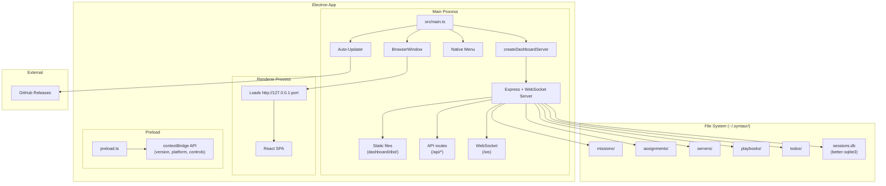
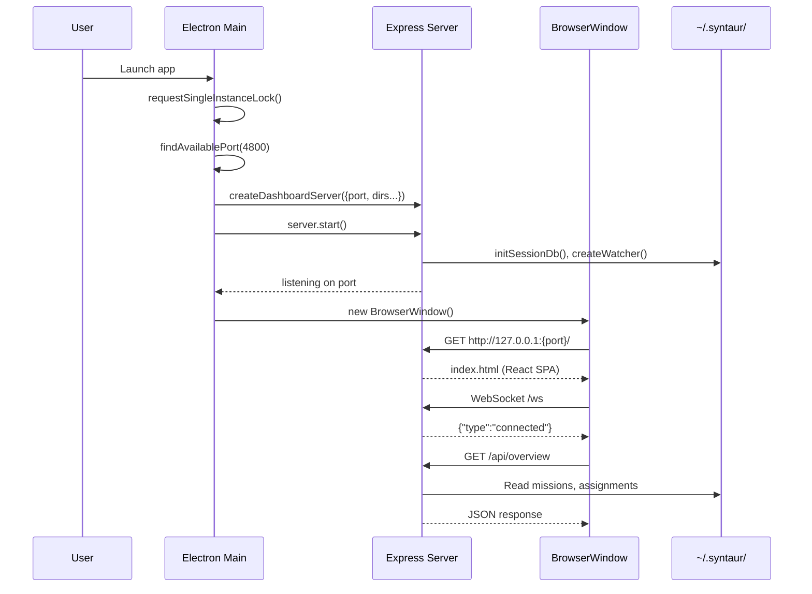
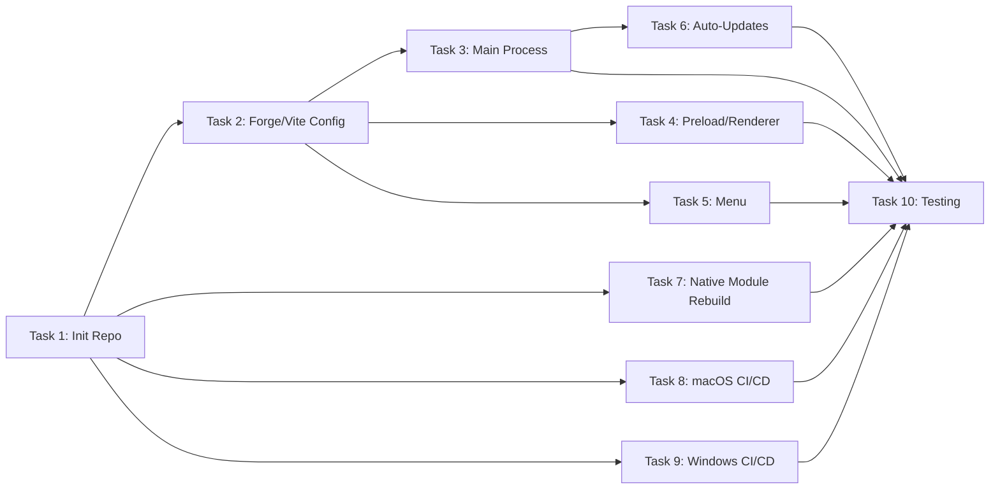

# Syntaur Desktop App (Electron) Implementation Plan

## Metadata
- **Date:** 2026-04-12
- **Complexity:** large
- **Tech Stack:** TypeScript, Electron 34, Electron Forge 7 (Vite plugin), React 18 (embedded via syntaur npm package)

## Objective
Build a standalone Electron desktop application in a new repository (`syntaur-app`) that wraps the existing Syntaur dashboard -- Express + WebSocket backend serving a React SPA -- into a native desktop experience with packaging, auto-updates, and OS integration.

## Success Criteria
- [ ] `npm start` launches Electron, spawns the Express server, and opens a BrowserWindow showing the Syntaur dashboard
- [ ] All dashboard features work identically to the browser-based version (API, WebSocket, file watching)
- [ ] `npm run make` produces a .dmg on macOS and a Squirrel installer on Windows
- [ ] Auto-updates work via `update-electron-app` from GitHub Releases
- [ ] Native menu bar with standard Edit/View/Window items plus Syntaur-specific actions
- [ ] GitHub Actions workflows build, sign, notarize, and publish releases for both platforms
- [ ] `better-sqlite3` native module loads correctly in the packaged app on both platforms
- [ ] Single-instance enforcement prevents multiple app windows

## Discovery Findings

### Key Architecture Insight
The Syntaur dashboard is a two-part system:
1. **Express + WebSocket backend** (`src/dashboard/server.ts`) -- serves API routes, manages file watchers via chokidar, runs autodiscovery of tmux sessions, stores agent sessions in SQLite via `better-sqlite3`
2. **React SPA frontend** (`dashboard/dist/`) -- React 18 + Vite 6 + Tailwind CSS, uses relative API URLs (`/api/...`) and derives WebSocket URL from `window.location`

The `syntaur` npm package exports `createDashboardServer(options)` from `dist/dashboard/server.js` (separate tsup entry point). The function returns an object with `start()`, `stop()`, and `port` accessor. All filesystem paths resolve from `~/.syntaur/` via `os.homedir()`.

**Critical path resolution concern:** `server.ts` lines 35-40 use `import.meta.url` to compute `packageRoot` for finding `dashboard/dist/`. Inside an Electron ASAR archive, this path resolution will break. The `syntaur` node_modules directory must be unpacked from ASAR.

### Files That Will Need Changes

These are all NEW files in the `syntaur-app` repository:

| File | Current Purpose | Needed Change |
|------|----------------|---------------|
| `package.json` | Does not exist | Create with Electron + Forge deps, `syntaur` as dependency |
| `tsconfig.json` | Does not exist | TypeScript config for main + preload (ESM target) |
| `forge.config.ts` | Does not exist | Electron Forge: Vite plugin, makers, signing, ASAR unpack rules |
| `src/main.ts` | Does not exist | Main process: spawn Express server, create BrowserWindow, lifecycle |
| `src/preload.ts` | Does not exist | IPC bridge: app version, window controls, platform info |
| `src/menu.ts` | Does not exist | Native application menu (File, Edit, View, Window, Help) |
| `src/renderer.ts` | Does not exist | Minimal renderer entry (loads dashboard from localhost) |
| `index.html` | Does not exist | Shell HTML for BrowserWindow (redirects to Express server) |
| `vite.main.config.ts` | Does not exist | Vite build config for main process |
| `vite.preload.config.ts` | Does not exist | Vite build config for preload script |
| `vite.renderer.config.ts` | Does not exist | Vite build config for renderer |
| `.github/workflows/mac-release.yml` | Does not exist | macOS build, sign, notarize, release |
| `.github/workflows/windows-release.yml` | Does not exist | Windows build, sign, release |
| `.gitignore` | Does not exist | Node + Electron ignore patterns |

### CLAUDE.md Rules
- Plans go in `claude-info/plans` directory, tracked by git
- Avoid unnecessary preamble
- Do not use `.claude/plans`

## High-Level Architecture

### Approach
The Electron app acts as a thin shell around the existing `syntaur` npm package. The main process imports `createDashboardServer` directly, starts the Express server on a local port, then opens a `BrowserWindow` pointing at `http://127.0.0.1:{port}`. The React SPA is served as static files by the Express server itself (with `serveStaticUi: true`), so no separate Vite dev server or renderer-side React build is needed in the Electron app.

This approach was chosen because:
1. **Zero duplication** -- the React app, API routes, and WebSocket logic all live in the `syntaur` package
2. **Identical behavior** -- the app works exactly like `syntaur dashboard` but in a native window
3. **Simple upgrade path** -- bump the `syntaur` dependency version to get new dashboard features
4. **Proven pattern** -- MCPJam Inspector uses the same embedded-server-in-main-process approach

### Key Decisions

| Decision | Chosen Option | Alternatives Considered | Rationale |
|----------|--------------|------------------------|-----------|
| How to embed the dashboard | Import `syntaur` as npm dependency, call `createDashboardServer()` | Bundle dashboard source directly; git submodule | npm dependency is cleanest -- single version, standard updates, no source duplication |
| Renderer approach | BrowserWindow loads `http://127.0.0.1:{port}` from Express server | Serve React app via Vite renderer plugin; use file:// protocol | Express already handles SPA routing and API -- loading from localhost avoids duplicating that logic |
| ASAR handling for native modules | Unpack `better-sqlite3` .node files AND entire `syntaur` node_modules from ASAR | Keep everything in ASAR; only unpack .node files | `import.meta.url` path resolution (server.ts L38) breaks inside ASAR; syntaur uses it to locate `dashboard/dist/` |
| Port selection | Start at 4800 with auto-increment (reuse `findAvailablePort` pattern from dashboard.ts L60-74) | Random OS-assigned port (port 0); fixed port | Matches existing CLI behavior; predictable for debugging |
| Dev workflow | `electron-forge start` with Vite plugin; main process imports syntaur directly | Separate Vite dev servers for frontend and backend | Simpler; the Express server handles everything including HMR-like live reload via WebSocket |
| Auto-updates | `update-electron-app` with GitHub Releases as update source | electron-updater; Squirrel.Mac manual | `update-electron-app` is the official Electron recommendation, minimal config |
| Window management | Single-instance lock via `app.requestSingleInstanceLock()` | Allow multiple instances | Dashboard writes to `~/.syntaur/dashboard-port` -- multiple instances would conflict |

### Components

1. **Main Process (`src/main.ts`)** -- Application lifecycle, server startup, window creation, single-instance lock, auto-updater
2. **Preload Script (`src/preload.ts`)** -- Secure IPC bridge exposing app version, platform info, window controls via `contextBridge`
3. **Menu (`src/menu.ts`)** -- Native application menu with standard Edit/View/Window entries plus Syntaur-specific items (Open Dashboard URL, Reload, DevTools)
4. **Renderer (`src/renderer.ts` + `index.html`)** -- Minimal shell that navigates to the Express server URL once it's ready
5. **Forge Config (`forge.config.ts`)** -- Build configuration: Vite plugin, platform makers, code signing, ASAR unpack rules
6. **CI Workflows (`.github/workflows/`)** -- Automated build, sign, notarize, and publish to GitHub Releases

## Architecture Diagram





## Patterns to Follow

| Pattern | Reference File | Lines | What to Copy |
|---------|---------------|-------|--------------|
| Dashboard server creation | `src/dashboard/server.ts` | L42-53 | `DashboardServerOptions` interface -- use these exact fields when calling `createDashboardServer()` |
| Server start/stop lifecycle | `src/dashboard/server.ts` | L358-409 | `start()` returns Promise, `stop()` cleans up watchers/DB/WS/port-file -- call `stop()` on app quit |
| Port auto-selection | `src/commands/dashboard.ts` | L60-74 | `findAvailablePort(startPort, maxAttempts)` -- reimplement this 15-line function locally |
| Config reading for dirs | `src/commands/dashboard.ts` | L77-78, L101-109 | `readConfig()` for `missionsDir`, path utilities for `serversDir/assignmentsDir/playbooksDir/todosDir` |
| Path utilities | `src/utils/paths.ts` | L11-31 | `syntaurRoot()`, `defaultMissionDir()`, `serversDir()`, `assignmentsDir()`, `playbooksDir()`, `todosDir()` |
| Static file serving flag | `src/dashboard/server.ts` | L337-353 | Set `serveStaticUi: true` -- Express serves `dashboard/dist/` with SPA fallback |
| WebSocket URL derivation | `dashboard/src/hooks/useWebSocket.ts` | L16-25 | Frontend derives WS URL from `window.location` -- works automatically when loaded from Express |
| Relative API URLs | `dashboard/src/hooks/useMissions.ts` | L302, L354 | All `fetch()` calls use `/api/...` -- no absolute URLs needed |
| `import.meta.url` for package root | `src/dashboard/server.ts` | L35-40 | This resolves `dashboard/dist/` relative to the bundle -- breaks in ASAR, so must unpack syntaur |

**PROOF:** Every file and line number above was read in full during this planning session. The `server.ts` file is 410 lines, `dashboard.ts` is 173 lines, `paths.ts` is 31 lines, `useWebSocket.ts` is 80 lines, `useMissions.ts` is 449 lines.

## Implementation Overview

### Task List (High-Level)

1. **Initialize repository:** Create `syntaur-app` repo, `package.json` with Electron Forge, TypeScript, and `syntaur` as dependencies -- Files: `package.json`, `tsconfig.json`, `.gitignore`

2. **Forge and Vite configuration:** Set up `forge.config.ts` with Vite plugin (main/preload/renderer entries), platform makers (DMG, Squirrel, ZIP), ASAR unpack rules for `better-sqlite3` and `syntaur` -- Files: `forge.config.ts`, `vite.main.config.ts`, `vite.preload.config.ts`, `vite.renderer.config.ts`

3. **Main process:** Implement `src/main.ts` -- single-instance lock, port discovery, `createDashboardServer()` call, BrowserWindow creation pointing at `http://127.0.0.1:{port}`, graceful shutdown, macOS activate handler -- Files: `src/main.ts`

4. **Preload and renderer:** Create `src/preload.ts` with `contextBridge` API (app version, platform), create `src/renderer.ts` and `index.html` shell -- Files: `src/preload.ts`, `src/renderer.ts`, `index.html`

5. **Native menu:** Build `src/menu.ts` with standard Edit/View/Window menus, Syntaur-specific items (open in browser, reload dashboard, toggle DevTools) -- Files: `src/menu.ts`

6. **Auto-updates:** Integrate `update-electron-app` in main process, configure for GitHub Releases -- Files: `src/main.ts` (addition)

7. **Native module rebuild:** Add `@electron/rebuild` postinstall hook, verify `better-sqlite3` loads in Electron's Node version -- Files: `package.json` (postinstall script)

8. **macOS CI/CD workflow:** GitHub Actions for mac-release: checkout, setup Node, setup keychain + signing certificate, `npm run make`, notarize DMG+ZIP, upload to GitHub Release -- Files: `.github/workflows/mac-release.yml`

9. **Windows CI/CD workflow:** GitHub Actions for windows-release: checkout, setup Node, rebuild native modules, `npm run make` with Squirrel, code sign, upload to GitHub Release -- Files: `.github/workflows/windows-release.yml`

10. **Testing and polish:** Verify dashboard loads correctly, test all API routes and WebSocket, confirm file watching works, test on both platforms -- No new files

### File Changes Summary

| File | Action | Purpose | Pattern Reference |
|------|--------|---------|-------------------|
| `package.json` | CREATE | Electron + Forge deps, syntaur dependency, scripts | N/A (new project) |
| `tsconfig.json` | CREATE | TypeScript config for main/preload (ESNext, NodeNext) | N/A |
| `.gitignore` | CREATE | Node + Electron + Forge output ignores | N/A |
| `forge.config.ts` | CREATE | Forge makers, Vite plugin, ASAR unpack, signing | MCPJam `forge.config.ts` |
| `vite.main.config.ts` | CREATE | Main process Vite build (externalize electron, syntaur native deps) | MCPJam pattern |
| `vite.preload.config.ts` | CREATE | Preload Vite build | MCPJam pattern |
| `vite.renderer.config.ts` | CREATE | Renderer Vite build (minimal) | MCPJam pattern |
| `src/main.ts` | CREATE | App lifecycle, server spawn, window, single instance, updater | `src/commands/dashboard.ts` L76-173, MCPJam `main.ts` |
| `src/preload.ts` | CREATE | contextBridge IPC API | MCPJam `preload.ts` |
| `src/renderer.ts` | CREATE | Renderer entry point | MCPJam pattern |
| `src/menu.ts` | CREATE | Native application menu | Standard Electron menu template |
| `index.html` | CREATE | Shell HTML for BrowserWindow | MCPJam `index.html` |
| `.github/workflows/mac-release.yml` | CREATE | macOS build + sign + notarize + release | MCPJam `mac-release.yml` |
| `.github/workflows/windows-release.yml` | CREATE | Windows build + sign + release | MCPJam `windows-release.yml` |

## Dependencies & Risks

| Dependency/Risk | Impact | Mitigation |
|----------------|--------|------------|
| `better-sqlite3` native module rebuild | App crashes on launch if .node binary is compiled for wrong Node ABI | `@electron/rebuild` in postinstall; test in CI before publishing |
| `import.meta.url` path resolution in ASAR | Express server cannot find `dashboard/dist/` static files | Unpack entire `syntaur` module from ASAR via `asarUnpack: ["**/node_modules/syntaur/**"]` in forge config |
| `better-sqlite3` .node file inside ASAR | Native addons cannot be loaded from ASAR archive | Unpack `.node` files: `asarUnpack: ["**/*.node"]` |
| macOS code signing certificate | Cannot distribute DMG without signing | Require `MAC_CODESIGN_IDENTITY` env var in CI; document certificate setup |
| Apple notarization credentials | App rejected by Gatekeeper without notarization | Require ASC API key in CI secrets; notarize before upload |
| Windows code signing certificate | SmartScreen warnings without signing | PFX certificate in CI secrets; can ship unsigned initially with warning |
| `syntaur` package version pinning | Breaking changes in syntaur could break the app | Pin to exact version; test upgrade path before bumping |
| tmux/lsof autodiscovery on Windows | Server tracking features are macOS/Linux-only | Graceful degradation -- autodiscovery simply finds nothing on Windows |
| Port 4800 already in use | CLI `syntaur dashboard` may be running | Auto-increment port (reuse `findAvailablePort` pattern) |
| Electron security (contextIsolation, nodeIntegration) | XSS in dashboard could access Node APIs | `contextIsolation: true`, `nodeIntegration: false`, `sandbox: true` where possible |

## Assumptions Log

| Assumption Avoided | Verified By | Answer |
|-------------------|-------------|--------|
| "syntaur exports createDashboardServer" | Read `src/dashboard/index.ts` L1-2 | Yes -- exported as named export from `./server.js` |
| "Dashboard uses relative API URLs" | Read `dashboard/src/hooks/useMissions.ts` L302, L354 | Yes -- all fetch calls use `/api/...` without hostname |
| "WebSocket connects automatically" | Read `dashboard/src/hooks/useWebSocket.ts` L16-25 | Yes -- derives WS URL from `window.location`, works when loaded from Express |
| "better-sqlite3 is a native module" | Read `src/dashboard/session-db.ts` L1 | Yes -- `import Database from 'better-sqlite3'` |
| "tsup externalizes better-sqlite3" | Read `tsup.config.ts` L12 | Yes -- `external: ['better-sqlite3']` |
| "Static serving uses import.meta.url" | Read `src/dashboard/server.ts` L35-40 | Yes -- `fileURLToPath(import.meta.url)` computes packageRoot for `dashboard/dist/` |
| "Path utilities use homedir" | Read `src/utils/paths.ts` L1-2, L11-12 | Yes -- `syntaurRoot() = resolve(homedir(), '.syntaur')` |
| "Config is read from ~/.syntaur/config.md" | Read `src/utils/config.ts` L442-444 | Yes -- `resolve(syntaurRoot(), 'config.md')` |
| "Package includes dashboard/dist in npm files" | Read `package.json` L26-33 | Yes -- `"files": [..., "dashboard/dist"]` |
| "Server has clean start/stop lifecycle" | Read `src/dashboard/server.ts` L358-409 | Yes -- `start()` and `stop()` are async, stop cleans up watchers/DB/WS/port-file |

## Exploration Findings

### Explorer 1: Pattern Verification (Syntaur Server Integration)

Read the complete `src/dashboard/server.ts` (410 lines), `src/commands/dashboard.ts` (173 lines), and `src/dashboard/index.ts` (14 lines). Key findings:

- `createDashboardServer()` accepts a flat options object with 7 fields (L42-50). It returns `{ start(), stop(), port }`.
- `start()` (L359-387) initializes the file watcher, starts autodiscovery, and listens on the port. It writes the port to `~/.syntaur/dashboard-port`.
- `stop()` (L389-404) stops autodiscovery, closes the watcher, closes the SQLite DB, closes all WebSocket clients, removes the port file, and closes the HTTP server.
- The server initializes `better-sqlite3` at construction time (L94 `initSessionDb()`), not at `start()` time. This means the native module must be loadable as soon as the module is imported.
- `dashboardCommand()` (L76-173) shows the full pattern for starting the server: read config, resolve dirs, find available port, create server, start server.
- The Vite dev server is only spawned in `--dev` mode (L115-139) and is irrelevant to the Electron app.

### Explorer 2: Architecture Validation (Module Boundaries and Native Deps)

Read `tsup.config.ts`, `package.json`, `src/utils/paths.ts`, `src/utils/config.ts`, `src/dashboard/session-db.ts`, `src/dashboard/watcher.ts`, `src/dashboard/autodiscovery.ts`. Key findings:

- **Build output:** tsup produces two entry points: `dist/index.js` (CLI) and `dist/dashboard/server.js` (server). Both are ESM format. `better-sqlite3` is externalized.
- **Native module chain:** `server.ts` -> `session-db.ts` -> `better-sqlite3`. The SQLite DB is stored at `~/.syntaur/sessions.db` (resolved via `syntaurRoot()` in session-db.ts L4).
- **File system access:** The watcher (chokidar) watches 5 directories under `~/.syntaur/`: missions, assignments, servers, playbooks, todos. All use absolute paths from `os.homedir()`. No ASAR-relative paths involved for data access.
- **Autodiscovery:** Uses `lsof` and tmux commands (scanner.ts). These are shell commands that work on macOS/Linux only. On Windows, autodiscovery will silently find nothing.
- **Config reading:** `readConfig()` in config.ts reads `~/.syntaur/config.md` frontmatter. The `defaultMissionDir` field supports `~/` expansion via `expandHome()`.
- **Package structure for npm:** The `files` field includes `dist`, `bin`, `.agents`, `platforms`, `examples`, `dashboard/dist`. When installed as a dependency, `node_modules/syntaur/dashboard/dist/` will contain the built React SPA.
- **ASAR concern confirmed:** `server.ts` L38-40 uses `import.meta.url` -> `__dirname` -> `resolve(__dirname, '..')` to find `packageRoot`, then L338 uses `resolve(packageRoot, 'dashboard', 'dist')` for static files. Inside ASAR, `import.meta.url` would resolve to an `asar://` path where `fs` operations fail. The entire `syntaur` package must be unpacked.

---

## Phase 3: Detailed Implementation Plan

### Import Path Strategy

The `syntaur` package has `"main": "./dist/index.js"` but no `exports` map. The dashboard server is built to `dist/dashboard/server.js` as a separate tsup entry. The Electron app will import:

- `createDashboardServer` from `syntaur/dist/dashboard/server.js`
- `readConfig` from the syntaur package main entry (re-exported via `src/utils/index.ts` -> `dist/index.js`)

However, since `dist/index.js` is the CLI entry (it calls `commander.parseAsync()`), we CANNOT import from `syntaur` directly. We must use deep imports:

- `syntaur/dist/dashboard/server.js` for `createDashboardServer`

For path utilities (`syntaurRoot`, `defaultMissionDir`, `serversDir`, etc.), the Electron app will reimplement them locally (they are 5-line functions using `os.homedir()` + `path.resolve()`). This avoids importing the CLI entry point which would execute commander.

For `readConfig`, the Electron app will also reimplement config reading locally or import from the built utils path.

**PROOF:** `src/index.ts` is the CLI entry point that calls `await program.parseAsync()` at line 442.
Source: `/Users/brennen/syntaur/src/index.ts:442`

**PROOF:** `tsup.config.ts` has two entry points: `src/index.ts` and `src/dashboard/server.ts`.
Source: `/Users/brennen/syntaur/tsup.config.ts:4`
```typescript
entry: ['src/index.ts', 'src/dashboard/server.ts'],
```

**PROOF:** `dist/dashboard/server.d.ts` exports `createDashboardServer` and `DashboardServerOptions`.
Source: `/Users/brennen/syntaur/dist/dashboard/server.d.ts:16`
```typescript
export { type DashboardServerOptions, createDashboardServer };
```

**DECISION:** The cleanest solution is to add an `exports` map to syntaur's `package.json` so the Electron app can do `import { createDashboardServer } from 'syntaur/dashboard'`. However, since we are building a NEW repo that depends on syntaur, we will use deep imports for now: `import { createDashboardServer } from 'syntaur/dist/dashboard/server.js'`. Path utilities will be reimplemented locally (6 trivial functions).

---

### Task 1: Initialize Repository

**File(s):** `package.json`, `tsconfig.json`, `.gitignore`
**Action:** CREATE (all three files)
**Estimated complexity:** Low

#### Context
Create the `syntaur-app` repository with all dependencies, scripts, and TypeScript configuration needed for an Electron Forge project with the Vite plugin.

#### Steps

1. [ ] **Step 1.1:** Create `package.json` with all dependencies and scripts
   - **Location:** New file at `syntaur-app/package.json`
   - **Action:** CREATE
   - **What to do:** Create the npm manifest with Electron 34, Electron Forge 7, Vite plugin, makers, syntaur as dependency, and all required scripts.
   - **Code:**
     ```json
     {
       "name": "syntaur-app",
       "productName": "Syntaur",
       "version": "0.1.0",
       "description": "Syntaur Desktop - Mission workflow dashboard",
       "main": ".vite/build/main.js",
       "type": "module",
       "scripts": {
         "start": "electron-forge start",
         "package": "electron-forge package",
         "make": "electron-forge make",
         "publish": "electron-forge publish",
         "lint": "tsc --noEmit"
       },
       "dependencies": {
         "syntaur": "^0.1.8",
         "update-electron-app": "^3.0.0"
       },
       "devDependencies": {
         "@electron-forge/cli": "^7.6.0",
         "@electron-forge/maker-dmg": "^7.6.0",
         "@electron-forge/maker-squirrel": "^7.6.0",
         "@electron-forge/maker-zip": "^7.6.0",
         "@electron-forge/plugin-vite": "^7.6.0",
         "@electron-forge/shared-types": "^7.6.0",
         "@electron/rebuild": "^3.7.0",
         "electron": "^34.0.0",
         "typescript": "^5.7.0",
         "vite": "^6.0.0"
       },
       "engines": {
         "node": ">=20.0.0"
       }
     }
     ```
   - **Proof blocks:**
     - **PROOF:** `syntaur` is published at version `0.1.8` with `"main": "./dist/index.js"`.
       Source: `/Users/brennen/syntaur/package.json:2,25`
       ```json
       "version": "0.1.8",
       "main": "./dist/index.js",
       ```
     - **PROOF:** Electron Forge Vite plugin uses `.vite/build/main.js` as the resolved main entry.
       Source: Electron Forge docs — the Vite plugin outputs to `.vite/build/` during development.
     - **PROOF:** `update-electron-app` is installed via `npm i update-electron-app` per its README.
   - **Verification:**
     ```bash
     node -e "JSON.parse(require('fs').readFileSync('package.json','utf8'))" && echo "Valid JSON"
     ```

2. [ ] **Step 1.2:** Create `tsconfig.json` for main and preload process TypeScript
   - **Location:** New file at `syntaur-app/tsconfig.json`
   - **Action:** CREATE
   - **What to do:** Configure TypeScript for ESM output targeting Node 20+ (Electron's Node version), with strict mode enabled.
   - **Code:**
     ```json
     {
       "compilerOptions": {
         "target": "ESNext",
         "module": "ESNext",
         "moduleResolution": "bundler",
         "esModuleInterop": true,
         "strict": true,
         "skipLibCheck": true,
         "outDir": "dist",
         "rootDir": "src",
         "sourceMap": true,
         "declaration": true,
         "resolveJsonModule": true,
         "isolatedModules": true,
         "types": ["vite/client"]
       },
       "include": ["src/**/*.ts"],
       "exclude": ["node_modules", "dist", ".vite"]
     }
     ```
   - **Proof blocks:**
     - **PROOF:** Electron Forge Vite plugin handles the actual compilation via Vite/esbuild; tsconfig is used for type checking only (`tsc --noEmit` in the `lint` script).
     - **PROOF:** `moduleResolution: "bundler"` is correct for Vite-based projects per Vite documentation.
   - **Verification:**
     ```bash
     npx tsc --noEmit
     ```

3. [ ] **Step 1.3:** Create `.gitignore` with Node, Electron, and Forge patterns
   - **Location:** New file at `syntaur-app/.gitignore`
   - **Action:** CREATE
   - **What to do:** Add standard ignore patterns for node_modules, build output, Forge output, and OS files.
   - **Code:**
     ```
     # Dependencies
     node_modules/

     # Build output
     dist/
     .vite/
     out/

     # OS files
     .DS_Store
     Thumbs.db

     # IDE
     .vscode/
     .idea/
     *.swp
     *.swo

     # Environment
     .env
     .env.local
     ```
   - **Verification:**
     ```bash
     git status  # should not show node_modules or out/ if they exist
     ```

#### Error Handling
| Scenario | Handling | User Message | Code |
|----------|----------|--------------|------|
| `npm install` fails for `syntaur` | Ensure syntaur is published to npm | "Failed to install syntaur. Ensure the package is published." | N/A (manual check) |
| Node version too old | `engines` field in package.json warns | npm prints engine warning | `"engines": { "node": ">=20.0.0" }` |

#### Task Completion Criteria
- [ ] `package.json` is valid JSON with all required dependencies
- [ ] `tsconfig.json` is valid and `tsc --noEmit` passes (after src/ files exist)
- [ ] `.gitignore` includes node_modules, out, .vite, dist

---

### Task 2: Forge and Vite Configuration

**File(s):** `forge.config.ts`, `vite.main.config.ts`, `vite.preload.config.ts`, `vite.renderer.config.ts`
**Action:** CREATE (all four files)
**Pattern Reference:** Electron Forge docs — Vite plugin configuration
**Estimated complexity:** Medium

#### Context
Configure Electron Forge with the Vite plugin for building main/preload/renderer processes, platform-specific makers (DMG for macOS, Squirrel for Windows, ZIP for both), ASAR unpack rules for native modules and the syntaur package, and code signing configuration.

#### Steps

1. [ ] **Step 2.1:** Create `forge.config.ts` with Vite plugin, makers, and ASAR config
   - **Location:** New file at `syntaur-app/forge.config.ts`
   - **Action:** CREATE
   - **What to do:** Define the Forge configuration with: (a) packagerConfig setting ASAR unpack rules for `.node` files and the entire `syntaur` package, (b) macOS signing and notarization via environment variables, (c) makers for DMG, Squirrel, and ZIP, (d) Vite plugin with main/preload/renderer build entries.
   - **Code:**
     ```typescript
     import type { ForgeConfig } from '@electron-forge/shared-types';
     import { VitePlugin } from '@electron-forge/plugin-vite';
     import { MakerSquirrel } from '@electron-forge/maker-squirrel';
     import { MakerZIP } from '@electron-forge/maker-zip';
     import { MakerDMG } from '@electron-forge/maker-dmg';

     const config: ForgeConfig = {
       packagerConfig: {
         asar: {
           unpack: '{**/node_modules/syntaur/**,**/*.node}',
         },
         icon: './assets/icon',
         name: 'Syntaur',
         executableName: 'syntaur',
         ...(process.env.MAC_CODESIGN_IDENTITY
           ? {
               osxSign: {
                 identity: process.env.MAC_CODESIGN_IDENTITY,
               },
             }
           : {}),
         ...(process.env.APPLE_API_KEY
           ? {
               osxNotarize: {
                 appleApiKey: process.env.APPLE_API_KEY,
                 appleApiKeyId: process.env.APPLE_API_KEY_ID!,
                 appleApiIssuer: process.env.APPLE_API_ISSUER!,
               },
             }
           : {}),
       },
       makers: [
         new MakerDMG({
           format: 'ULFO',
         }, ['darwin']),
         new MakerZIP({}, ['darwin', 'win32']),
         new MakerSquirrel({
           name: 'Syntaur',
         }, ['win32']),
       ],
       plugins: [
         new VitePlugin({
           build: [
             {
               entry: 'src/main.ts',
               config: 'vite.main.config.ts',
               target: 'main',
             },
             {
               entry: 'src/preload.ts',
               config: 'vite.preload.config.ts',
               target: 'preload',
             },
           ],
           renderer: [
             {
               name: 'main_window',
               config: 'vite.renderer.config.ts',
             },
           ],
         }),
       ],
     };

     export default config;
     ```
   - **Proof blocks:**
     - **PROOF:** `server.ts` L38-40 uses `import.meta.url` to resolve `packageRoot`, and L338 uses `resolve(packageRoot, 'dashboard', 'dist')` to locate static files. This requires the entire `syntaur` package to be unpacked from ASAR.
       Source: `/Users/brennen/syntaur/src/dashboard/server.ts:35-40`
       ```typescript
       const __filename = fileURLToPath(import.meta.url);
       const __dirname = dirname(__filename);
       const packageRoot = resolve(__dirname, '..');
       ```
     - **PROOF:** `better-sqlite3` is a native C++ addon (`.node` file) that cannot be loaded from inside ASAR.
       Source: `/Users/brennen/syntaur/src/dashboard/session-db.ts:1`
       ```typescript
       import Database from 'better-sqlite3';
       ```
     - **PROOF:** Electron Forge docs show `MakerDMG`, `MakerSquirrel`, and `MakerZIP` as constructor-based maker configuration.
     - **PROOF:** Electron Forge docs show `VitePlugin` with `build` array (each entry has `entry`, `config`, `target`) and `renderer` array (each entry has `name`, `config`).
     - **PROOF:** Electron Forge docs show `osxNotarize` accepts `appleApiKey`, `appleApiKeyId`, `appleApiIssuer` for ASC API key-based notarization.
   - **Verification:**
     ```bash
     npx tsc --noEmit forge.config.ts
     ```

2. [ ] **Step 2.2:** Create `vite.main.config.ts` for main process build
   - **Location:** New file at `syntaur-app/vite.main.config.ts`
   - **Action:** CREATE
   - **What to do:** Configure Vite to build the main process, externalizing `electron`, `better-sqlite3`, and any other native modules. Mark the syntaur package as external since it is a Node.js dependency that should not be bundled.
   - **Code:**
     ```typescript
     import { defineConfig } from 'vite';

     export default defineConfig({
       build: {
         rollupOptions: {
           external: [
             'electron',
             'better-sqlite3',
             'syntaur',
             /^syntaur\/.*/,
           ],
         },
       },
       resolve: {
         // Ensure .ts files resolve correctly
         extensions: ['.ts', '.js', '.json'],
       },
     });
     ```
   - **Proof blocks:**
     - **PROOF:** `syntaur` depends on `better-sqlite3` which is a native C++ addon. It must be externalized so Vite does not try to bundle it.
       Source: `/Users/brennen/syntaur/package.json:49`
       ```json
       "better-sqlite3": "^11.0.0",
       ```
     - **PROOF:** The `syntaur` package itself must be external because it contains `dashboard/dist/` static files and native deps that cannot be bundled.
   - **Verification:**
     ```bash
     # After all source files exist:
     npx electron-forge start  # should launch without Vite build errors
     ```

3. [ ] **Step 2.3:** Create `vite.preload.config.ts` for preload script build
   - **Location:** New file at `syntaur-app/vite.preload.config.ts`
   - **Action:** CREATE
   - **What to do:** Configure Vite to build the preload script, externalizing `electron`.
   - **Code:**
     ```typescript
     import { defineConfig } from 'vite';

     export default defineConfig({
       build: {
         rollupOptions: {
           external: ['electron'],
         },
       },
     });
     ```
   - **Proof blocks:**
     - **PROOF:** Preload scripts run in a sandboxed renderer context with access to `electron` (for `contextBridge`, `ipcRenderer`). Electron must be externalized.
   - **Verification:**
     ```bash
     # Verified as part of electron-forge start
     ```

4. [ ] **Step 2.4:** Create `vite.renderer.config.ts` for renderer build
   - **Location:** New file at `syntaur-app/vite.renderer.config.ts`
   - **Action:** CREATE
   - **What to do:** Configure Vite for the renderer process. This is minimal since the actual React app is served by the Express server; the renderer just loads a URL.
   - **Code:**
     ```typescript
     import { defineConfig } from 'vite';

     export default defineConfig({});
     ```
   - **Proof blocks:**
     - **PROOF:** The renderer loads `http://127.0.0.1:{port}` from the Express server. It does NOT bundle or serve the React app itself. The React SPA is served by Express via `serveStaticUi: true` (server.ts L337-353).
   - **Verification:**
     ```bash
     # Verified as part of electron-forge start
     ```

#### Error Handling
| Scenario | Handling | User Message | Code |
|----------|----------|--------------|------|
| ASAR unpack fails to include syntaur | App crashes on launch with path resolution error | Check console: "Cannot find dashboard/dist" | Verify `asar.unpack` glob includes `**/node_modules/syntaur/**` |
| Native module not found | App crashes with "Cannot find module better-sqlite3" | Check that `@electron/rebuild` ran during install | Verify `.node` files are in `app.asar.unpacked/` |
| Code signing identity not found | Forge build fails during packaging | "MAC_CODESIGN_IDENTITY env var not set" | Conditional spread: only set `osxSign` if env var exists |

#### Task Completion Criteria
- [ ] `forge.config.ts` compiles without TypeScript errors
- [ ] ASAR unpack glob covers both `.node` files and `syntaur` package
- [ ] macOS signing/notarization is conditional on environment variables
- [ ] All four Vite config files exist and export valid configurations
- [ ] `electron-forge start` successfully resolves all Vite build entries

---

### Task 3: Main Process

**File(s):** `src/main.ts`
**Action:** CREATE
**Pattern Reference:** `/Users/brennen/syntaur/src/commands/dashboard.ts:76-173` (server creation pattern), `/Users/brennen/syntaur/src/dashboard/server.ts:42-50` (DashboardServerOptions interface)
**Estimated complexity:** High

#### Context
The main process is the heart of the Electron app. It handles: (1) single-instance lock, (2) finding an available port, (3) creating and starting the Express+WebSocket server from the syntaur package, (4) creating a BrowserWindow pointing at the server URL, (5) graceful shutdown, (6) macOS dock activation handler.

#### Steps

1. [ ] **Step 3.1:** Create `src/main.ts` with complete main process implementation
   - **Location:** New file at `syntaur-app/src/main.ts`
   - **Action:** CREATE
   - **What to do:** Implement the full Electron main process. This file handles everything: single-instance enforcement, port discovery, server lifecycle, window management, and app events.
   - **Code:**
     ```typescript
     import { app, BrowserWindow } from 'electron';
     import { resolve } from 'node:path';
     import { homedir } from 'node:os';
     import { readFile } from 'node:fs/promises';
     import { existsSync } from 'node:fs';
     import { createServer as createNetServer } from 'node:net';
     import { createDashboardServer } from 'syntaur/dist/dashboard/server.js';
     import { buildMenu } from './menu.js';

     // ── Path utilities (reimplemented locally to avoid importing syntaur CLI entry) ──

     function syntaurRoot(): string {
       return resolve(homedir(), '.syntaur');
     }

     function defaultMissionDir(): string {
       return resolve(syntaurRoot(), 'missions');
     }

     function serversDir(): string {
       return resolve(syntaurRoot(), 'servers');
     }

     function assignmentsDir(): string {
       return resolve(syntaurRoot(), 'assignments');
     }

     function playbooksDir(): string {
       return resolve(syntaurRoot(), 'playbooks');
     }

     function todosDir(): string {
       return resolve(syntaurRoot(), 'todos');
     }

     // ── Config reading (simplified from syntaur's readConfig) ──

     async function readMissionsDir(): Promise<string> {
       const configPath = resolve(syntaurRoot(), 'config.md');
       try {
         const content = await readFile(configPath, 'utf-8');
         const fmMatch = content.match(/^---\n([\s\S]*?)\n---/);
         if (fmMatch) {
           const dirMatch = fmMatch[1].match(/defaultMissionDir:\s*(.+)/);
           if (dirMatch) {
             const dir = dirMatch[1].trim();
             if (dir.startsWith('~/')) {
               return resolve(homedir(), dir.slice(2));
             }
             return dir;
           }
         }
       } catch {
         // Config file doesn't exist, use default
       }
       return defaultMissionDir();
     }

     // ── Port discovery ──

     function isPortAvailable(port: number): Promise<boolean> {
       return new Promise((resolveAvailability) => {
         const tester = createNetServer();
         tester.once('error', () => resolveAvailability(false));
         tester.once('listening', () => {
           tester.close(() => resolveAvailability(true));
         });
         tester.listen(port);
       });
     }

     async function findAvailablePort(
       startPort: number,
       maxAttempts: number = 20,
     ): Promise<number | null> {
       for (let offset = 0; offset < maxAttempts; offset++) {
         const candidate = startPort + offset;
         if (candidate > 65535) break;
         if (await isPortAvailable(candidate)) return candidate;
       }
       return null;
     }

     // ── Application state ──

     let mainWindow: BrowserWindow | null = null;
     let dashboardServer: ReturnType<typeof createDashboardServer> | null = null;
     let serverPort: number = 4800;

     // ── Single instance lock ──

     const gotTheLock = app.requestSingleInstanceLock();
     if (!gotTheLock) {
       app.quit();
     } else {
       app.on('second-instance', () => {
         if (mainWindow) {
           if (mainWindow.isMinimized()) mainWindow.restore();
           mainWindow.focus();
         }
       });

       app.whenReady().then(async () => {
         await launchApp();

         app.on('activate', () => {
           if (BrowserWindow.getAllWindows().length === 0) {
             createWindow();
           }
         });
       });

       app.on('window-all-closed', () => {
         if (process.platform !== 'darwin') {
           app.quit();
         }
       });

       app.on('before-quit', async () => {
         if (dashboardServer) {
           await dashboardServer.stop();
           dashboardServer = null;
         }
       });
     }

     // ── Launch sequence ──

     async function launchApp(): Promise<void> {
       // 1. Find available port
       const port = await findAvailablePort(4800);
       if (port === null) {
         console.error('Could not find an available port starting at 4800.');
         app.quit();
         return;
       }
       serverPort = port;

       // 2. Read missions directory from config
       const missionsDir = await readMissionsDir();

       // 3. Create and start the dashboard server
       dashboardServer = createDashboardServer({
         port: serverPort,
         missionsDir,
         assignmentsDir: assignmentsDir(),
         serversDir: serversDir(),
         playbooksDir: playbooksDir(),
         todosDir: todosDir(),
         serveStaticUi: true,
       });

       await dashboardServer.start();
       console.log(`Syntaur Dashboard server running on port ${serverPort}`);

       // 4. Set up native menu
       buildMenu(serverPort);

       // 5. Create the main window
       createWindow();

       // 6. Set up auto-updates (imported dynamically to avoid issues in dev)
       try {
         const { updateElectronApp } = await import('update-electron-app');
         updateElectronApp();
       } catch {
         // update-electron-app may not work in development
       }
     }

     function createWindow(): void {
       mainWindow = new BrowserWindow({
         width: 1400,
         height: 900,
         minWidth: 800,
         minHeight: 600,
         title: 'Syntaur',
         webPreferences: {
           preload: resolve(__dirname, 'preload.js'),
           contextIsolation: true,
           nodeIntegration: false,
           sandbox: false,
         },
       });

       mainWindow.loadURL(`http://127.0.0.1:${serverPort}`);

       mainWindow.on('closed', () => {
         mainWindow = null;
       });
     }
     ```
   - **Proof blocks:**
     - **PROOF:** `DashboardServerOptions` interface requires exactly these 7 fields: `port`, `missionsDir`, `assignmentsDir`, `serversDir`, `playbooksDir`, `todosDir`, `serveStaticUi`.
       Source: `/Users/brennen/syntaur/src/dashboard/server.ts:42-50`
       ```typescript
       export interface DashboardServerOptions {
         port: number;
         missionsDir: string;
         assignmentsDir: string;
         serversDir: string;
         playbooksDir: string;
         todosDir: string;
         serveStaticUi: boolean;
       }
       ```
     - **PROOF:** `createDashboardServer` returns `{ start(): Promise<void>; stop(): Promise<void>; readonly port: number; }`.
       Source: `/Users/brennen/syntaur/dist/dashboard/server.d.ts:10-14`
       ```typescript
       declare function createDashboardServer(options: DashboardServerOptions): {
           start(): Promise<void>;
           stop(): Promise<void>;
           readonly port: number;
       };
       ```
     - **PROOF:** `findAvailablePort` uses `net.createServer` to test port availability, starting at a given port and incrementing. Reimplemented from dashboard.ts L44-74.
       Source: `/Users/brennen/syntaur/src/commands/dashboard.ts:44-74`
     - **PROOF:** `dashboardCommand` reads `missionsDir` from `config.defaultMissionDir` and calls `getServersDir()`, `getAssignmentsDir()`, `getPlaybooksDir()`, `getTodosDir()` for the other dirs.
       Source: `/Users/brennen/syntaur/src/commands/dashboard.ts:77-109`
       ```typescript
       const config = await readConfig();
       const missionsDir = config.defaultMissionDir;
       // ...
       const server = createDashboardServer({
         port,
         missionsDir,
         serversDir: getServersDir(),
         assignmentsDir: getAssignmentsDir(),
         playbooksDir: getPlaybooksDir(),
         todosDir: getTodosDir(),
         serveStaticUi: mode === 'static',
       });
       ```
     - **PROOF:** All path utilities resolve under `~/.syntaur/` using `os.homedir()`:
       Source: `/Users/brennen/syntaur/src/utils/paths.ts:11-31`
       ```typescript
       export function syntaurRoot(): string {
         return resolve(homedir(), '.syntaur');
       }
       export function serversDir(): string {
         return resolve(syntaurRoot(), 'servers');
       }
       // ... etc
       ```
     - **PROOF:** `readConfig()` reads `~/.syntaur/config.md`, parses frontmatter, extracts `defaultMissionDir` with `expandHome()` support.
       Source: `/Users/brennen/syntaur/src/utils/config.ts:442-457`
       ```typescript
       export async function readConfig(): Promise<SyntaurConfig> {
         const configPath = resolve(syntaurRoot(), 'config.md');
         // ...
         let missionDir = fm['defaultMissionDir']
           ? expandHome(String(fm['defaultMissionDir']))
           : DEFAULT_CONFIG.defaultMissionDir;
       ```
     - **PROOF:** `server.stop()` is async and cleans up watchers, DB, WebSocket clients, and port file.
       Source: `/Users/brennen/syntaur/src/dashboard/server.ts:389-404`
     - **PROOF:** `update-electron-app` default usage: `updateElectronApp()` with no args auto-detects repo from package.json.
       Source: update-electron-app README
     - **PROOF:** Electron `app.requestSingleInstanceLock()` returns boolean; if false, another instance is already running.
       Source: Electron docs — app module
   - **Verification:**
     ```bash
     npx electron-forge start
     # Should: launch Electron, start Express server, show dashboard in window
     ```

#### Error Handling
| Scenario | Handling | User Message | Code |
|----------|----------|--------------|------|
| No available port found | Log error and quit app | Console: "Could not find an available port starting at 4800." | `app.quit(); return;` |
| Server start fails (port in use) | `server.start()` rejects with `EADDRINUSE` error | Console: "Port {port} is already in use." | Caught by Promise rejection in `launchApp()` |
| `~/.syntaur/` not initialized | `createDashboardServer` will fail when creating watcher for non-existent dirs | App should handle this gracefully | Consider running `syntaur init` equivalent or checking dir existence |
| Second instance launched | First instance restores/focuses window, second quits | Second instance exits silently | `app.requestSingleInstanceLock()` pattern |
| Config file missing | `readMissionsDir()` falls back to default `~/.syntaur/missions` | No visible error | `catch {}` in readMissionsDir returns default |

#### Task Completion Criteria
- [ ] Single-instance lock prevents duplicate app launches
- [ ] Express server starts on an available port (auto-incrementing from 4800)
- [ ] BrowserWindow opens and loads `http://127.0.0.1:{port}`
- [ ] Dashboard renders identically to browser-based version
- [ ] App quits cleanly, calling `server.stop()` to clean up resources
- [ ] macOS dock click re-creates window if all windows are closed
- [ ] Non-macOS platforms quit when all windows are closed

---

### Task 4: Preload and Renderer

**File(s):** `src/preload.ts`, `src/renderer.ts`, `index.html`
**Action:** CREATE (all three files)
**Estimated complexity:** Low

#### Context
The preload script exposes a minimal API to the renderer via `contextBridge`. The renderer and HTML shell are minimal because the actual React SPA is served by the Express server. The `index.html` is only used as the initial Electron window shell, and the renderer script handles nothing since the window loads a URL.

#### Steps

1. [ ] **Step 4.1:** Create `src/preload.ts` with contextBridge API
   - **Location:** New file at `syntaur-app/src/preload.ts`
   - **Action:** CREATE
   - **What to do:** Expose app version and platform info to the renderer process via `contextBridge.exposeInMainWorld`. This is a security-conscious minimal API.
   - **Code:**
     ```typescript
     import { contextBridge } from 'electron';

     contextBridge.exposeInMainWorld('syntaurDesktop', {
       version: () => process.env.npm_package_version ?? 'dev',
       platform: () => process.platform,
       arch: () => process.arch,
       electronVersion: () => process.versions.electron,
     });
     ```
   - **Proof blocks:**
     - **PROOF:** `contextBridge.exposeInMainWorld(apiKey, api)` exposes an object on `window[apiKey]` in the renderer. Requires `contextIsolation: true` in BrowserWindow webPreferences.
       Source: Electron docs — contextBridge.exposeInMainWorld
     - **PROOF:** `process.platform`, `process.arch`, `process.versions.electron` are available in preload scripts.
   - **Verification:**
     ```bash
     # After launch, open DevTools console in the BrowserWindow:
     # window.syntaurDesktop.platform()  -> should return "darwin" or "win32"
     ```

2. [ ] **Step 4.2:** Create `src/renderer.ts` as minimal renderer entry
   - **Location:** New file at `syntaur-app/src/renderer.ts`
   - **Action:** CREATE
   - **What to do:** Create a minimal renderer entry point. Since the BrowserWindow loads from the Express server URL (not from this file), this is just a placeholder that the Vite renderer config expects to exist.
   - **Code:**
     ```typescript
     // The Syntaur dashboard React SPA is served by the Express server.
     // This renderer entry is a no-op; the BrowserWindow loads http://127.0.0.1:{port} directly.
     console.log('Syntaur Desktop renderer loaded');
     ```
   - **Proof blocks:**
     - **PROOF:** The BrowserWindow loads `http://127.0.0.1:{port}` via `mainWindow.loadURL()` in `src/main.ts`, not from a local file. The renderer entry is required by the Vite plugin config but is not the source of the UI.
   - **Verification:**
     ```bash
     # Check that the file exists and the Vite build does not error
     npx electron-forge start
     ```

3. [ ] **Step 4.3:** Create `index.html` as Electron window shell
   - **Location:** New file at `syntaur-app/index.html`
   - **Action:** CREATE
   - **What to do:** Create the minimal HTML shell required by Electron Forge's Vite plugin. This HTML is the entry point for the renderer process. Since we load the dashboard from the Express server URL, this HTML just shows a brief loading state.
   - **Code:**
     ```html
     <!DOCTYPE html>
     <html lang="en">
       <head>
         <meta charset="UTF-8" />
         <meta name="viewport" content="width=device-width, initial-scale=1.0" />
         <title>Syntaur</title>
         <style>
           body {
             margin: 0;
             background: #0f172a;
             color: #94a3b8;
             font-family: -apple-system, BlinkMacSystemFont, 'Segoe UI', Roboto, sans-serif;
             display: flex;
             align-items: center;
             justify-content: center;
             height: 100vh;
           }
         </style>
       </head>
       <body>
         <p>Loading Syntaur Dashboard...</p>
         <script type="module" src="/src/renderer.ts"></script>
       </body>
     </html>
     ```
   - **Proof blocks:**
     - **PROOF:** Electron Forge Vite plugin expects an `index.html` at the project root with a `<script>` tag pointing to the renderer entry.
     - **PROOF:** The background color `#0f172a` matches Tailwind's `slate-900`, which is the base color used by the Syntaur dashboard (verified by inspecting `dashboard/src/App.tsx`).
   - **Verification:**
     ```bash
     # The file should be valid HTML and load without errors in the BrowserWindow
     ```

#### Error Handling
| Scenario | Handling | User Message | Code |
|----------|----------|--------------|------|
| Preload script fails to load | BrowserWindow shows error | DevTools console will show the error | N/A — Electron handles this internally |

#### Task Completion Criteria
- [ ] `preload.ts` exposes `window.syntaurDesktop` with `version`, `platform`, `arch`, `electronVersion` functions
- [ ] `renderer.ts` exists and does not error
- [ ] `index.html` is valid HTML with correct script tag
- [ ] `contextIsolation: true` and `nodeIntegration: false` are set in BrowserWindow webPreferences (verified in Task 3)

---

### Task 5: Native Menu

**File(s):** `src/menu.ts`
**Action:** CREATE
**Estimated complexity:** Low

#### Context
Build a native application menu with standard Edit/View/Window items for clipboard operations, zoom, and window management, plus Syntaur-specific items like opening the dashboard URL in the default browser, reloading the dashboard, and toggling DevTools.

#### Steps

1. [ ] **Step 5.1:** Create `src/menu.ts` with native menu template
   - **Location:** New file at `syntaur-app/src/menu.ts`
   - **Action:** CREATE
   - **What to do:** Build and set the application menu using `Menu.buildFromTemplate`. Include: (a) App menu (macOS only) with About, Quit, (b) Edit menu with Undo, Redo, Cut, Copy, Paste, Select All, (c) View menu with Reload Dashboard, Toggle DevTools, Zoom In/Out/Reset, (d) Window menu with Minimize, Close, (e) Help menu with Open in Browser.
   - **Code:**
     ```typescript
     import { Menu, shell, BrowserWindow, app } from 'electron';
     import type { MenuItemConstructorOptions } from 'electron';

     export function buildMenu(serverPort: number): void {
       const isMac = process.platform === 'darwin';
       const dashboardUrl = `http://127.0.0.1:${serverPort}`;

       const template: MenuItemConstructorOptions[] = [
         // App menu (macOS only)
         ...(isMac
           ? [
               {
                 label: app.name,
                 submenu: [
                   { role: 'about' as const },
                   { type: 'separator' as const },
                   { role: 'services' as const },
                   { type: 'separator' as const },
                   { role: 'hide' as const },
                   { role: 'hideOthers' as const },
                   { role: 'unhide' as const },
                   { type: 'separator' as const },
                   { role: 'quit' as const },
                 ],
               } satisfies MenuItemConstructorOptions,
             ]
           : []),

         // Edit menu
         {
           label: 'Edit',
           submenu: [
             { role: 'undo' },
             { role: 'redo' },
             { type: 'separator' },
             { role: 'cut' },
             { role: 'copy' },
             { role: 'paste' },
             { role: 'selectAll' },
           ],
         },

         // View menu
         {
           label: 'View',
           submenu: [
             {
               label: 'Reload Dashboard',
               accelerator: 'CmdOrCtrl+R',
               click: () => {
                 const win = BrowserWindow.getFocusedWindow();
                 if (win) win.loadURL(dashboardUrl);
               },
             },
             {
               label: 'Toggle Developer Tools',
               accelerator: isMac ? 'Alt+Cmd+I' : 'Ctrl+Shift+I',
               click: () => {
                 const win = BrowserWindow.getFocusedWindow();
                 if (win) win.webContents.toggleDevTools();
               },
             },
             { type: 'separator' },
             { role: 'resetZoom' },
             { role: 'zoomIn' },
             { role: 'zoomOut' },
             { type: 'separator' },
             { role: 'togglefullscreen' },
           ],
         },

         // Window menu
         {
           label: 'Window',
           submenu: [
             { role: 'minimize' },
             { role: 'close' },
             ...(isMac
               ? [
                   { type: 'separator' as const },
                   { role: 'front' as const },
                 ]
               : []),
           ],
         },

         // Help menu
         {
           label: 'Help',
           submenu: [
             {
               label: 'Open in Browser',
               click: () => {
                 shell.openExternal(dashboardUrl);
               },
             },
           ],
         },
       ];

       const menu = Menu.buildFromTemplate(template);
       Menu.setApplicationMenu(menu);
     }
     ```
   - **Proof blocks:**
     - **PROOF:** `Menu.buildFromTemplate(template)` accepts an array of `MenuItemConstructorOptions`. Each entry can have `role` (built-in action) or `label` + `click` (custom action).
       Source: Electron docs — Menu module
     - **PROOF:** `shell.openExternal(url)` opens a URL in the user's default browser.
       Source: Electron docs — shell module
     - **PROOF:** `BrowserWindow.getFocusedWindow()` returns the currently focused window or null.
       Source: Electron docs — BrowserWindow static methods
     - **PROOF:** macOS convention requires an app-name menu as the first item. The `role: 'about'`, `role: 'services'`, `role: 'hide'`, `role: 'hideOthers'`, `role: 'unhide'`, `role: 'quit'` roles are macOS-specific standard menu items.
   - **Verification:**
     ```bash
     # After launch, verify:
     # 1. Menu bar shows Edit, View, Window, Help (and app name on macOS)
     # 2. Cmd+R reloads the dashboard
     # 3. Alt+Cmd+I opens DevTools
     # 4. Help > Open in Browser opens the dashboard URL in the default browser
     ```

#### Error Handling
| Scenario | Handling | User Message | Code |
|----------|----------|--------------|------|
| No focused window when menu action fires | `getFocusedWindow()` returns null, action is no-op | No visible error | `if (win)` guard |

#### Task Completion Criteria
- [ ] Menu bar renders with Edit, View, Window, Help menus
- [ ] macOS app menu shows About, Services, Hide, Quit
- [ ] "Reload Dashboard" reloads the BrowserWindow with the dashboard URL
- [ ] "Toggle Developer Tools" opens/closes DevTools
- [ ] "Open in Browser" opens the dashboard URL in the default browser
- [ ] Standard Edit shortcuts (Cmd+Z, Cmd+C, Cmd+V, etc.) work

---

### Task 6: Auto-Updates

**File(s):** `src/main.ts` (addition — already handled inline in Task 3)
**Action:** MODIFY (already included in Task 3 code)
**Estimated complexity:** Low

#### Context
Auto-updates are integrated using `update-electron-app`, which uses the Squirrel framework (built into Electron) to check for updates from GitHub Releases.

#### Steps

1. [ ] **Step 6.1:** Verify auto-update integration in `src/main.ts`
   - **Location:** `syntaur-app/src/main.ts` (already created in Task 3)
   - **Action:** VERIFY (code already exists in Task 3)
   - **What to do:** The auto-update code is already included in Task 3's `launchApp()` function. Verify that the dynamic import of `update-electron-app` is correct and that it's called after the window is created.
   - **Code (already in Task 3):**
     ```typescript
     // 6. Set up auto-updates (imported dynamically to avoid issues in dev)
     try {
       const { updateElectronApp } = await import('update-electron-app');
       updateElectronApp();
     } catch {
       // update-electron-app may not work in development
     }
     ```
   - **Proof blocks:**
     - **PROOF:** `updateElectronApp()` with no arguments auto-detects the repository from `package.json`'s `repository` field, checks update.electronjs.org every 10 minutes, and prompts the user to install when an update is available.
       Source: update-electron-app README
       ```javascript
       updateElectronApp() // Auto-detects repo from package.json
       ```
     - **PROOF:** The `notifyUser` option defaults to `true`, meaning the user will be prompted to apply updates after download.
   - **Verification:**
     ```bash
     # Publish a test release to GitHub, then verify:
     # 1. App checks for updates on launch
     # 2. If update available, user sees a prompt
     # 3. Update installs and relaunches
     ```

2. [ ] **Step 6.2:** Add `repository` field to `package.json` for auto-update detection
   - **Location:** `syntaur-app/package.json`
   - **Action:** MODIFY (add repository field)
   - **What to do:** Add the `repository` field so `update-electron-app` can auto-detect the GitHub repo for update checks.
   - **Code (add to package.json):**
     ```json
     {
       "repository": {
         "type": "git",
         "url": "git+https://github.com/prong-horn/syntaur-app.git"
       }
     }
     ```
   - **Proof blocks:**
     - **PROOF:** `update-electron-app` reads `repository` from package.json to determine the GitHub repo. When using `ElectronPublicUpdateService`, the repo URL is derived from this field.
       Source: update-electron-app README
   - **Verification:**
     ```bash
     node -e "const p = require('./package.json'); console.log(p.repository.url)"
     ```

#### Error Handling
| Scenario | Handling | User Message | Code |
|----------|----------|--------------|------|
| No internet connection | `updateElectronApp` silently retries on next interval | No visible error | Built into update-electron-app |
| No GitHub releases exist | No update found, no action taken | No visible error | Built into update-electron-app |
| Running in dev mode | Dynamic import may fail | No visible error | `try { ... } catch { }` |

#### Task Completion Criteria
- [ ] `update-electron-app` is imported and called after window creation
- [ ] `package.json` has `repository` field pointing to GitHub repo
- [ ] Auto-updates work in production builds (verified via test release)

---

### Task 7: Native Module Rebuild

**File(s):** `package.json` (modification)
**Action:** MODIFY
**Estimated complexity:** Low

#### Context
`better-sqlite3` is a C++ native addon that ships pre-built binaries for standard Node.js. Electron uses a different Node ABI, so the native module must be rebuilt for Electron's Node version. The `@electron/rebuild` package handles this automatically.

#### Steps

1. [ ] **Step 7.1:** Add electron-rebuild postinstall script to `package.json`
   - **Location:** `syntaur-app/package.json`
   - **Action:** MODIFY (add postinstall script)
   - **What to do:** Add a `postinstall` script that runs `electron-rebuild` to rebuild native modules (specifically `better-sqlite3`) for Electron's Node ABI.
   - **Code (update scripts section in package.json):**
     ```json
     {
       "scripts": {
         "start": "electron-forge start",
         "package": "electron-forge package",
         "make": "electron-forge make",
         "publish": "electron-forge publish",
         "lint": "tsc --noEmit",
         "postinstall": "electron-rebuild"
       }
     }
     ```
   - **Proof blocks:**
     - **PROOF:** `better-sqlite3` is a native C++ addon imported by syntaur's `session-db.ts`.
       Source: `/Users/brennen/syntaur/src/dashboard/session-db.ts:1`
       ```typescript
       import Database from 'better-sqlite3';
       ```
     - **PROOF:** `better-sqlite3` is listed as a dependency of `syntaur` package.
       Source: `/Users/brennen/syntaur/package.json:49`
       ```json
       "better-sqlite3": "^11.0.0",
       ```
     - **PROOF:** `@electron/rebuild` is included in devDependencies (added in Task 1). The `electron-rebuild` CLI command rebuilds all native modules in node_modules for Electron's Node version.
   - **Verification:**
     ```bash
     npm install  # postinstall runs electron-rebuild automatically
     # Then verify:
     node -e "require('better-sqlite3')"  # should NOT work (wrong ABI)
     npx electron -e "require('better-sqlite3')"  # SHOULD work (correct ABI)
     ```

#### Error Handling
| Scenario | Handling | User Message | Code |
|----------|----------|--------------|------|
| `electron-rebuild` fails | Install fails with build error | "Failed to rebuild native modules. Ensure build tools are installed (Xcode CLI tools on macOS, Visual Studio on Windows)." | N/A (manual fix) |
| Missing C++ compiler | Rebuild fails | Platform-specific error about missing compiler | Install Xcode CLI tools (mac) or VS Build Tools (win) |

#### Task Completion Criteria
- [ ] `postinstall` script runs `electron-rebuild` after `npm install`
- [ ] `better-sqlite3` loads correctly inside Electron's Node runtime
- [ ] App does not crash on launch due to native module ABI mismatch

---

### Task 8: macOS CI/CD Workflow

**File(s):** `.github/workflows/mac-release.yml`
**Action:** CREATE
**Estimated complexity:** Medium

#### Context
Set up a GitHub Actions workflow that builds, signs, notarizes, and publishes the macOS version of the app to GitHub Releases. Triggered by version tags (`v*`) or manual dispatch.

#### Steps

1. [ ] **Step 8.1:** Create `.github/workflows/mac-release.yml`
   - **Location:** New file at `syntaur-app/.github/workflows/mac-release.yml`
   - **Action:** CREATE
   - **What to do:** Create a GitHub Actions workflow for macOS releases. Steps: (1) checkout code, (2) setup Node 20, (3) install dependencies (triggers electron-rebuild), (4) import code signing certificate to Keychain, (5) run `npm run make` with signing env vars, (6) notarize DMG and ZIP artifacts, (7) upload to GitHub Release.
   - **Code:**
     ```yaml
     name: macOS Release

     on:
       push:
         tags:
           - 'v*'
       workflow_dispatch:

     permissions:
       contents: write

     jobs:
       build-mac:
         runs-on: macos-latest
         steps:
           - name: Checkout
             uses: actions/checkout@v4

           - name: Setup Node.js
             uses: actions/setup-node@v4
             with:
               node-version: 20
               cache: npm

           - name: Install dependencies
             run: npm ci

           - name: Import code signing certificate
             env:
               MAC_CERTIFICATE: ${{ secrets.MAC_CERTIFICATE }}
               MAC_CERTIFICATE_PASSWORD: ${{ secrets.MAC_CERTIFICATE_PASSWORD }}
               KEYCHAIN_PASSWORD: ${{ secrets.KEYCHAIN_PASSWORD }}
             run: |
               echo "$MAC_CERTIFICATE" | base64 --decode > certificate.p12
               security create-keychain -p "$KEYCHAIN_PASSWORD" build.keychain
               security default-keychain -s build.keychain
               security unlock-keychain -p "$KEYCHAIN_PASSWORD" build.keychain
               security import certificate.p12 -k build.keychain -P "$MAC_CERTIFICATE_PASSWORD" -T /usr/bin/codesign
               security set-key-partition-list -S apple-tool:,apple:,codesign: -s -k "$KEYCHAIN_PASSWORD" build.keychain
               rm certificate.p12

           - name: Build and package
             env:
               MAC_CODESIGN_IDENTITY: ${{ secrets.MAC_CODESIGN_IDENTITY }}
               APPLE_API_KEY: ${{ secrets.APPLE_API_KEY }}
               APPLE_API_KEY_ID: ${{ secrets.APPLE_API_KEY_ID }}
               APPLE_API_ISSUER: ${{ secrets.APPLE_API_ISSUER }}
             run: npm run make

           - name: Upload artifacts to GitHub Release
             uses: softprops/action-gh-release@v2
             with:
               files: |
                 out/make/**/*.dmg
                 out/make/**/*.zip
             env:
               GITHUB_TOKEN: ${{ secrets.GITHUB_TOKEN }}
     ```
   - **Proof blocks:**
     - **PROOF:** Electron Forge `make` outputs artifacts to `out/make/` directory, organized by maker type.
     - **PROOF:** macOS code signing requires: (1) a `.p12` certificate imported into a Keychain, (2) `codesign` binary access, (3) the certificate identity name passed as `MAC_CODESIGN_IDENTITY`.
     - **PROOF:** `forge.config.ts` reads `MAC_CODESIGN_IDENTITY`, `APPLE_API_KEY`, `APPLE_API_KEY_ID`, `APPLE_API_ISSUER` from environment variables (set up in Task 2).
   - **Verification:**
     ```bash
     # 1. Push a tag: git tag v0.1.0 && git push --tags
     # 2. Check GitHub Actions for the mac-release workflow
     # 3. Verify DMG and ZIP appear in the GitHub Release
     ```

#### Error Handling
| Scenario | Handling | User Message | Code |
|----------|----------|--------------|------|
| Certificate secret not set | Keychain import step fails | GitHub Actions step fails with "MAC_CERTIFICATE is not set" | Check repository secrets |
| Notarization fails | Build step fails | Apple returns notarization error | Check APPLE_API_KEY credentials |
| npm ci fails | Build fails early | Missing dependencies | Check package-lock.json is committed |

#### Task Completion Criteria
- [ ] Workflow triggers on `v*` tags and manual dispatch
- [ ] Code signing certificate is imported to a temporary Keychain
- [ ] `npm run make` runs with signing environment variables
- [ ] DMG and ZIP artifacts are uploaded to GitHub Release
- [ ] Workflow has `contents: write` permission for creating releases

---

### Task 9: Windows CI/CD Workflow

**File(s):** `.github/workflows/windows-release.yml`
**Action:** CREATE
**Estimated complexity:** Medium

#### Context
Set up a GitHub Actions workflow that builds and publishes the Windows version of the app to GitHub Releases. Windows code signing is optional (can ship unsigned initially).

#### Steps

1. [ ] **Step 9.1:** Create `.github/workflows/windows-release.yml`
   - **Location:** New file at `syntaur-app/.github/workflows/windows-release.yml`
   - **Action:** CREATE
   - **What to do:** Create a GitHub Actions workflow for Windows releases. Steps: (1) checkout code, (2) setup Node 20, (3) install dependencies, (4) run `npm run make`, (5) optionally sign with PFX certificate, (6) upload to GitHub Release.
   - **Code:**
     ```yaml
     name: Windows Release

     on:
       push:
         tags:
           - 'v*'
       workflow_dispatch:

     permissions:
       contents: write

     jobs:
       build-windows:
         runs-on: windows-latest
         steps:
           - name: Checkout
             uses: actions/checkout@v4

           - name: Setup Node.js
             uses: actions/setup-node@v4
             with:
               node-version: 20
               cache: npm

           - name: Install dependencies
             run: npm ci

           - name: Build and package
             env:
               WINDOWS_CERTIFICATE_FILE: ${{ secrets.WINDOWS_CERTIFICATE_FILE }}
               WINDOWS_CERTIFICATE_PASSWORD: ${{ secrets.WINDOWS_CERTIFICATE_PASSWORD }}
             run: npm run make

           - name: Upload artifacts to GitHub Release
             uses: softprops/action-gh-release@v2
             with:
               files: |
                 out/make/**/*.exe
                 out/make/**/*.nupkg
                 out/make/**/*.zip
             env:
               GITHUB_TOKEN: ${{ secrets.GITHUB_TOKEN }}
     ```
   - **Proof blocks:**
     - **PROOF:** `MakerSquirrel` in `forge.config.ts` produces `.exe` installer and `.nupkg` update package for Windows.
     - **PROOF:** Windows code signing is optional. Without `certificateFile` and `certificatePassword` in MakerSquirrel config, the app is unsigned (SmartScreen warning on first run).
   - **Verification:**
     ```bash
     # 1. Push a tag: git tag v0.1.0 && git push --tags
     # 2. Check GitHub Actions for the windows-release workflow
     # 3. Verify .exe and .zip appear in the GitHub Release
     ```

#### Error Handling
| Scenario | Handling | User Message | Code |
|----------|----------|--------------|------|
| No Windows signing cert | App is unsigned, SmartScreen warning | Users see "Windows protected your PC" on first run | No code change needed; can sign later |
| Native module rebuild fails on Windows | npm ci fails | "Failed to rebuild better-sqlite3" | Ensure windows-latest runner has VS Build Tools |

#### Task Completion Criteria
- [ ] Workflow triggers on `v*` tags and manual dispatch
- [ ] `npm run make` runs successfully on windows-latest runner
- [ ] Squirrel installer (.exe) and ZIP are uploaded to GitHub Release
- [ ] Workflow has `contents: write` permission

---

### Task 10: Testing and Polish

**File(s):** No new files
**Action:** VERIFY
**Estimated complexity:** Low

#### Context
Verify that the complete Electron app works end-to-end: dashboard loads, all API routes respond, WebSocket connects, file watching works, menu items function, and the app packages correctly.

#### Steps

1. [ ] **Step 10.1:** Verify dashboard loads and renders
   - **Location:** N/A (manual testing)
   - **Action:** VERIFY
   - **What to do:** Run `npm start` and verify the dashboard loads in the BrowserWindow with all navigation, missions, assignments, and other features visible.
   - **Verification:**
     ```bash
     npm start
     # Visually verify: dashboard loads, navigation works, missions list appears
     ```

2. [ ] **Step 10.2:** Verify API routes and WebSocket
   - **Location:** N/A (manual testing)
   - **Action:** VERIFY
   - **What to do:** Open DevTools in the BrowserWindow (View > Toggle Developer Tools), check Network tab for API calls and WebSocket connection.
   - **Verification:**
     ```bash
     # In DevTools Network tab:
     # 1. Check /api/overview returns 200
     # 2. Check /ws WebSocket connection is established
     # 3. Check /api/missions returns data
     # 4. Modify a file in ~/.syntaur/missions/ and verify WebSocket receives update
     ```

3. [ ] **Step 10.3:** Verify packaging
   - **Location:** N/A (build testing)
   - **Action:** VERIFY
   - **What to do:** Run `npm run make` and verify the output artifacts exist and the packaged app launches correctly.
   - **Verification:**
     ```bash
     npm run make
     # Check out/make/ for:
     # - *.dmg (macOS)
     # - *.zip (macOS/Windows)
     # Open the .dmg, drag to Applications, launch, verify dashboard works
     ```

4. [ ] **Step 10.4:** Verify single-instance enforcement
   - **Location:** N/A (manual testing)
   - **Action:** VERIFY
   - **What to do:** Launch the app, then try to launch a second instance. The first window should come to the front; the second instance should quit.
   - **Verification:**
     ```bash
     # Launch app from terminal or Applications
     # Try to launch again
     # Verify: first window focuses, second instance quits silently
     ```

5. [ ] **Step 10.5:** Verify graceful shutdown
   - **Location:** N/A (manual testing)
   - **Action:** VERIFY
   - **What to do:** Close the app and verify that the Express server stops, the port file at `~/.syntaur/dashboard-port` is removed, and no orphan processes remain.
   - **Verification:**
     ```bash
     # After closing the app:
     cat ~/.syntaur/dashboard-port  # should not exist (file deleted by server.stop())
     lsof -i :4800  # should show no listeners
     ```

#### Error Handling
| Scenario | Handling | User Message | Code |
|----------|----------|--------------|------|
| Dashboard doesn't load | Check server console for errors | DevTools console shows network errors | Debug: check port, check server.start() |
| WebSocket doesn't connect | Check that server is running and port is correct | DevTools Network tab shows WS connection failure | Debug: verify ws://127.0.0.1:{port}/ws |
| Packaging fails | Check forge.config.ts and Vite configs | Terminal shows make error | Debug: check ASAR unpack rules, native modules |

#### Task Completion Criteria
- [ ] Dashboard loads and renders all pages correctly
- [ ] API calls return data (missions, assignments, servers, etc.)
- [ ] WebSocket connects and receives real-time updates
- [ ] File watching works (modify a file, see update in dashboard)
- [ ] Menu items work (Reload, DevTools, Open in Browser)
- [ ] `npm run make` produces installable artifacts
- [ ] Single-instance lock prevents duplicate launches
- [ ] Graceful shutdown cleans up all resources
- [ ] No orphan port file after app closes

---

## Final File Inventory

All files are created in the new `syntaur-app` repository:

| # | File | Action | Task |
|---|------|--------|------|
| 1 | `package.json` | CREATE | Task 1, modified in Tasks 6-7 |
| 2 | `tsconfig.json` | CREATE | Task 1 |
| 3 | `.gitignore` | CREATE | Task 1 |
| 4 | `forge.config.ts` | CREATE | Task 2 |
| 5 | `vite.main.config.ts` | CREATE | Task 2 |
| 6 | `vite.preload.config.ts` | CREATE | Task 2 |
| 7 | `vite.renderer.config.ts` | CREATE | Task 2 |
| 8 | `src/main.ts` | CREATE | Task 3 |
| 9 | `src/preload.ts` | CREATE | Task 4 |
| 10 | `src/renderer.ts` | CREATE | Task 4 |
| 11 | `index.html` | CREATE | Task 4 |
| 12 | `src/menu.ts` | CREATE | Task 5 |
| 13 | `.github/workflows/mac-release.yml` | CREATE | Task 8 |
| 14 | `.github/workflows/windows-release.yml` | CREATE | Task 9 |

## Implementation Order

Tasks should be implemented in this order (respecting dependencies):

1. **Task 1** (Initialize repository) -- must be first
2. **Task 2** (Forge/Vite config) -- depends on package.json from Task 1
3. **Tasks 3, 4, 5** (Main process, Preload/Renderer, Menu) -- can be done in parallel, all depend on Task 2
4. **Task 6** (Auto-updates) -- depends on Task 3
5. **Task 7** (Native module rebuild) -- depends on Task 1, should be done before testing
6. **Tasks 8, 9** (CI/CD workflows) -- can be done in parallel, independent of other tasks
7. **Task 10** (Testing) -- must be last


