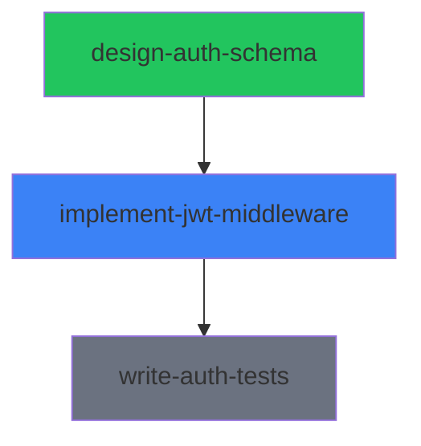

# Syntaur File Format Reference

This document defines the complete schema for every file type in the Syntaur protocol. For each file, the YAML frontmatter schema, body sections, ownership, and a realistic example are provided.

**Conventions used in this document:**

- **Required** fields must be present for a valid file. **Optional** fields may be omitted.
- All timestamps use **RFC 3339 / ISO 8601 with UTC offset** (e.g., `2026-03-18T14:30:00Z`).
- Local filesystem path fields (`workspace.worktreePath`, `defaultProjectDir`) use absolute expanded form. Never store `~` literally. `workspace.repository` is exempt — it may be a local path or a remote URL.
- Intra-project markdown links use relative paths for portability (e.g., `./project.md`).
- **Derived** files are generated by the rebuild script. Never edit them manually.
- **Agent-writable** files are written only by the assigned agent.
- **Human-authored** files are written only by humans.
- **Shared-writable** files can be created by both humans and agents.

---

## 1. manifest.md

**Ownership:** Derived (rebuild script only)

The root navigation file for a project. An agent reads this first to discover all indexes, config, and the project overview. It is regenerated on every rebuild.

### Frontmatter Schema

| Field | Type | Required | Default | Description |
|-------|------|----------|---------|-------------|
| `version` | string | required | — | Protocol version. Currently `"2.0"`. |
| `project` | string | required | — | Project slug. Matches the folder name. |
| `generated` | string (RFC 3339) | required | — | Timestamp of last rebuild. |

### Body Sections

| Section | Purpose | Who Writes |
|---------|---------|------------|
| Overview | Link to `project.md` | Rebuild script |
| Indexes | Links to all `_index-*` files and `_status.md` | Rebuild script |

All links are relative paths so the project folder is portable.

### Example

```markdown
---
version: "2.0"
project: build-auth-system
generated: "2026-03-18T15:00:00Z"
---

# Project: build-auth-system

## Overview
- [Project Overview](./project.md)

## Indexes
- [Assignments](./_index-assignments.md)
- [Plans](./_index-plans.md)
- [Decision Records](./_index-decisions.md)
- [Status](./_status.md)
- [Resources](./resources/_index.md)
- [Memories](./memories/_index.md)
```

---

## 2. project.md

**Ownership:** Human-authored only

The project overview containing the goal, context, and success criteria. This file contains **no computed or derived content**. All status rollups, assignment listings, dependency graphs, and session information live in `_status.md` and the various index files.

**Relationship to `_status.md`:** The only lifecycle state stored in `project.md` is the `archived` flag. When a human sets `archived: true`, the rebuild script projects this as `status: archived` in `_status.md`, overriding any computed status. All other project status is derived from assignment states and lives exclusively in `_status.md`.

### Frontmatter Schema

| Field | Type | Valid Values | Required | Default | Description |
|-------|------|-------------|----------|---------|-------------|
| `id` | string (UUID) | UUID v4 | required | — | Unique identifier for the project. |
| `slug` | string | lowercase, hyphen-separated | required | — | Human-readable identifier. Matches the folder name. Explicit in frontmatter so it's available without path inference. |
| `title` | string | any | required | — | Display title for the project. |
| `archived` | boolean | `true`, `false` | optional | `false` | Human-authored lifecycle override. When true, `_status.md` projects `status: archived`. |
| `archivedAt` | string (RFC 3339) or null | RFC 3339 datetime | optional | `null` | Timestamp when the project was archived. |
| `archivedReason` | string or null | any | optional | `null` | Human explanation for why the project was archived. |
| `created` | string (RFC 3339) | RFC 3339 datetime | required | — | When the project was created. |
| `updated` | string (RFC 3339) | RFC 3339 datetime | required | — | When the project was last modified. |
| `externalIds` | array of objects | `{system, id, url}` | optional | `[]` | Links to external tracking systems. Generic format — new integrations don't require protocol changes. |
| `externalIds[].system` | string | any (e.g., `jira`, `linear`, `github`) | required (per entry) | — | Name of the external system. |
| `externalIds[].id` | string | any | required (per entry) | — | Identifier in the external system. |
| `externalIds[].url` | string or null | URL | optional (per entry) | `null` | Direct link to the item in the external system. |
| `tags` | array of strings | any | optional | `[]` | Freeform tags for categorization. |
| `workspace` | string or null | any | optional | `null` | Organizational grouping label. Groups projects by codebase or project context in the dashboard. Not related to the assignment-level `workspace` object. |

### Body Sections

| Section | Purpose | Who Writes |
|---------|---------|------------|
| Overview | Free-form description of the project goal, context, and success criteria | Human |
| Notes | Optional human notes, updates, or context that don't fit elsewhere | Human |

### Example

```markdown
---
id: 7a1b3c4d-5e6f-7890-abcd-ef1234567890
slug: build-auth-system
title: Build Authentication System
archived: false
archivedAt: null
archivedReason: null
created: "2026-03-15T09:00:00Z"
updated: "2026-03-18T14:00:00Z"
externalIds:
  - system: jira
    id: AUTH-42
    url: https://mycompany.atlassian.net/browse/AUTH-42
  - system: linear
    id: AUTH-123
    url: https://linear.app/mycompany/issue/AUTH-123
tags:
  - security
  - backend
workspace: auth-project
---

# Build Authentication System

## Overview

Build a complete JWT-based authentication system for the backend API. This includes
schema design, middleware implementation, and comprehensive test coverage.

Success looks like: all API endpoints are protected by JWT auth, tokens are signed
with RS256, refresh token rotation is implemented, and test coverage exceeds 90%.

## Notes

2026-03-16: Product confirmed we need both access and refresh tokens. Access token
TTL is 15 minutes, refresh token TTL is 7 days.
```

---

## 3. assignment.md

**Ownership:** Agent-writable

The core unit of work and the **single source of truth** for assignment state. This is the file an agent reads to understand what to do and updates to report progress. All index files and status rollups are projections of data in this file.

### Frontmatter Schema

| Field | Type | Valid Values | Required | Default | Description |
|-------|------|-------------|----------|---------|-------------|
| `id` | string (UUID) | UUID v4 | required | — | Unique identifier for the assignment. |
| `slug` | string | lowercase, hyphen-separated | required | — | Human-readable identifier. For project-nested assignments, matches the folder name. For standalone assignments, the folder is named by `id` and `slug` is display-only. |
| `title` | string | any | required | — | Display title for the assignment. |
| `project` | string or null | project slug or null | required | — | The containing project's slug. `null` for standalone assignments at `~/.syntaur/assignments/<uuid>/`. |
| `type` | string or null | see `config.md` `types.definitions` | optional | `null` | Free-form classification (e.g., `feature`, `bug`, `chore`). Validated against `config.md` when `types.definitions` is present. |
| `status` | string (enum) | `pending`, `in_progress`, `blocked`, `review`, `completed`, `failed` | required | — | Current state of the assignment. See dependency semantics below. |
| `priority` | string (enum) | `low`, `medium`, `high`, `critical` | required | — | Priority level. |
| `created` | string (RFC 3339) | RFC 3339 datetime | required | — | When the assignment was created. |
| `updated` | string (RFC 3339) | RFC 3339 datetime | required | — | When the assignment was last modified. |
| `assignee` | string or null | agent name or null | optional | `null` | The agent currently responsible for this assignment. Authoritative owner field. |
| `externalIds` | array of objects | `{system, id, url}` | optional | `[]` | Links to external tracking systems. Same format as `project.md`. |
| `externalIds[].system` | string | any | required (per entry) | — | Name of the external system. |
| `externalIds[].id` | string | any | required (per entry) | — | Identifier in the external system. |
| `externalIds[].url` | string or null | URL | optional (per entry) | `null` | Direct link to the item. |
| `dependsOn` | array of strings | assignment slugs | optional | `[]` | Assignment slugs this depends on. |
| `blockedReason` | string or null | any | conditional | `null` | **Required** when `status` is `blocked`. Explains the manual/runtime block. |
| `workspace` | object | see sub-fields | optional | `null` | Code workspace information. |
| `workspace.repository` | string or null | repo path or URL | optional | `null` | The repository this assignment works in. |
| `workspace.worktreePath` | string or null | absolute path | optional | `null` | Absolute path to the git worktree. |
| `workspace.branch` | string or null | branch name | optional | `null` | The git branch for this assignment's work. |
| `workspace.parentBranch` | string or null | branch name | optional | `null` | The branch this was created from. |
| `tags` | array of strings | any | optional | `[]` | Freeform tags. |

### Dependency Semantics

- **`pending` with unmet `dependsOn`:** The assignment is waiting for its dependencies to reach `completed` status. The lifecycle engine prevents it from transitioning to `in_progress`. This is the normal state for assignments whose prerequisites are not yet done.
- **`blocked`:** A manual or runtime block unrelated to dependencies. The agent encountered an obstacle (e.g., waiting for human input, external service down, unclear requirements). `blockedReason` is **required** when status is `blocked`.
- Key distinction: `pending` with dependencies = structural wait (automated). `blocked` = runtime obstacle (requires human intervention).

### Body Sections

| Section | Purpose | Who Writes |
|---------|---------|------------|
| Objective | Clear description of what needs to be done and why | Human (initial), agent may refine |
| Acceptance Criteria | Checklist of requirements for completion | Human (initial), agent checks off |
| Todos | Checklist of work items; items may be simple tasks or link to plan files (`plan.md`, `plan-v2.md`, ...). Also the landing spot for cross-assignment requests (see `syntaur request`). | Agent (appended by `/plan-assignment`, `syntaur request`, and manual edits) |
| Context | Links to relevant docs, code, or other assignments | Human or agent |
| Links | Links to supporting files (progress, comments, scratchpad, handoff, decisions) | Scaffolding (initial) |

**Todos supersede convention:** When a plan is replaced by a newer version, do not delete the old todo. Mark it as:

```
- [x] ~~Execute [old plan](./plan.md)~~ (superseded by plan-v2)
```

Checked, strikethrough, and with a parenthetical pointer to the replacement. This preserves the history of planning decisions on the assignment.

**Q&A is now `comments.md`:** The former `## Questions & Answers` body section has moved out of `assignment.md` into a dedicated `comments.md` file. Comments support multiple types (question, note, feedback), reply threading, and a `resolved` flag on questions. All comment writes are CLI-mediated via `syntaur comment`. See section 9 for the full schema.

**Progress is now `progress.md`:** The former `## Progress` body section has moved into a dedicated `progress.md` file. The agent appends timestamped entries directly. See section 8.

**Standalone assignments:** An assignment may live outside any project at `~/.syntaur/assignments/<uuid>/` (created via `syntaur create-assignment --one-off`). In that case the folder is named by `id` (the UUID), `project` is `null`, and the `slug` is display-only — it is not guaranteed unique across standalone assignments. Resolve standalone assignments by `id` via `resolveAssignmentById`.

**Sessions:** Agent sessions are tracked in a SQLite database (`~/.syntaur/syntaur.db`), not in the assignment file. The `assignee` field in frontmatter is the authoritative owner. See section 13 for session storage details.

### Example

```markdown
---
id: a2b3c4d5-e6f7-8901-abcd-ef2345678901
slug: implement-jwt-middleware
title: Implement JWT Authentication Middleware
project: build-auth-system
type: feature
status: in_progress
priority: high
created: "2026-03-16T10:00:00Z"
updated: "2026-03-18T14:30:00Z"
assignee: claude-1
externalIds:
  - system: jira
    id: AUTH-44
    url: https://mycompany.atlassian.net/browse/AUTH-44
dependsOn:
  - design-auth-schema
blockedReason: null
workspace:
  repository: /Users/brennen/projects/myapp
  worktreePath: /Users/brennen/projects/myapp-jwt-middleware
  branch: feat/jwt-middleware
  parentBranch: main
tags:
  - security
  - middleware
---

# Implement JWT Authentication Middleware

## Objective

Implement Express middleware that validates JWT tokens on protected routes. Tokens
are signed with RS256 using the key pair defined in the auth schema. Must support
both access tokens (15min TTL) and refresh token rotation (7-day TTL).

## Acceptance Criteria

- [x] Middleware extracts Bearer token from Authorization header
- [x] RS256 signature validation implemented
- [ ] Token expiry checking with appropriate error responses
- [ ] Refresh token rotation endpoint
- [ ] Rate limiting on token refresh

## Todos

- [x] ~~Execute [plan](./plan.md)~~ (superseded by plan-v2)
- [ ] Execute [plan v2](./plan-v2.md)
- [ ] Double-check rate limit thresholds with product before finalizing
- [ ] Confirm error-response shape with design-auth-schema (from: write-auth-tests)

## Context

- Depends on [design-auth-schema](../design-auth-schema/assignment.md) for the
  user table schema and key storage approach
- See [auth-requirements](../../resources/auth-requirements.md) for product specs
- JWT library: `jose` (chosen in Decision 1)

## Links

- [Progress](./progress.md)
- [Comments](./comments.md)
- [Scratchpad](./scratchpad.md)
- [Handoff](./handoff.md)
- [Decision Record](./decision-record.md)
```

---

## 4. plan\*.md (`plan.md`, `plan-v2.md`, ...)

**Ownership:** Agent-writable

Zero or more implementation plan files per assignment. Plans are **not scaffolded** — they are created on demand by `/plan-assignment`. Each plan file corresponds to an entry in the `## Todos` section of `assignment.md`.

**Filename versioning:** The first plan for an assignment is `plan.md`. Subsequent plans use `plan-v2.md`, `plan-v3.md`, etc. — the smallest unused `plan-v<N>.md` where `N >= 2`. When requirements shift, create a new versioned plan and mark the old todo superseded in `assignment.md` instead of rewriting the old plan file.

Each plan has its own status independent of the assignment status.

### Frontmatter Schema

| Field | Type | Valid Values | Required | Default | Description |
|-------|------|-------------|----------|---------|-------------|
| `assignment` | string | assignment slug | required | — | The parent assignment this plan belongs to. |
| `status` | string (enum) | `draft`, `approved`, `in_progress`, `completed` | required | — | Plan lifecycle state. Independent of assignment status. |
| `created` | string (RFC 3339) | RFC 3339 datetime | required | — | When the plan was created. |
| `updated` | string (RFC 3339) | RFC 3339 datetime | required | — | When the plan was last modified. |

### Body Sections

| Section | Purpose | Who Writes |
|---------|---------|------------|
| Approach | High-level description of how the agent plans to accomplish the objective | Agent |
| Tasks | Checklist of implementation steps | Agent |
| Risks & Mitigations | Table of identified risks and planned mitigations | Agent |

### Example

```markdown
---
assignment: implement-jwt-middleware
status: in_progress
created: "2026-03-17T16:00:00Z"
updated: "2026-03-18T14:30:00Z"
---

# Plan: Implement JWT Authentication Middleware

## Approach

Use the `jose` library for JWT operations. Implement as Express middleware that
runs before route handlers. Start with token validation, then add refresh rotation.
Follow the schema from design-auth-schema for key storage.

## Tasks

- [x] Set up worktree and branch
- [x] Install jose library and configure RS256 keys
- [x] Implement Bearer token extraction middleware
- [x] Implement RS256 signature validation
- [ ] Add token expiry checking with 401 responses
- [ ] Implement refresh token rotation endpoint
- [ ] Add rate limiting to refresh endpoint
- [ ] Write integration tests

## Risks & Mitigations

| Risk | Mitigation |
|------|------------|
| Key rotation complexity | Start with single key pair, add rotation support as a follow-up |
| Refresh token theft | Store hashed tokens in DB, implement token family tracking |
| Performance impact of DB lookups on refresh | Add connection pooling (see memory: postgres-connection-pooling) |
```

---

## 5. scratchpad.md

**Ownership:** Agent-writable

Unstructured working memory for the agent. The agent uses this as scratch space during work. No required body format -- this is the agent's private workspace within the assignment. Created as an empty template by scaffolding, optional until first use.

### Frontmatter Schema

| Field | Type | Valid Values | Required | Default | Description |
|-------|------|-------------|----------|---------|-------------|
| `assignment` | string | assignment slug | required | — | The parent assignment. |
| `updated` | string (RFC 3339) | RFC 3339 datetime | required | — | When the scratchpad was last modified. |

### Body Sections

No required structure. The body is freeform working notes.

### Example

```markdown
---
assignment: implement-jwt-middleware
updated: "2026-03-18T14:30:00Z"
---

# Scratchpad

## Token format notes

Access token payload:
- sub: user UUID
- iat: issued at
- exp: 15 min from iat
- iss: "myapp"

Refresh token: opaque string, stored as SHA-256 hash in DB.

## Things to remember

- The jose library uses `importSPKI` / `importPKCS8` for PEM key import
- Need to handle both expired and malformed token errors differently (401 vs 400)
- Check if the DB migration from design-auth-schema included the refresh_tokens table
```

---

## 6. handoff.md

**Ownership:** Agent-writable, append-only

A chronological log of handoffs between agents or between agents and humans. Each handoff is a numbered entry so history is preserved. The `handoffCount` in frontmatter enables quick indexing without parsing the body. Created as an empty template by scaffolding, optional until first use.

### Frontmatter Schema

| Field | Type | Valid Values | Required | Default | Description |
|-------|------|-------------|----------|---------|-------------|
| `assignment` | string | assignment slug | required | — | The parent assignment. |
| `updated` | string (RFC 3339) | RFC 3339 datetime | required | — | When the last handoff was appended. |
| `handoffCount` | number (integer) | >= 0 | required | `0` | Total number of handoff entries. Enables indexing without body parsing. |

### Body Sections

Each handoff is a numbered entry (`## Handoff N`) separated by a horizontal rule. Entries are appended at the end of the file.

| Sub-section | Purpose | Who Writes |
|-------------|---------|------------|
| From | Who is handing off (agent name or "human") | Agent |
| To | Who is receiving (agent name or "human") | Agent |
| Reason | Why the handoff is happening | Agent |
| Summary | What was accomplished and what remains | Agent |
| Current State | Where things stand -- what's working, what's not, what's partially done | Agent |
| Next Steps | Bulleted list of recommended next actions | Agent |
| Important Context | Anything the next agent/human needs that isn't in the assignment or plan | Agent |

### Example

```markdown
---
assignment: design-auth-schema
updated: "2026-03-17T10:00:00Z"
handoffCount: 1
---

# Handoff Log

## Handoff 1: 2026-03-17T10:00:00Z

**From:** claude-2
**To:** human
**Reason:** Assignment completed, handing off for review and downstream work.

### Summary
Designed the complete auth schema including users table, refresh_tokens table,
and RSA key pair storage. All acceptance criteria met.

### Current State
- Users table migration is ready at `migrations/003_auth_schema.sql`
- Refresh tokens table included with user_id FK, token_hash, expires_at, revoked_at
- RSA key pair stored as environment variables (not in DB)
- All tests passing

### Next Steps
- Review the migration before merging
- Start implement-jwt-middleware (depends on this assignment)

### Important Context
Chose PostgreSQL over Redis for refresh token storage. See decision record for
rationale. The connection pooling findings are documented in the project memory
`postgres-connection-pooling`.
```

---

## 7. decision-record.md

**Ownership:** Agent-writable, append-only

A structured log of decisions made during the assignment. Each decision is a numbered entry with required fields. The `decisionCount` in frontmatter enables indexing without body parsing. Created as an empty template by scaffolding, optional until first use.

### Frontmatter Schema

| Field | Type | Valid Values | Required | Default | Description |
|-------|------|-------------|----------|---------|-------------|
| `assignment` | string | assignment slug | required | — | The parent assignment. |
| `updated` | string (RFC 3339) | RFC 3339 datetime | required | — | When the last decision was appended. |
| `decisionCount` | number (integer) | >= 0 | required | `0` | Total number of decision entries. Enables indexing without body parsing. |

### Body Sections

Each decision is a numbered entry (`## Decision N: <title>`) separated by a horizontal rule. Entries are appended at the end of the file.

| Field | Purpose | Who Writes |
|-------|---------|------------|
| Date | When the decision was made (RFC 3339) | Agent |
| Status | Lifecycle of the decision | Agent |
| Context | Why this decision was needed | Agent |
| Decision | What was decided | Agent |
| Consequences | What follows from this decision | Agent |

**Status values:**

| Value | Meaning |
|-------|---------|
| `proposed` | Decision is under consideration, not yet finalized. |
| `accepted` | Decision has been accepted and is in effect. |
| `rejected` | Decision was considered but not adopted. |
| `superseded` | Decision was accepted previously but has been replaced by a later decision. |

### Example

```markdown
---
assignment: implement-jwt-middleware
updated: "2026-03-18T14:00:00Z"
decisionCount: 1
---

# Decision Record

## Decision 1: Use RS256 for JWT signing

**Date:** 2026-03-17T16:30:00Z
**Status:** accepted
**Context:** Need to choose a JWT signing algorithm. Options are HS256 (symmetric)
or RS256 (asymmetric). The auth-requirements resource specifies that tokens may
be verified by multiple services.
**Decision:** Use RS256 (asymmetric) so that services only need the public key to
verify tokens. The private key stays on the auth server.
**Consequences:** Slightly larger tokens and slower signing than HS256, but
verification can be distributed without sharing secrets. Key rotation is simpler
since only the public key needs to be distributed.
```

---

## 8. progress.md

**Ownership:** Agent-writable, append-only

A reverse-chronological log of work the agent has done on the assignment. This replaces the old `## Progress` body section that used to live inside `assignment.md`. The agent writes entries directly (no CLI mediation). Created as an empty template by scaffolding, optional until first use.

### Frontmatter Schema

| Field | Type | Valid Values | Required | Default | Description |
|-------|------|-------------|----------|---------|-------------|
| `assignment` | string | assignment slug | required | — | The parent assignment. |
| `entryCount` | number (integer) | >= 0 | required | `0` | Total number of progress entries. Enables indexing without body parsing. |
| `generated` | string (RFC 3339) | RFC 3339 datetime | required | — | When the template was scaffolded. |
| `updated` | string (RFC 3339) | RFC 3339 datetime | required | — | When the last entry was appended. |

### Body Sections

Each entry is a timestamped heading (`## <RFC 3339 timestamp>`) followed by the entry body. Entries are **prepended** — newest first. The empty template contains the heading `# Progress` and the sentinel `No progress yet.` which is replaced on first entry.

### Example

```markdown
---
assignment: implement-jwt-middleware
entryCount: 2
generated: "2026-03-17T18:00:00Z"
updated: "2026-03-18T14:30:00Z"
---

# Progress

## 2026-03-18T14:30:00Z

Implemented Bearer token extraction and RS256 signature validation. Both passing
tests. Moving on to token expiry checking next.

## 2026-03-17T18:00:00Z

Set up the middleware skeleton and installed the `jose` library. Created the
worktree and branch. Reviewed the auth schema from the dependency assignment.
```

---

## 9. comments.md

**Ownership:** CLI-mediated shared-writable (humans and other agents append via `syntaur comment`)

A threaded log of questions, notes, and feedback on the assignment. This replaces the old `## Questions & Answers` body section that used to live inside `assignment.md`. Comments may have a type (`question`, `note`, `feedback`), may reply to another comment, and questions carry a `resolved` flag.

All writes are **mediated by the `syntaur comment` CLI** (or the dashboard write API) — never by directly editing the file. This preserves safe concurrent-write semantics across agents and humans. Created as an empty template by scaffolding, optional until first use.

### Frontmatter Schema

| Field | Type | Valid Values | Required | Default | Description |
|-------|------|-------------|----------|---------|-------------|
| `assignment` | string | assignment slug | required | — | The parent assignment. |
| `entryCount` | number (integer) | >= 0 | required | `0` | Total number of comment entries. |
| `generated` | string (RFC 3339) | RFC 3339 datetime | required | — | When the template was scaffolded. |
| `updated` | string (RFC 3339) | RFC 3339 datetime | required | — | When the last comment was appended. |

### Body Sections

Each comment is a heading with a stable id (`## <comment-id>`) followed by structured metadata lines and the body. Entries are appended at the end. The empty template contains the heading `# Comments` and the sentinel `No comments yet.` which is replaced on first entry.

| Field | Purpose | Required | Notes |
|-------|---------|----------|-------|
| `**Recorded:**` | RFC 3339 timestamp | yes | When the comment was appended. |
| `**Author:**` | Agent name or `"human"` | yes | Who wrote the comment. |
| `**Type:**` | One of `question`, `note`, `feedback` | yes | Classification. |
| `**Reply to:**` | A previous comment id | no | Present only when the comment replies to another. |
| `**Resolved:**` | `true` or `false` | conditional | Present **only** when `Type: question`. Toggleable via `PATCH /api/.../comments/:id/resolved`. |
| Body | Freeform markdown | yes | The comment content. |

### Example

```markdown
---
assignment: implement-jwt-middleware
entryCount: 3
generated: "2026-03-17T16:00:00Z"
updated: "2026-03-18T15:00:00Z"
---

# Comments

## c-1

**Recorded:** 2026-03-17T16:30:00Z
**Author:** claude-1
**Type:** question
**Resolved:** true

Should refresh tokens be stored in the database or use a stateless approach?

## c-2

**Recorded:** 2026-03-17T17:05:00Z
**Author:** human
**Type:** note
**Reply to:** c-1

Store refresh tokens in the database so we can revoke them. Add a `refresh_tokens`
table with user_id, token_hash, expires_at, revoked_at.

## c-3

**Recorded:** 2026-03-18T15:00:00Z
**Author:** human
**Type:** feedback

Great progress on the middleware. Please add rate-limit tests before review.
```

### Rollup: `openQuestions`

The `_status.md` frontmatter field `needsAttention.openQuestions` is computed by scanning every assignment's `comments.md` for entries where `Type: question` and `Resolved: false` (or absent). Unresolved questions across the project are aggregated into this count.

---

## 10. _index-assignments.md

**Ownership:** Derived (rebuild script only)

Summary table of all assignments in the project. The frontmatter includes status counts for quick dashboard access without parsing the table body.

### Frontmatter Schema

| Field | Type | Valid Values | Required | Default | Description |
|-------|------|-------------|----------|---------|-------------|
| `project` | string | project slug | required | — | The parent project. |
| `generated` | string (RFC 3339) | RFC 3339 datetime | required | — | When this file was last rebuilt. |
| `total` | number (integer) | >= 0 | required | — | Total number of assignments. |
| `by_status` | object | see sub-fields | required | — | Counts by status. |
| `by_status.pending` | number (integer) | >= 0 | required | `0` | Assignments in `pending` status. |
| `by_status.in_progress` | number (integer) | >= 0 | required | `0` | Assignments in `in_progress` status. |
| `by_status.blocked` | number (integer) | >= 0 | required | `0` | Assignments in `blocked` status. |
| `by_status.review` | number (integer) | >= 0 | required | `0` | Assignments in `review` status. |
| `by_status.completed` | number (integer) | >= 0 | required | `0` | Assignments in `completed` status. |
| `by_status.failed` | number (integer) | >= 0 | required | `0` | Assignments in `failed` status. |

### Body Sections

| Section | Purpose | Who Writes |
|---------|---------|------------|
| Assignments table | Tabular summary of every assignment | Rebuild script |

**Table columns:** Slug (linked to assignment.md), Title, Status, Priority, Assignee, Dependencies (or `--` if none), Updated.

### Example

```markdown
---
project: build-auth-system
generated: "2026-03-18T15:00:00Z"
total: 3
by_status:
  pending: 1
  in_progress: 1
  blocked: 0
  review: 0
  completed: 1
  failed: 0
---

# Assignments

| Slug | Title | Status | Priority | Assignee | Dependencies | Updated |
|------|-------|--------|----------|----------|--------------|---------|
| [design-auth-schema](./assignments/design-auth-schema/assignment.md) | Design auth schema | completed | high | claude-2 | — | 2026-03-17T10:00:00Z |
| [implement-jwt-middleware](./assignments/implement-jwt-middleware/assignment.md) | Implement JWT middleware | in_progress | high | claude-1 | design-auth-schema | 2026-03-18T14:30:00Z |
| [write-auth-tests](./assignments/write-auth-tests/assignment.md) | Write auth test suite | pending | medium | — | implement-jwt-middleware | 2026-03-16T10:00:00Z |
```

---

## 11. _index-plans.md

**Ownership:** Derived (rebuild script only)

Summary table of all plans across assignments.

### Frontmatter Schema

| Field | Type | Valid Values | Required | Default | Description |
|-------|------|-------------|----------|---------|-------------|
| `project` | string | project slug | required | — | The parent project. |
| `generated` | string (RFC 3339) | RFC 3339 datetime | required | — | When this file was last rebuilt. |

### Body Sections

| Section | Purpose | Who Writes |
|---------|---------|------------|
| Plans table | Tabular summary of every plan file across assignments | Rebuild script |

**Table columns:** Assignment, Plan File (linked to `plan.md`, `plan-v2.md`, ...), Plan Status, Updated. Assignments with zero plan files are omitted; assignments with multiple plans contribute one row per plan.

### Example

```markdown
---
project: build-auth-system
generated: "2026-03-18T15:00:00Z"
---

# Plans

| Assignment | Plan File | Plan Status | Updated |
|------------|-----------|-------------|---------|
| design-auth-schema | [plan.md](./assignments/design-auth-schema/plan.md) | completed | 2026-03-17T10:00:00Z |
| implement-jwt-middleware | [plan.md](./assignments/implement-jwt-middleware/plan.md) | superseded | 2026-03-17T22:00:00Z |
| implement-jwt-middleware | [plan-v2.md](./assignments/implement-jwt-middleware/plan-v2.md) | in_progress | 2026-03-18T14:30:00Z |
| write-auth-tests | [plan.md](./assignments/write-auth-tests/plan.md) | draft | 2026-03-16T10:00:00Z |
```

---

## 12. _index-decisions.md

**Ownership:** Derived (rebuild script only)

Summary table of decision records across all assignments.

### Frontmatter Schema

| Field | Type | Valid Values | Required | Default | Description |
|-------|------|-------------|----------|---------|-------------|
| `project` | string | project slug | required | — | The parent project. |
| `generated` | string (RFC 3339) | RFC 3339 datetime | required | — | When this file was last rebuilt. |

### Body Sections

| Section | Purpose | Who Writes |
|---------|---------|------------|
| Decision records table | Summary of decisions per assignment | Rebuild script |

**Table columns:** Assignment (linked to decision-record.md), Count, Latest Decision, Latest Status, Updated.

### Example

```markdown
---
project: build-auth-system
generated: "2026-03-18T15:00:00Z"
---

# Decision Records

| Assignment | Count | Latest Decision | Latest Status | Updated |
|------------|-------|-----------------|---------------|---------|
| [design-auth-schema](./assignments/design-auth-schema/decision-record.md) | 1 | Use PostgreSQL for user store | accepted | 2026-03-17T09:00:00Z |
| [implement-jwt-middleware](./assignments/implement-jwt-middleware/decision-record.md) | 1 | Use RS256 for JWT signing | accepted | 2026-03-18T14:00:00Z |
| [write-auth-tests](./assignments/write-auth-tests/decision-record.md) | 0 | — | — | — |
```

---

## 13. Agent Sessions (SQLite)

**Storage:** `~/.syntaur/syntaur.db` — `sessions` table

Agent sessions are stored in a SQLite database rather than markdown files. This provides proper querying, atomic updates, and scales well as session counts grow. Sessions are operational/node-local data — agents write them via the `syntaur track-session` CLI or the dashboard API, and humans consume them through the dashboard UI.

### Schema

```sql
CREATE TABLE sessions (
  session_id TEXT PRIMARY KEY,
  project_slug TEXT,
  assignment_slug TEXT,
  agent TEXT NOT NULL,
  started TEXT NOT NULL,
  ended TEXT,
  status TEXT NOT NULL DEFAULT 'active',
  path TEXT,
  description TEXT,
  transcript_path TEXT,
  created_at TEXT NOT NULL DEFAULT (datetime('now')),
  updated_at TEXT NOT NULL DEFAULT (datetime('now'))
);
```

Current schema version: `3`. The schema version is stored in a `meta` table and the DB migrates automatically on `initSessionDb()` — v1→v2 made project/assignment nullable and added `description`; v2→v3 added `transcript_path`.

### Session ID Rule

`session_id` must always be the **real, agent-generated session identifier**. Never synthesize a UUID. The CLI (`syntaur track-session`) and the POST endpoint (`/api/agent-sessions`) both reject requests that omit `session_id`.

Sources of truth by agent:

| Agent | Where to read the real session id |
|-------|-----------------------------------|
| Claude Code | SessionStart hook stdin payload (`session_id`), or fallback: the most-recently-modified `~/.claude/sessions/<pid>.json` whose `cwd` matches `$(pwd)`. |
| Codex | `payload.id` from the first line (`type: "session_meta"`) of the most-recently-modified `~/.codex/sessions/YYYY/MM/DD/rollout-<ts>-<uuid>.jsonl` whose `payload.cwd` matches `$(pwd)`. Helper: `platforms/codex/scripts/resolve-session.sh`. |

`transcript_path` is the absolute path to the agent's rollout/transcript file. Optional — nullable column — but strongly preferred so handoffs and the dashboard can link back to the raw conversation.

### Upsert Semantics

`appendSession` (and the POST endpoint it backs) upserts on `session_id`. Re-registering the same real id is a no-op for identity fields and a COALESCE for other fields, so SessionStart can pre-register a minimal row that grab-assignment or `/track-session` later enrich with project/assignment/description. Sessions already in a terminal status (`completed` / `stopped`) are not revived by re-registration.

### Status Values

| Status | Meaning |
|--------|---------|
| `active` | Session is currently running |
| `completed` | Session finished successfully |
| `stopped` | Session was terminated or failed |

### API Endpoints

| Method | Path | Description |
|--------|------|-------------|
| `GET` | `/api/agent-sessions` | List all sessions across all projects |
| `GET` | `/api/agent-sessions/:projectSlug` | List sessions for a project (optional `?assignment=` filter) |
| `POST` | `/api/agent-sessions` | Register a new session |
| `PATCH` | `/api/agent-sessions/:sessionId/status` | Update session status |

### CLI

```bash
syntaur track-session --agent <name> --session-id <real-id> [--transcript-path <path>] [--project <slug>] [--assignment <slug>] [--path <cwd>] [--description <text>]
```

`--session-id` is required; it must be the real id from the agent runtime. `--transcript-path` is optional but strongly preferred.

---

## 14. _status.md

**Ownership:** Derived (rebuild script only)

The project status rollup. Contains the computed overall status, progress counters, assignment checklist with links, a mermaid dependency graph, and a "needs attention" section. This is the single place a human or dashboard looks to understand project health at a glance.

### Frontmatter Schema

| Field | Type | Valid Values | Required | Default | Description |
|-------|------|-------------|----------|---------|-------------|
| `project` | string | project slug | required | — | The parent project. |
| `generated` | string (RFC 3339) | RFC 3339 datetime | required | — | When this file was last rebuilt. |
| `status` | string (enum) | `pending`, `active`, `blocked`, `completed`, `failed`, `archived` | required | — | Computed project status. See rollup algorithm below. |
| `progress` | object | see sub-fields | required | — | Assignment count breakdown. |
| `progress.total` | number (integer) | >= 0 | required | — | Total assignments. |
| `progress.completed` | number (integer) | >= 0 | required | — | Assignments in `completed` status. |
| `progress.in_progress` | number (integer) | >= 0 | required | — | Assignments in `in_progress` status. |
| `progress.blocked` | number (integer) | >= 0 | required | — | Assignments in `blocked` status. |
| `progress.pending` | number (integer) | >= 0 | required | — | Assignments in `pending` status. |
| `progress.review` | number (integer) | >= 0 | required | — | Assignments in `review` status. |
| `progress.failed` | number (integer) | >= 0 | required | — | Assignments in `failed` status. |
| `needsAttention` | object | see sub-fields | required | — | Items requiring human action. |
| `needsAttention.blockedCount` | number (integer) | >= 0 | required | — | Assignments currently blocked. |
| `needsAttention.failedCount` | number (integer) | >= 0 | required | — | Assignments that have failed. |
| `needsAttention.openQuestions` | number (integer) | >= 0 | required | — | Total unanswered Q&A entries across all assignments. |

### Project Status Rollup Algorithm

The project status is computed from assignment states. Rules are evaluated **top-to-bottom; first match wins:**

| Rule | Condition | Result |
|------|-----------|--------|
| 1 | `project.md` has `archived: true` | `archived` |
| 2 | ALL assignments are `completed` | `completed` |
| 3 | ANY assignment is `in_progress` or `review` | `active` |
| 4 | ANY assignment is `failed` | `failed` |
| 5 | ANY assignment is `blocked` | `blocked` |
| 6 | ALL assignments are `pending` | `pending` |
| 7 | Otherwise (mixed pending + completed, no active/failed/blocked) | `active` |

**Edge case examples:**

| Scenario | Rule | Result | Rationale |
|----------|------|--------|-----------|
| 2 completed + 1 pending + 0 active | 7 | `active` | Work remains but nothing is running; signals human that assignments need starting. |
| 1 completed + 1 blocked + 1 pending | 5 | `blocked` | A block exists. |
| 1 in_progress + 1 failed + 1 completed | 3 | `active` | Active work takes precedence over failures. |
| 3 completed | 2 | `completed` | All work done. |
| Human sets `archived: true` on project.md | 1 | `archived` | Human override; takes precedence over everything. |

The `archived` status is a **human-authored override** stored in `project.md` frontmatter (`archived`, `archivedAt`, `archivedReason` fields). It is the only project status not computed from assignment states. It signals "we're done with this, regardless of completion state."

### Body Sections

| Section | Purpose | Who Writes |
|---------|---------|------------|
| Status summary | Status and progress fraction as text | Rebuild script |
| Assignments | Checklist of assignments with links, status, and assignee/dependency info | Rebuild script |
| Dependency Graph | Mermaid graph showing assignment dependencies with color-coded statuses | Rebuild script |
| Needs Attention | Summary of blocked, failed, and unanswered items | Rebuild script |

### Example

```markdown
---
project: build-auth-system
generated: "2026-03-18T15:00:00Z"
status: active
progress:
  total: 3
  completed: 1
  in_progress: 1
  blocked: 0
  pending: 1
  review: 0
  failed: 0
needsAttention:
  blockedCount: 0
  failedCount: 0
  openQuestions: 1
---

# Project Status: Build Authentication System

**Status:** active
**Progress:** 1/3 assignments complete

## Assignments

- [x] [design-auth-schema](./assignments/design-auth-schema/assignment.md) — completed
- [ ] [implement-jwt-middleware](./assignments/implement-jwt-middleware/assignment.md) — in_progress (claude-1)
- [ ] [write-auth-tests](./assignments/write-auth-tests/assignment.md) — pending (waiting on: implement-jwt-middleware)

## Dependency Graph



## Needs Attention

- **0 blocked** assignments
- **0 failed** assignments
- **1 unanswered** question
```

---

## 15. resources/_index.md

**Ownership:** Derived (rebuild script only)

Listing of all resource files in the project.

### Frontmatter Schema

| Field | Type | Valid Values | Required | Default | Description |
|-------|------|-------------|----------|---------|-------------|
| `project` | string | project slug | required | — | The parent project. |
| `generated` | string (RFC 3339) | RFC 3339 datetime | required | — | When this file was last rebuilt. |
| `total` | number (integer) | >= 0 | required | — | Total number of resource files. |

### Body Sections

| Section | Purpose | Who Writes |
|---------|---------|------------|
| Resources table | Tabular listing of all resource files | Rebuild script |

**Table columns:** Name (linked to the resource file), Category, Source, Related Assignments, Updated.

### Example

```markdown
---
project: build-auth-system
generated: "2026-03-18T15:00:00Z"
total: 1
---

# Resources

| Name | Category | Source | Related Assignments | Updated |
|------|----------|--------|---------------------|---------|
| [auth-requirements](./auth-requirements.md) | documentation | human | design-auth-schema, implement-jwt-middleware | 2026-03-16T09:00:00Z |
```

---

## 16. memories/_index.md

**Ownership:** Derived (rebuild script only)

Listing of all memory files in the project.

### Frontmatter Schema

| Field | Type | Valid Values | Required | Default | Description |
|-------|------|-------------|----------|---------|-------------|
| `project` | string | project slug | required | — | The parent project. |
| `generated` | string (RFC 3339) | RFC 3339 datetime | required | — | When this file was last rebuilt. |
| `total` | number (integer) | >= 0 | required | — | Total number of memory files. |

### Body Sections

| Section | Purpose | Who Writes |
|---------|---------|------------|
| Memories table | Tabular listing of all memory files | Rebuild script |

**Table columns:** Name (linked to the memory file), Source, Scope, Source Assignment, Updated.

### Example

```markdown
---
project: build-auth-system
generated: "2026-03-18T15:00:00Z"
total: 1
---

# Memories

| Name | Source | Scope | Source Assignment | Updated |
|------|--------|-------|------------------|---------|
| [postgres-connection-pooling](./postgres-connection-pooling.md) | claude-2 | project | design-auth-schema | 2026-03-17T11:00:00Z |
```

---

## 17. Resource Files

**Ownership:** Shared-writable (humans and agents)

Resource files live in the `resources/` folder and represent reference material agents need to consult: external docs, API specs, architecture notes, configuration references, etc.

**Canonical identity:** The filename (slug) is the canonical identifier. Unlike projects and assignments, resources do not carry a separate `id`/`slug` in frontmatter. The `name` field is display-only.

### Frontmatter Schema

| Field | Type | Valid Values | Required | Default | Description |
|-------|------|-------------|----------|---------|-------------|
| `type` | string (literal) | `"resource"` | required | — | Always `"resource"`. Discriminator field. |
| `name` | string | any | required | — | Display name for the resource. |
| `source` | string | agent name or `"human"` | required | — | Who created this resource. Tracks provenance. |
| `category` | string (enum) | `documentation`, `api`, `service`, `config`, `other` | required | — | Classification of the resource. |
| `sourceUrl` | string or null | URL | optional | `null` | Link to the original external source, if any. |
| `sourceAssignment` | string or null | assignment slug | optional | `null` | The assignment that created this resource, if any. |
| `relatedAssignments` | array of strings | assignment slugs | optional | `[]` | Assignments that reference or use this resource. |
| `created` | string (RFC 3339) | RFC 3339 datetime | required | — | When the resource was created. |
| `updated` | string (RFC 3339) | RFC 3339 datetime | required | — | When the resource was last modified. |

### Body Sections

No required structure. The body contains the resource content: descriptions, links, specs, notes, etc.

### Example

**Filename:** `resources/auth-requirements.md`

```markdown
---
type: resource
name: Auth Requirements
source: human
category: documentation
sourceUrl: https://docs.google.com/document/d/1abc123/edit
sourceAssignment: null
relatedAssignments:
  - design-auth-schema
  - implement-jwt-middleware
created: "2026-03-15T09:00:00Z"
updated: "2026-03-16T09:00:00Z"
---

# Auth Requirements

Product requirements for the authentication system, summarized from the PRD.

## Token Specifications

- **Access token:** JWT, RS256 signed, 15-minute TTL
- **Refresh token:** opaque, stored in DB, 7-day TTL, rotation on use
- Both tokens issued on login and refresh

## Endpoints

- `POST /auth/login` — issue token pair
- `POST /auth/refresh` — rotate refresh token, issue new access token
- `POST /auth/logout` — revoke refresh token
- `GET /auth/me` — return current user (requires valid access token)

## Security Requirements

- Refresh tokens must be revocable
- Rate limit on login: 5 attempts per minute per IP
- Rate limit on refresh: 10 requests per minute per user
```

---

## 18. Memory Files

**Ownership:** Shared-writable (humans and agents)

Memory files live in the `memories/` folder and represent learnings, patterns, or context discovered during the project that may be useful for other assignments or future work.

**Canonical identity:** The filename (slug) is the canonical identifier. No separate `id`/`slug` in frontmatter. The `name` field is display-only.

### Frontmatter Schema

| Field | Type | Valid Values | Required | Default | Description |
|-------|------|-------------|----------|---------|-------------|
| `type` | string (literal) | `"memory"` | required | — | Always `"memory"`. Discriminator field. |
| `name` | string | any | required | — | Display name for the memory. |
| `source` | string | agent name or `"human"` | required | — | Who created this memory. Tracks provenance. |
| `sourceAssignment` | string or null | assignment slug | optional | `null` | The assignment where this learning originated. |
| `relatedAssignments` | array of strings | assignment slugs | optional | `[]` | Assignments that benefit from this memory. |
| `scope` | string (enum) | `assignment`, `project`, `global` | required | — | How broadly this learning applies. |
| `created` | string (RFC 3339) | RFC 3339 datetime | required | — | When the memory was created. |
| `updated` | string (RFC 3339) | RFC 3339 datetime | required | — | When the memory was last modified. |
| `tags` | array of strings | any | optional | `[]` | Freeform tags for categorization and search. |

**Scope values:**

| Value | Meaning |
|-------|---------|
| `assignment` | Learning is specific to the source assignment. |
| `project` | Learning is relevant to the entire project. |
| `global` | Learning is potentially promotable to a global memory system (future versions). |

### Body Sections

No required structure. The body contains the learning content.

### Example

**Filename:** `memories/postgres-connection-pooling.md`

```markdown
---
type: memory
name: PostgreSQL Connection Pooling Configuration
source: claude-2
sourceAssignment: design-auth-schema
relatedAssignments:
  - implement-jwt-middleware
scope: project
created: "2026-03-17T11:00:00Z"
updated: "2026-03-17T11:00:00Z"
tags:
  - postgres
  - performance
  - infrastructure
---

# PostgreSQL Connection Pooling Configuration

During the auth schema design, discovered that the default PostgreSQL connection
pool settings are insufficient for the expected token refresh load.

## Findings

- Default `max` connections in `pg` library is 10, which will bottleneck under
  concurrent refresh token lookups
- Recommended: set pool `max` to 20 for the auth service, with `idleTimeoutMillis`
  of 30000
- Connection pool should be shared across the auth middleware and refresh endpoint,
  not created per-request

## Configuration

```javascript
const pool = new Pool({
  max: 20,
  idleTimeoutMillis: 30000,
  connectionTimeoutMillis: 2000,
});
```

## Relevance

This applies to any assignment that performs database queries in the request path,
especially the JWT middleware refresh endpoint which will see high concurrency.
```

---


## 19. config.md

**Ownership:** Human-authored

Global Syntaur configuration file at `~/.syntaur/config.md`. This file is **optional** -- Syntaur works with sensible defaults when it is absent.

### Frontmatter Schema

| Field | Type | Valid Values | Required | Default | Description |
|-------|------|-------------|----------|---------|-------------|
| `version` | string | `"2.0"` | required | — | Config schema version. |
| `defaultProjectDir` | string | absolute path | optional | `~/.syntaur/projects` (expanded) | Default directory for projects. **Must be absolute path; never use `~`.** |
| `onboarding.completed` | boolean | `true`, `false` | optional | `false` | Whether the first-run onboarding flow has completed. |
| `agentDefaults.trustLevel` | string (enum) | `low`, `medium`, `high` | optional | `medium` | Default trust level for agents. |
| `agentDefaults.autoApprove` | boolean | `true`, `false` | optional | `false` | Whether to auto-approve agent actions. |
| `backup.repo` | string or null | repo path or URL | optional | `null` | Backup git repo for `syntaur backup` / `syntaur restore`. |
| `backup.categories` | string | comma-separated | optional | `"projects, playbooks, todos, servers, config"` | Categories included in backups. |
| `backup.lastBackup` | string (RFC 3339) or null | | optional | `null` | Last backup timestamp. |
| `backup.lastRestore` | string (RFC 3339) or null | | optional | `null` | Last restore timestamp. |
| `integrations.claudePluginDir` | string or null | absolute path | optional | `null` | Override location of the Claude Code plugin directory. |
| `integrations.codexPluginDir` | string or null | absolute path | optional | `null` | Override location of the Codex plugin directory. |
| `integrations.codexMarketplacePath` | string or null | absolute path | optional | `null` | Override path to a Codex marketplace manifest. |
| `types` | object or null | see below | optional | `null` (system defaults apply) | Assignment type taxonomy. |

**`types` structure** (nested via dot-notation in frontmatter):

| Field | Type | Description |
|-------|------|-------------|
| `types.definitions` | array of `{id, label, icon?}` objects | Allowed type ids for the `type` field on `assignment.md`. |
| `types.default` | string | Default type id used when none is specified on create. |

Built-in defaults apply when `types` is absent: `feature`, `bug`, `refactor`, `research`, `chore`, with default `feature`. Doctor warns when an assignment's `type` is not in the configured definitions.

**Path normalization:** All path fields must use absolute expanded form. The CLI expands `~` to the full home directory at write time. A config file must never contain a literal `~` in any path value.

### Body Sections

The body is optional and contains human notes about the configuration. No required structure.

### Example

```markdown
---
version: "2.0"
defaultProjectDir: /Users/brennen/.syntaur/projects
onboarding.completed: true
agentDefaults:
  trustLevel: medium
  autoApprove: false
backup:
  repo: null
  categories: projects, playbooks, todos, servers, config
  lastBackup: null
  lastRestore: null
---

# Syntaur Configuration

Personal development machine. Projects stored in default location.
```

---

## 20. Playbooks (`~/.syntaur/playbooks/<slug>.md`)

**Ownership:** Human-authored (read-only to agents)
**Purpose:** Define behavioral rules, workflows, and conventions that agents must follow.

Playbooks are global — they apply across all projects and assignments. They are composable, short markdown files with imperative rules that get injected into agent context at decision points (grabbing assignments, planning, completing work).

### Frontmatter Schema

| Field | Type | Required | Default | Description |
|-------|------|----------|---------|-------------|
| `name` | string | yes | — | Display name |
| `slug` | string | yes | — | Filename-safe identifier (lowercase, hyphenated) |
| `description` | string | no | `""` | One-line summary of what the playbook does |
| `when_to_use` | string | no | `null` | Describes when agents should apply this playbook |
| `created` | RFC 3339 | yes | — | Creation timestamp |
| `updated` | RFC 3339 | yes | — | Last update timestamp |
| `tags` | string[] | no | `[]` | Categorization tags |

### Body

The body contains imperative rules and workflows in markdown. Guidelines:

- Keep playbooks short — ideally under 50 lines
- Use imperative language ("Do X", "Never do Y")
- Focus each playbook on a single concern
- Rules in playbooks take precedence over default conventions when they conflict

### Example

```markdown
---
name: "Test Before Done"
slug: test-before-done
description: "Agents must run tests and verify acceptance criteria before marking assignments complete"
when_to_use: "Before transitioning an assignment to review or completed"
created: "2026-04-02T00:00:00Z"
updated: "2026-04-02T00:00:00Z"
tags:
  - quality
  - testing
---

# Test Before Done

Before transitioning an assignment to `review` or `completed`:

1. **Run the test suite.** If the project has tests, run them. All must pass.
2. **Check every acceptance criterion.** Go through them one by one.
3. **Build the project.** If there's a build step, run it. No build errors allowed.

Do NOT mark an assignment complete just because you wrote the code.
```
