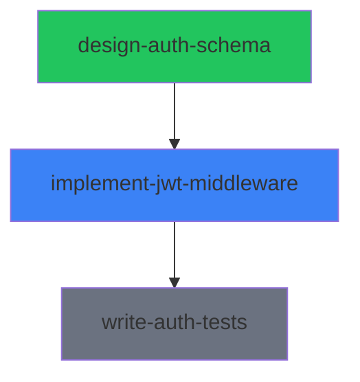

# Syntaur File Format Reference

This document defines the complete schema for every file type in the Syntaur protocol. For each file, the YAML frontmatter schema, body sections, ownership, and a realistic example are provided.

**Conventions used in this document:**

- **Required** fields must be present for a valid file. **Optional** fields may be omitted.
- All timestamps use **RFC 3339 / ISO 8601 with UTC offset** (e.g., `2026-03-18T14:30:00Z`).
- Local filesystem path fields (`workspace.worktreePath`, `defaultMissionDir`) use absolute expanded form. Never store `~` literally. `workspace.repository` is exempt — it may be a local path or a remote URL.
- Intra-mission markdown links use relative paths for portability (e.g., `./mission.md`).
- **Derived** files are generated by the rebuild script. Never edit them manually.
- **Agent-writable** files are written only by the assigned agent.
- **Human-authored** files are written only by humans.
- **Shared-writable** files can be created by both humans and agents.

---

## 1. manifest.md

**Ownership:** Derived (rebuild script only)

The root navigation file for a mission. An agent reads this first to discover all indexes, config, and the mission overview. It is regenerated on every rebuild.

### Frontmatter Schema

| Field | Type | Required | Default | Description |
|-------|------|----------|---------|-------------|
| `version` | string | required | — | Protocol version. Currently `"1.0"`. |
| `mission` | string | required | — | Mission slug. Matches the folder name. |
| `generated` | string (RFC 3339) | required | — | Timestamp of last rebuild. |

### Body Sections

| Section | Purpose | Who Writes |
|---------|---------|------------|
| Overview | Link to `mission.md` | Rebuild script |
| Indexes | Links to all `_index-*` files and `_status.md` | Rebuild script |
| Config | Links to `agent.md` and `claude.md` | Rebuild script |

All links are relative paths so the mission folder is portable.

### Example

```markdown
---
version: "1.0"
mission: build-auth-system
generated: "2026-03-18T15:00:00Z"
---

# Mission: build-auth-system

## Overview
- [Mission Overview](./mission.md)

## Indexes
- [Assignments](./_index-assignments.md)
- [Plans](./_index-plans.md)
- [Decision Records](./_index-decisions.md)
- [Sessions](./_index-sessions.md)
- [Status](./_status.md)
- [Resources](./resources/_index.md)
- [Memories](./memories/_index.md)

## Config
- [Agent Instructions](./agent.md)
- [Claude Code Instructions](./claude.md)
```

---

## 2. mission.md

**Ownership:** Human-authored only

The mission overview containing the goal, context, and success criteria. This file contains **no computed or derived content**. All status rollups, assignment listings, dependency graphs, and session information live in `_status.md` and the various index files.

**Relationship to `_status.md`:** The only lifecycle state stored in `mission.md` is the `archived` flag. When a human sets `archived: true`, the rebuild script projects this as `status: archived` in `_status.md`, overriding any computed status. All other mission status is derived from assignment states and lives exclusively in `_status.md`.

### Frontmatter Schema

| Field | Type | Valid Values | Required | Default | Description |
|-------|------|-------------|----------|---------|-------------|
| `id` | string (UUID) | UUID v4 | required | — | Unique identifier for the mission. |
| `slug` | string | lowercase, hyphen-separated | required | — | Human-readable identifier. Matches the folder name. Explicit in frontmatter so it's available without path inference. |
| `title` | string | any | required | — | Display title for the mission. |
| `archived` | boolean | `true`, `false` | optional | `false` | Human-authored lifecycle override. When true, `_status.md` projects `status: archived`. |
| `archivedAt` | string (RFC 3339) or null | RFC 3339 datetime | optional | `null` | Timestamp when the mission was archived. |
| `archivedReason` | string or null | any | optional | `null` | Human explanation for why the mission was archived. |
| `created` | string (RFC 3339) | RFC 3339 datetime | required | — | When the mission was created. |
| `updated` | string (RFC 3339) | RFC 3339 datetime | required | — | When the mission was last modified. |
| `externalIds` | array of objects | `{system, id, url}` | optional | `[]` | Links to external tracking systems. Generic format — new integrations don't require protocol changes. |
| `externalIds[].system` | string | any (e.g., `jira`, `linear`, `github`) | required (per entry) | — | Name of the external system. |
| `externalIds[].id` | string | any | required (per entry) | — | Identifier in the external system. |
| `externalIds[].url` | string or null | URL | optional (per entry) | `null` | Direct link to the item in the external system. |
| `tags` | array of strings | any | optional | `[]` | Freeform tags for categorization. |

### Body Sections

| Section | Purpose | Who Writes |
|---------|---------|------------|
| Overview | Free-form description of the mission goal, context, and success criteria | Human |
| Notes | Optional human notes, updates, or context that don't fit elsewhere | Human |

### Example

```markdown
---
id: 7a1b3c4d-5e6f-7890-abcd-ef1234567890
slug: build-auth-system
title: Build Authentication System
archived: false
archivedAt: null
archivedReason: null
created: "2026-03-15T09:00:00Z"
updated: "2026-03-18T14:00:00Z"
externalIds:
  - system: jira
    id: AUTH-42
    url: https://mycompany.atlassian.net/browse/AUTH-42
  - system: linear
    id: AUTH-123
    url: https://linear.app/mycompany/issue/AUTH-123
tags:
  - security
  - backend
---

# Build Authentication System

## Overview

Build a complete JWT-based authentication system for the backend API. This includes
schema design, middleware implementation, and comprehensive test coverage.

Success looks like: all API endpoints are protected by JWT auth, tokens are signed
with RS256, refresh token rotation is implemented, and test coverage exceeds 90%.

## Notes

2026-03-16: Product confirmed we need both access and refresh tokens. Access token
TTL is 15 minutes, refresh token TTL is 7 days.
```

---

## 3. assignment.md

**Ownership:** Agent-writable

The core unit of work and the **single source of truth** for assignment state. This is the file an agent reads to understand what to do and updates to report progress. All index files and status rollups are projections of data in this file.

### Frontmatter Schema

| Field | Type | Valid Values | Required | Default | Description |
|-------|------|-------------|----------|---------|-------------|
| `id` | string (UUID) | UUID v4 | required | — | Unique identifier for the assignment. |
| `slug` | string | lowercase, hyphen-separated | required | — | Human-readable identifier. Matches the folder name. |
| `title` | string | any | required | — | Display title for the assignment. |
| `status` | string (enum) | `pending`, `in_progress`, `blocked`, `review`, `completed`, `failed` | required | — | Current state of the assignment. See dependency semantics below. |
| `priority` | string (enum) | `low`, `medium`, `high`, `critical` | required | — | Priority level. |
| `created` | string (RFC 3339) | RFC 3339 datetime | required | — | When the assignment was created. |
| `updated` | string (RFC 3339) | RFC 3339 datetime | required | — | When the assignment was last modified. |
| `assignee` | string or null | agent name or null | optional | `null` | The agent currently responsible for this assignment. Authoritative owner field. |
| `externalIds` | array of objects | `{system, id, url}` | optional | `[]` | Links to external tracking systems. Same format as `mission.md`. |
| `externalIds[].system` | string | any | required (per entry) | — | Name of the external system. |
| `externalIds[].id` | string | any | required (per entry) | — | Identifier in the external system. |
| `externalIds[].url` | string or null | URL | optional (per entry) | `null` | Direct link to the item. |
| `dependsOn` | array of strings | assignment slugs | optional | `[]` | Assignment slugs this depends on. |
| `blockedReason` | string or null | any | conditional | `null` | **Required** when `status` is `blocked`. Explains the manual/runtime block. |
| `workspace` | object | see sub-fields | optional | `null` | Code workspace information. |
| `workspace.repository` | string or null | repo path or URL | optional | `null` | The repository this assignment works in. |
| `workspace.worktreePath` | string or null | absolute path | optional | `null` | Absolute path to the git worktree. |
| `workspace.branch` | string or null | branch name | optional | `null` | The git branch for this assignment's work. |
| `workspace.parentBranch` | string or null | branch name | optional | `null` | The branch this was created from. |
| `tags` | array of strings | any | optional | `[]` | Freeform tags. |

### Dependency Semantics

- **`pending` with unmet `dependsOn`:** The assignment is waiting for its dependencies to reach `completed` status. The lifecycle engine prevents it from transitioning to `in_progress`. This is the normal state for assignments whose prerequisites are not yet done.
- **`blocked`:** A manual or runtime block unrelated to dependencies. The agent encountered an obstacle (e.g., waiting for human input, external service down, unclear requirements). `blockedReason` is **required** when status is `blocked`.
- Key distinction: `pending` with dependencies = structural wait (automated). `blocked` = runtime obstacle (requires human intervention).

### Body Sections

| Section | Purpose | Who Writes |
|---------|---------|------------|
| Objective | Clear description of what needs to be done and why | Human (initial), agent may refine |
| Acceptance Criteria | Checklist of requirements for completion | Human (initial), agent checks off |
| Context | Links to relevant docs, code, or other assignments | Human or agent |
| Sessions | Table tracking agent session history | Agent |
| Questions & Answers | Agent asks questions, humans/other agents answer via CLI | Agent writes questions; answers mediated via `syntaur answer` CLI command |
| Progress | Reverse-chronological log of work done | Agent |
| Links | Links to supporting files (plan, scratchpad, handoff, decisions) | Scaffolding (initial) |

**Q&A write boundaries:** The Q&A section is the one exception to the single-writer rule for assignment folders. Answers are written by humans or other agents, but always **mediated through the CLI** (e.g., `syntaur answer`), never by directly editing the file. This preserves the single-writer guarantee at the file-system level.

**Sessions table:** Sessions are informational and help the dashboard show active work. The `assignee` field is the authoritative owner, not the sessions table. Multiple sessions are allowed (e.g., agent restarts). The `Ended` column and `stopped` status handle stale sessions.

### Example

```markdown
---
id: a2b3c4d5-e6f7-8901-abcd-ef2345678901
slug: implement-jwt-middleware
title: Implement JWT Authentication Middleware
status: in_progress
priority: high
created: "2026-03-16T10:00:00Z"
updated: "2026-03-18T14:30:00Z"
assignee: claude-1
externalIds:
  - system: jira
    id: AUTH-44
    url: https://mycompany.atlassian.net/browse/AUTH-44
dependsOn:
  - design-auth-schema
blockedReason: null
workspace:
  repository: /Users/brennen/projects/myapp
  worktreePath: /Users/brennen/projects/myapp-jwt-middleware
  branch: feat/jwt-middleware
  parentBranch: main
tags:
  - security
  - middleware
---

# Implement JWT Authentication Middleware

## Objective

Implement Express middleware that validates JWT tokens on protected routes. Tokens
are signed with RS256 using the key pair defined in the auth schema. Must support
both access tokens (15min TTL) and refresh token rotation (7-day TTL).

## Acceptance Criteria

- [x] Middleware extracts Bearer token from Authorization header
- [x] RS256 signature validation implemented
- [ ] Token expiry checking with appropriate error responses
- [ ] Refresh token rotation endpoint
- [ ] Rate limiting on token refresh

## Context

- Depends on [design-auth-schema](../design-auth-schema/assignment.md) for the
  user table schema and key storage approach
- See [auth-requirements](../../resources/auth-requirements.md) for product specs
- JWT library: `jose` (chosen in Decision 1)

## Sessions

| Session ID | Agent | Started | Ended | Status |
|------------|-------|---------|-------|--------|
| tmux:syntaur-auth-1 | claude-1 | 2026-03-18T14:00:00Z | | active |
| tmux:syntaur-auth-0 | claude-1 | 2026-03-17T16:00:00Z | 2026-03-17T18:30:00Z | completed |

## Questions & Answers

### Q: Should refresh tokens be stored in the database or use a stateless approach?
**Asked:** 2026-03-17T16:30:00Z
**A:** Store refresh tokens in the database so we can revoke them. Add a `refresh_tokens` table with user_id, token_hash, expires_at, and revoked_at columns.

### Q: What should the rate limit be on the refresh endpoint?
**Asked:** 2026-03-18T14:15:00Z
**A:** pending

## Progress

### 2026-03-18T14:30:00Z
Implemented Bearer token extraction and RS256 signature validation. Both passing
tests. Moving on to token expiry checking next.

### 2026-03-17T18:00:00Z
Set up the middleware skeleton and installed the `jose` library. Created the
worktree and branch. Reviewed the auth schema from the dependency assignment.

## Links

- [Plan](./plan.md)
- [Scratchpad](./scratchpad.md)
- [Handoff](./handoff.md)
- [Decision Record](./decision-record.md)
```

---

## 4. plan.md

**Ownership:** Agent-writable

The implementation plan for an assignment. Created as an empty template by scaffolding, populated by the agent when planning work. Has its own status independent of the assignment status (a plan can be drafted and approved before work begins).

### Frontmatter Schema

| Field | Type | Valid Values | Required | Default | Description |
|-------|------|-------------|----------|---------|-------------|
| `assignment` | string | assignment slug | required | — | The parent assignment this plan belongs to. |
| `status` | string (enum) | `draft`, `approved`, `in_progress`, `completed` | required | — | Plan lifecycle state. Independent of assignment status. |
| `created` | string (RFC 3339) | RFC 3339 datetime | required | — | When the plan was created. |
| `updated` | string (RFC 3339) | RFC 3339 datetime | required | — | When the plan was last modified. |

### Body Sections

| Section | Purpose | Who Writes |
|---------|---------|------------|
| Approach | High-level description of how the agent plans to accomplish the objective | Agent |
| Tasks | Checklist of implementation steps | Agent |
| Risks & Mitigations | Table of identified risks and planned mitigations | Agent |

### Example

```markdown
---
assignment: implement-jwt-middleware
status: in_progress
created: "2026-03-17T16:00:00Z"
updated: "2026-03-18T14:30:00Z"
---

# Plan: Implement JWT Authentication Middleware

## Approach

Use the `jose` library for JWT operations. Implement as Express middleware that
runs before route handlers. Start with token validation, then add refresh rotation.
Follow the schema from design-auth-schema for key storage.

## Tasks

- [x] Set up worktree and branch
- [x] Install jose library and configure RS256 keys
- [x] Implement Bearer token extraction middleware
- [x] Implement RS256 signature validation
- [ ] Add token expiry checking with 401 responses
- [ ] Implement refresh token rotation endpoint
- [ ] Add rate limiting to refresh endpoint
- [ ] Write integration tests

## Risks & Mitigations

| Risk | Mitigation |
|------|------------|
| Key rotation complexity | Start with single key pair, add rotation support as a follow-up |
| Refresh token theft | Store hashed tokens in DB, implement token family tracking |
| Performance impact of DB lookups on refresh | Add connection pooling (see memory: postgres-connection-pooling) |
```

---

## 5. scratchpad.md

**Ownership:** Agent-writable

Unstructured working memory for the agent. The agent uses this as scratch space during work. No required body format -- this is the agent's private workspace within the assignment. Created as an empty template by scaffolding, optional until first use.

### Frontmatter Schema

| Field | Type | Valid Values | Required | Default | Description |
|-------|------|-------------|----------|---------|-------------|
| `assignment` | string | assignment slug | required | — | The parent assignment. |
| `updated` | string (RFC 3339) | RFC 3339 datetime | required | — | When the scratchpad was last modified. |

### Body Sections

No required structure. The body is freeform working notes.

### Example

```markdown
---
assignment: implement-jwt-middleware
updated: "2026-03-18T14:30:00Z"
---

# Scratchpad

## Token format notes

Access token payload:
- sub: user UUID
- iat: issued at
- exp: 15 min from iat
- iss: "myapp"

Refresh token: opaque string, stored as SHA-256 hash in DB.

## Things to remember

- The jose library uses `importSPKI` / `importPKCS8` for PEM key import
- Need to handle both expired and malformed token errors differently (401 vs 400)
- Check if the DB migration from design-auth-schema included the refresh_tokens table
```

---

## 6. handoff.md

**Ownership:** Agent-writable, append-only

A chronological log of handoffs between agents or between agents and humans. Each handoff is a numbered entry so history is preserved. The `handoffCount` in frontmatter enables quick indexing without parsing the body. Created as an empty template by scaffolding, optional until first use.

### Frontmatter Schema

| Field | Type | Valid Values | Required | Default | Description |
|-------|------|-------------|----------|---------|-------------|
| `assignment` | string | assignment slug | required | — | The parent assignment. |
| `updated` | string (RFC 3339) | RFC 3339 datetime | required | — | When the last handoff was appended. |
| `handoffCount` | number (integer) | >= 0 | required | `0` | Total number of handoff entries. Enables indexing without body parsing. |

### Body Sections

Each handoff is a numbered entry (`## Handoff N`) separated by a horizontal rule. Entries are appended at the end of the file.

| Sub-section | Purpose | Who Writes |
|-------------|---------|------------|
| From | Who is handing off (agent name or "human") | Agent |
| To | Who is receiving (agent name or "human") | Agent |
| Reason | Why the handoff is happening | Agent |
| Summary | What was accomplished and what remains | Agent |
| Current State | Where things stand -- what's working, what's not, what's partially done | Agent |
| Next Steps | Bulleted list of recommended next actions | Agent |
| Important Context | Anything the next agent/human needs that isn't in the assignment or plan | Agent |

### Example

```markdown
---
assignment: design-auth-schema
updated: "2026-03-17T10:00:00Z"
handoffCount: 1
---

# Handoff Log

## Handoff 1: 2026-03-17T10:00:00Z

**From:** claude-2
**To:** human
**Reason:** Assignment completed, handing off for review and downstream work.

### Summary
Designed the complete auth schema including users table, refresh_tokens table,
and RSA key pair storage. All acceptance criteria met.

### Current State
- Users table migration is ready at `migrations/003_auth_schema.sql`
- Refresh tokens table included with user_id FK, token_hash, expires_at, revoked_at
- RSA key pair stored as environment variables (not in DB)
- All tests passing

### Next Steps
- Review the migration before merging
- Start implement-jwt-middleware (depends on this assignment)

### Important Context
Chose PostgreSQL over Redis for refresh token storage. See decision record for
rationale. The connection pooling findings are documented in the mission memory
`postgres-connection-pooling`.
```

---

## 7. decision-record.md

**Ownership:** Agent-writable, append-only

A structured log of decisions made during the assignment. Each decision is a numbered entry with required fields. The `decisionCount` in frontmatter enables indexing without body parsing. Created as an empty template by scaffolding, optional until first use.

### Frontmatter Schema

| Field | Type | Valid Values | Required | Default | Description |
|-------|------|-------------|----------|---------|-------------|
| `assignment` | string | assignment slug | required | — | The parent assignment. |
| `updated` | string (RFC 3339) | RFC 3339 datetime | required | — | When the last decision was appended. |
| `decisionCount` | number (integer) | >= 0 | required | `0` | Total number of decision entries. Enables indexing without body parsing. |

### Body Sections

Each decision is a numbered entry (`## Decision N: <title>`) separated by a horizontal rule. Entries are appended at the end of the file.

| Field | Purpose | Who Writes |
|-------|---------|------------|
| Date | When the decision was made (RFC 3339) | Agent |
| Status | Lifecycle of the decision | Agent |
| Context | Why this decision was needed | Agent |
| Decision | What was decided | Agent |
| Consequences | What follows from this decision | Agent |

**Status values:**

| Value | Meaning |
|-------|---------|
| `proposed` | Decision is under consideration, not yet finalized. |
| `accepted` | Decision has been accepted and is in effect. |
| `rejected` | Decision was considered but not adopted. |
| `superseded` | Decision was accepted previously but has been replaced by a later decision. |

### Example

```markdown
---
assignment: implement-jwt-middleware
updated: "2026-03-18T14:00:00Z"
decisionCount: 1
---

# Decision Record

## Decision 1: Use RS256 for JWT signing

**Date:** 2026-03-17T16:30:00Z
**Status:** accepted
**Context:** Need to choose a JWT signing algorithm. Options are HS256 (symmetric)
or RS256 (asymmetric). The auth-requirements resource specifies that tokens may
be verified by multiple services.
**Decision:** Use RS256 (asymmetric) so that services only need the public key to
verify tokens. The private key stays on the auth server.
**Consequences:** Slightly larger tokens and slower signing than HS256, but
verification can be distributed without sharing secrets. Key rotation is simpler
since only the public key needs to be distributed.
```

---

## 8. _index-assignments.md

**Ownership:** Derived (rebuild script only)

Summary table of all assignments in the mission. The frontmatter includes status counts for quick dashboard access without parsing the table body.

### Frontmatter Schema

| Field | Type | Valid Values | Required | Default | Description |
|-------|------|-------------|----------|---------|-------------|
| `mission` | string | mission slug | required | — | The parent mission. |
| `generated` | string (RFC 3339) | RFC 3339 datetime | required | — | When this file was last rebuilt. |
| `total` | number (integer) | >= 0 | required | — | Total number of assignments. |
| `by_status` | object | see sub-fields | required | — | Counts by status. |
| `by_status.pending` | number (integer) | >= 0 | required | `0` | Assignments in `pending` status. |
| `by_status.in_progress` | number (integer) | >= 0 | required | `0` | Assignments in `in_progress` status. |
| `by_status.blocked` | number (integer) | >= 0 | required | `0` | Assignments in `blocked` status. |
| `by_status.review` | number (integer) | >= 0 | required | `0` | Assignments in `review` status. |
| `by_status.completed` | number (integer) | >= 0 | required | `0` | Assignments in `completed` status. |
| `by_status.failed` | number (integer) | >= 0 | required | `0` | Assignments in `failed` status. |

### Body Sections

| Section | Purpose | Who Writes |
|---------|---------|------------|
| Assignments table | Tabular summary of every assignment | Rebuild script |

**Table columns:** Slug (linked to assignment.md), Title, Status, Priority, Assignee, Dependencies (or `--` if none), Updated.

### Example

```markdown
---
mission: build-auth-system
generated: "2026-03-18T15:00:00Z"
total: 3
by_status:
  pending: 1
  in_progress: 1
  blocked: 0
  review: 0
  completed: 1
  failed: 0
---

# Assignments

| Slug | Title | Status | Priority | Assignee | Dependencies | Updated |
|------|-------|--------|----------|----------|--------------|---------|
| [design-auth-schema](./assignments/design-auth-schema/assignment.md) | Design auth schema | completed | high | claude-2 | — | 2026-03-17T10:00:00Z |
| [implement-jwt-middleware](./assignments/implement-jwt-middleware/assignment.md) | Implement JWT middleware | in_progress | high | claude-1 | design-auth-schema | 2026-03-18T14:30:00Z |
| [write-auth-tests](./assignments/write-auth-tests/assignment.md) | Write auth test suite | pending | medium | — | implement-jwt-middleware | 2026-03-16T10:00:00Z |
```

---

## 9. _index-plans.md

**Ownership:** Derived (rebuild script only)

Summary table of all plans across assignments.

### Frontmatter Schema

| Field | Type | Valid Values | Required | Default | Description |
|-------|------|-------------|----------|---------|-------------|
| `mission` | string | mission slug | required | — | The parent mission. |
| `generated` | string (RFC 3339) | RFC 3339 datetime | required | — | When this file was last rebuilt. |

### Body Sections

| Section | Purpose | Who Writes |
|---------|---------|------------|
| Plans table | Tabular summary of every assignment's plan | Rebuild script |

**Table columns:** Assignment (linked to plan.md), Plan Status, Updated.

### Example

```markdown
---
mission: build-auth-system
generated: "2026-03-18T15:00:00Z"
---

# Plans

| Assignment | Plan Status | Updated |
|------------|-------------|---------|
| [design-auth-schema](./assignments/design-auth-schema/plan.md) | completed | 2026-03-17T10:00:00Z |
| [implement-jwt-middleware](./assignments/implement-jwt-middleware/plan.md) | in_progress | 2026-03-18T14:30:00Z |
| [write-auth-tests](./assignments/write-auth-tests/plan.md) | draft | 2026-03-16T10:00:00Z |
```

---

## 10. _index-decisions.md

**Ownership:** Derived (rebuild script only)

Summary table of decision records across all assignments.

### Frontmatter Schema

| Field | Type | Valid Values | Required | Default | Description |
|-------|------|-------------|----------|---------|-------------|
| `mission` | string | mission slug | required | — | The parent mission. |
| `generated` | string (RFC 3339) | RFC 3339 datetime | required | — | When this file was last rebuilt. |

### Body Sections

| Section | Purpose | Who Writes |
|---------|---------|------------|
| Decision records table | Summary of decisions per assignment | Rebuild script |

**Table columns:** Assignment (linked to decision-record.md), Count, Latest Decision, Latest Status, Updated.

### Example

```markdown
---
mission: build-auth-system
generated: "2026-03-18T15:00:00Z"
---

# Decision Records

| Assignment | Count | Latest Decision | Latest Status | Updated |
|------------|-------|-----------------|---------------|---------|
| [design-auth-schema](./assignments/design-auth-schema/decision-record.md) | 1 | Use PostgreSQL for user store | accepted | 2026-03-17T09:00:00Z |
| [implement-jwt-middleware](./assignments/implement-jwt-middleware/decision-record.md) | 1 | Use RS256 for JWT signing | accepted | 2026-03-18T14:00:00Z |
| [write-auth-tests](./assignments/write-auth-tests/decision-record.md) | 0 | — | — | — |
```

---

## 11. _index-sessions.md

**Ownership:** Derived (rebuild script only)

Summary of active sessions across all assignments.

### Frontmatter Schema

| Field | Type | Valid Values | Required | Default | Description |
|-------|------|-------------|----------|---------|-------------|
| `mission` | string | mission slug | required | — | The parent mission. |
| `generated` | string (RFC 3339) | RFC 3339 datetime | required | — | When this file was last rebuilt. |
| `activeSessions` | number (integer) | >= 0 | required | — | Count of currently active sessions. |

### Body Sections

| Section | Purpose | Who Writes |
|---------|---------|------------|
| Sessions table | Active sessions across all assignments | Rebuild script |

**Table columns:** Assignment (linked to assignment.md), Agent, Session ID, Started, Status.

### Example

```markdown
---
mission: build-auth-system
generated: "2026-03-18T15:00:00Z"
activeSessions: 1
---

# Active Sessions

| Assignment | Agent | Session ID | Started | Status |
|------------|-------|------------|---------|--------|
| [implement-jwt-middleware](./assignments/implement-jwt-middleware/assignment.md) | claude-1 | tmux:syntaur-auth-1 | 2026-03-18T14:00:00Z | active |
```

---

## 12. _status.md

**Ownership:** Derived (rebuild script only)

The mission status rollup. Contains the computed overall status, progress counters, assignment checklist with links, a mermaid dependency graph, and a "needs attention" section. This is the single place a human or dashboard looks to understand mission health at a glance.

### Frontmatter Schema

| Field | Type | Valid Values | Required | Default | Description |
|-------|------|-------------|----------|---------|-------------|
| `mission` | string | mission slug | required | — | The parent mission. |
| `generated` | string (RFC 3339) | RFC 3339 datetime | required | — | When this file was last rebuilt. |
| `status` | string (enum) | `pending`, `active`, `blocked`, `completed`, `failed`, `archived` | required | — | Computed mission status. See rollup algorithm below. |
| `progress` | object | see sub-fields | required | — | Assignment count breakdown. |
| `progress.total` | number (integer) | >= 0 | required | — | Total assignments. |
| `progress.completed` | number (integer) | >= 0 | required | — | Assignments in `completed` status. |
| `progress.in_progress` | number (integer) | >= 0 | required | — | Assignments in `in_progress` status. |
| `progress.blocked` | number (integer) | >= 0 | required | — | Assignments in `blocked` status. |
| `progress.pending` | number (integer) | >= 0 | required | — | Assignments in `pending` status. |
| `progress.review` | number (integer) | >= 0 | required | — | Assignments in `review` status. |
| `progress.failed` | number (integer) | >= 0 | required | — | Assignments in `failed` status. |
| `needsAttention` | object | see sub-fields | required | — | Items requiring human action. |
| `needsAttention.blockedCount` | number (integer) | >= 0 | required | — | Assignments currently blocked. |
| `needsAttention.failedCount` | number (integer) | >= 0 | required | — | Assignments that have failed. |
| `needsAttention.unansweredQuestions` | number (integer) | >= 0 | required | — | Total unanswered Q&A entries across all assignments. |

### Mission Status Rollup Algorithm

The mission status is computed from assignment states. Rules are evaluated **top-to-bottom; first match wins:**

| Rule | Condition | Result |
|------|-----------|--------|
| 1 | `mission.md` has `archived: true` | `archived` |
| 2 | ALL assignments are `completed` | `completed` |
| 3 | ANY assignment is `in_progress` or `review` | `active` |
| 4 | ANY assignment is `failed` | `failed` |
| 5 | ANY assignment is `blocked` | `blocked` |
| 6 | ALL assignments are `pending` | `pending` |
| 7 | Otherwise (mixed pending + completed, no active/failed/blocked) | `active` |

**Edge case examples:**

| Scenario | Rule | Result | Rationale |
|----------|------|--------|-----------|
| 2 completed + 1 pending + 0 active | 7 | `active` | Work remains but nothing is running; signals human that assignments need starting. |
| 1 completed + 1 blocked + 1 pending | 5 | `blocked` | A block exists. |
| 1 in_progress + 1 failed + 1 completed | 3 | `active` | Active work takes precedence over failures. |
| 3 completed | 2 | `completed` | All work done. |
| Human sets `archived: true` on mission.md | 1 | `archived` | Human override; takes precedence over everything. |

The `archived` status is a **human-authored override** stored in `mission.md` frontmatter (`archived`, `archivedAt`, `archivedReason` fields). It is the only mission status not computed from assignment states. It signals "we're done with this, regardless of completion state."

### Body Sections

| Section | Purpose | Who Writes |
|---------|---------|------------|
| Status summary | Status and progress fraction as text | Rebuild script |
| Assignments | Checklist of assignments with links, status, and assignee/dependency info | Rebuild script |
| Dependency Graph | Mermaid graph showing assignment dependencies with color-coded statuses | Rebuild script |
| Needs Attention | Summary of blocked, failed, and unanswered items | Rebuild script |

### Example

```markdown
---
mission: build-auth-system
generated: "2026-03-18T15:00:00Z"
status: active
progress:
  total: 3
  completed: 1
  in_progress: 1
  blocked: 0
  pending: 1
  review: 0
  failed: 0
needsAttention:
  blockedCount: 0
  failedCount: 0
  unansweredQuestions: 1
---

# Mission Status: Build Authentication System

**Status:** active
**Progress:** 1/3 assignments complete

## Assignments

- [x] [design-auth-schema](./assignments/design-auth-schema/assignment.md) — completed
- [ ] [implement-jwt-middleware](./assignments/implement-jwt-middleware/assignment.md) — in_progress (claude-1)
- [ ] [write-auth-tests](./assignments/write-auth-tests/assignment.md) — pending (waiting on: implement-jwt-middleware)

## Dependency Graph



## Needs Attention

- **0 blocked** assignments
- **0 failed** assignments
- **1 unanswered** question
```

---

## 13. resources/_index.md

**Ownership:** Derived (rebuild script only)

Listing of all resource files in the mission.

### Frontmatter Schema

| Field | Type | Valid Values | Required | Default | Description |
|-------|------|-------------|----------|---------|-------------|
| `mission` | string | mission slug | required | — | The parent mission. |
| `generated` | string (RFC 3339) | RFC 3339 datetime | required | — | When this file was last rebuilt. |
| `total` | number (integer) | >= 0 | required | — | Total number of resource files. |

### Body Sections

| Section | Purpose | Who Writes |
|---------|---------|------------|
| Resources table | Tabular listing of all resource files | Rebuild script |

**Table columns:** Name (linked to the resource file), Category, Source, Related Assignments, Updated.

### Example

```markdown
---
mission: build-auth-system
generated: "2026-03-18T15:00:00Z"
total: 1
---

# Resources

| Name | Category | Source | Related Assignments | Updated |
|------|----------|--------|---------------------|---------|
| [auth-requirements](./auth-requirements.md) | documentation | human | design-auth-schema, implement-jwt-middleware | 2026-03-16T09:00:00Z |
```

---

## 14. memories/_index.md

**Ownership:** Derived (rebuild script only)

Listing of all memory files in the mission.

### Frontmatter Schema

| Field | Type | Valid Values | Required | Default | Description |
|-------|------|-------------|----------|---------|-------------|
| `mission` | string | mission slug | required | — | The parent mission. |
| `generated` | string (RFC 3339) | RFC 3339 datetime | required | — | When this file was last rebuilt. |
| `total` | number (integer) | >= 0 | required | — | Total number of memory files. |

### Body Sections

| Section | Purpose | Who Writes |
|---------|---------|------------|
| Memories table | Tabular listing of all memory files | Rebuild script |

**Table columns:** Name (linked to the memory file), Source, Scope, Source Assignment, Updated.

### Example

```markdown
---
mission: build-auth-system
generated: "2026-03-18T15:00:00Z"
total: 1
---

# Memories

| Name | Source | Scope | Source Assignment | Updated |
|------|--------|-------|------------------|---------|
| [postgres-connection-pooling](./postgres-connection-pooling.md) | claude-2 | mission | design-auth-schema | 2026-03-17T11:00:00Z |
```

---

## 15. Resource Files

**Ownership:** Shared-writable (humans and agents)

Resource files live in the `resources/` folder and represent reference material agents need to consult: external docs, API specs, architecture notes, configuration references, etc.

**Canonical identity:** The filename (slug) is the canonical identifier. Unlike missions and assignments, resources do not carry a separate `id`/`slug` in frontmatter. The `name` field is display-only.

### Frontmatter Schema

| Field | Type | Valid Values | Required | Default | Description |
|-------|------|-------------|----------|---------|-------------|
| `type` | string (literal) | `"resource"` | required | — | Always `"resource"`. Discriminator field. |
| `name` | string | any | required | — | Display name for the resource. |
| `source` | string | agent name or `"human"` | required | — | Who created this resource. Tracks provenance. |
| `category` | string (enum) | `documentation`, `api`, `service`, `config`, `other` | required | — | Classification of the resource. |
| `sourceUrl` | string or null | URL | optional | `null` | Link to the original external source, if any. |
| `sourceAssignment` | string or null | assignment slug | optional | `null` | The assignment that created this resource, if any. |
| `relatedAssignments` | array of strings | assignment slugs | optional | `[]` | Assignments that reference or use this resource. |
| `created` | string (RFC 3339) | RFC 3339 datetime | required | — | When the resource was created. |
| `updated` | string (RFC 3339) | RFC 3339 datetime | required | — | When the resource was last modified. |

### Body Sections

No required structure. The body contains the resource content: descriptions, links, specs, notes, etc.

### Example

**Filename:** `resources/auth-requirements.md`

```markdown
---
type: resource
name: Auth Requirements
source: human
category: documentation
sourceUrl: https://docs.google.com/document/d/1abc123/edit
sourceAssignment: null
relatedAssignments:
  - design-auth-schema
  - implement-jwt-middleware
created: "2026-03-15T09:00:00Z"
updated: "2026-03-16T09:00:00Z"
---

# Auth Requirements

Product requirements for the authentication system, summarized from the PRD.

## Token Specifications

- **Access token:** JWT, RS256 signed, 15-minute TTL
- **Refresh token:** opaque, stored in DB, 7-day TTL, rotation on use
- Both tokens issued on login and refresh

## Endpoints

- `POST /auth/login` — issue token pair
- `POST /auth/refresh` — rotate refresh token, issue new access token
- `POST /auth/logout` — revoke refresh token
- `GET /auth/me` — return current user (requires valid access token)

## Security Requirements

- Refresh tokens must be revocable
- Rate limit on login: 5 attempts per minute per IP
- Rate limit on refresh: 10 requests per minute per user
```

---

## 16. Memory Files

**Ownership:** Shared-writable (humans and agents)

Memory files live in the `memories/` folder and represent learnings, patterns, or context discovered during the mission that may be useful for other assignments or future work.

**Canonical identity:** The filename (slug) is the canonical identifier. No separate `id`/`slug` in frontmatter. The `name` field is display-only.

### Frontmatter Schema

| Field | Type | Valid Values | Required | Default | Description |
|-------|------|-------------|----------|---------|-------------|
| `type` | string (literal) | `"memory"` | required | — | Always `"memory"`. Discriminator field. |
| `name` | string | any | required | — | Display name for the memory. |
| `source` | string | agent name or `"human"` | required | — | Who created this memory. Tracks provenance. |
| `sourceAssignment` | string or null | assignment slug | optional | `null` | The assignment where this learning originated. |
| `relatedAssignments` | array of strings | assignment slugs | optional | `[]` | Assignments that benefit from this memory. |
| `scope` | string (enum) | `assignment`, `mission`, `global` | required | — | How broadly this learning applies. |
| `created` | string (RFC 3339) | RFC 3339 datetime | required | — | When the memory was created. |
| `updated` | string (RFC 3339) | RFC 3339 datetime | required | — | When the memory was last modified. |
| `tags` | array of strings | any | optional | `[]` | Freeform tags for categorization and search. |

**Scope values:**

| Value | Meaning |
|-------|---------|
| `assignment` | Learning is specific to the source assignment. |
| `mission` | Learning is relevant to the entire mission. |
| `global` | Learning is potentially promotable to a global memory system (future versions). |

### Body Sections

No required structure. The body contains the learning content.

### Example

**Filename:** `memories/postgres-connection-pooling.md`

```markdown
---
type: memory
name: PostgreSQL Connection Pooling Configuration
source: claude-2
sourceAssignment: design-auth-schema
relatedAssignments:
  - implement-jwt-middleware
scope: mission
created: "2026-03-17T11:00:00Z"
updated: "2026-03-17T11:00:00Z"
tags:
  - postgres
  - performance
  - infrastructure
---

# PostgreSQL Connection Pooling Configuration

During the auth schema design, discovered that the default PostgreSQL connection
pool settings are insufficient for the expected token refresh load.

## Findings

- Default `max` connections in `pg` library is 10, which will bottleneck under
  concurrent refresh token lookups
- Recommended: set pool `max` to 20 for the auth service, with `idleTimeoutMillis`
  of 30000
- Connection pool should be shared across the auth middleware and refresh endpoint,
  not created per-request

## Configuration

```javascript
const pool = new Pool({
  max: 20,
  idleTimeoutMillis: 30000,
  connectionTimeoutMillis: 2000,
});
```

## Relevance

This applies to any assignment that performs database queries in the request path,
especially the JWT middleware refresh endpoint which will see high concurrency.
```

---

## 17. agent.md

**Ownership:** Human-authored

Mission-scoped instruction file for all agents, regardless of framework. Any agent framework adapter reads this file to understand the mission's conventions, boundaries, and resources. Written in plain language so it is framework-agnostic.

### Frontmatter Schema

| Field | Type | Valid Values | Required | Default | Description |
|-------|------|-------------|----------|---------|-------------|
| `mission` | string | mission slug | required | — | The parent mission. |
| `updated` | string (RFC 3339) | RFC 3339 datetime | required | — | When these instructions were last modified. |

### Body Sections

| Section | Purpose | Who Writes |
|---------|---------|------------|
| Agent Instructions | Top-level instructions for all agents on this mission | Human |
| Conventions | Coding conventions, naming standards, architectural patterns | Human |
| Boundaries | What agents should NOT do; off-limits files/systems; approval requirements | Human |
| Resources | Links to key resources agents should consult | Human |

### Example

```markdown
---
mission: build-auth-system
updated: "2026-03-16T09:00:00Z"
---

# Agent Instructions

You are working on the authentication system for myapp. All work should follow
the existing codebase patterns and conventions described below.

## Conventions

- TypeScript strict mode, no `any` types
- Use `zod` for runtime validation of all inputs
- Express middleware follows the `(req, res, next)` signature
- All database queries go through the shared connection pool
- Test files are colocated: `foo.ts` -> `foo.test.ts`

## Boundaries

- Do NOT modify files in `src/core/` without explicit approval
- Do NOT change the database migration numbering scheme
- All schema changes require a new migration file, never alter existing migrations
- Do NOT install new npm packages without asking first

## Resources

- [Auth Requirements](./resources/auth-requirements.md) — product specs
- [API Conventions](https://internal-wiki.example.com/api-conventions) — company API standards
- Express middleware docs: https://expressjs.com/en/guide/using-middleware.html
```

---

## 18. claude.md

**Ownership:** Human-authored

Claude Code specific instruction file, following the standard `CLAUDE.md` convention. This file is automatically picked up by Claude Code when working in the mission context. It supplements `agent.md` with Claude-specific instructions, tool permissions, and behavioral rules.

**Relationship to agent.md:** `agent.md` contains universal instructions that any agent framework can consume. `claude.md` is a supplement specifically for Claude Code, leveraging its native `CLAUDE.md` mechanism. Other framework adapters (Cursor, Codex, etc.) would read `agent.md` and translate it into their own format, ignoring `claude.md`. If you use Claude Code, both files apply: `agent.md` for the general rules and `claude.md` for Claude-specific configuration.

### Frontmatter Schema

`claude.md` follows the standard CLAUDE.md format. It does not require Syntaur-specific YAML frontmatter, though it may optionally include it.

### Body Sections

Standard CLAUDE.md content. No mandated section structure -- follow Claude Code conventions.

### Example

```markdown
# Claude Code Instructions

## Syntaur Context

This is a Syntaur-managed mission. Read the manifest at `./manifest.md` to
navigate mission files. Read `./agent.md` for mission-wide conventions.

## Tool Permissions

- You may read and write files in your assignment folder
- You may read (but not write) files in other assignment folders
- You may read and write files in `resources/` and `memories/`
- Do NOT write to any file prefixed with `_` (these are derived)

## Behavioral Rules

- Always update your assignment's `updated` timestamp when modifying frontmatter
- Log progress entries in reverse chronological order
- Ask questions via the Q&A section rather than making assumptions
```

---

## 19. config.md

**Ownership:** Human-authored

Global Syntaur configuration file at `~/.syntaur/config.md`. This file is **optional** -- Syntaur works with sensible defaults when it is absent.

### Frontmatter Schema

| Field | Type | Valid Values | Required | Default | Description |
|-------|------|-------------|----------|---------|-------------|
| `version` | string | `"1.0"` | required | — | Config schema version. |
| `defaultMissionDir` | string | absolute path | optional | `~/.syntaur/missions` (expanded) | Default directory for missions. **Must be absolute path; never use `~`.** |
| `agentDefaults` | object | see sub-fields | optional | — | Default settings for agent behavior. |
| `agentDefaults.trustLevel` | string (enum) | `low`, `medium`, `high` | optional | `medium` | Default trust level for agents. |
| `agentDefaults.autoApprove` | boolean | `true`, `false` | optional | `false` | Whether to auto-approve agent actions. |
| `sync` | object | see sub-fields | optional | — | **v2 placeholder.** Sync settings for future remote sync support. |
| `sync.enabled` | boolean | `true`, `false` | optional | `false` | Whether remote sync is enabled. **v2 -- not implemented in v1.** |
| `sync.endpoint` | string or null | URL | optional | `null` | Remote sync endpoint. **v2 -- not implemented in v1.** |
| `sync.interval` | number (integer) | seconds | optional | `300` | Sync interval in seconds. **v2 -- not implemented in v1.** |

**Version scope:**

| Field | Version | Notes |
|-------|---------|-------|
| `version` | v1 | Always present. |
| `defaultMissionDir` | v1 | Active in v1. |
| `agentDefaults.*` | v1 | Active in v1. |
| `sync.*` | v2 | Placeholder. Included in schema for forward compatibility but ignored by v1 tooling. |

**Path normalization:** All path fields must use absolute expanded form. The CLI expands `~` to the full home directory at write time. A config file must never contain a literal `~` in any path value.

### Body Sections

The body is optional and contains human notes about the configuration. No required structure.

### Example

```markdown
---
version: "1.0"
defaultMissionDir: /Users/brennen/.syntaur/missions
agentDefaults:
  trustLevel: medium
  autoApprove: false
sync:
  enabled: false
  endpoint: null
  interval: 300
---

# Syntaur Configuration

Personal development machine. Missions stored in default location.
Sync disabled until v2 is available.
```
