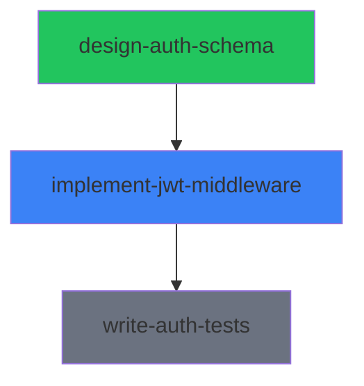

# Project Status: Build Authentication System

**Status:** active
**Progress:** 1/3 assignments complete

## Assignments

- [x] [design-auth-schema](./assignments/design-auth-schema/assignment.md) — completed
- [ ] [implement-jwt-middleware](./assignments/implement-jwt-middleware/assignment.md) — in_progress (claude-1)
- [ ] [write-auth-tests](./assignments/write-auth-tests/assignment.md) — pending (waiting on: implement-jwt-middleware)

## Dependency Graph

## Needs Attention

- **0 blocked** assignments
- **0 failed** assignments
- **1 unanswered** question in [implement-jwt-middleware](./assignments/implement-jwt-middleware/assignment.md)
