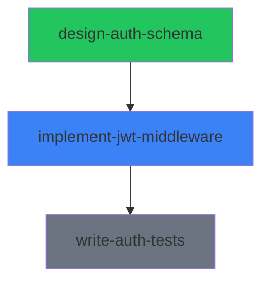

# Project Status: Build Authentication System

**Status:** active
**Progress:** 1/3 tickets complete

## Tickets

- [x] [design-auth-schema](./tickets/design-auth-schema/ticket.md) — completed
- [ ] [implement-jwt-middleware](./tickets/implement-jwt-middleware/ticket.md) — in_progress (claude-1)
- [ ] [write-auth-tests](./tickets/write-auth-tests/ticket.md) — pending (waiting on: implement-jwt-middleware)

## Dependency Graph

```mermaid
graph TD
    design-auth-schema:::completed --> implement-jwt-middleware:::in_progress
    implement-jwt-middleware:::in_progress --> write-auth-tests:::pending
    classDef completed fill:#22c55e
    classDef in_progress fill:#3b82f6
    classDef pending fill:#6b7280
    classDef blocked fill:#ef4444
    classDef failed fill:#dc2626
```

## Needs Attention

- **0 blocked** tickets
- **0 failed** tickets
- **1 open** question in [implement-jwt-middleware/comments.md](./tickets/implement-jwt-middleware/comments.md)
